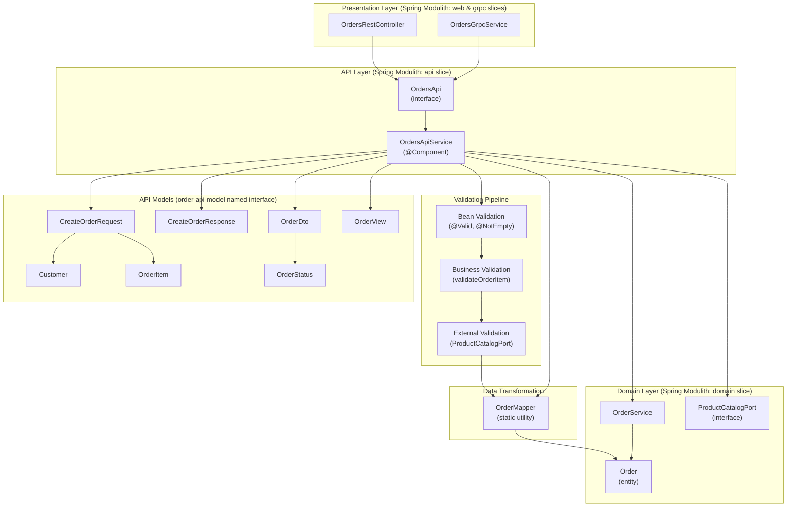
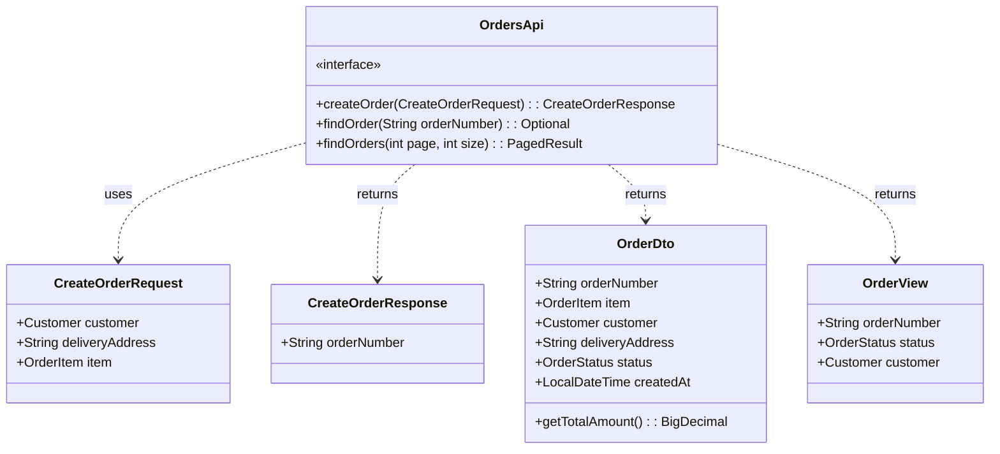
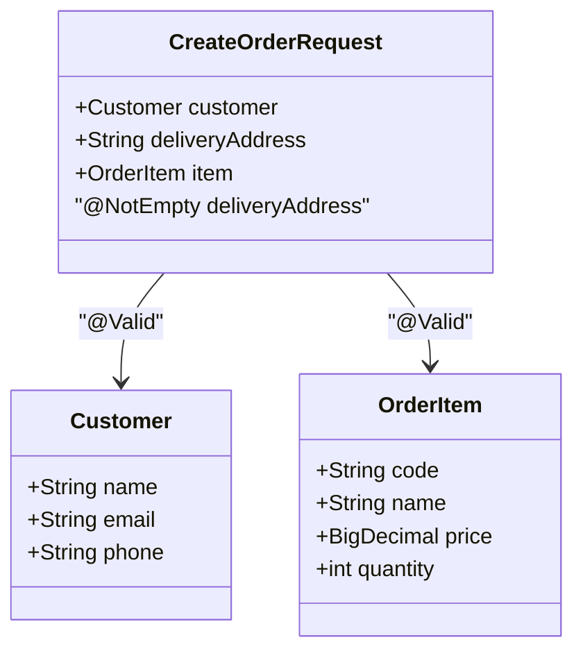
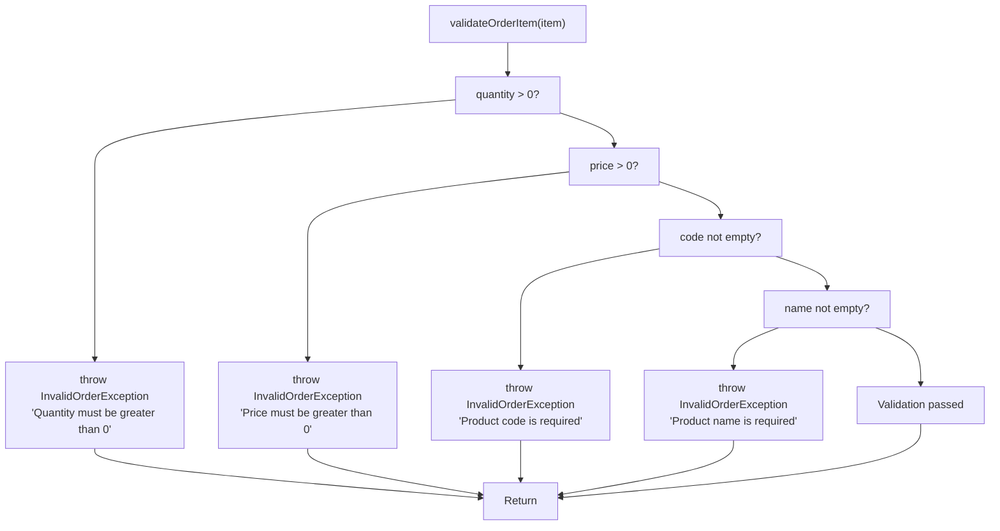
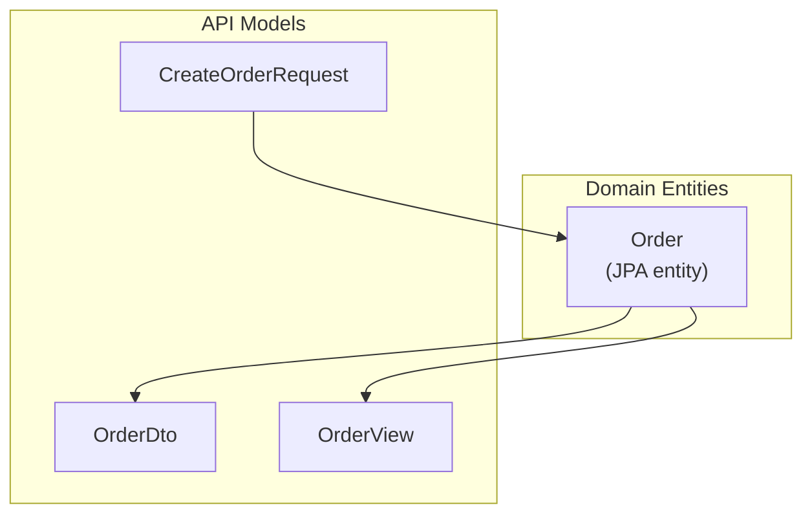

# API Layer Design

> **Relevant source files**
> * [README-OpenAPI.md](https://github.com/philipz/spring-modulith-orders/blob/eb506991/README-OpenAPI.md)
> * [src/main/java/com/sivalabs/bookstore/orders/OrdersApiService.java](https://github.com/philipz/spring-modulith-orders/blob/eb506991/src/main/java/com/sivalabs/bookstore/orders/OrdersApiService.java)
> * [src/main/java/com/sivalabs/bookstore/orders/api/CreateOrderRequest.java](https://github.com/philipz/spring-modulith-orders/blob/eb506991/src/main/java/com/sivalabs/bookstore/orders/api/CreateOrderRequest.java)
> * [src/main/java/com/sivalabs/bookstore/orders/api/CreateOrderResponse.java](https://github.com/philipz/spring-modulith-orders/blob/eb506991/src/main/java/com/sivalabs/bookstore/orders/api/CreateOrderResponse.java)
> * [src/main/java/com/sivalabs/bookstore/orders/api/OrderDto.java](https://github.com/philipz/spring-modulith-orders/blob/eb506991/src/main/java/com/sivalabs/bookstore/orders/api/OrderDto.java)
> * [src/main/java/com/sivalabs/bookstore/orders/api/OrderView.java](https://github.com/philipz/spring-modulith-orders/blob/eb506991/src/main/java/com/sivalabs/bookstore/orders/api/OrderView.java)
> * [src/main/java/com/sivalabs/bookstore/orders/api/OrdersApi.java](https://github.com/philipz/spring-modulith-orders/blob/eb506991/src/main/java/com/sivalabs/bookstore/orders/api/OrdersApi.java)

## Purpose and Scope

This document describes the API layer architecture of the orders-service, focusing on the contract-first design patterns, validation pipeline, and data transformation mechanisms. The API layer serves as a facade between presentation layers (REST and gRPC) and the domain logic, providing unified business operations through the `OrdersApi` interface.

For REST-specific endpoint documentation, see [REST API](/philipz/spring-modulith-orders/4.1-rest-api). For gRPC service definitions, see [gRPC API](/philipz/spring-modulith-orders/4.2-grpc-api). For implementation details of the domain layer, see [Orders Service Implementation](/philipz/spring-modulith-orders/5.1-orders-service-implementation).

## API Layer Architecture

The API layer follows a layered architecture pattern where all presentation concerns route through a single service interface. This design ensures consistency across multiple API protocols and centralizes cross-cutting concerns like validation and transformation.



**Sources:** [src/main/java/com/sivalabs/bookstore/orders/OrdersApiService.java L1-L76](https://github.com/philipz/spring-modulith-orders/blob/eb506991/src/main/java/com/sivalabs/bookstore/orders/OrdersApiService.java#L1-L76)

 [src/main/java/com/sivalabs/bookstore/orders/api/OrdersApi.java L1-L13](https://github.com/philipz/spring-modulith-orders/blob/eb506991/src/main/java/com/sivalabs/bookstore/orders/api/OrdersApi.java#L1-L13)

## API Contract Definition

The `OrdersApi` interface defines the public contract for all order operations. This interface serves as a named interface in Spring Modulith terminology, establishing a stable API boundary that presentation layers depend upon.

### OrdersApi Interface



The interface defines three core operations:

| Method | Purpose | Input | Output |
| --- | --- | --- | --- |
| `createOrder` | Creates a new order with validation | `CreateOrderRequest` | `CreateOrderResponse` with order number |
| `findOrder` | Retrieves a single order by number | `String orderNumber` | `Optional<OrderDto>` |
| `findOrders` | Retrieves paginated list of orders | `int page, int size` | `PagedResult<OrderView>` |

**Sources:** [src/main/java/com/sivalabs/bookstore/orders/api/OrdersApi.java L1-L13](https://github.com/philipz/spring-modulith-orders/blob/eb506991/src/main/java/com/sivalabs/bookstore/orders/api/OrdersApi.java#L1-L13)

## API Models and DTOs

The API layer uses immutable Java records for all request and response models. Each model is annotated with OpenAPI `@Schema` annotations for documentation and Bean Validation constraints for input validation.

### Request Models

The `CreateOrderRequest` record encapsulates all data required to create an order:



**Sources:** [src/main/java/com/sivalabs/bookstore/orders/api/CreateOrderRequest.java L1-L17](https://github.com/philipz/spring-modulith-orders/blob/eb506991/src/main/java/com/sivalabs/bookstore/orders/api/CreateOrderRequest.java#L1-L17)

### Response Models

| Model | Purpose | Fields |
| --- | --- | --- |
| `CreateOrderResponse` | Confirmation after order creation | `orderNumber` (String) |
| `OrderDto` | Complete order details | `orderNumber`, `item`, `customer`, `deliveryAddress`, `status`, `createdAt`, computed `totalAmount` |
| `OrderView` | Simplified order listing | `orderNumber`, `status`, `customer` |

The `OrderDto` includes a computed `getTotalAmount()` method that calculates the total as `item.price() * item.quantity()`, marked as read-only via `@JsonProperty(access = JsonProperty.Access.READ_ONLY)` [src/main/java/com/sivalabs/bookstore/orders/api/OrderDto.java L20-L24](https://github.com/philipz/spring-modulith-orders/blob/eb506991/src/main/java/com/sivalabs/bookstore/orders/api/OrderDto.java#L20-L24)

**Sources:** [src/main/java/com/sivalabs/bookstore/orders/api/CreateOrderResponse.java L1-L7](https://github.com/philipz/spring-modulith-orders/blob/eb506991/src/main/java/com/sivalabs/bookstore/orders/api/CreateOrderResponse.java#L1-L7)

 [src/main/java/com/sivalabs/bookstore/orders/api/OrderDto.java L1-L25](https://github.com/philipz/spring-modulith-orders/blob/eb506991/src/main/java/com/sivalabs/bookstore/orders/api/OrderDto.java#L1-L25)

 [src/main/java/com/sivalabs/bookstore/orders/api/OrderView.java L1-L11](https://github.com/philipz/spring-modulith-orders/blob/eb506991/src/main/java/com/sivalabs/bookstore/orders/api/OrderView.java#L1-L11)

## Service Implementation

`OrdersApiService` is the concrete implementation of the `OrdersApi` interface, annotated with `@Component` for Spring dependency injection. The class orchestrates validation, transformation, and delegation to domain services.

```mermaid
sequenceDiagram
  participant Client
  participant OrdersApiService
  participant validateOrderItem()
  participant ProductCatalogPort
  participant OrderMapper
  participant OrderService

  Client->>OrdersApiService: createOrder(CreateOrderRequest)
  note over OrdersApiService: Bean Validation
  OrdersApiService->>validateOrderItem(): validateOrderItem(item)
  note over validateOrderItem(): Check quantity > 0
  validateOrderItem()-->>OrdersApiService: void or throw
  OrdersApiService->>ProductCatalogPort: validate(code, price)
  note over ProductCatalogPort: Verify product exists
  ProductCatalogPort-->>OrdersApiService: void or throw
  OrdersApiService->>OrderMapper: convertToEntity(request)
  OrderMapper-->>OrdersApiService: Order entity
  OrdersApiService->>OrderService: createOrder(order)
  OrderService-->>OrdersApiService: savedOrder
  OrdersApiService-->>Client: CreateOrderResponse(orderNumber)
```

### Constructor and Dependencies

The service declares two dependencies via constructor injection [src/main/java/com/sivalabs/bookstore/orders/OrdersApiService.java L20-L26](https://github.com/philipz/spring-modulith-orders/blob/eb506991/src/main/java/com/sivalabs/bookstore/orders/OrdersApiService.java#L20-L26)

:

* `OrderService orderService` - Domain service for order persistence and business logic
* `ProductCatalogPort productCatalogPort` - External validation port for product catalog integration

**Sources:** [src/main/java/com/sivalabs/bookstore/orders/OrdersApiService.java L1-L76](https://github.com/philipz/spring-modulith-orders/blob/eb506991/src/main/java/com/sivalabs/bookstore/orders/OrdersApiService.java#L1-L76)

## Validation Pipeline

The API layer implements a three-stage validation pipeline that progressively validates request data from syntax to semantics.

### Stage 1: Bean Validation

Bean Validation (Jakarta Validation) runs automatically on method entry via Spring's `@Valid` annotation. Constraints are declared on request model fields:

| Annotation | Field | Validation |
| --- | --- | --- |
| `@Valid` | `customer` | Recursively validates nested Customer object |
| `@NotEmpty` | `deliveryAddress` | Ensures delivery address is not null or empty |
| `@Valid` | `item` | Recursively validates nested OrderItem object |

**Sources:** [src/main/java/com/sivalabs/bookstore/orders/api/CreateOrderRequest.java L6-L17](https://github.com/philipz/spring-modulith-orders/blob/eb506991/src/main/java/com/sivalabs/bookstore/orders/api/CreateOrderRequest.java#L6-L17)

### Stage 2: Business Validation

The `validateOrderItem()` private method performs domain-specific validation that cannot be expressed with Bean Validation annotations [src/main/java/com/sivalabs/bookstore/orders/OrdersApiService.java L38-L51](https://github.com/philipz/spring-modulith-orders/blob/eb506991/src/main/java/com/sivalabs/bookstore/orders/OrdersApiService.java#L38-L51)

:



This validation enforces:

* Quantity must be positive (> 0)
* Price must be positive (> 0)
* Product code must be present and non-empty
* Product name must be present and non-empty

**Sources:** [src/main/java/com/sivalabs/bookstore/orders/OrdersApiService.java L38-L51](https://github.com/philipz/spring-modulith-orders/blob/eb506991/src/main/java/com/sivalabs/bookstore/orders/OrdersApiService.java#L38-L51)

### Stage 3: External Validation

The final validation stage invokes `ProductCatalogPort.validate(code, price)` to ensure product consistency with the external product catalog service [src/main/java/com/sivalabs/bookstore/orders/OrdersApiService.java L33](https://github.com/philipz/spring-modulith-orders/blob/eb506991/src/main/java/com/sivalabs/bookstore/orders/OrdersApiService.java#L33-L33)

 This validates:

* Product code exists in the catalog
* Product price matches the catalog price

For details on the `ProductCatalogPort` implementation, see [Orders Service Implementation](/philipz/spring-modulith-orders/5.1-orders-service-implementation).

**Sources:** [src/main/java/com/sivalabs/bookstore/orders/OrdersApiService.java L29-L36](https://github.com/philipz/spring-modulith-orders/blob/eb506991/src/main/java/com/sivalabs/bookstore/orders/OrdersApiService.java#L29-L36)

## Data Transformation

The `OrderMapper` utility class handles bidirectional transformation between API models and domain entities. The API layer uses three key transformations:



### Transformation Methods

| Method | Input | Output | Usage |
| --- | --- | --- | --- |
| `convertToEntity(CreateOrderRequest)` | `CreateOrderRequest` | `Order` | Before calling `OrderService.createOrder()` [src/main/java/com/sivalabs/bookstore/orders/OrdersApiService.java L34](https://github.com/philipz/spring-modulith-orders/blob/eb506991/src/main/java/com/sivalabs/bookstore/orders/OrdersApiService.java#L34-L34) |
| `convertToDto(Order)` | `Order` | `OrderDto` | When returning single order details [src/main/java/com/sivalabs/bookstore/orders/OrdersApiService.java L55](https://github.com/philipz/spring-modulith-orders/blob/eb506991/src/main/java/com/sivalabs/bookstore/orders/OrdersApiService.java#L55-L55) |
| `convertToOrderView(Order)` | `Order` | `OrderView` | When returning paginated order list [src/main/java/com/sivalabs/bookstore/orders/OrdersApiService.java L65](https://github.com/philipz/spring-modulith-orders/blob/eb506991/src/main/java/com/sivalabs/bookstore/orders/OrdersApiService.java#L65-L65) |

The mapper ensures that:

* API concerns (validation annotations, OpenAPI documentation) remain isolated from domain entities
* Domain entities remain focused on business logic without presentation concerns
* Multiple presentation formats (REST, gRPC) can reuse the same domain model

**Sources:** [src/main/java/com/sivalabs/bookstore/orders/OrdersApiService.java L34](https://github.com/philipz/spring-modulith-orders/blob/eb506991/src/main/java/com/sivalabs/bookstore/orders/OrdersApiService.java#L34-L34)

 [src/main/java/com/sivalabs/bookstore/orders/OrdersApiService.java L55](https://github.com/philipz/spring-modulith-orders/blob/eb506991/src/main/java/com/sivalabs/bookstore/orders/OrdersApiService.java#L55-L55)

 [src/main/java/com/sivalabs/bookstore/orders/OrdersApiService.java L65](https://github.com/philipz/spring-modulith-orders/blob/eb506991/src/main/java/com/sivalabs/bookstore/orders/OrdersApiService.java#L65-L65)

## Query Operations

The API layer provides two query operations with distinct purposes and return types.

### Find Order by Number

The `findOrder(String orderNumber)` method retrieves a single order by its unique order number, returning an `Optional<OrderDto>` [src/main/java/com/sivalabs/bookstore/orders/OrdersApiService.java L54-L56](https://github.com/philipz/spring-modulith-orders/blob/eb506991/src/main/java/com/sivalabs/bookstore/orders/OrdersApiService.java#L54-L56)

:

```

```

This operation uses the full `OrderDto` model which includes all order details including items, customer information, and computed total amount.

### Find Orders with Pagination

The `findOrders(int page, int size)` method retrieves a paginated list of orders using the simplified `OrderView` model [src/main/java/com/sivalabs/bookstore/orders/OrdersApiService.java L59-L75](https://github.com/philipz/spring-modulith-orders/blob/eb506991/src/main/java/com/sivalabs/bookstore/orders/OrdersApiService.java#L59-L75)

:

**Pagination Logic:**

* Ensures minimum page number of 1: `Math.max(page, 1)`
* Ensures minimum page size of 1: `Math.max(size, 1)`
* Converts to zero-based index: `pageNumber - 1`
* Applies descending sort by ID: `Sort.by("id").descending()`

The method constructs a `PagedResult` wrapper containing:

| Field | Description |
| --- | --- |
| `content` | List of `OrderView` objects |
| `totalElements` | Total number of orders across all pages |
| `pageNumber` | Current page (1-based) |
| `totalPages` | Total number of pages |
| `isFirst` | Whether this is the first page |
| `isLast` | Whether this is the last page |
| `hasNext` | Whether there is a next page |
| `hasPrevious` | Whether there is a previous page |

**Sources:** [src/main/java/com/sivalabs/bookstore/orders/OrdersApiService.java L54-L75](https://github.com/philipz/spring-modulith-orders/blob/eb506991/src/main/java/com/sivalabs/bookstore/orders/OrdersApiService.java#L54-L75)

## Error Handling

The API layer throws `InvalidOrderException` for business validation failures. This exception is caught by presentation layer exception handlers to generate appropriate HTTP status codes (400 Bad Request for REST) or gRPC status codes (INVALID_ARGUMENT).

**Validation Failure Scenarios:**

| Condition | Exception Message |
| --- | --- |
| Quantity ≤ 0 | "Quantity must be greater than 0" |
| Price ≤ 0 | "Price must be greater than 0" |
| Empty product code | "Product code is required" |
| Empty product name | "Product name is required" |

For comprehensive exception handling patterns, see [Exception Handling](/philipz/spring-modulith-orders/5.3-exception-handling).

**Sources:** [src/main/java/com/sivalabs/bookstore/orders/OrdersApiService.java L38-L51](https://github.com/philipz/spring-modulith-orders/blob/eb506991/src/main/java/com/sivalabs/bookstore/orders/OrdersApiService.java#L38-L51)

## OpenAPI Documentation

All API models include OpenAPI `@Schema` annotations that generate comprehensive API documentation. The documentation is accessible via:

| Endpoint | Format | Purpose |
| --- | --- | --- |
| `/api-docs` | JSON | OpenAPI 3.0 specification |
| `/swagger-ui.html` | HTML | Interactive API explorer |

### Schema Annotations

API models use `@Schema` to document:

* **description**: Human-readable field descriptions
* **required**: Whether field is mandatory
* **example**: Sample values for documentation
* **accessMode**: Whether field is read-only or write-only

Example from `CreateOrderRequest` [src/main/java/com/sivalabs/bookstore/orders/api/CreateOrderRequest.java L9-L17](https://github.com/philipz/spring-modulith-orders/blob/eb506991/src/main/java/com/sivalabs/bookstore/orders/api/CreateOrderRequest.java#L9-L17)

:

* Customer field marked as `required = true`
* Delivery address includes example value: "123 Main St, City, State 12345"
* All fields have descriptive documentation

The OpenAPI configuration excludes Spring Boot Actuator endpoints and sorts operations alphabetically for readability.

For complete OpenAPI documentation details, see [REST API](/philipz/spring-modulith-orders/4.1-rest-api).

**Sources:** [README-OpenAPI.md L1-L64](https://github.com/philipz/spring-modulith-orders/blob/eb506991/README-OpenAPI.md#L1-L64)

 [src/main/java/com/sivalabs/bookstore/orders/api/CreateOrderRequest.java L9-L17](https://github.com/philipz/spring-modulith-orders/blob/eb506991/src/main/java/com/sivalabs/bookstore/orders/api/CreateOrderRequest.java#L9-L17)

 [src/main/java/com/sivalabs/bookstore/orders/api/CreateOrderResponse.java L5-L7](https://github.com/philipz/spring-modulith-orders/blob/eb506991/src/main/java/com/sivalabs/bookstore/orders/api/CreateOrderResponse.java#L5-L7)

 [src/main/java/com/sivalabs/bookstore/orders/api/OrderDto.java L11-L18](https://github.com/philipz/spring-modulith-orders/blob/eb506991/src/main/java/com/sivalabs/bookstore/orders/api/OrderDto.java#L11-L18)

 [src/main/java/com/sivalabs/bookstore/orders/api/OrderView.java L7-L11](https://github.com/philipz/spring-modulith-orders/blob/eb506991/src/main/java/com/sivalabs/bookstore/orders/api/OrderView.java#L7-L11)