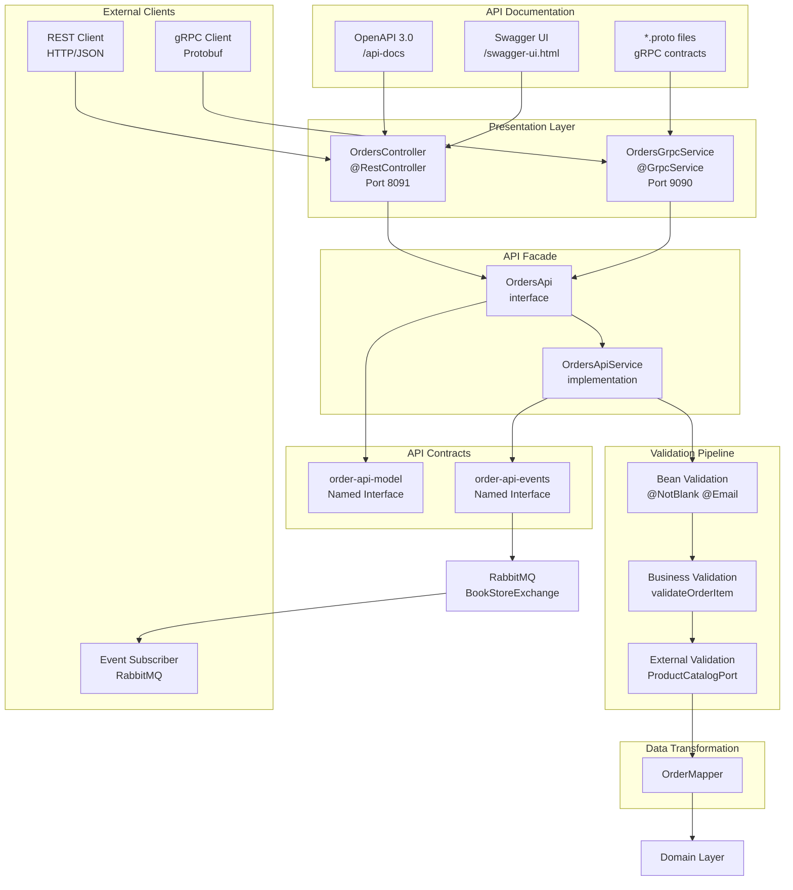
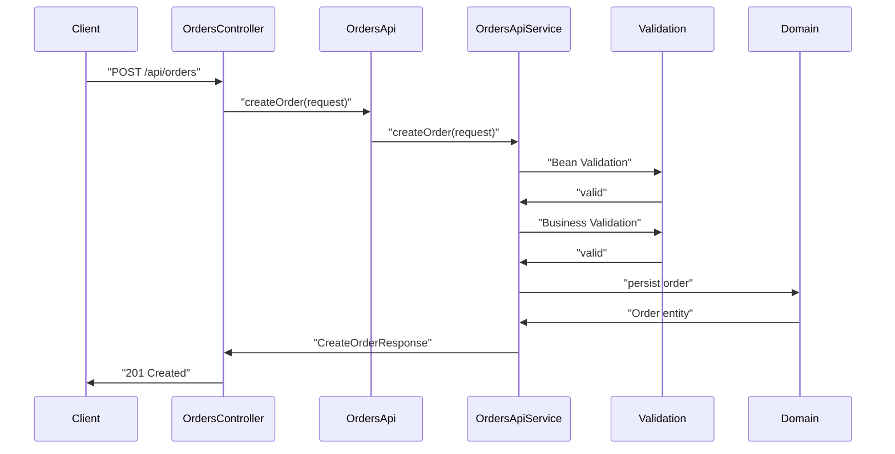
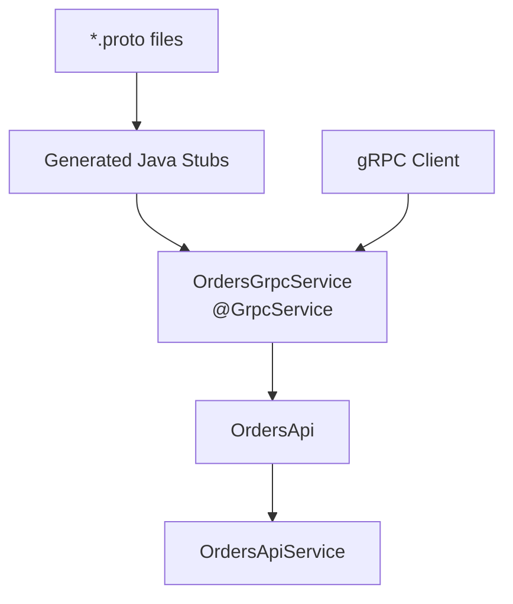
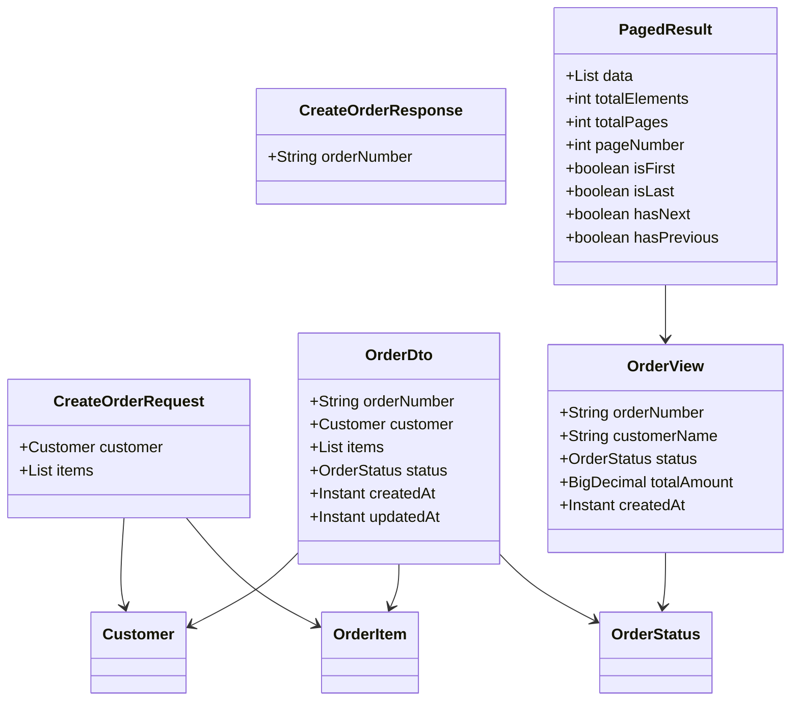

# API Reference

> **Relevant source files**
> * [README-OpenAPI.md](https://github.com/philipz/spring-modulith-orders/blob/eb506991/README-OpenAPI.md)
> * [src/main/java/com/sivalabs/bookstore/orders/api/OrdersApi.java](https://github.com/philipz/spring-modulith-orders/blob/eb506991/src/main/java/com/sivalabs/bookstore/orders/api/OrdersApi.java)

## Purpose and Scope

This document provides comprehensive reference documentation for all public APIs exposed by the orders-service, including REST endpoints, gRPC services, data transfer objects (DTOs), domain models, and event contracts. This reference covers the contracts that external clients and services use to interact with the orders-service.

For implementation details of the API layer design patterns and validation pipeline, see [API Layer Design](/philipz/spring-modulith-orders/3.3-api-layer-design). For information about testing API contracts, see [Testing](/philipz/spring-modulith-orders/7-testing).

## API Architecture Overview

The orders-service exposes dual API interfaces - REST and gRPC - both implemented through the `OrdersApi` interface facade. All requests flow through validation and transformation pipelines before reaching the domain layer.



**Sources:** [src/main/java/com/sivalabs/bookstore/orders/api/OrdersApi.java L1-L13](https://github.com/philipz/spring-modulith-orders/blob/eb506991/src/main/java/com/sivalabs/bookstore/orders/api/OrdersApi.java#L1-L13)

 [README-OpenAPI.md L1-L64](https://github.com/philipz/spring-modulith-orders/blob/eb506991/README-OpenAPI.md#L1-L64)

## REST API

### Endpoints

The REST API runs on port 8091 and exposes three primary endpoints under the `/api/orders` path:

| HTTP Method | Endpoint | Description | Request Body | Response Type |
| --- | --- | --- | --- | --- |
| POST | `/api/orders` | Create a new order | `CreateOrderRequest` | `CreateOrderResponse` |
| GET | `/api/orders` | List all orders (paginated) | Query params: `page`, `size` | `PagedResult<OrderView>` |
| GET | `/api/orders/{orderNumber}` | Get order by order number | Path variable: `orderNumber` | `OrderDto` |

### OpenAPI Documentation

The service provides comprehensive OpenAPI 3.0 specification and interactive documentation:

| Resource | URL | Description |
| --- | --- | --- |
| OpenAPI Spec | `http://localhost:8091/api-docs` | Raw JSON specification conforming to OpenAPI 3.0 |
| Swagger UI | `http://localhost:8091/swagger-ui.html` | Interactive web interface for API exploration and testing |

**Configuration Details:**

* Service title: "Orders Service API"
* Description: "Orders microservice extracted from the bookstore modular monolith"
* Version: "1.0.0"
* Development server: `http://localhost:8091`
* Operations and tags: sorted alphabetically
* Actuator endpoints: excluded from documentation

### REST Controller Implementation

The REST endpoints are implemented in the `OrdersController` class located in the `web` Spring Modulith slice. The controller delegates to the `OrdersApi` interface:



**Sources:** [README-OpenAPI.md L20-L42](https://github.com/philipz/spring-modulith-orders/blob/eb506991/README-OpenAPI.md#L20-L42)

 [src/main/java/com/sivalabs/bookstore/orders/api/OrdersApi.java L1-L13](https://github.com/philipz/spring-modulith-orders/blob/eb506991/src/main/java/com/sivalabs/bookstore/orders/api/OrdersApi.java#L1-L13)

## gRPC API

### Service Definition

The gRPC API runs on port 9090 and provides the same functional interface as the REST API but uses Protocol Buffers for serialization.

| Service | RPC Method | Request Message | Response Message |
| --- | --- | --- | --- |
| `OrdersService` | `CreateOrder` | `CreateOrderRequest` | `CreateOrderResponse` |
| `OrdersService` | `GetOrder` | `GetOrderRequest` | `OrderResponse` |
| `OrdersService` | `ListOrders` | `ListOrdersRequest` | `ListOrdersResponse` |

### Protocol Buffers Contracts

The gRPC service contracts are defined in `.proto` files that serve as the single source of truth. The `protobuf-maven-plugin` generates Java stubs during the build process.

**Build Integration:**

* Plugin: `protobuf-maven-plugin`
* Proto source directory: `src/main/proto`
* Generated Java classes: `target/generated-sources/protobuf`
* gRPC Java plugin version: referenced in plugin configuration

### gRPC Service Implementation

The gRPC service implementation is located in the `grpc` Spring Modulith slice and uses the `@GrpcService` annotation:



**Port Configuration:**

* Default gRPC port: `9090`
* Configuration property: `grpc.server.port`
* Environment variable override: `GRPC_SERVER_PORT`

**Sources:** [README-OpenAPI.md L1-L64](https://github.com/philipz/spring-modulith-orders/blob/eb506991/README-OpenAPI.md#L1-L64)

 Based on high-level architecture diagrams

## Request and Response Models

### CreateOrderRequest

Request DTO for creating a new order.

| Field | Type | Constraints | Description |
| --- | --- | --- | --- |
| `customer` | `Customer` | `@Valid` | Customer information (required) |
| `items` | `List<OrderItem>` | `@NotEmpty` | List of items in the order (must contain at least one item) |

**Validation:**

* Bean validation applied via `@Valid` annotation
* Business validation: each item validated via `validateOrderItem` method
* External validation: product codes and prices validated against Product Catalog Service

**Example JSON:**

```json
{
  "customer": {
    "name": "John Doe",
    "email": "john@example.com",
    "phone": "+1234567890"
  },
  "items": [
    {
      "code": "BOOK-001",
      "name": "Spring in Action",
      "price": 39.99,
      "quantity": 2
    }
  ]
}
```

### CreateOrderResponse

Response DTO returned after successful order creation.

| Field | Type | Description |
| --- | --- | --- |
| `orderNumber` | `String` | Unique order identifier generated by the system |

**Example JSON:**

```json
{
  "orderNumber": "ORD-20240115-ABC123"
}
```

### OrderDto

Complete order information including all details.

| Field | Type | Description |
| --- | --- | --- |
| `orderNumber` | `String` | Unique order identifier |
| `customer` | `Customer` | Customer information |
| `items` | `List<OrderItem>` | Order items |
| `status` | `OrderStatus` | Current order status |
| `createdAt` | `Instant` | Order creation timestamp |
| `updatedAt` | `Instant` | Last update timestamp |

**Usage:**

* Returned by: `GET /api/orders/{orderNumber}`
* Part of: `order-api-model` named interface

### OrderView

Simplified order view for list operations, optimized for pagination.

| Field | Type | Description |
| --- | --- | --- |
| `orderNumber` | `String` | Unique order identifier |
| `customerName` | `String` | Customer name |
| `status` | `OrderStatus` | Current order status |
| `totalAmount` | `BigDecimal` | Total order amount |
| `createdAt` | `Instant` | Order creation timestamp |

**Usage:**

* Returned by: `GET /api/orders` (paginated)
* Wrapped in: `PagedResult<OrderView>`

### API Model Relationships



**Sources:** [README-OpenAPI.md L28-L42](https://github.com/philipz/spring-modulith-orders/blob/eb506991/README-OpenAPI.md#L28-L42)

 [src/main/java/com/sivalabs/bookstore/orders/api/OrdersApi.java L1-L13](https://github.com/philipz/spring-modulith-orders/blob/eb506991/src/main/java/com/sivalabs/bookstore/orders/api/OrdersApi.java#L1-L13)

## Domain Models

### Customer

Customer information embedded in orders.

| Field | Type | Constraints | Description |
| --- | --- | --- | --- |
| `name` | `String` | `@NotBlank` | Customer full name |
| `email` | `String` | `@NotBlank`, `@Email` | Customer email address |
| `phone` | `String` | `@NotBlank` | Customer phone number |

**Part of:** `order-api-model` named interface

### OrderItem

Individual item within an order.

| Field | Type | Constraints | Description |
| --- | --- | --- | --- |
| `code` | `String` | `@NotBlank` | Product code (SKU) |
| `name` | `String` | `@NotBlank` | Product name |
| `price` | `BigDecimal` | `@NotNull`, `@Positive` | Unit price |
| `quantity` | `Integer` | `@NotNull`, `@Positive` | Quantity ordered |

**Validation:**

* Each item validated against Product Catalog Service via `ProductCatalogPort`
* Business rule: price and product code must match catalog

### OrderStatus

Enumeration representing order lifecycle states.

| Status Value | Description |
| --- | --- |
| `NEW` | Order has been created but not yet processed |
| `IN_PROGRESS` | Order is being processed |
| `DELIVERED` | Order has been delivered to customer |
| `CANCELLED` | Order has been cancelled |
| `ERROR` | Order processing encountered an error |

**Part of:** `order-api-model` named interface

### PagedResult

Generic wrapper for paginated query results.

| Field | Type | Description |
| --- | --- | --- |
| `data` | `List<T>` | List of items for current page |
| `totalElements` | `long` | Total number of items across all pages |
| `totalPages` | `int` | Total number of pages |
| `pageNumber` | `int` | Current page number (zero-indexed) |
| `isFirst` | `boolean` | Whether this is the first page |
| `isLast` | `boolean` | Whether this is the last page |
| `hasNext` | `boolean` | Whether there is a next page |
| `hasPrevious` | `boolean` | Whether there is a previous page |

**Usage:**

* Used by: `OrdersApi.findOrders(int page, int size)`
* Type parameter: `OrderView` for order listings

**Sources:** [README-OpenAPI.md L35-L42](https://github.com/philipz/spring-modulith-orders/blob/eb506991/README-OpenAPI.md#L35-L42)

 [src/main/java/com/sivalabs/bookstore/orders/api/OrdersApi.java L3-L4](https://github.com/philipz/spring-modulith-orders/blob/eb506991/src/main/java/com/sivalabs/bookstore/orders/api/OrdersApi.java#L3-L4)

## Event Contracts

### OrderCreatedEvent

Domain event published when a new order is successfully created. This event is part of the `order-api-events` named interface and is automatically externalized to RabbitMQ.

**Event Structure:**

| Field | Type | Description |
| --- | --- | --- |
| `orderNumber` | `String` | Unique identifier of the created order |
| `customerEmail` | `String` | Email address of the customer |
| `items` | `List<OrderItem>` | List of ordered items |
| `totalAmount` | `BigDecimal` | Total order amount |
| `createdAt` | `Instant` | Event timestamp |

### Event Publishing Flow

```mermaid
sequenceDiagram
  participant OrderService
  participant (Domain)
  participant Spring Modulith
  participant Event Store
  participant AMQP Externalizer
  participant @Externalized
  participant RabbitMQ
  participant BookStoreExchange
  participant External Service

  OrderService->>OrderService: "createOrder()"
  OrderService->>Spring Modulith: "publish(OrderCreatedEvent)"
  note over Spring Modulith,Event Store: "Stored in
  Spring Modulith->>AMQP Externalizer: "process event"
  note over AMQP Externalizer,@Externalized: "@Externalized
  AMQP Externalizer->>RabbitMQ: "routing key:
  RabbitMQ->>External Service: orders.new"
```

### AMQP Configuration

| Property | Value | Description |
| --- | --- | --- |
| Exchange Name | `BookStoreExchange` | RabbitMQ exchange for all bookstore events |
| Routing Key | `orders.new` | Routing key for new order events |
| Exchange Type | `topic` | Allows pattern-based routing |
| Durability | `true` | Events persisted to disk |
| Event Store Schema | `orders_events` | PostgreSQL schema for transactional event storage |

**Annotation Usage:**

* The `OrderCreatedEvent` class is annotated with `@Externalized`
* This annotation tells Spring Modulith to externalize the event to RabbitMQ
* Events are stored transactionally in the event store before externalization
* Provides at-least-once delivery guarantee

### Event Consumer Contract

External services subscribing to order events should:

1. Subscribe to `BookStoreExchange` with routing key pattern `orders.*` or `orders.new`
2. Expect JSON-serialized event payload
3. Handle idempotent processing (events may be delivered more than once)
4. Implement dead-letter queue handling for poison messages

**Environment Configuration:**

* RabbitMQ host: `SPRING_RABBITMQ_HOST` (default: `localhost`)
* RabbitMQ port: `SPRING_RABBITMQ_PORT` (default: `5672`)
* Management UI port: `15672` (Docker Compose) or `15673` (local dev)

**Sources:** [README-OpenAPI.md L1-L64](https://github.com/philipz/spring-modulith-orders/blob/eb506991/README-OpenAPI.md#L1-L64)

 Based on high-level architecture diagrams showing event flow

---

## API Contract Validation

All API contracts (REST, gRPC, and events) can be validated through:

1. **OpenAPI Schema Validation**: Use the `/api-docs` endpoint for contract testing frameworks
2. **gRPC Reflection**: gRPC server supports reflection protocol for dynamic client discovery
3. **Schema Tests**: Contract tests located in `orders/support` test directory validate API stability

For implementation details on API validation pipeline, see [API Layer Design](/philipz/spring-modulith-orders/3.3-api-layer-design). For testing API contracts, see [Writing Tests](/philipz/spring-modulith-orders/7.2-writing-tests).