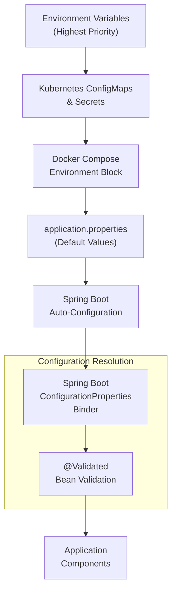
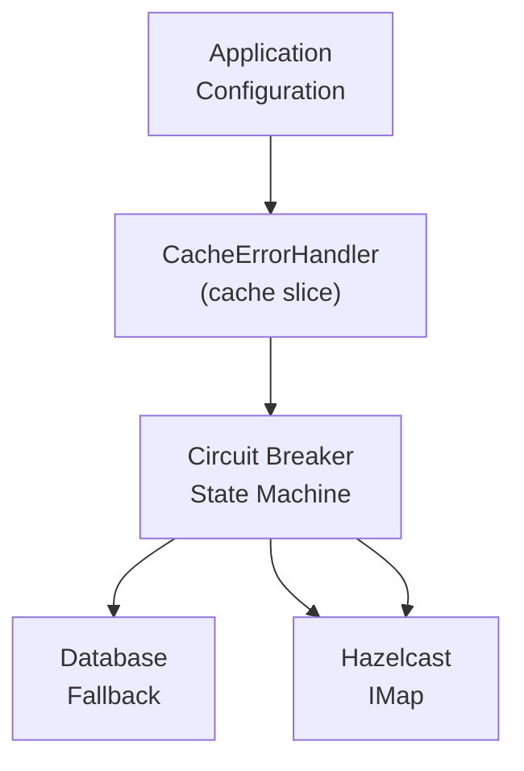
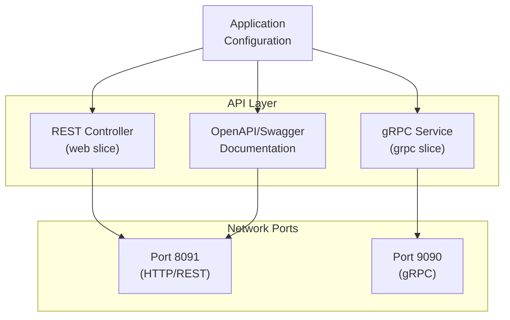
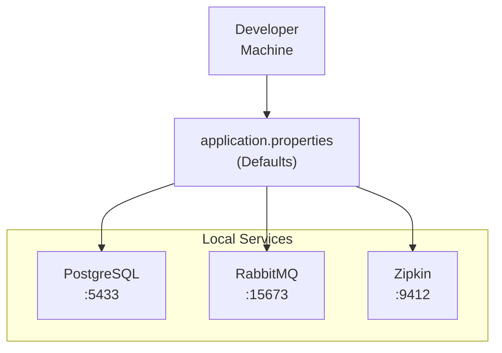
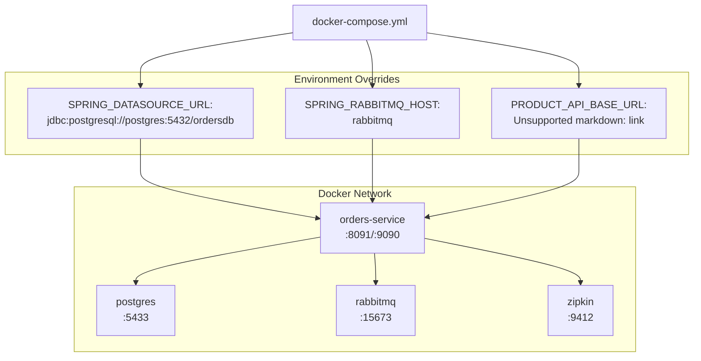
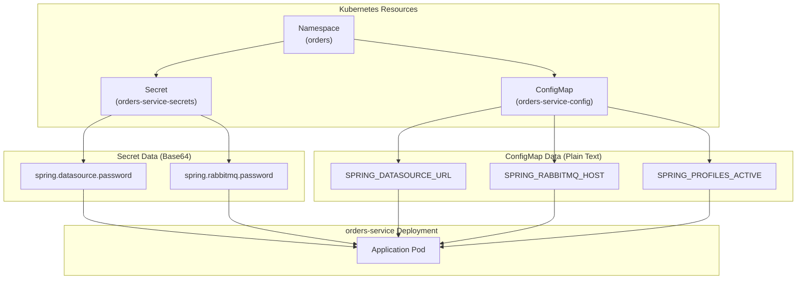
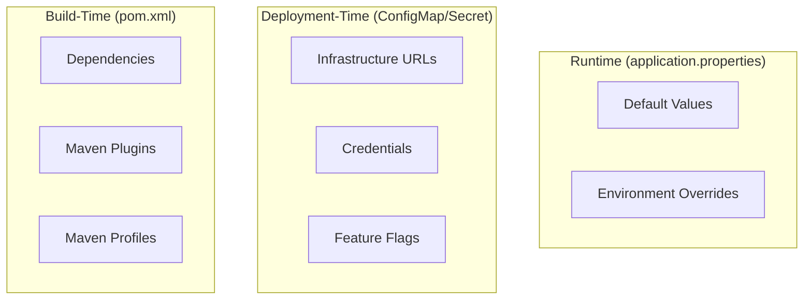

# Application Configuration

> **Relevant source files**
> * [AGENTS.md](https://github.com/philipz/spring-modulith-orders/blob/eb506991/AGENTS.md)
> * [README-deployment.md](https://github.com/philipz/spring-modulith-orders/blob/eb506991/README-deployment.md)
> * [README.md](https://github.com/philipz/spring-modulith-orders/blob/eb506991/README.md)

## Purpose and Scope

This document covers the runtime configuration of the orders-service application, including default property values, environment variable overrides, and configuration mechanisms. The focus is on application behavior settings rather than build configuration (see [Build Configuration](/philipz/spring-modulith-orders/8.2-build-configuration) for Maven configuration) or the exhaustive reference of all variables (see [Environment Variables Reference](/philipz/spring-modulith-orders/8.3-environment-variables-reference) for comprehensive listings).

Configuration is managed through Spring Boot's hierarchical property system, with defaults defined in `application.properties` and runtime overrides applied via environment variables. This approach supports the 12-factor app methodology, enabling environment-specific customization without code changes.

**Sources:** [AGENTS.md L34-L37](https://github.com/philipz/spring-modulith-orders/blob/eb506991/AGENTS.md#L34-L37)

 [README.md L24-L27](https://github.com/philipz/spring-modulith-orders/blob/eb506991/README.md#L24-L27)

 [README-deployment.md L57-L62](https://github.com/philipz/spring-modulith-orders/blob/eb506991/README-deployment.md#L57-L62)

---

## Configuration Architecture

### Configuration Source Hierarchy

The orders-service resolves configuration from multiple sources in the following precedence order (highest to lowest):



**Diagram: Configuration Source Precedence and Resolution Pipeline**

Environment variables follow Spring Boot's relaxed binding rules, where `SPRING_DATASOURCE_URL` maps to `spring.datasource.url`. This allows case-insensitive, underscore-separated variable names in deployment environments while maintaining property hierarchy in configuration files.

**Sources:** [AGENTS.md L35-L37](https://github.com/philipz/spring-modulith-orders/blob/eb506991/AGENTS.md#L35-L37)

 [README.md L24-L27](https://github.com/philipz/spring-modulith-orders/blob/eb506991/README.md#L24-L27)

 [README-deployment.md L59-L61](https://github.com/philipz/spring-modulith-orders/blob/eb506991/README-deployment.md#L59-L61)

---

## Core Configuration Areas

### Database Configuration

PostgreSQL connection settings control persistence layer behavior. The service requires dedicated schemas for domain data (`orders`) and event storage (`orders_events`).

| Property | Environment Variable | Default | Description |
| --- | --- | --- | --- |
| `spring.datasource.url` | `SPRING_DATASOURCE_URL` | `jdbc:postgresql://localhost:5433/ordersdb` | JDBC connection string |
| `spring.datasource.username` | `SPRING_DATASOURCE_USERNAME` | `postgres` | Database username |
| `spring.datasource.password` | `SPRING_DATASOURCE_PASSWORD` | `postgres` | Database password |
| `spring.jpa.hibernate.ddl-auto` | N/A | `validate` | Schema validation mode |
| `spring.liquibase.default-schema` | N/A | `orders` | Liquibase changelog schema |

The `infrastructure` slice [src/main/java/com/sivalabs/bookstore/orders/infrastructure](https://github.com/philipz/spring-modulith-orders/blob/eb506991/src/main/java/com/sivalabs/bookstore/orders/infrastructure)

 consumes these settings through Spring Data JPA repositories. Liquibase manages schema evolution via changelogs in [src/main/resources/db](https://github.com/philipz/spring-modulith-orders/blob/eb506991/src/main/resources/db)

**Example Override (Docker Compose):**

```yaml
environment:
  SPRING_DATASOURCE_URL: jdbc:postgresql://postgres:5432/ordersdb
  SPRING_DATASOURCE_USERNAME: app_user
  SPRING_DATASOURCE_PASSWORD: ${DB_PASSWORD}
```

**Sources:** [README-deployment.md L26-L27](https://github.com/philipz/spring-modulith-orders/blob/eb506991/README-deployment.md#L26-L27)

 [README.md L25](https://github.com/philipz/spring-modulith-orders/blob/eb506991/README.md#L25-L25)

 [AGENTS.md L7](https://github.com/philipz/spring-modulith-orders/blob/eb506991/AGENTS.md#L7-L7)

---

### Message Broker Configuration

RabbitMQ integration enables event-driven architecture through Spring Modulith's `@Externalized` annotation. Events published by the `events` slice are routed to the `BookStoreExchange`.

| Property | Environment Variable | Default | Description |
| --- | --- | --- | --- |
| `spring.rabbitmq.host` | `SPRING_RABBITMQ_HOST` | `localhost` | RabbitMQ server hostname |
| `spring.rabbitmq.port` | `SPRING_RABBITMQ_PORT` | `5672` | AMQP port |
| `spring.rabbitmq.username` | `SPRING_RABBITMQ_USERNAME` | `guest` | Broker username |
| `spring.rabbitmq.password` | `SPRING_RABBITMQ_PASSWORD` | `guest` | Broker password |
| `spring.modulith.events.externalization.enabled` | N/A | `true` | Enable event externalization |

The `events` slice [src/main/java/com/sivalabs/bookstore/orders/events](https://github.com/philipz/spring-modulith-orders/blob/eb506991/src/main/java/com/sivalabs/bookstore/orders/events)

 uses these settings to publish domain events like `OrderCreatedEvent` to RabbitMQ exchanges.

**Example Kubernetes ConfigMap:**

```yaml
data:
  SPRING_RABBITMQ_HOST: "rabbitmq.orders.svc.cluster.local"
  SPRING_RABBITMQ_PORT: "5672"
```

**Sources:** [README-deployment.md L28](https://github.com/philipz/spring-modulith-orders/blob/eb506991/README-deployment.md#L28-L28)

 [README.md L26](https://github.com/philipz/spring-modulith-orders/blob/eb506991/README.md#L26-L26)

 [AGENTS.md L35](https://github.com/philipz/spring-modulith-orders/blob/eb506991/AGENTS.md#L35-L35)

---

### Cache Configuration

Hazelcast distributed cache provides resilience through the `cache` slice. The `CacheErrorHandler` implements circuit breaker patterns specific to cache operations.

| Property | Environment Variable | Purpose |
| --- | --- | --- |
| `bookstore.cache.max-consecutive-failures` | `BOOKSTORE_CACHE_MAX_CONSECUTIVE_FAILURES` | Circuit breaker threshold |
| `bookstore.cache.recovery-interval-seconds` | `BOOKSTORE_CACHE_RECOVERY_INTERVAL_SECONDS` | Half-open state duration |
| `bookstore.cache.health-check-timeout-ms` | `BOOKSTORE_CACHE_HEALTH_CHECK_TIMEOUT_MS` | Health check timeout |
| `bookstore.cache.should-fallback-to-database` | `BOOKSTORE_CACHE_SHOULD_FALLBACK_TO_DATABASE` | Enable DB fallback on cache failure |



**Diagram: Cache Configuration Flow to Circuit Breaker**

The `AbstractCacheService` base class [src/main/java/com/sivalabs/bookstore/orders/cache](https://github.com/philipz/spring-modulith-orders/blob/eb506991/src/main/java/com/sivalabs/bookstore/orders/cache)

 wraps all cache operations with `CacheErrorHandler`, using these configuration values to determine failure thresholds and recovery behavior.

**Sources:** [AGENTS.md L37](https://github.com/philipz/spring-modulith-orders/blob/eb506991/AGENTS.md#L37-L37)

 [README-deployment.md L59-L61](https://github.com/philipz/spring-modulith-orders/blob/eb506991/README-deployment.md#L59-L61)

---

### Resilience4j Configuration

The service uses Resilience4j for circuit breakers, retries, and bulkheads on external service calls, particularly the `ProductCatalogPort` integration.

| Configuration Area | Property Pattern | Description |
| --- | --- | --- |
| Circuit Breaker | `resilience4j.circuitbreaker.<name>.*` | Failure rate thresholds, wait duration |
| Retry | `resilience4j.retry.<name>.*` | Retry attempts, backoff strategy |
| Rate Limiter | `resilience4j.ratelimiter.<name>.*` | Request rate limits |
| Bulkhead | `resilience4j.bulkhead.<name>.*` | Concurrent call limits |

**Example Configuration:**

```
resilience4j.circuitbreaker.productCatalog.failure-rate-threshold=50
resilience4j.circuitbreaker.productCatalog.wait-duration-in-open-state=10000
resilience4j.retry.productCatalog.max-attempts=3
resilience4j.retry.productCatalog.wait-duration=500
```

These settings are consumed by the `api` slice [src/main/java/com/sivalabs/bookstore/orders/api](https://github.com/philipz/spring-modulith-orders/blob/eb506991/src/main/java/com/sivalabs/bookstore/orders/api)

 when invoking `ProductCatalogPort` for product validation.

**Sources:** [AGENTS.md L37](https://github.com/philipz/spring-modulith-orders/blob/eb506991/AGENTS.md#L37-L37)

---

### API Configuration

The service supports dual API exposure through REST and gRPC. Feature flags control endpoint enablement.

| Property | Environment Variable | Default | Description |
| --- | --- | --- | --- |
| `orders.rest.enabled` | `ORDERS_REST_ENABLED` | `false` | Enable REST endpoints |
| `grpc.server.port` | `GRPC_SERVER_PORT` | `9090` | gRPC server port |
| `server.port` | `SERVER_PORT` | `8091` | HTTP server port |
| `springdoc.api-docs.enabled` | N/A | `true` | Enable OpenAPI documentation |



**Diagram: API Configuration to Endpoint Mapping**

The `web` slice [src/main/java/com/sivalabs/bookstore/orders/web](https://github.com/philipz/spring-modulith-orders/blob/eb506991/src/main/java/com/sivalabs/bookstore/orders/web)

 conditionally registers REST controllers based on `ORDERS_REST_ENABLED`, while the `grpc` slice [src/main/java/com/sivalabs/bookstore/orders/grpc](https://github.com/philipz/spring-modulith-orders/blob/eb506991/src/main/java/com/sivalabs/bookstore/orders/grpc)

 is always active.

**Product Catalog Integration:**

| Property | Environment Variable | Default | Description |
| --- | --- | --- | --- |
| `product.api.base-url` | `PRODUCT_API_BASE_URL` | `http://localhost:8080` | Monolith catalog service URL |

**Sources:** [README.md L27](https://github.com/philipz/spring-modulith-orders/blob/eb506991/README.md#L27-L27)

 [README-deployment.md L31](https://github.com/philipz/spring-modulith-orders/blob/eb506991/README-deployment.md#L31-L31)

 [AGENTS.md L12](https://github.com/philipz/spring-modulith-orders/blob/eb506991/AGENTS.md#L12-L12)

 [AGENTS.md L35](https://github.com/philipz/spring-modulith-orders/blob/eb506991/AGENTS.md#L35-L35)

---

### Observability Configuration

Actuator endpoints, metrics, and distributed tracing are configured for production monitoring.

| Property | Environment Variable | Default | Description |
| --- | --- | --- | --- |
| `management.endpoints.web.exposure.include` | N/A | `health,info,metrics,prometheus` | Exposed actuator endpoints |
| `management.endpoints.web.base-path` | N/A | `/actuator` | Actuator base path |
| `management.tracing.sampling.probability` | N/A | `1.0` | Trace sampling rate |
| `management.otlp.tracing.endpoint` | `OTLP_ENDPOINT` | `http://localhost:4318/v1/traces` | OpenTelemetry collector |
| `management.zipkin.tracing.endpoint` | `ZIPKIN_ENDPOINT` | `http://localhost:9411/api/v2/spans` | Zipkin collector |

Prometheus scrapes metrics from `http://localhost:8091/actuator/prometheus`, while OpenTelemetry exports traces to Zipkin or OTLP collectors.

**Docker Compose Example:**

```yaml
environment:
  ZIPKIN_ENDPOINT: http://zipkin:9411/api/v2/spans
  MANAGEMENT_TRACING_SAMPLING_PROBABILITY: "0.1"
```

**Sources:** [AGENTS.md L36](https://github.com/philipz/spring-modulith-orders/blob/eb506991/AGENTS.md#L36-L36)

 [README-deployment.md L29](https://github.com/philipz/spring-modulith-orders/blob/eb506991/README-deployment.md#L29-L29)

---

### Data Migration Configuration

Historical order backfill from the legacy monolith is controlled through dedicated environment variables.

| Property | Environment Variable | Default | Description |
| --- | --- | --- | --- |
| N/A | `ORDERS_BACKFILL_ENABLED` | `false` | Enable startup backfill |
| N/A | `ORDERS_BACKFILL_LOOKBACK_DAYS` | `null` | Limit migration window (days) |
| N/A | `ORDERS_BACKFILL_RECORD_LIMIT` | `500` | Maximum rows per run |
| N/A | `ORDERS_BACKFILL_SOURCE_URL` | (service DB) | Source database JDBC URL |
| N/A | `ORDERS_BACKFILL_SOURCE_USERNAME` | `postgres` | Source DB username |
| N/A | `ORDERS_BACKFILL_SOURCE_PASSWORD` | `postgres` | Source DB password |

The backfill mechanism executes once at application startup when `ORDERS_BACKFILL_ENABLED=true`. Results are persisted in the `orders.backfill_audit` table for traceability. Rollback scripts are available at [scripts/rollback.sql](https://github.com/philipz/spring-modulith-orders/blob/eb506991/scripts/rollback.sql)

**Example Backfill Configuration:**

```javascript
export ORDERS_BACKFILL_ENABLED=true
export ORDERS_BACKFILL_LOOKBACK_DAYS=90
export ORDERS_BACKFILL_SOURCE_URL=jdbc:postgresql://monolith-db:5432/postgres
export ORDERS_BACKFILL_SOURCE_USERNAME=readonly_user
export ORDERS_BACKFILL_SOURCE_PASSWORD=secure_password
```

After successful migration, disable backfill to prevent re-execution:

```javascript
export ORDERS_BACKFILL_ENABLED=false
```

**Sources:** [README-deployment.md L65-L82](https://github.com/philipz/spring-modulith-orders/blob/eb506991/README-deployment.md#L65-L82)

 [AGENTS.md L8](https://github.com/philipz/spring-modulith-orders/blob/eb506991/AGENTS.md#L8-L8)

---

## Configuration by Deployment Environment

### Local Development

Default values in [src/main/resources/application.properties](https://github.com/philipz/spring-modulith-orders/blob/eb506991/src/main/resources/application.properties)

 are optimized for local development with services running on non-standard ports to avoid conflicts.



**Diagram: Local Development Configuration Flow**

**Sources:** [README.md L18-L22](https://github.com/philipz/spring-modulith-orders/blob/eb506991/README.md#L18-L22)

 [AGENTS.md L12](https://github.com/philipz/spring-modulith-orders/blob/eb506991/AGENTS.md#L12-L12)

---

### Docker Compose

The [docker-compose.yml](https://github.com/philipz/spring-modulith-orders/blob/eb506991/docker-compose.yml)

 file injects environment variables to connect containerized services.



**Diagram: Docker Compose Configuration and Service Network**

**Sources:** [README-deployment.md L16-L33](https://github.com/philipz/spring-modulith-orders/blob/eb506991/README-deployment.md#L16-L33)

 [README.md L24-L27](https://github.com/philipz/spring-modulith-orders/blob/eb506991/README.md#L24-L27)

---

### Kubernetes

Configuration is externalized into `ConfigMap` and `Secret` resources applied before deployment.



**Diagram: Kubernetes Configuration Resource Structure**

**Manifest Application Order:**

1. [k8s/namespace.yaml](https://github.com/philipz/spring-modulith-orders/blob/eb506991/k8s/namespace.yaml)
2. [k8s/secret.yaml](https://github.com/philipz/spring-modulith-orders/blob/eb506991/k8s/secret.yaml)
3. [k8s/configmap.yaml](https://github.com/philipz/spring-modulith-orders/blob/eb506991/k8s/configmap.yaml)
4. [k8s/postgres.yaml](https://github.com/philipz/spring-modulith-orders/blob/eb506991/k8s/postgres.yaml)  [k8s/rabbitmq.yaml](https://github.com/philipz/spring-modulith-orders/blob/eb506991/k8s/rabbitmq.yaml)  [k8s/zipkin.yaml](https://github.com/philipz/spring-modulith-orders/blob/eb506991/k8s/zipkin.yaml)
5. [k8s/orders-service.yaml](https://github.com/philipz/spring-modulith-orders/blob/eb506991/k8s/orders-service.yaml)

Secrets contain sensitive credentials, while ConfigMaps store non-secret connection strings and feature flags. The deployment manifests mount these as environment variables.

**Sources:** [README-deployment.md L35-L61](https://github.com/philipz/spring-modulith-orders/blob/eb506991/README-deployment.md#L35-L61)

---

## Configuration Validation

### Startup Validation

Spring Boot's `@ConfigurationProperties` combined with `@Validated` annotations ensure configuration integrity at startup. Invalid or missing required properties cause application startup to fail fast with descriptive error messages.

**Validation Points:**

* **Database Connection:** Connection pool initialization validates JDBC URL syntax and connectivity
* **RabbitMQ Connection:** AMQP connection factory validates broker reachability
* **Liquibase Migration:** Schema validation ensures database schema matches expected state
* **gRPC Server:** Port binding validates that `grpc.server.port` is available

### Runtime Configuration Changes

Most configuration properties are bound at startup and immutable during runtime. Exceptions include:

* **Cache Circuit Breaker State:** Transitions between open/closed/half-open based on failure rate
* **Actuator Endpoints:** Some management endpoints support runtime property refresh

For configuration changes requiring restart, rolling deployments in Kubernetes ensure zero-downtime updates.

**Sources:** [AGENTS.md L7](https://github.com/philipz/spring-modulith-orders/blob/eb506991/AGENTS.md#L7-L7)

 [README-deployment.md L57-L62](https://github.com/philipz/spring-modulith-orders/blob/eb506991/README-deployment.md#L57-L62)

---

## Configuration Best Practices

### Separation of Concerns



**Diagram: Configuration Concerns by Lifecycle Phase**

### Security Considerations

| Configuration Type | Storage Location | Access Control |
| --- | --- | --- |
| **Passwords, API Keys** | Kubernetes Secrets (Base64) | RBAC-restricted |
| **Connection Strings** | ConfigMaps or Environment Variables | RBAC-restricted |
| **Feature Flags** | ConfigMaps or application.properties | Public read |
| **Default Values** | application.properties in JAR | Public (committed to repo) |

Never commit sensitive credentials to [src/main/resources/application.properties](https://github.com/philipz/spring-modulith-orders/blob/eb506991/src/main/resources/application.properties)

 Use environment variable placeholders or external secret management systems.

### Testing Configuration

Test-specific configuration resides in [src/test/resources/application.properties](https://github.com/philipz/spring-modulith-orders/blob/eb506991/src/test/resources/application.properties)

 and overrides production defaults. Testcontainers dynamically provides connection strings for PostgreSQL and RabbitMQ during integration tests.

**Sources:** [AGENTS.md L23-L26](https://github.com/philipz/spring-modulith-orders/blob/eb506991/AGENTS.md#L23-L26)

 [README.md L29-L31](https://github.com/philipz/spring-modulith-orders/blob/eb506991/README.md#L29-L31)

---

## Summary

The orders-service configuration system follows Spring Boot conventions with environment-specific overrides applied through standardized mechanisms:

1. **Default Values:** [src/main/resources/application.properties](https://github.com/philipz/spring-modulith-orders/blob/eb506991/src/main/resources/application.properties)  provides development-friendly defaults
2. **Environment Variables:** Override defaults following relaxed binding rules (`SPRING_DATASOURCE_URL` → `spring.datasource.url`)
3. **Externalized Config:** Kubernetes ConfigMaps and Secrets manage deployment-specific settings
4. **Validation:** Startup-time validation ensures configuration integrity before accepting traffic

For comprehensive listings of all available properties, see [Environment Variables Reference](/philipz/spring-modulith-orders/8.3-environment-variables-reference). For build-time configuration like Maven dependencies and plugins, see [Build Configuration](/philipz/spring-modulith-orders/8.2-build-configuration).

**Sources:** [AGENTS.md L34-L37](https://github.com/philipz/spring-modulith-orders/blob/eb506991/AGENTS.md#L34-L37)

 [README-deployment.md L57-L62](https://github.com/philipz/spring-modulith-orders/blob/eb506991/README-deployment.md#L57-L62)

 [README.md L24-L27](https://github.com/philipz/spring-modulith-orders/blob/eb506991/README.md#L24-L27)