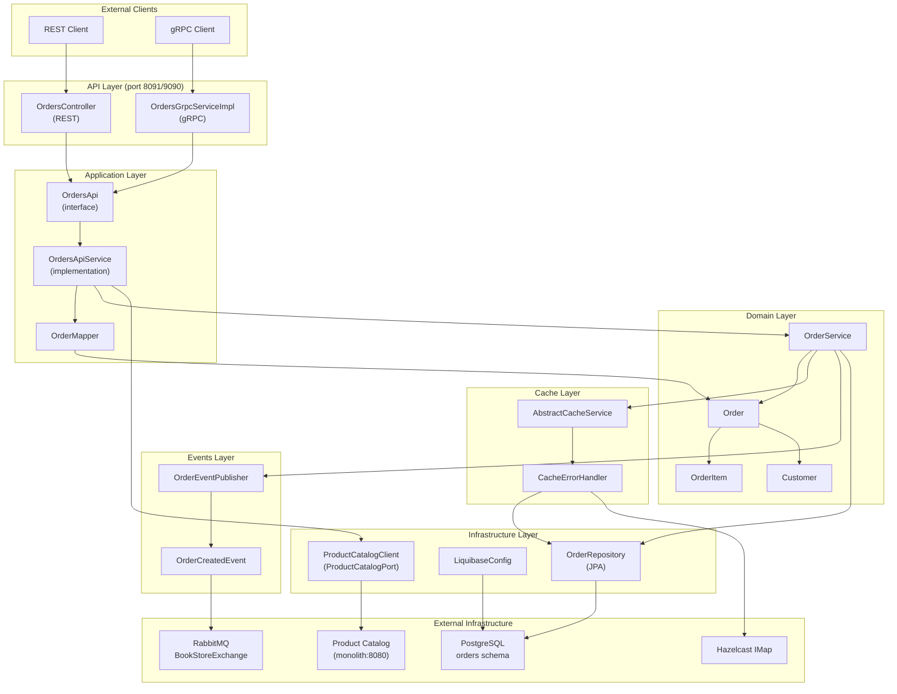
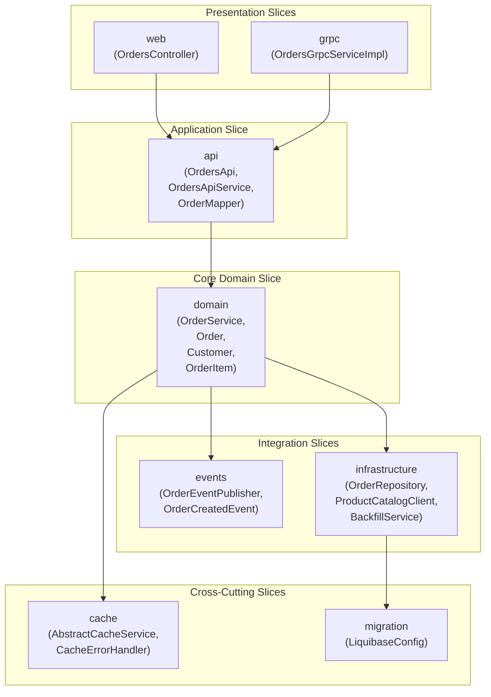
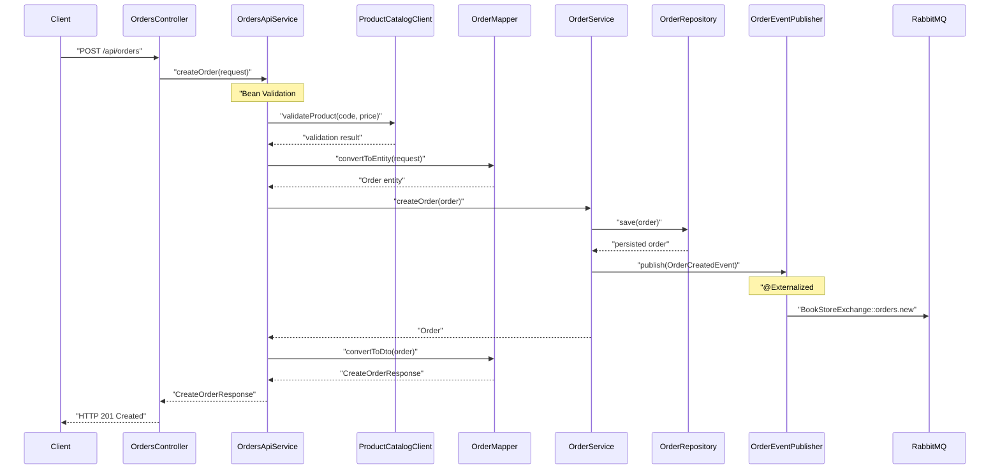
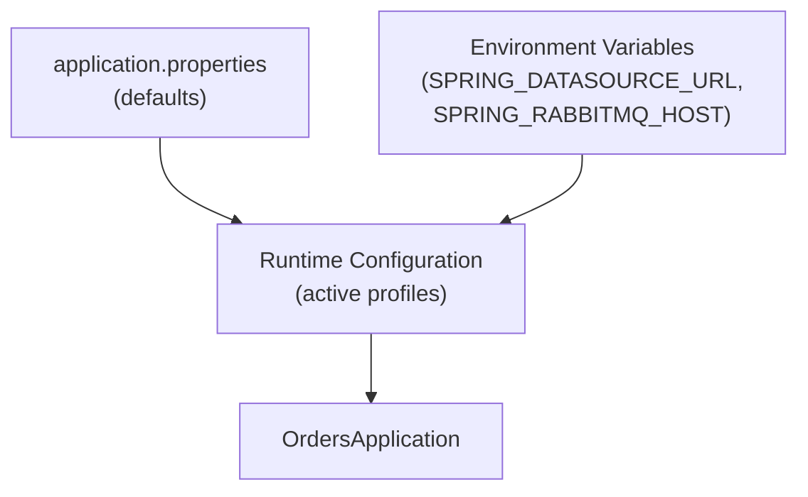

# Architecture

> **Relevant source files**
> * [README.md](https://github.com/philipz/spring-modulith-orders/blob/eb506991/README.md)
> * [pom.xml](https://github.com/philipz/spring-modulith-orders/blob/eb506991/pom.xml)
> * [src/main/java/com/sivalabs/bookstore/orders/OrdersApplication.java](https://github.com/philipz/spring-modulith-orders/blob/eb506991/src/main/java/com/sivalabs/bookstore/orders/OrdersApplication.java)

## Purpose and Scope

This document provides an architectural overview of the `orders-service` microservice, describing the overall system design, technology choices, and how major components interact. It covers the high-level structure of the Spring Modulith application, external integrations, and key architectural patterns employed.

For detailed information about specific architectural layers, see:

* System architecture and technology stack: [3.1](/philipz/spring-modulith-orders/3.1-system-architecture)
* Spring Modulith slice organization: [3.2](/philipz/spring-modulith-orders/3.2-spring-modulith-organization)
* API layer design patterns: [3.3](/philipz/spring-modulith-orders/3.3-api-layer-design)
* Event-driven architecture: [3.4](/philipz/spring-modulith-orders/3.4-event-driven-architecture)
* Resilience and fault tolerance: [3.5](/philipz/spring-modulith-orders/3.5-resilience-and-fault-tolerance)

---

## Architectural Approach

The `orders-service` is a microservice extracted from a modular monolith, built using Spring Boot 3.5 and Java 21. It employs Spring Modulith to maintain internal modularity while operating as an independent deployable unit. The service exposes dual APIs (REST and gRPC) and integrates with external infrastructure services for persistence, messaging, and caching.

The architecture follows these principles:

* **Modular Monolith Structure**: Internal organization using Spring Modulith slices with explicit boundaries
* **Contract-First API Design**: Both REST (OpenAPI) and gRPC (Protocol Buffers) are contract-driven
* **Event-Driven Integration**: Asynchronous communication via Spring Modulith events externalized to RabbitMQ
* **Resilience by Default**: Circuit breakers, fallbacks, and health checks at multiple layers
* **Observability**: Built-in metrics (Prometheus), tracing (OpenTelemetry), and actuator endpoints

Sources: [README.md L1-L37](https://github.com/philipz/spring-modulith-orders/blob/eb506991/README.md#L1-L37)

 [pom.xml L1-L315](https://github.com/philipz/spring-modulith-orders/blob/eb506991/pom.xml#L1-L315)

 [src/main/java/com/sivalabs/bookstore/orders/OrdersApplication.java L1-L12](https://github.com/philipz/spring-modulith-orders/blob/eb506991/src/main/java/com/sivalabs/bookstore/orders/OrdersApplication.java#L1-L12)

---

## Technology Stack

| Category | Technology | Version | Purpose |
| --- | --- | --- | --- |
| Runtime | Java | 21 | Primary language runtime |
| Framework | Spring Boot | 3.5.5 | Application framework |
| Modularity | Spring Modulith | 1.4.3 | Internal module boundaries |
| Database | PostgreSQL | (runtime) | Primary data store |
| Migration | Liquibase | (spring-managed) | Database schema versioning |
| Messaging | RabbitMQ | (via AMQP) | Event publishing and consumption |
| Cache | Hazelcast | 5.5.6 | Distributed caching |
| API | gRPC | 1.58.0 | Primary RPC protocol |
| API | REST/OpenAPI | (springdoc 2.6.0) | Alternative HTTP API |
| Resilience | Resilience4j | 2.2.0 | Circuit breakers, retries, rate limiting |
| Observability | Micrometer | (spring-managed) | Metrics collection |
| Tracing | OpenTelemetry | (spring-managed) | Distributed tracing |

Sources: [pom.xml L21-L238](https://github.com/philipz/spring-modulith-orders/blob/eb506991/pom.xml#L21-L238)

---

## High-Level Component Architecture

The following diagram shows the major components of the `orders-service` and their relationships:

**Key Components**:

* **`OrdersController`** ([src/main/java/com/sivalabs/bookstore/orders/web/controllers/OrdersController.java](https://github.com/philipz/spring-modulith-orders/blob/eb506991/src/main/java/com/sivalabs/bookstore/orders/web/controllers/OrdersController.java) ): REST endpoint on port 8091
* **`OrdersGrpcServiceImpl`** ([src/main/java/com/sivalabs/bookstore/orders/grpc/OrdersGrpcServiceImpl.java](https://github.com/philipz/spring-modulith-orders/blob/eb506991/src/main/java/com/sivalabs/bookstore/orders/grpc/OrdersGrpcServiceImpl.java) ): gRPC service on port 9090
* **`OrdersApiService`** ([src/main/java/com/sivalabs/bookstore/orders/api/OrdersApiService.java](https://github.com/philipz/spring-modulith-orders/blob/eb506991/src/main/java/com/sivalabs/bookstore/orders/api/OrdersApiService.java) ): Core application logic
* **`OrderService`** ([src/main/java/com/sivalabs/bookstore/orders/domain/OrderService.java](https://github.com/philipz/spring-modulith-orders/blob/eb506991/src/main/java/com/sivalabs/bookstore/orders/domain/OrderService.java) ): Domain business logic
* **`OrderEventPublisher`** ([src/main/java/com/sivalabs/bookstore/orders/events/OrderEventPublisher.java](https://github.com/philipz/spring-modulith-orders/blob/eb506991/src/main/java/com/sivalabs/bookstore/orders/events/OrderEventPublisher.java) ): Event publishing via Spring Modulith
* **`AbstractCacheService`** ([src/main/java/com/sivalabs/bookstore/orders/cache/AbstractCacheService.java](https://github.com/philipz/spring-modulith-orders/blob/eb506991/src/main/java/com/sivalabs/bookstore/orders/cache/AbstractCacheService.java) ): Base class for caching operations
* **`CacheErrorHandler`** ([src/main/java/com/sivalabs/bookstore/orders/cache/CacheErrorHandler.java](https://github.com/philipz/spring-modulith-orders/blob/eb506991/src/main/java/com/sivalabs/bookstore/orders/cache/CacheErrorHandler.java) ): Circuit breaker for cache failures

Sources: [README.md L5-L10](https://github.com/philipz/spring-modulith-orders/blob/eb506991/README.md#L5-L10)

 [pom.xml L45-L178](https://github.com/philipz/spring-modulith-orders/blob/eb506991/pom.xml#L45-L178)

---

## Spring Modulith Slice Organization

The application is organized into Spring Modulith slices, each with a specific responsibility:

**Slice Responsibilities**:

| Slice | Package | Key Classes | Purpose |
| --- | --- | --- | --- |
| `web` | `com.sivalabs.bookstore.orders.web` | `OrdersController` | REST API endpoints |
| `grpc` | `com.sivalabs.bookstore.orders.grpc` | `OrdersGrpcServiceImpl` | gRPC service implementation |
| `api` | `com.sivalabs.bookstore.orders.api` | `OrdersApi`, `OrdersApiService`, `OrderMapper` | Application facade and DTOs |
| `domain` | `com.sivalabs.bookstore.orders.domain` | `OrderService`, `Order`, `Customer`, `OrderItem` | Core business logic and entities |
| `events` | `com.sivalabs.bookstore.orders.events` | `OrderEventPublisher`, `OrderCreatedEvent` | Event publishing |
| `infrastructure` | `com.sivalabs.bookstore.orders.infrastructure` | `OrderRepository`, `ProductCatalogClient`, `BackfillService` | External integrations |
| `cache` | `com.sivalabs.bookstore.orders.cache` | `AbstractCacheService`, `CacheErrorHandler` | Caching abstraction |
| `migration` | `com.sivalabs.bookstore.orders.migration` | `LiquibaseConfig` | Database schema management |

Sources: [README.md L5-L10](https://github.com/philipz/spring-modulith-orders/blob/eb506991/README.md#L5-L10)

---

## Request Flow Architecture

The following sequence diagram illustrates how a typical order creation request flows through the system:

**Key Flow Steps**:

1. **API Layer**: `OrdersController` receives HTTP request on port 8091
2. **Validation**: `OrdersApiService` performs Bean Validation (JSR-303) on incoming request
3. **External Validation**: `ProductCatalogClient` validates product data against external catalog
4. **Transformation**: `OrderMapper` converts request DTO to domain entity `Order`
5. **Business Logic**: `OrderService` applies domain rules and orchestrates persistence
6. **Persistence**: `OrderRepository` saves to PostgreSQL via JPA
7. **Event Publishing**: `OrderEventPublisher` publishes `OrderCreatedEvent` with `@Externalized` annotation
8. **AMQP Routing**: Spring Modulith routes event to RabbitMQ `BookStoreExchange` with routing key `orders.new`
9. **Response Mapping**: `OrderMapper` converts domain entity back to DTO
10. **HTTP Response**: Client receives `CreateOrderResponse` with `orderNumber`

Sources: [README.md L5-L10](https://github.com/philipz/spring-modulith-orders/blob/eb506991/README.md#L5-L10)

 [pom.xml L129-L156](https://github.com/philipz/spring-modulith-orders/blob/eb506991/pom.xml#L129-L156)

---

## Integration Points

### External Service Dependencies

The `orders-service` integrates with the following external systems:

| System | Protocol | Purpose | Configuration |
| --- | --- | --- | --- |
| PostgreSQL | JDBC | Primary data persistence | `SPRING_DATASOURCE_URL` (default: `localhost:5432`) |
| RabbitMQ | AMQP | Event publishing | `SPRING_RABBITMQ_HOST` (default: `localhost:5672`) |
| Hazelcast | Native | Distributed caching | Embedded or external cluster |
| Product Catalog | gRPC | Product validation | `BOOKSTORE_CATALOG_SERVICE_TARGET` (default: `localhost:9091`) |
| Prometheus | HTTP | Metrics scraping | `/actuator/prometheus` endpoint |
| Zipkin/OTLP | HTTP | Trace export | `MANAGEMENT_OTLP_TRACING_ENDPOINT` |

### Named API Interfaces

Spring Modulith exposes two named interfaces for external consumption:

1. **`order-api-model`**: Data contracts in `com.sivalabs.bookstore.orders.api.model` package * `CreateOrderRequest`, `CreateOrderResponse` * `OrderDto`, `OrderView` * `Customer`, `OrderItem`, `OrderStatus`
2. **`order-api-events`**: Event contracts in `com.sivalabs.bookstore.orders.events.model` package * `OrderCreatedEvent` (published to RabbitMQ with `@Externalized`)

These named interfaces allow other Spring Modulith modules to depend on specific contracts without coupling to implementation details.

Sources: [README.md L24-L28](https://github.com/philipz/spring-modulith-orders/blob/eb506991/README.md#L24-L28)

 [pom.xml L114-L184](https://github.com/philipz/spring-modulith-orders/blob/eb506991/pom.xml#L114-L184)

---

## Deployment Ports

The service exposes multiple ports for different concerns:

| Port | Protocol | Purpose | Configuration Property |
| --- | --- | --- | --- |
| 8091 | HTTP/REST | Primary REST API | `server.port=8091` |
| 9090 | gRPC | Primary gRPC API | `grpc.server.port=9090` |
| 8091 | HTTP | Actuator endpoints | `/actuator/*` |
| 8091 | HTTP | Swagger UI | `/swagger-ui.html` (when enabled) |
| 8091 | HTTP | OpenAPI spec | `/v3/api-docs` |

The REST API can be disabled via `ORDERS_REST_ENABLED=false`, making gRPC the sole protocol.

Sources: [README.md L20-L28](https://github.com/philipz/spring-modulith-orders/blob/eb506991/README.md#L20-L28)

---

## Configuration Management

Configuration follows Spring Boot's externalized configuration model:

Key configuration categories:

* **Database**: `SPRING_DATASOURCE_*` properties for PostgreSQL connection
* **Messaging**: `SPRING_RABBITMQ_*` properties for RabbitMQ broker
* **gRPC Clients**: `BOOKSTORE_CATALOG_SERVICE_TARGET` for product catalog
* **Feature Flags**: `ORDERS_REST_ENABLED`, `ORDERS_BACKFILL_ENABLED`
* **Cache**: `BOOKSTORE_CACHE_*` properties for Hazelcast tuning
* **Resilience**: `RESILIENCE4J_*` properties for circuit breaker configuration
* **Observability**: `MANAGEMENT_*` properties for actuator and tracing

For detailed configuration reference, see [8.1](/philipz/spring-modulith-orders/8.1-application-configuration) and [8.3](/philipz/spring-modulith-orders/8.3-environment-variables-reference).

Sources: [README.md L24-L28](https://github.com/philipz/spring-modulith-orders/blob/eb506991/README.md#L24-L28)

 [pom.xml L1-L315](https://github.com/philipz/spring-modulith-orders/blob/eb506991/pom.xml#L1-L315)