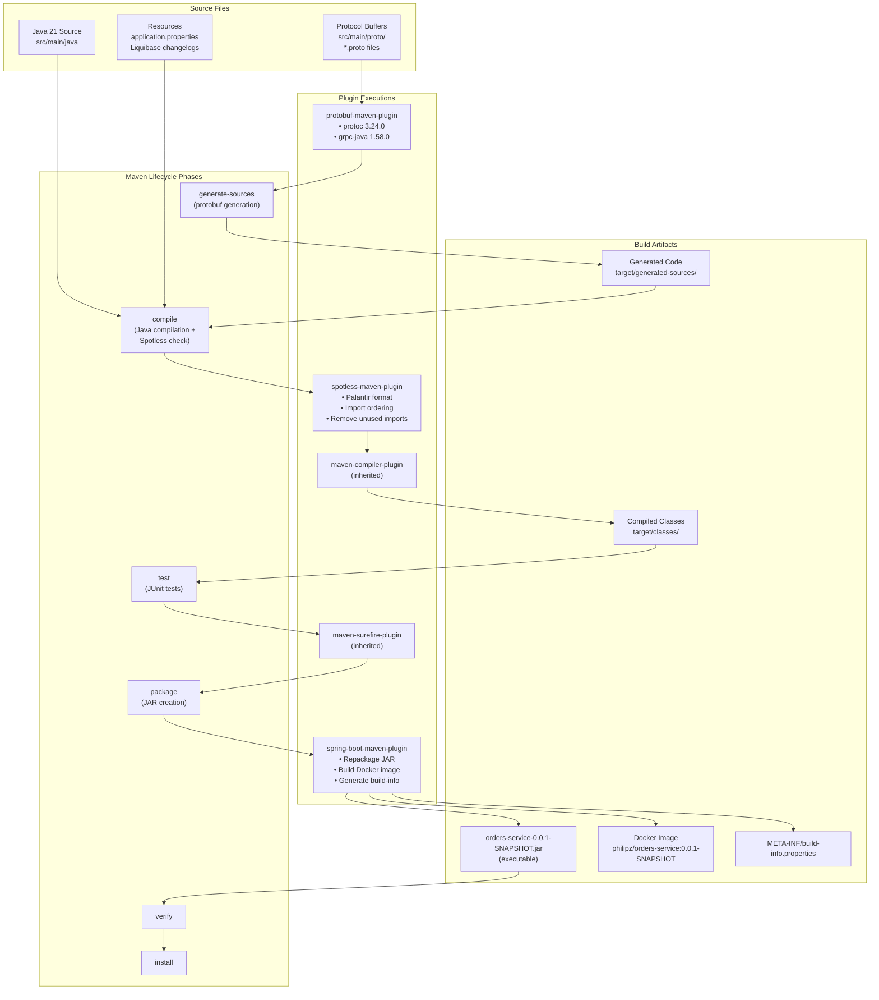
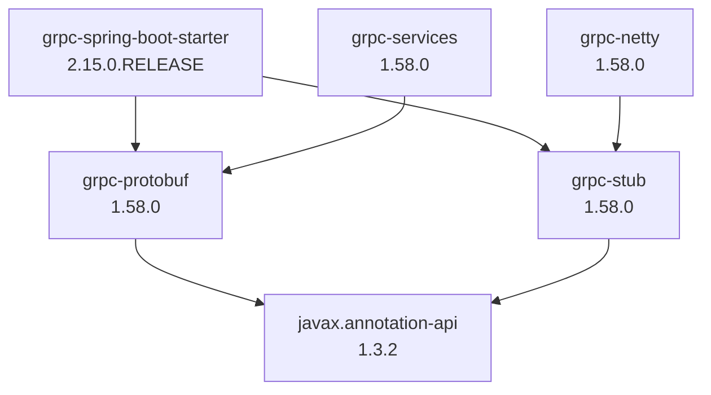
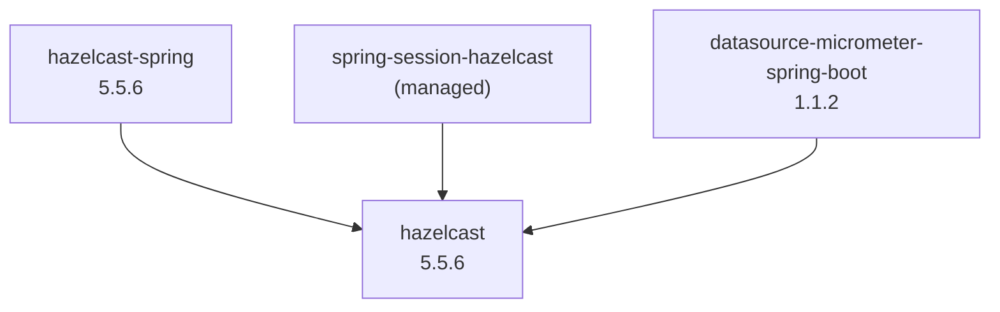
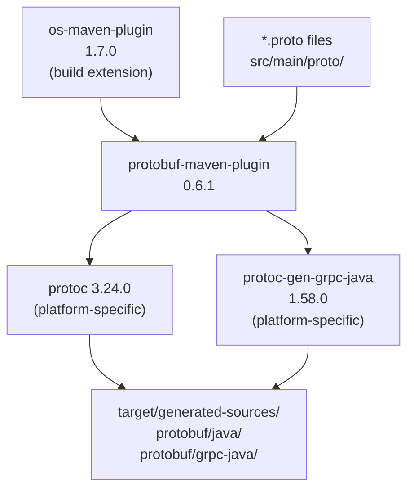
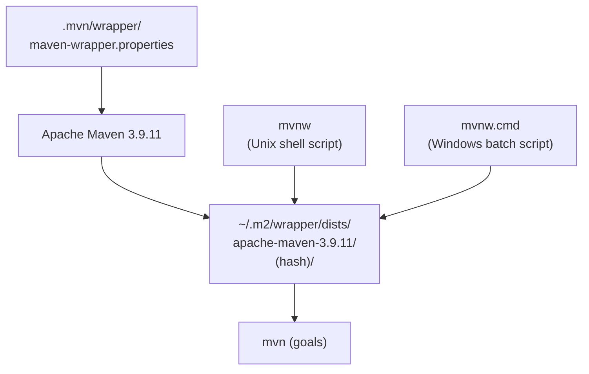

# Build Configuration

> **Relevant source files**
> * [.mvn/wrapper/maven-wrapper.properties](https://github.com/philipz/spring-modulith-orders/blob/eb506991/.mvn/wrapper/maven-wrapper.properties)
> * [mvnw](https://github.com/philipz/spring-modulith-orders/blob/eb506991/mvnw)
> * [mvnw.cmd](https://github.com/philipz/spring-modulith-orders/blob/eb506991/mvnw.cmd)
> * [pom.xml](https://github.com/philipz/spring-modulith-orders/blob/eb506991/pom.xml)

## Purpose and Scope

This document describes the Maven build configuration for the `orders-service` project, including dependency management, build plugins, code generation, and artifact packaging. The build system uses Apache Maven 3.9.11 (via Maven Wrapper) with Java 21 and Spring Boot 3.5.5 as the parent POM.

For information about environment-specific configuration and runtime properties, see [Application Configuration](/philipz/spring-modulith-orders/8.1-application-configuration). For deployment-specific build artifacts like Docker images and Kubernetes manifests, see [Deployment](/philipz/spring-modulith-orders/6-deployment).

**Sources:** [pom.xml L1-L315](https://github.com/philipz/spring-modulith-orders/blob/eb506991/pom.xml#L1-L315)

---

## Maven Project Coordinates

The project is defined with the following coordinates in [pom.xml L14-L19](https://github.com/philipz/spring-modulith-orders/blob/eb506991/pom.xml#L14-L19)

:

| Property | Value |
| --- | --- |
| **groupId** | `com.sivalabs.bookstore` |
| **artifactId** | `orders-service` |
| **version** | `0.0.1-SNAPSHOT` |
| **packaging** | `jar` |
| **name** | `orders-service` |
| **description** | Orders microservice extracted from the modular monolith |

The project inherits from `spring-boot-starter-parent` version 3.5.5 [pom.xml L7-L12](https://github.com/philipz/spring-modulith-orders/blob/eb506991/pom.xml#L7-L12)

 which provides dependency management, plugin configuration, and Spring Boot-specific build conventions.

**Sources:** [pom.xml L7-L19](https://github.com/philipz/spring-modulith-orders/blob/eb506991/pom.xml#L7-L19)

---

## Version Properties

Version properties are centrally defined in [pom.xml L21-L31](https://github.com/philipz/spring-modulith-orders/blob/eb506991/pom.xml#L21-L31)

 to ensure consistency across dependencies and plugins:

```
java.version=21
spring-modulith.version=1.4.3
datasource-micrometer-spring-boot.version=1.1.2
hazelcast.version=5.5.6
bootstrap.version=5.3.7
htmx.version=2.0.6
spotless.version=2.46.1
palantir-java-format.version=2.72.0
resilience4j.version=2.2.0
```

The Spring Modulith BOM (Bill of Materials) is imported via `dependencyManagement` [pom.xml L33-L43](https://github.com/philipz/spring-modulith-orders/blob/eb506991/pom.xml#L33-L43)

 to provide version alignment for all Spring Modulith artifacts.

**Sources:** [pom.xml L21-L43](https://github.com/philipz/spring-modulith-orders/blob/eb506991/pom.xml#L21-L43)

---

## Build Process Overview

The following diagram illustrates the complete Maven build lifecycle and the plugins that execute at each phase:



**Sources:** [pom.xml L247-L314](https://github.com/philipz/spring-modulith-orders/blob/eb506991/pom.xml#L247-L314)

---

## Dependency Categories

### Core Application Stack

The foundation of the application consists of Spring Boot starters and core infrastructure:

| Dependency | Scope | Purpose |
| --- | --- | --- |
| `spring-boot-starter-web` | compile | REST API support with embedded Tomcat |
| `spring-boot-starter-validation` | compile | Bean Validation (JSR-380) with Hibernate Validator |
| `spring-boot-starter-aop` | compile | Aspect-oriented programming support |
| `spring-boot-starter-actuator` | compile | Production-ready monitoring and management |
| `micrometer-registry-prometheus` | runtime | Prometheus metrics registry |
| `micrometer-tracing-bridge-otel` | compile | OpenTelemetry distributed tracing |
| `opentelemetry-exporter-otlp` | compile | OTLP protocol exporter for traces |
| `resilience4j-spring-boot3` | compile | Circuit breaker, retry, and bulkhead patterns |

**Sources:** [pom.xml L46-L80](https://github.com/philipz/spring-modulith-orders/blob/eb506991/pom.xml#L46-L80)

### gRPC Dependencies

The gRPC stack requires multiple coordinated dependencies for contract-first API development:



All gRPC dependencies are aligned to version 1.58.0 for compatibility [pom.xml L82-L112](https://github.com/philipz/spring-modulith-orders/blob/eb506991/pom.xml#L82-L112)

**Sources:** [pom.xml L82-L112](https://github.com/philipz/spring-modulith-orders/blob/eb506991/pom.xml#L82-L112)

### Persistence Stack

The persistence layer combines JPA, Liquibase for schema migration, and PostgreSQL:

| Dependency | Version | Purpose |
| --- | --- | --- |
| `spring-boot-starter-data-jpa` | (managed) | JPA with Hibernate ORM |
| `liquibase-core` | (managed) | Database schema versioning and migration |
| `postgresql` | (managed, runtime) | PostgreSQL JDBC driver |

Liquibase changelogs are located in the `migration` slice and executed on application startup. See [Architecture](/philipz/spring-modulith-orders/3-architecture) for details on the Spring Modulith slice structure.

**Sources:** [pom.xml L114-L127](https://github.com/philipz/spring-modulith-orders/blob/eb506991/pom.xml#L114-L127)

### Messaging and Spring Modulith

The event-driven architecture is powered by Spring Modulith with AMQP externalization:

| Dependency | Scope | Purpose |
| --- | --- | --- |
| `spring-boot-starter-amqp` | compile | RabbitMQ integration via Spring AMQP |
| `spring-modulith-starter-core` | compile | Core Spring Modulith functionality |
| `spring-modulith-starter-jdbc` | compile | JDBC-based event store for transactional events |
| `spring-modulith-events-amqp` | runtime | `@Externalized` annotation support for event publishing |
| `spring-modulith-actuator` | runtime | Actuator endpoints for module inspection |
| `spring-modulith-observability` | runtime | Observability instrumentation for module boundaries |

The Spring Modulith version (1.4.3) is managed through the BOM import [pom.xml L33-L43](https://github.com/philipz/spring-modulith-orders/blob/eb506991/pom.xml#L33-L43)

 For event publishing patterns, see [Event-Driven Architecture](/philipz/spring-modulith-orders/3.4-event-driven-architecture).

**Sources:** [pom.xml L129-L156](https://github.com/philipz/spring-modulith-orders/blob/eb506991/pom.xml#L129-L156)

### Caching with Hazelcast

Hazelcast provides distributed caching and session management:



The Hazelcast repository is explicitly declared [pom.xml L240-L245](https://github.com/philipz/spring-modulith-orders/blob/eb506991/pom.xml#L240-L245)

 to ensure artifact availability. Cache configuration and circuit breaker patterns are detailed in [Caching Layer](/philipz/spring-modulith-orders/5.2-caching-layer) and [Resilience and Fault Tolerance](/philipz/spring-modulith-orders/3.5-resilience-and-fault-tolerance).

**Sources:** [pom.xml L158-L177](https://github.com/philipz/spring-modulith-orders/blob/eb506991/pom.xml#L158-L177)

 [pom.xml L240-L245](https://github.com/philipz/spring-modulith-orders/blob/eb506991/pom.xml#L240-L245)

### API Documentation

OpenAPI 3.0 specification is generated at runtime via Springdoc:

* **Dependency:** `springdoc-openapi-starter-webmvc-ui` version 2.6.0 [pom.xml L180-L184](https://github.com/philipz/spring-modulith-orders/blob/eb506991/pom.xml#L180-L184)
* **Swagger UI:** Available at `/swagger-ui.html` (see [REST API](/philipz/spring-modulith-orders/4.1-rest-api))
* **OpenAPI Spec:** Available at `/v3/api-docs`

**Sources:** [pom.xml L180-L184](https://github.com/philipz/spring-modulith-orders/blob/eb506991/pom.xml#L180-L184)

### Developer Experience Tools

| Dependency | Scope | Purpose |
| --- | --- | --- |
| `lombok` | optional | Reduces boilerplate code with annotations |
| `spring-boot-devtools` | optional | Automatic restart and LiveReload |
| `spring-boot-configuration-processor` | optional | Generates metadata for custom configuration properties |

These dependencies are marked as `optional` and excluded from the final runtime artifact [pom.xml L186-L201](https://github.com/philipz/spring-modulith-orders/blob/eb506991/pom.xml#L186-L201)

**Sources:** [pom.xml L186-L201](https://github.com/philipz/spring-modulith-orders/blob/eb506991/pom.xml#L186-L201)

### Testing Dependencies

The test scope includes Spring Boot's comprehensive testing stack plus Testcontainers:

| Dependency | Purpose |
| --- | --- |
| `spring-boot-starter-test` | JUnit Jupiter, Mockito, AssertJ, MockMvc, JSONPath |
| `testcontainers:junit-jupiter` | JUnit 5 integration for Testcontainers |
| `testcontainers:postgresql` | PostgreSQL container for integration tests |
| `testcontainers:rabbitmq` | RabbitMQ container for messaging tests |
| `mockwebserver` (4.12.0) | HTTP server mocking for external service calls |
| `awaitility` (4.2.0) | Asynchronous assertion library |

All testing dependencies use `test` scope [pom.xml L203-L237](https://github.com/philipz/spring-modulith-orders/blob/eb506991/pom.xml#L203-L237)

 For testing strategies and patterns, see [Testing](/philipz/spring-modulith-orders/7-testing).

**Sources:** [pom.xml L203-L237](https://github.com/philipz/spring-modulith-orders/blob/eb506991/pom.xml#L203-L237)

---

## Build Plugins Configuration

### Protocol Buffers Code Generation

The `protobuf-maven-plugin` generates Java classes and gRPC stubs from `.proto` files during the `generate-sources` phase:



Configuration details [pom.xml L256-L273](https://github.com/philipz/spring-modulith-orders/blob/eb506991/pom.xml#L256-L273)

:

* **OS Detection Extension:** `os-maven-plugin` 1.7.0 [pom.xml L248-L254](https://github.com/philipz/spring-modulith-orders/blob/eb506991/pom.xml#L248-L254)  detects the platform classifier (e.g., `osx-x86_64`, `linux-x86_64`, `windows-x86_64`)
* **Protocol Compiler:** `protoc` 3.24.0 with platform-specific executable
* **gRPC Plugin:** `protoc-gen-grpc-java` 1.58.0 for service stub generation
* **Goals:** `compile` (for message classes) and `compile-custom` (for gRPC services)

The generated code is automatically added to the compilation source path. For gRPC API contracts, see [gRPC API](/philipz/spring-modulith-orders/4.2-grpc-api).

**Sources:** [pom.xml L248-L273](https://github.com/philipz/spring-modulith-orders/blob/eb506991/pom.xml#L248-L273)

### Spring Boot Packaging and Docker Images

The `spring-boot-maven-plugin` creates executable JARs and Docker images via Cloud Native Buildpacks:

**Configuration** [pom.xml L274-L289](https://github.com/philipz/spring-modulith-orders/blob/eb506991/pom.xml#L274-L289)

:

```xml
<configuration>
    <image>
        <name>philipz/${project.artifactId}:${project.version}</name>
    </image>
</configuration>
<executions>
    <execution>
        <goals>
            <goal>build-info</goal>
        </goals>
    </execution>
</executions>
```

**Capabilities:**

1. **Executable JAR:** The `repackage` goal (bound to the `package` phase) creates a fully executable JAR with embedded dependencies
2. **Docker Image:** The image name is `philipz/orders-service:0.0.1-SNAPSHOT`, built using Paketo Buildpacks without requiring a Dockerfile
3. **Build Info:** Generates `META-INF/build-info.properties` containing build time, version, and artifact coordinates (accessible via Actuator)

To build a Docker image without packaging: `./mvnw spring-boot:build-image`

**Sources:** [pom.xml L274-L289](https://github.com/philipz/spring-modulith-orders/blob/eb506991/pom.xml#L274-L289)

### Code Formatting with Spotless

The `spotless-maven-plugin` enforces consistent code style using Palantir Java Format:

**Configuration** [pom.xml L290-L312](https://github.com/philipz/spring-modulith-orders/blob/eb506991/pom.xml#L290-L312)

:

```html
<configuration>
    <java>
        <importOrder />
        <removeUnusedImports />
        <palantirJavaFormat>
            <version>2.72.0</version>
        </palantirJavaFormat>
        <formatAnnotations />
    </java>
</configuration>
```

**Features:**

* **Import Management:** Organizes imports and removes unused ones
* **Palantir Format:** Applies Palantir's opinionated Java formatting rules
* **Annotation Formatting:** Ensures consistent annotation placement
* **Execution Phase:** Runs during the `compile` phase with the `check` goal, failing the build if code is not properly formatted

**Commands:**

* Check formatting: `./mvnw spotless:check`
* Apply formatting: `./mvnw spotless:apply`

For development guidelines and formatting standards, see [Development Guidelines](/philipz/spring-modulith-orders/2.4-development-guidelines).

**Sources:** [pom.xml L290-L312](https://github.com/philipz/spring-modulith-orders/blob/eb506991/pom.xml#L290-L312)

---

## Maven Wrapper Configuration

The project includes Maven Wrapper for consistent build tool versioning across development environments:



**Files:**

* [.mvn/wrapper/maven-wrapper.properties L1-L3](https://github.com/philipz/spring-modulith-orders/blob/eb506991/.mvn/wrapper/maven-wrapper.properties#L1-L3)  - Specifies Maven distribution URL
* [mvnw L1-L296](https://github.com/philipz/spring-modulith-orders/blob/eb506991/mvnw#L1-L296)  - Unix/macOS wrapper script
* [mvnw.cmd L1-L190](https://github.com/philipz/spring-modulith-orders/blob/eb506991/mvnw.cmd#L1-L190)  - Windows wrapper script

**Maven Version:** 3.9.11 from Maven Central [.mvn/wrapper/maven-wrapper.properties L2](https://github.com/philipz/spring-modulith-orders/blob/eb506991/.mvn/wrapper/maven-wrapper.properties#L2-L2)

**Distribution Type:** `only-script` - downloads Maven but not the wrapper JAR [.mvn/wrapper/maven-wrapper.properties L1](https://github.com/philipz/spring-modulith-orders/blob/eb506991/.mvn/wrapper/maven-wrapper.properties#L1-L1)

**Usage:**

* Unix/macOS: `./mvnw clean install`
* Windows: `mvnw.cmd clean install`

The wrapper automatically downloads Maven to `~/.m2/wrapper/dists/` on first use, ensuring all developers use the same Maven version without requiring manual installation. For initial setup instructions, see [Prerequisites and Setup](/philipz/spring-modulith-orders/2.1-prerequisites-and-setup).

**Sources:** [.mvn/wrapper/maven-wrapper.properties L1-L3](https://github.com/philipz/spring-modulith-orders/blob/eb506991/.mvn/wrapper/maven-wrapper.properties#L1-L3)

 [mvnw L1-L296](https://github.com/philipz/spring-modulith-orders/blob/eb506991/mvnw#L1-L296)

 [mvnw.cmd L1-L190](https://github.com/philipz/spring-modulith-orders/blob/eb506991/mvnw.cmd#L1-L190)

---

## Build Artifacts and Output

The build process produces several artifacts in the `target/` directory:

| Artifact | Location | Description |
| --- | --- | --- |
| **Executable JAR** | `target/orders-service-0.0.1-SNAPSHOT.jar` | Fat JAR with embedded dependencies, executable via `java -jar` |
| **Generated Sources** | `target/generated-sources/protobuf/` | Protocol Buffer message classes and gRPC stubs |
| **Compiled Classes** | `target/classes/` | Compiled Java bytecode and resources |
| **Build Info** | `target/classes/META-INF/build-info.properties` | Build metadata (version, timestamp, artifact coordinates) |
| **Test Reports** | `target/surefire-reports/` | JUnit XML test reports |
| **Docker Image** | Local Docker daemon | `philipz/orders-service:0.0.1-SNAPSHOT` (via Cloud Native Buildpacks) |

**Build Commands:**

```markdown
# Full build with tests
./mvnw clean verify

# Build executable JAR
./mvnw clean package

# Build Docker image
./mvnw clean spring-boot:build-image

# Run without packaging
./mvnw spring-boot:run
```

For local development and deployment instructions, see [Running Locally](/philipz/spring-modulith-orders/2.3-running-locally) and [Deployment](/philipz/spring-modulith-orders/6-deployment).

**Sources:** [pom.xml L274-L289](https://github.com/philipz/spring-modulith-orders/blob/eb506991/pom.xml#L274-L289)