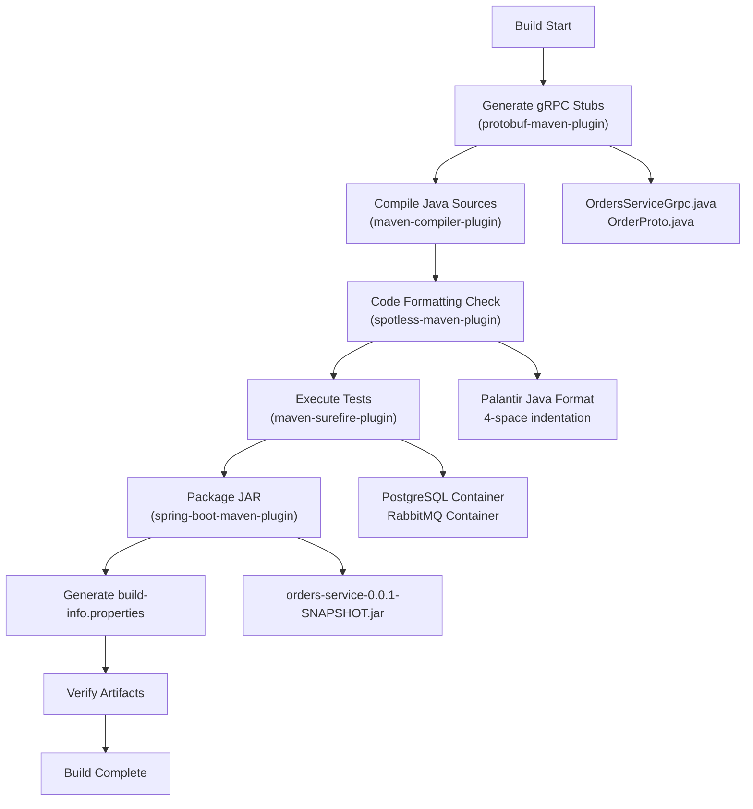
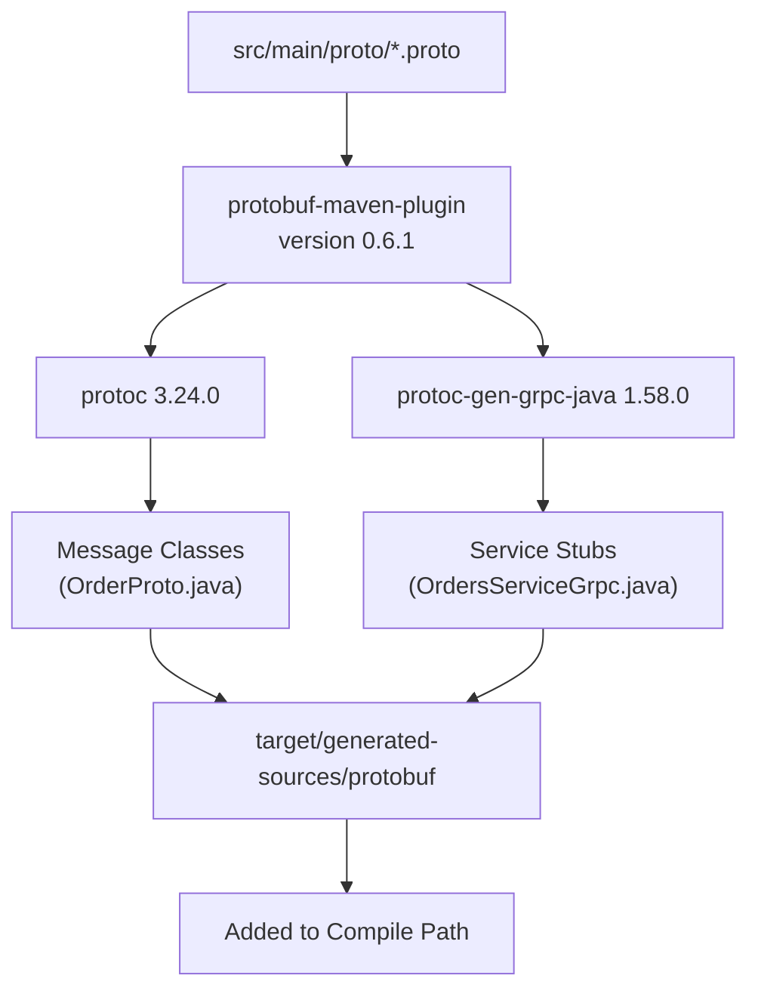
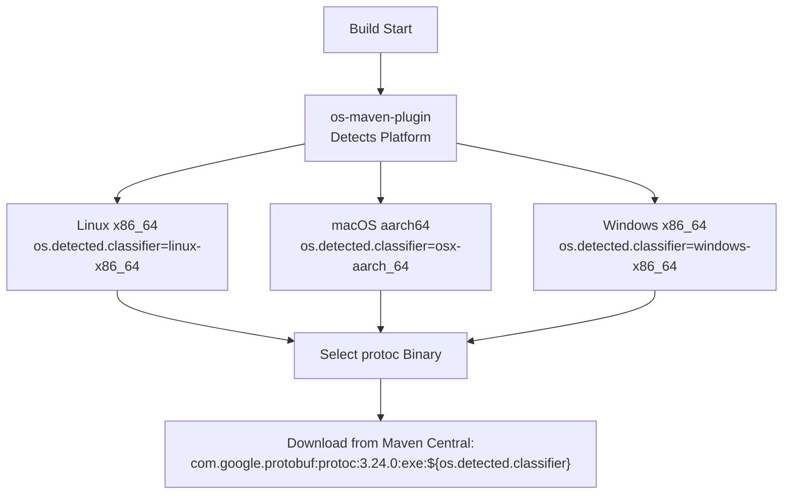
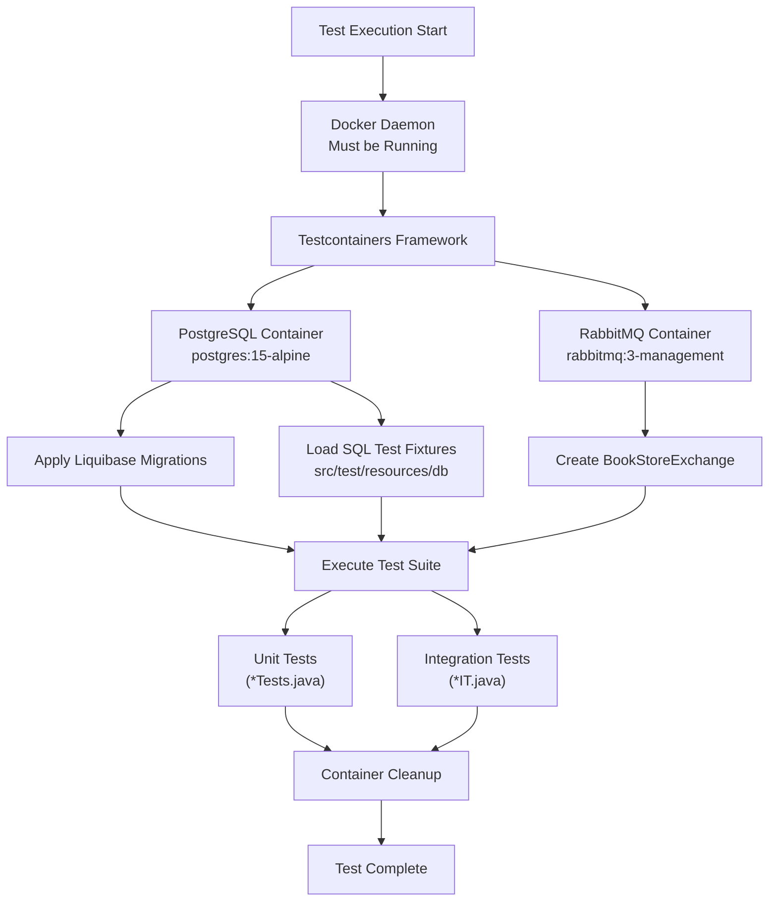
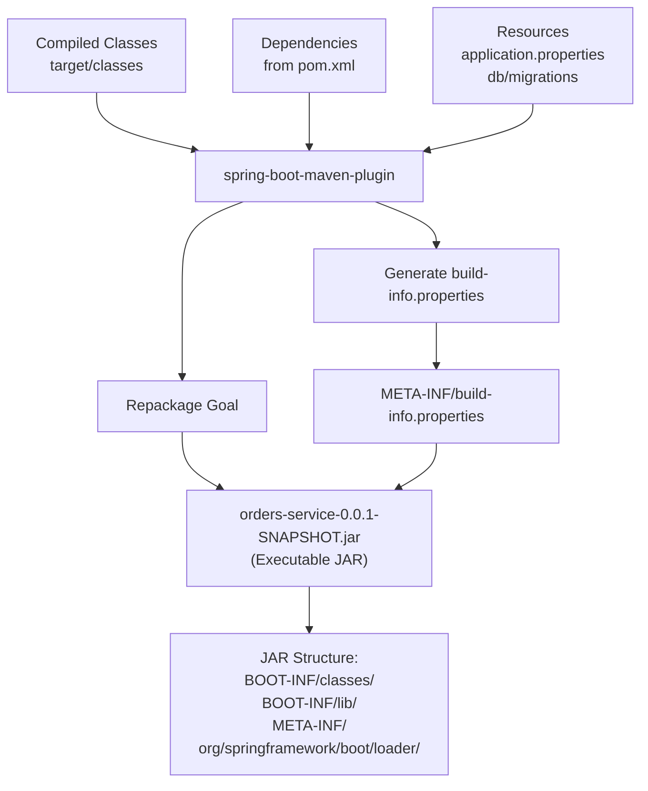
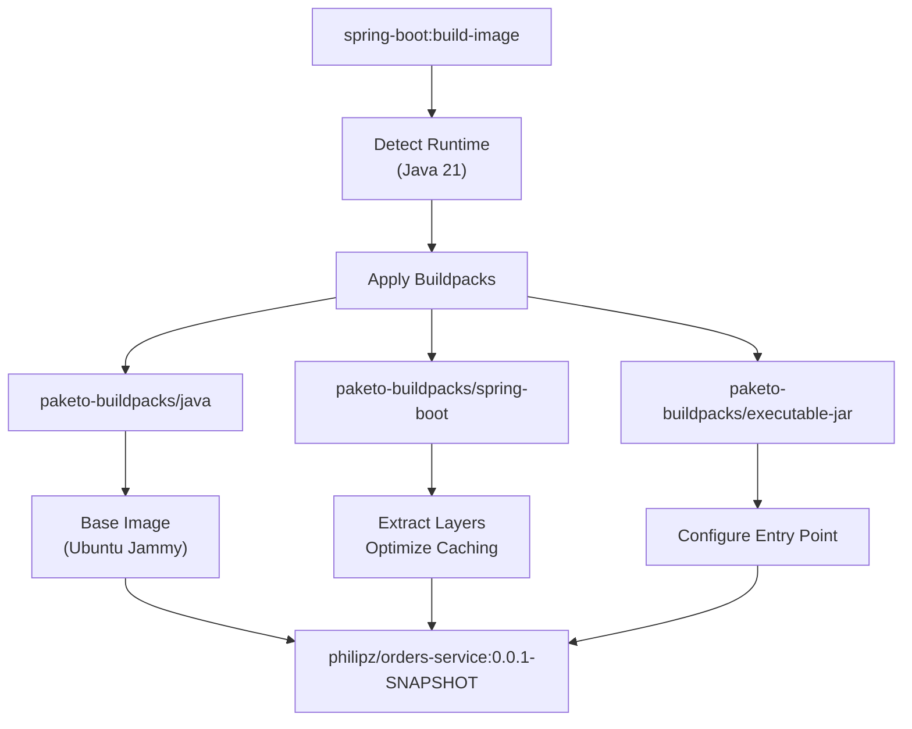

# Building the Project

> **Relevant source files**
> * [AGENTS.md](https://github.com/philipz/spring-modulith-orders/blob/eb506991/AGENTS.md)
> * [mvnw](https://github.com/philipz/spring-modulith-orders/blob/eb506991/mvnw)
> * [mvnw.cmd](https://github.com/philipz/spring-modulith-orders/blob/eb506991/mvnw.cmd)
> * [pom.xml](https://github.com/philipz/spring-modulith-orders/blob/eb506991/pom.xml)

This page documents the Maven build process for the orders-service, including code generation from Protocol Buffer files, code formatting with Spotless, test execution with Testcontainers, and artifact packaging. For information about running the service after building, see [Running Locally](/philipz/spring-modulith-orders/2.3-running-locally). For build configuration details, see [Build Configuration](/philipz/spring-modulith-orders/8.2-build-configuration).

---

## Build Overview

The orders-service uses Maven 3 with the Maven Wrapper (`mvnw` / `mvnw.cmd`) to ensure consistent builds across environments. The build process involves multiple code generation and validation steps that execute automatically during compilation.

### Build Lifecycle



**Sources:** [pom.xml L247-L314](https://github.com/philipz/spring-modulith-orders/blob/eb506991/pom.xml#L247-L314)

 [AGENTS.md L10-L14](https://github.com/philipz/spring-modulith-orders/blob/eb506991/AGENTS.md#L10-L14)

---

## Maven Wrapper

The project includes Maven Wrapper scripts that automatically download and use the correct Maven version specified in [.mvn/wrapper/maven-wrapper.properties](https://github.com/philipz/spring-modulith-orders/blob/eb506991/.mvn/wrapper/maven-wrapper.properties)

| Platform | Script | Usage |
| --- | --- | --- |
| Unix/Linux/macOS | `mvnw` | `./mvnw <goals>` |
| Windows | `mvnw.cmd` | `mvnw.cmd <goals>` |

The wrapper ensures Maven version consistency without requiring a global Maven installation. On first execution, it downloads Maven to `~/.m2/wrapper/dists/`.

**Sources:** [mvnw L1-L296](https://github.com/philipz/spring-modulith-orders/blob/eb506991/mvnw#L1-L296)

 [mvnw.cmd L1-L190](https://github.com/philipz/spring-modulith-orders/blob/eb506991/mvnw.cmd#L1-L190)

 [AGENTS.md L11](https://github.com/philipz/spring-modulith-orders/blob/eb506991/AGENTS.md#L11-L11)

---

## Common Build Commands

| Command | Purpose | Details |
| --- | --- | --- |
| `./mvnw clean verify` | Full build with validation | Cleans, compiles, generates code, formats, and runs all tests |
| `./mvnw clean install` | Full build and install to local repo | Same as verify plus installs to `~/.m2/repository` |
| `./mvnw compile` | Compile only | Generates proto stubs and compiles Java sources |
| `./mvnw test` | Run tests only | Executes unit and integration tests with Testcontainers |
| `./mvnw spotless:apply` | Auto-format code | Applies Palantir formatting to all Java sources |
| `./mvnw spotless:check` | Check code formatting | Validates formatting without modifying files |
| `./mvnw package` | Create JAR | Builds executable JAR in `target/` directory |
| `./mvnw spring-boot:build-image` | Create Docker image | Builds OCI image using Cloud Native Buildpacks |

**Sources:** [AGENTS.md L10-L14](https://github.com/philipz/spring-modulith-orders/blob/eb506991/AGENTS.md#L10-L14)

 [pom.xml L276-L289](https://github.com/philipz/spring-modulith-orders/blob/eb506991/pom.xml#L276-L289)

---

## Build Plugins and Code Generation

### Protocol Buffer Code Generation

The `protobuf-maven-plugin` generates Java code from `.proto` files during the compilation phase.



**Configuration details:**

* **Plugin:** `protobuf-maven-plugin` [pom.xml L256-L273](https://github.com/philipz/spring-modulith-orders/blob/eb506991/pom.xml#L256-L273)
* **Protocol Compiler:** `protoc` version 3.24.0 [pom.xml L261](https://github.com/philipz/spring-modulith-orders/blob/eb506991/pom.xml#L261-L261)
* **gRPC Plugin:** `protoc-gen-grpc-java` version 1.58.0 [pom.xml L263](https://github.com/philipz/spring-modulith-orders/blob/eb506991/pom.xml#L263-L263)
* **Output Directory:** `target/generated-sources/protobuf/java` and `target/generated-sources/protobuf/grpc-java`

The plugin executes two goals:

* `compile`: Generates message classes from `.proto` files
* `compile-custom`: Generates gRPC service stubs using the gRPC plugin

The generated sources are automatically added to the project's compile source roots, making them available to the Java compiler without manual configuration.

**Sources:** [pom.xml L256-L273](https://github.com/philipz/spring-modulith-orders/blob/eb506991/pom.xml#L256-L273)

 [AGENTS.md L6](https://github.com/philipz/spring-modulith-orders/blob/eb506991/AGENTS.md#L6-L6)

### OS Detection for Native Compilation

The `os-maven-plugin` extension detects the operating system and architecture to select the appropriate native Protocol Buffer compiler.



**Sources:** [pom.xml L248-L254](https://github.com/philipz/spring-modulith-orders/blob/eb506991/pom.xml#L248-L254)

 [pom.xml L261-L263](https://github.com/philipz/spring-modulith-orders/blob/eb506991/pom.xml#L261-L263)

---

## Code Formatting with Spotless

The `spotless-maven-plugin` enforces consistent code style using Palantir Java Format.

### Spotless Configuration

| Setting | Value | Purpose |
| --- | --- | --- |
| Formatter | Palantir Java Format | Industry-standard formatter with 4-space indentation |
| Version | 2.72.0 | Latest stable version [pom.xml L29](https://github.com/philipz/spring-modulith-orders/blob/eb506991/pom.xml#L29-L29) |
| Phase | `compile` | Runs automatically during compilation [pom.xml L306](https://github.com/philipz/spring-modulith-orders/blob/eb506991/pom.xml#L306-L306) |
| Goal | `check` | Fails build if formatting violations detected [pom.xml L308](https://github.com/philipz/spring-modulith-orders/blob/eb506991/pom.xml#L308-L308) |

### Formatting Rules Applied

1. **Import Ordering:** Sorts imports alphabetically [pom.xml L296](https://github.com/philipz/spring-modulith-orders/blob/eb506991/pom.xml#L296-L296)
2. **Remove Unused Imports:** Cleans up unnecessary import statements [pom.xml L297](https://github.com/philipz/spring-modulith-orders/blob/eb506991/pom.xml#L297-L297)
3. **Format Annotations:** Ensures consistent annotation formatting [pom.xml L301](https://github.com/philipz/spring-modulith-orders/blob/eb506991/pom.xml#L301-L301)
4. **Indentation:** 4 spaces, no tabs
5. **Line Length:** Enforced by Palantir formatter
6. **No Wildcard Imports:** Explicit imports only [AGENTS.md L18](https://github.com/philipz/spring-modulith-orders/blob/eb506991/AGENTS.md#L18-L18)

### Manual Formatting

To apply formatting manually (fixes violations):

```
./mvnw spotless:apply
```

This is useful after structural refactoring or before code reviews.

**Sources:** [pom.xml L290-L312](https://github.com/philipz/spring-modulith-orders/blob/eb506991/pom.xml#L290-L312)

 [AGENTS.md L14-L18](https://github.com/philipz/spring-modulith-orders/blob/eb506991/AGENTS.md#L14-L18)

---

## Test Execution with Testcontainers

Tests automatically launch containerized dependencies using Testcontainers.



### Test Infrastructure

The build uses Testcontainers to provide real database and messaging services during tests, avoiding mocks for integration testing:

| Dependency | Version | Purpose |
| --- | --- | --- |
| `testcontainers:junit-jupiter` | Managed by Spring Boot BOM | JUnit 5 integration [pom.xml L211-L215](https://github.com/philipz/spring-modulith-orders/blob/eb506991/pom.xml#L211-L215) |
| `testcontainers:postgresql` | Managed by Spring Boot BOM | PostgreSQL container support [pom.xml L216-L220](https://github.com/philipz/spring-modulith-orders/blob/eb506991/pom.xml#L216-L220) |
| `testcontainers:rabbitmq` | Managed by Spring Boot BOM | RabbitMQ container support [pom.xml L221-L225](https://github.com/philipz/spring-modulith-orders/blob/eb506991/pom.xml#L221-L225) |

**Test Execution Command:**

```
./mvnw test
```

**Prerequisites:**

* Docker must be running and accessible
* Sufficient disk space for container images (~500MB)
* Network access to pull images if not cached locally

**Sources:** [pom.xml L211-L225](https://github.com/philipz/spring-modulith-orders/blob/eb506991/pom.xml#L211-L225)

 [AGENTS.md L13-L24](https://github.com/philipz/spring-modulith-orders/blob/eb506991/AGENTS.md#L13-L24)

---

## Spring Boot Packaging

The `spring-boot-maven-plugin` creates an executable JAR with embedded dependencies.

### Packaging Configuration



**Plugin Configuration:**

* **Artifact Name:** `orders-service` [pom.xml L15](https://github.com/philipz/spring-modulith-orders/blob/eb506991/pom.xml#L15-L15)
* **Version:** `0.0.1-SNAPSHOT` [pom.xml L16](https://github.com/philipz/spring-modulith-orders/blob/eb506991/pom.xml#L16-L16)
* **JAR Location:** `target/orders-service-0.0.1-SNAPSHOT.jar`
* **Executable:** Yes, with embedded Spring Boot Loader
* **Build Info:** Automatically generated and exposed via Actuator [pom.xml L283-L287](https://github.com/philipz/spring-modulith-orders/blob/eb506991/pom.xml#L283-L287)

**Execution:**

```
./mvnw clean package
```

The resulting JAR can be executed directly:

```
java -jar target/orders-service-0.0.1-SNAPSHOT.jar
```

**Sources:** [pom.xml L274-L289](https://github.com/philipz/spring-modulith-orders/blob/eb506991/pom.xml#L274-L289)

---

## Docker Image Creation

The `spring-boot-maven-plugin` supports Cloud Native Buildpacks for creating Docker images without a Dockerfile.



**Image Configuration:**

* **Image Name:** `philipz/orders-service:0.0.1-SNAPSHOT` [pom.xml L279](https://github.com/philipz/spring-modulith-orders/blob/eb506991/pom.xml#L279-L279)
* **Builder:** Paketo Buildpacks (default)
* **Base Image:** Ubuntu Jammy with Java 21
* **Layer Optimization:** Separate layers for dependencies, application classes, and resources

**Build Command:**

```
./mvnw spring-boot:build-image
```

**Docker Requirements:**

* Docker daemon must be running
* Sufficient disk space for image layers (~300MB)

**Sources:** [pom.xml L277-L281](https://github.com/philipz/spring-modulith-orders/blob/eb506991/pom.xml#L277-L281)

 [AGENTS.md L11-L12](https://github.com/philipz/spring-modulith-orders/blob/eb506991/AGENTS.md#L11-L12)

---

## Build Artifacts and Output Structure

After a successful build, the following artifacts are generated:

```markdown
target/
├── classes/                                    # Compiled Java classes
│   ├── com/sivalabs/bookstore/orders/         # Application code
│   ├── application.properties                  # Configuration
│   └── db/                                     # Liquibase migrations
├── generated-sources/
│   └── protobuf/
│       ├── java/                               # Proto message classes
│       └── grpc-java/                          # gRPC service stubs
├── generated-test-sources/                     # Test resources
├── test-classes/                               # Compiled test classes
├── orders-service-0.0.1-SNAPSHOT.jar          # Executable JAR
├── orders-service-0.0.1-SNAPSHOT.jar.original # Original JAR before repackaging
└── maven-status/                               # Build metadata
```

### Executable JAR Internal Structure

```markdown
orders-service-0.0.1-SNAPSHOT.jar
├── BOOT-INF/
│   ├── classes/                                # Application classes and resources
│   ├── lib/                                    # Embedded dependencies (JARs)
│   └── classpath.idx                           # Classpath index
├── META-INF/
│   ├── MANIFEST.MF                             # JAR manifest
│   └── build-info.properties                   # Build metadata
└── org/springframework/boot/loader/            # Spring Boot Loader classes
```

The JAR is fully self-contained and can run on any system with Java 21+ installed.

**Sources:** [pom.xml L15-L16](https://github.com/philipz/spring-modulith-orders/blob/eb506991/pom.xml#L15-L16)

 [pom.xml L274-L289](https://github.com/philipz/spring-modulith-orders/blob/eb506991/pom.xml#L274-L289)

---

## Build Properties and Versioning

Key build properties defined in `pom.xml`:

| Property | Value | Usage |
| --- | --- | --- |
| `java.version` | 21 | Compilation target and runtime [pom.xml L22](https://github.com/philipz/spring-modulith-orders/blob/eb506991/pom.xml#L22-L22) |
| `spring-modulith.version` | 1.4.3 | Spring Modulith framework version [pom.xml L23](https://github.com/philipz/spring-modulith-orders/blob/eb506991/pom.xml#L23-L23) |
| `hazelcast.version` | 5.5.6 | Hazelcast distributed cache [pom.xml L25](https://github.com/philipz/spring-modulith-orders/blob/eb506991/pom.xml#L25-L25) |
| `spotless.version` | 2.46.1 | Code formatter plugin [pom.xml L28](https://github.com/philipz/spring-modulith-orders/blob/eb506991/pom.xml#L28-L28) |
| `palantir-java-format.version` | 2.72.0 | Formatting rules [pom.xml L29](https://github.com/philipz/spring-modulith-orders/blob/eb506991/pom.xml#L29-L29) |
| `resilience4j.version` | 2.2.0 | Resilience patterns library [pom.xml L30](https://github.com/philipz/spring-modulith-orders/blob/eb506991/pom.xml#L30-L30) |

### Dependency Management

The project inherits from Spring Boot parent POM version 3.5.5 [pom.xml L7-L12](https://github.com/philipz/spring-modulith-orders/blob/eb506991/pom.xml#L7-L12)

 and imports the Spring Modulith BOM [pom.xml L33-L43](https://github.com/philipz/spring-modulith-orders/blob/eb506991/pom.xml#L33-L43)

 This ensures compatible versions of all Spring dependencies and Spring Modulith artifacts.

**Sources:** [pom.xml L21-L31](https://github.com/philipz/spring-modulith-orders/blob/eb506991/pom.xml#L21-L31)

 [pom.xml L33-L43](https://github.com/philipz/spring-modulith-orders/blob/eb506991/pom.xml#L33-L43)

---

## Troubleshooting Build Issues

### Protocol Buffer Generation Failures

**Symptom:** `protoc` executable not found or incompatible version

**Solution:**

* Ensure the `os-maven-plugin` is correctly detecting your platform
* Check that Maven can download artifacts from Maven Central
* Verify network connectivity and proxy settings if behind a corporate firewall

### Spotless Formatting Violations

**Symptom:** Build fails with message "The following files had format violations"

**Solution:**

```
./mvnw spotless:apply
```

This auto-formats all Java files to comply with Palantir standards.

### Testcontainers Failures

**Symptom:** Tests fail with "Could not find a valid Docker environment"

**Solution:**

* Verify Docker daemon is running: `docker ps`
* Check Docker socket permissions (Unix/Linux)
* Ensure sufficient resources allocated to Docker Desktop (Windows/macOS)
* Clear Docker images and retry: `docker system prune -a`

### Maven Wrapper Download Issues

**Symptom:** `mvnw` fails to download Maven

**Solution:**

* Check network connectivity
* Clear Maven cache: `rm -rf ~/.m2/wrapper`
* Re-run the wrapper script to trigger fresh download

**Sources:** [AGENTS.md L10-L14](https://github.com/philipz/spring-modulith-orders/blob/eb506991/AGENTS.md#L10-L14)

 [pom.xml L256-L312](https://github.com/philipz/spring-modulith-orders/blob/eb506991/pom.xml#L256-L312)

---

## Incremental Builds

Maven supports incremental compilation, skipping unchanged sources:

```go
# Full clean build (recommended for CI)
./mvnw clean verify

# Incremental build (faster for local development)
./mvnw compile

# Skip tests for quick compilation check
./mvnw package -DskipTests
```

**Note:** Always run `./mvnw clean verify` before pushing commits to ensure a clean build state.

**Sources:** [AGENTS.md L11](https://github.com/philipz/spring-modulith-orders/blob/eb506991/AGENTS.md#L11-L11)