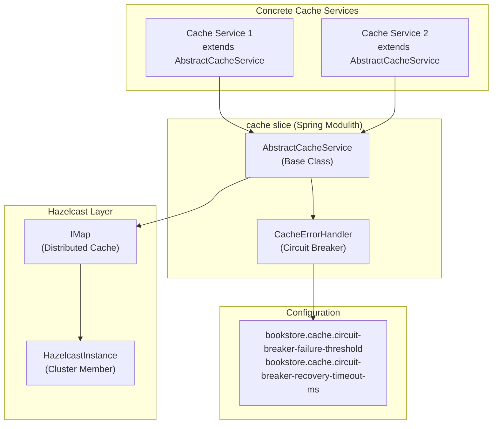
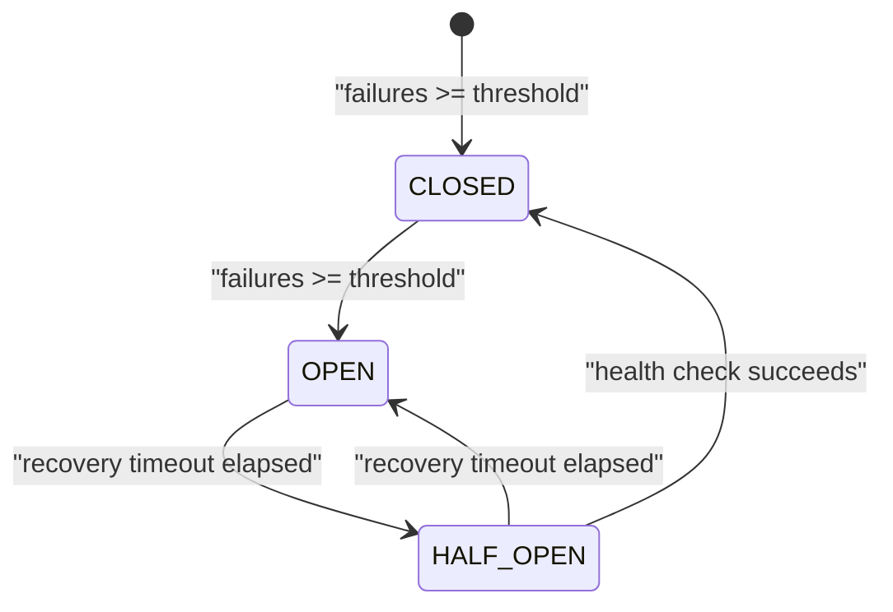
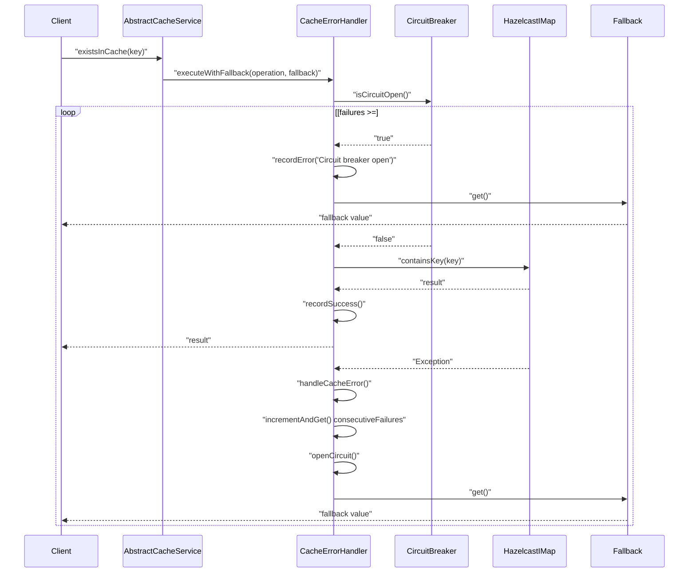
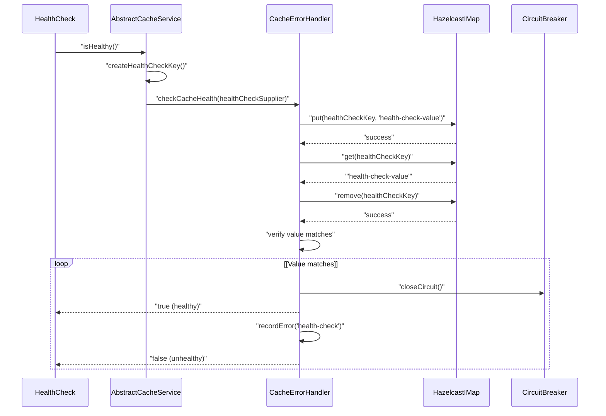
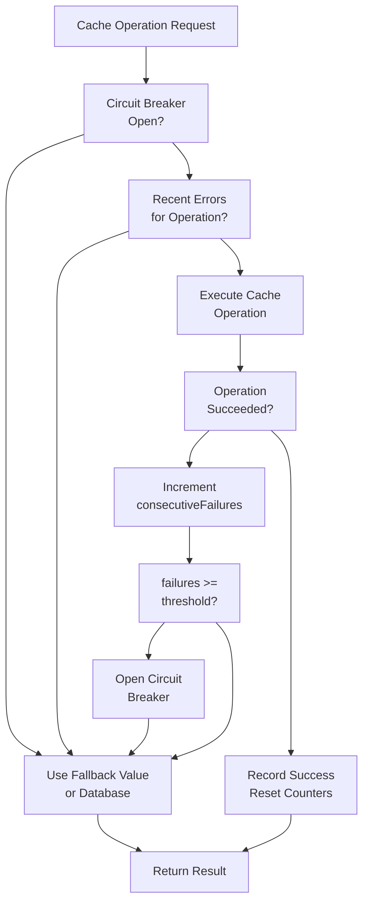

# Caching Layer

> **Relevant source files**
> * [pom.xml](https://github.com/philipz/spring-modulith-orders/blob/eb506991/pom.xml)
> * [src/main/java/com/sivalabs/bookstore/orders/cache/AbstractCacheService.java](https://github.com/philipz/spring-modulith-orders/blob/eb506991/src/main/java/com/sivalabs/bookstore/orders/cache/AbstractCacheService.java)
> * [src/main/java/com/sivalabs/bookstore/orders/cache/CacheErrorHandler.java](https://github.com/philipz/spring-modulith-orders/blob/eb506991/src/main/java/com/sivalabs/bookstore/orders/cache/CacheErrorHandler.java)

## Purpose and Scope

This document describes the distributed caching infrastructure in the orders-service, including the Hazelcast integration, circuit breaker pattern implementation, cache operation patterns, and fallback strategies. The caching layer provides fault-tolerant distributed caching with automatic failure detection and recovery mechanisms.

For information about the broader resilience architecture including Resilience4j patterns, see [Resilience and Fault Tolerance](/philipz/spring-modulith-orders/3.5-resilience-and-fault-tolerance). For configuration options related to caching, see [Application Configuration](/philipz/spring-modulith-orders/8.1-application-configuration).

---

## Architecture Overview

The caching layer is implemented in the `cache` slice of the Spring Modulith architecture. It provides a distributed caching infrastructure using Hazelcast IMap as the underlying storage mechanism, with a sophisticated circuit breaker pattern to handle cache failures gracefully.

**Core Components:**

| Component | Purpose | Location |
| --- | --- | --- |
| `AbstractCacheService<K, V>` | Base class for all cache services | [src/main/java/com/sivalabs/bookstore/orders/cache/AbstractCacheService.java L7-L193](https://github.com/philipz/spring-modulith-orders/blob/eb506991/src/main/java/com/sivalabs/bookstore/orders/cache/AbstractCacheService.java#L7-L193) |
| `CacheErrorHandler` | Circuit breaker implementation for cache operations | [src/main/java/com/sivalabs/bookstore/orders/cache/CacheErrorHandler.java L13-L208](https://github.com/philipz/spring-modulith-orders/blob/eb506991/src/main/java/com/sivalabs/bookstore/orders/cache/CacheErrorHandler.java#L13-L208) |
| Hazelcast IMap | Distributed cache storage backend | Maven dependency |



**Diagram: Caching Layer Architecture**

The design follows a template method pattern where `AbstractCacheService` provides common caching operations wrapped with circuit breaker protection, and concrete cache services extend it to implement domain-specific caching logic.

**Sources:** [src/main/java/com/sivalabs/bookstore/orders/cache/AbstractCacheService.java L7-L21](https://github.com/philipz/spring-modulith-orders/blob/eb506991/src/main/java/com/sivalabs/bookstore/orders/cache/AbstractCacheService.java#L7-L21)

 [src/main/java/com/sivalabs/bookstore/orders/cache/CacheErrorHandler.java L13-L40](https://github.com/philipz/spring-modulith-orders/blob/eb506991/src/main/java/com/sivalabs/bookstore/orders/cache/CacheErrorHandler.java#L13-L40)

 [pom.xml L158-L172](https://github.com/philipz/spring-modulith-orders/blob/eb506991/pom.xml#L158-L172)

---

## Hazelcast Integration

The service uses Hazelcast 5.5.6 as its distributed caching backend. Hazelcast is configured as a Spring bean and provides `IMap<K, Object>` instances for storing cached entities.

**Maven Dependencies:**

```
com.hazelcast:hazelcast-spring:5.5.6
com.hazelcast:hazelcast:5.5.6
org.springframework.session:spring-session-hazelcast
```

The cache uses Hazelcast's `IMap` interface, which provides distributed map operations with built-in replication, partitioning, and consistency guarantees. Each concrete cache service receives an `IMap` instance through dependency injection.

**IMap Operations Used:**

| Operation | Method | Purpose |
| --- | --- | --- |
| Store | `put(K, Object)` | Cache an entity |
| Retrieve | `get(K)` | Fetch cached entity |
| Check existence | `containsKey(K)` | Verify cache presence |
| Remove | `remove(K)` | Invalidate cached entity |
| Statistics | `getLocalMapStats()` | Retrieve performance metrics |

**Sources:** [pom.xml L158-L172](https://github.com/philipz/spring-modulith-orders/blob/eb506991/pom.xml#L158-L172)

 [src/main/java/com/sivalabs/bookstore/orders/cache/AbstractCacheService.java L11](https://github.com/philipz/spring-modulith-orders/blob/eb506991/src/main/java/com/sivalabs/bookstore/orders/cache/AbstractCacheService.java#L11-L11)

---

## AbstractCacheService Base Class

The `AbstractCacheService<K, V>` class provides a generic, reusable foundation for implementing cache services. It encapsulates common caching patterns and automatically handles error scenarios through the `CacheErrorHandler`.

**Type Parameters:**

* `K`: Key type for cache lookups
* `V`: Value type for cached entities

**Constructor Dependencies:**

```
protected AbstractCacheService(
    IMap<K, Object> cache,           // Hazelcast distributed map
    CacheErrorHandler errorHandler,  // Circuit breaker for fault tolerance
    Class<V> valueType               // Runtime type information for safe casting
)
```

**Core Methods:**

| Method | Return Type | Purpose |
| --- | --- | --- |
| `getCacheStats()` | `String` | Retrieve cache statistics including size, hits, operations |
| `isHealthy()` | `boolean` | Perform health check using test key-value pair |
| `getCircuitBreakerStatus()` | `String` | Get circuit breaker state and error statistics |
| `isCircuitBreakerOpen()` | `boolean` | Check if circuit breaker is currently open |
| `shouldFallbackToDatabase(String)` | `boolean` | Determine if operation should bypass cache |
| `resetCircuitBreaker()` | `boolean` | Manually reset circuit breaker state |
| `existsInCache(K)` | `boolean` | Check if key exists in cache |
| `removeFromCache(K)` | `boolean` | Remove entry from cache |
| `warmUpCache(Iterable<K>)` | `int` | Preload cache entries |

**Protected Template Methods:**

Subclasses must implement:

* `getCacheDisplayName()`: Returns human-readable cache name for logging
* `createHealthCheckKey()`: Creates a key for health check operations

**Sources:** [src/main/java/com/sivalabs/bookstore/orders/cache/AbstractCacheService.java L7-L193](https://github.com/philipz/spring-modulith-orders/blob/eb506991/src/main/java/com/sivalabs/bookstore/orders/cache/AbstractCacheService.java#L7-L193)

---

## Circuit Breaker Pattern

The `CacheErrorHandler` implements a custom circuit breaker specifically designed for cache operations. Unlike general-purpose circuit breakers (like Resilience4j used elsewhere in the application), this implementation is optimized for cache failure scenarios.

### Circuit Breaker States



**Diagram: Cache Circuit Breaker State Machine**

**State Tracking Fields:**

| Field | Type | Purpose |
| --- | --- | --- |
| `consecutiveFailures` | `AtomicInteger` | Count of sequential cache operation failures |
| `circuitOpen` | `volatile boolean` | Current circuit state |
| `circuitOpenedAt` | `volatile LocalDateTime` | Timestamp when circuit opened |
| `totalCircuitOpenings` | `AtomicInteger` | Lifetime count of circuit openings |
| `fallbackRecommendations` | `AtomicInteger` | Count of fallback operations triggered |
| `errorCounts` | `ConcurrentHashMap<String, AtomicInteger>` | Error counts per operation type |
| `lastErrorTimes` | `ConcurrentHashMap<String, LocalDateTime>` | Last error timestamp per operation |

**Configuration:**

| Property | Default | Purpose |
| --- | --- | --- |
| `bookstore.cache.circuit-breaker-failure-threshold` | `5` | Consecutive failures before opening circuit |
| `bookstore.cache.circuit-breaker-recovery-timeout-ms` | `30000` | Milliseconds before attempting recovery |

**Sources:** [src/main/java/com/sivalabs/bookstore/orders/cache/CacheErrorHandler.java L13-L40](https://github.com/philipz/spring-modulith-orders/blob/eb506991/src/main/java/com/sivalabs/bookstore/orders/cache/CacheErrorHandler.java#L13-L40)

 [src/main/java/com/sivalabs/bookstore/orders/cache/CacheErrorHandler.java L99-L111](https://github.com/philipz/spring-modulith-orders/blob/eb506991/src/main/java/com/sivalabs/bookstore/orders/cache/CacheErrorHandler.java#L99-L111)

---

## Cache Operation Flow

All cache operations flow through the `CacheErrorHandler`, which provides three primary execution patterns:

### Execution Patterns

**1. Read Operations with Fallback:**



**Diagram: Cache Operation Flow with Circuit Breaker**

**2. Write Operations (Void):**

Used for operations like `cacheEntity()`, `updateCachedEntity()`, and `removeFromCache()`. Returns `boolean` indicating success/failure but does not return cached values.

**3. Health Check Operations:**

Special execution path for health checks that can close an open circuit breaker if the cache recovers.

**Sources:** [src/main/java/com/sivalabs/bookstore/orders/cache/CacheErrorHandler.java L42-L82](https://github.com/philipz/spring-modulith-orders/blob/eb506991/src/main/java/com/sivalabs/bookstore/orders/cache/CacheErrorHandler.java#L42-L82)

 [src/main/java/com/sivalabs/bookstore/orders/cache/AbstractCacheService.java L97-L125](https://github.com/philipz/spring-modulith-orders/blob/eb506991/src/main/java/com/sivalabs/bookstore/orders/cache/AbstractCacheService.java#L97-L125)

---

## Cache Operations Reference

### Read Operations

**`existsInCache(K key)`**

Checks if a key exists in the cache without retrieving the value. Returns `false` if circuit breaker is open or operation fails.

```yaml
Location: AbstractCacheService.java:97-110
Circuit breaker: Yes
Fallback: Returns false
```

**`getCacheStats()`**

Retrieves comprehensive cache statistics including size, hit count, and operation counts. Returns error message if unavailable.

```yaml
Location: AbstractCacheService.java:23-46
Metrics available:
  - Cache Name
  - Cache Size
  - Owned Entry Count
  - Backup Entry Count
  - Hits
  - Get/Put Operation Counts
```

### Write Operations

**`cacheEntity(K key, V entity)`**

Stores an entity in the cache. Validates entity is non-null before caching.

```yaml
Location: AbstractCacheService.java:147-154
Circuit breaker: Yes
Returns: boolean (success/failure)
```

**`updateCachedEntity(K key, V entity)`**

Updates an existing cached entity. Only updates if key already exists in cache.

```yaml
Location: AbstractCacheService.java:156-173
Circuit breaker: Yes
Returns: boolean (success/failure)
```

**`removeFromCache(K key)`**

Removes an entry from the cache.

```yaml
Location: AbstractCacheService.java:112-125
Circuit breaker: Yes
Returns: boolean (success/failure)
```

### Maintenance Operations

**`warmUpCache(Iterable<K> keys)`**

Pre-loads cache entries by fetching values for a list of keys. Returns count of successfully warmed entries.

```yaml
Location: AbstractCacheService.java:127-145
Use case: Startup optimization
Circuit breaker: Yes (per-key basis)
```

**`resetCircuitBreaker()`**

Manually resets the circuit breaker state, clearing error counts and reopening the circuit. Used for recovery or testing.

```yaml
Location: AbstractCacheService.java:86-95
Warning: Manual operation - use with caution
```

**Sources:** [src/main/java/com/sivalabs/bookstore/orders/cache/AbstractCacheService.java L23-L173](https://github.com/philipz/spring-modulith-orders/blob/eb506991/src/main/java/com/sivalabs/bookstore/orders/cache/AbstractCacheService.java#L23-L173)

---

## Health Monitoring

### Cache Health Check

The `isHealthy()` method performs an active health check by writing, reading, and removing a test value:



**Diagram: Cache Health Check Sequence**

**Health Check Implementation:**

The health check creates a temporary key-value pair, verifies the round-trip operation succeeds, and cleans up the test data. A successful health check will close an open circuit breaker.

**Circuit Breaker Status API:**

```
String status = cacheService.getCircuitBreakerStatus();
// Returns:
// Cache Circuit Breaker Status:
//   Circuit State: OPEN (Bypassing Cache) | CLOSED (Cache Active)
//   Error Statistics:
//   Error Counts by Operation:
//     - getFromCache: 5
//     - putToCache: 3
//   Last Error Times:
//     - getFromCache: 2024-01-15T10:30:45
```

**Sources:** [src/main/java/com/sivalabs/bookstore/orders/cache/AbstractCacheService.java L48-L72](https://github.com/philipz/spring-modulith-orders/blob/eb506991/src/main/java/com/sivalabs/bookstore/orders/cache/AbstractCacheService.java#L48-L72)

 [src/main/java/com/sivalabs/bookstore/orders/cache/CacheErrorHandler.java L113-L128](https://github.com/philipz/spring-modulith-orders/blob/eb506991/src/main/java/com/sivalabs/bookstore/orders/cache/CacheErrorHandler.java#L113-L128)

---

## Fallback Strategies

The caching layer implements multiple fallback strategies to maintain service availability during cache failures:

### Strategy Decision Tree



**Diagram: Fallback Strategy Decision Flow**

### Fallback Patterns

**1. Null Fallback:**

Used when cached value is optional or can be computed later.

```python
// Example from existsInCache()
() -> {
    logger.debug("Cache existence check failed for {}, assuming false", key);
    return false;
}
```

**2. Database Fallback:**

The `shouldFallbackToDatabase(String operationName)` method determines if an operation should bypass the cache and query the database directly:

```
public boolean shouldFallbackToDatabase(String operationName) {
    if (errorHandler.isCircuitOpen()) {
        return true;  // Circuit open - use database
    }
    return errorHandler.shouldFallbackToDatabase(operationName);
    // Returns true if operation has frequent errors (> threshold/2)
}
```

**3. Default Value Fallback:**

Custom fallback logic provided by the caller:

```
errorHandler.executeWithFallback(
    () -> cache.get(key),
    "getFromCache",
    String.valueOf(key),
    () -> defaultValue  // Custom fallback
)
```

**Fallback Metrics:**

| Metric | Location | Purpose |
| --- | --- | --- |
| `fallbackRecommendations` | CacheErrorHandler | Total count of fallback operations |
| `errorCounts per operation` | CacheErrorHandler | Error frequency per operation type |
| Circuit state | CacheErrorHandler | Current OPEN/CLOSED state |

**Sources:** [src/main/java/com/sivalabs/bookstore/orders/cache/AbstractCacheService.java L78-L84](https://github.com/philipz/spring-modulith-orders/blob/eb506991/src/main/java/com/sivalabs/bookstore/orders/cache/AbstractCacheService.java#L78-L84)

 [src/main/java/com/sivalabs/bookstore/orders/cache/CacheErrorHandler.java L130-L138](https://github.com/philipz/spring-modulith-orders/blob/eb506991/src/main/java/com/sivalabs/bookstore/orders/cache/CacheErrorHandler.java#L130-L138)

 [src/main/java/com/sivalabs/bookstore/orders/cache/CacheErrorHandler.java L42-L63](https://github.com/philipz/spring-modulith-orders/blob/eb506991/src/main/java/com/sivalabs/bookstore/orders/cache/CacheErrorHandler.java#L42-L63)

---

## Type Safety and Casting

The `AbstractCacheService` stores values as `Object` in Hazelcast IMap but provides type-safe retrieval through the `safeCast()` method:

```
protected V safeCast(Object cachedValue, K key) {
    if (cachedValue == null) {
        return null;
    }
    if (!valueType.isInstance(cachedValue)) {
        logger.warn(
            "Cached value type mismatch for key {}. Expected: {}, Actual: {}",
            key, valueType.getName(), cachedValue.getClass().getName()
        );
        return null;
    }
    return valueType.cast(cachedValue);
}
```

This approach:

* Prevents `ClassCastException` at runtime
* Logs type mismatches for debugging
* Returns `null` for invalid cached values, triggering fallback logic
* Uses the `valueType` parameter passed during construction for runtime type checking

**Sources:** [src/main/java/com/sivalabs/bookstore/orders/cache/AbstractCacheService.java L175-L188](https://github.com/philipz/spring-modulith-orders/blob/eb506991/src/main/java/com/sivalabs/bookstore/orders/cache/AbstractCacheService.java#L175-L188)

---

## Configuration Reference

### Circuit Breaker Configuration

| Property | Default | Description |
| --- | --- | --- |
| `bookstore.cache.circuit-breaker-failure-threshold` | `5` | Number of consecutive failures before opening circuit |
| `bookstore.cache.circuit-breaker-recovery-timeout-ms` | `30000` | Milliseconds before attempting cache recovery (half-open state) |

### Environment Variables

Set via Spring Boot's property binding:

```markdown
# Increase failure tolerance
BOOKSTORE_CACHE_CIRCUIT_BREAKER_FAILURE_THRESHOLD=10

# Faster recovery attempts
BOOKSTORE_CACHE_CIRCUIT_BREAKER_RECOVERY_TIMEOUT_MS=15000
```

### Hazelcast Configuration

Hazelcast is configured through standard Spring Boot autoconfiguration. Additional customization can be provided via `HazelcastConfig` beans or `hazelcast.xml` configuration files.

**Sources:** [src/main/java/com/sivalabs/bookstore/orders/cache/CacheErrorHandler.java L30-L35](https://github.com/philipz/spring-modulith-orders/blob/eb506991/src/main/java/com/sivalabs/bookstore/orders/cache/CacheErrorHandler.java#L30-L35)

---

## Error Handling and Logging

### Log Levels

| Level | Usage | Example Operations |
| --- | --- | --- |
| `INFO` | Circuit state changes, initialization | Circuit opened, circuit closed, cache initialized |
| `WARN` | Cache operation failures, null entity caching | "Cache operation failed", "Circuit breaker OPENED" |
| `DEBUG` | Normal operation details, circuit breaker checks | "Cache hit for key X", "Circuit breaker is open" |

### Error Recording

Each cache operation failure is tracked in multiple dimensions:

```
// Per-operation error counting
errorCounts.computeIfAbsent(operationName, key -> new AtomicInteger(0))
    .incrementAndGet();

// Last error timestamp
lastErrorTimes.put(operationName, LocalDateTime.now());

// Consecutive failure tracking
consecutiveFailures.incrementAndGet();
```

This multi-dimensional tracking enables:

* Per-operation failure rate analysis
* Temporal pattern detection
* Circuit breaker decision making
* Debugging and troubleshooting

**Sources:** [src/main/java/com/sivalabs/bookstore/orders/cache/CacheErrorHandler.java L84-L97](https://github.com/philipz/spring-modulith-orders/blob/eb506991/src/main/java/com/sivalabs/bookstore/orders/cache/CacheErrorHandler.java#L84-L97)

 [src/main/java/com/sivalabs/bookstore/orders/cache/CacheErrorHandler.java L203-L207](https://github.com/philipz/spring-modulith-orders/blob/eb506991/src/main/java/com/sivalabs/bookstore/orders/cache/CacheErrorHandler.java#L203-L207)

---

## Extending AbstractCacheService

To implement a domain-specific cache service:

**Step 1: Extend AbstractCacheService**

```python
public class OrderCacheService extends AbstractCacheService<String, Order> {
    
    public OrderCacheService(
        @Qualifier("orderCache") IMap<String, Object> cache,
        CacheErrorHandler errorHandler
    ) {
        super(cache, errorHandler, Order.class);
    }
    
    @Override
    protected String getCacheDisplayName() {
        return "Order";
    }
    
    @Override
    protected String createHealthCheckKey() {
        return "health-check-order-" + UUID.randomUUID();
    }
}
```

**Step 2: Implement Domain Operations**

```yaml
public Optional<Order> getOrder(String orderNumber) {
    return errorHandler.executeWithFallback(
        () -> {
            Object cached = cache.get(orderNumber);
            return Optional.ofNullable(safeCast(cached, orderNumber));
        },
        "getOrder",
        orderNumber,
        Optional::empty
    );
}

public void cacheOrder(Order order) {
    cacheEntity(order.getOrderNumber(), order);
}
```

**Step 3: Configure Hazelcast IMap Bean**

```python
@Configuration
public class CacheConfig {
    
    @Bean
    public IMap<String, Object> orderCache(HazelcastInstance hazelcastInstance) {
        return hazelcastInstance.getMap("orders");
    }
}
```

**Sources:** [src/main/java/com/sivalabs/bookstore/orders/cache/AbstractCacheService.java L7-L193](https://github.com/philipz/spring-modulith-orders/blob/eb506991/src/main/java/com/sivalabs/bookstore/orders/cache/AbstractCacheService.java#L7-L193)