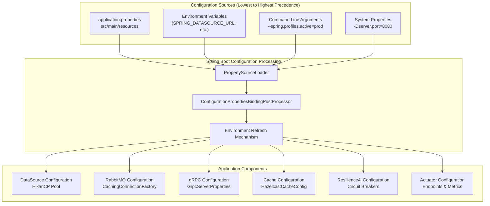
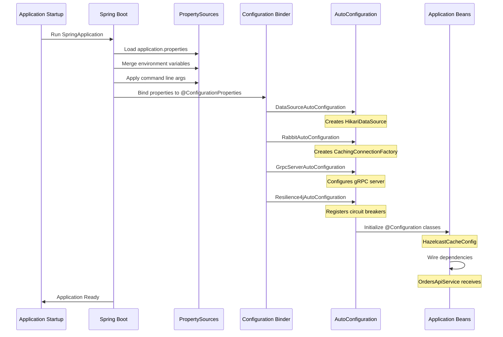

# Configuration

> **Relevant source files**
> * [AGENTS.md](https://github.com/philipz/spring-modulith-orders/blob/eb506991/AGENTS.md)
> * [README.md](https://github.com/philipz/spring-modulith-orders/blob/eb506991/README.md)

## Purpose and Scope

This page provides an overview of the configuration system for the orders-service, including how application settings are organized, loaded, and can be customized for different environments. It covers both runtime application configuration and build-time Maven configuration.

For detailed configuration settings, see:

* Application runtime configuration: [Application Configuration](/philipz/spring-modulith-orders/8.1-application-configuration)
* Maven build setup: [Build Configuration](/philipz/spring-modulith-orders/8.2-build-configuration)
* Complete environment variable reference: [Environment Variables Reference](/philipz/spring-modulith-orders/8.3-environment-variables-reference)

For deployment-specific configuration, see [Deployment](/philipz/spring-modulith-orders/6-deployment).

---

## Configuration Overview

The orders-service uses Spring Boot's externalized configuration system, allowing settings to be defined in multiple sources with a clear precedence order. Configuration is separated into two main categories:

**Runtime Configuration**: Application behavior settings loaded when the service starts, including database connections, message broker configuration, feature flags, caching parameters, and observability settings.

**Build Configuration**: Maven POM settings that control dependency management, code generation from Protocol Buffers, code formatting rules, and packaging options.

Sources: [AGENTS.md L34-L37](https://github.com/philipz/spring-modulith-orders/blob/eb506991/AGENTS.md#L34-L37)

 [README.md L24-L27](https://github.com/philipz/spring-modulith-orders/blob/eb506991/README.md#L24-L27)

---

## Configuration Layers

The following diagram illustrates the configuration hierarchy used by the orders-service, showing how settings are loaded and merged:

Sources: [AGENTS.md L34-L37](https://github.com/philipz/spring-modulith-orders/blob/eb506991/AGENTS.md#L34-L37)

 [README.md L24-L27](https://github.com/philipz/spring-modulith-orders/blob/eb506991/README.md#L24-L27)

---

## Configuration Categories

The orders-service configuration is organized into the following functional areas:

| Category | Key Prefixes | Purpose | Details |
| --- | --- | --- | --- |
| **Data Source** | `spring.datasource.*` | PostgreSQL connection settings, HikariCP pool sizing | [Application Configuration](/philipz/spring-modulith-orders/8.1-application-configuration) |
| **Message Broker** | `spring.rabbitmq.*` | RabbitMQ connection, exchange bindings, queue configuration | [Application Configuration](/philipz/spring-modulith-orders/8.1-application-configuration) |
| **gRPC Server** | `grpc.server.*` | gRPC port (9090), TLS settings, interceptor configuration | [Application Configuration](/philipz/spring-modulith-orders/8.1-application-configuration) |
| **gRPC Clients** | `grpc.client.*` | Outbound gRPC channel configuration for ProductCatalogPort | [Application Configuration](/philipz/spring-modulith-orders/8.1-application-configuration) |
| **REST API** | `server.*`, `spring.mvc.*` | HTTP port (8091), servlet context, OpenAPI documentation | [Application Configuration](/philipz/spring-modulith-orders/8.1-application-configuration) |
| **Feature Flags** | `orders.*` | Toggle REST API (`orders.rest.enabled`), backfill behavior | [Environment Variables Reference](/philipz/spring-modulith-orders/8.3-environment-variables-reference) |
| **Caching** | `bookstore.cache.*` | Hazelcast configuration, circuit breaker thresholds, TTL settings | [Application Configuration](/philipz/spring-modulith-orders/8.1-application-configuration) |
| **Resilience** | `resilience4j.*` | Circuit breaker, retry, rate limiter, bulkhead configuration | [Application Configuration](/philipz/spring-modulith-orders/8.1-application-configuration) |
| **Database Migration** | `spring.liquibase.*` | Liquibase changelog location, schema management | [Application Configuration](/philipz/spring-modulith-orders/8.1-application-configuration) |
| **Observability** | `management.*`, `otlp.*` | Actuator endpoints, Prometheus metrics, OpenTelemetry tracing | [Application Configuration](/philipz/spring-modulith-orders/8.1-application-configuration) |
| **Spring Modulith** | `spring.modulith.*` | Event store configuration, AMQP externalization | [Application Configuration](/philipz/spring-modulith-orders/8.1-application-configuration) |

Sources: [AGENTS.md L34-L37](https://github.com/philipz/spring-modulith-orders/blob/eb506991/AGENTS.md#L34-L37)

 [README.md L24-L27](https://github.com/philipz/spring-modulith-orders/blob/eb506991/README.md#L24-L27)

---

## Configuration to Code Entity Mapping

This diagram shows how configuration properties map to specific code components and Spring beans:

```mermaid
flowchart TD

DATASOURCE_PROPS["spring.datasource.url<br>spring.datasource.username<br>spring.datasource.password"]
RABBITMQ_PROPS["spring.rabbitmq.host<br>spring.rabbitmq.port<br>spring.rabbitmq.username"]
GRPC_SERVER_PROPS["grpc.server.port<br>grpc.server.address"]
GRPC_CLIENT_PROPS["grpc.client.product-catalog.address<br>grpc.client.product-catalog.negotiationType"]
CACHE_PROPS["bookstore.cache.enabled<br>bookstore.cache.circuit-breaker.failure-threshold<br>bookstore.cache.circuit-breaker.open-duration"]
RESILIENCE_PROPS["resilience4j.circuitbreaker.instances.resilience4j.retry.instances."]
MODULITH_PROPS["spring.modulith.events.jdbc.schema-initialization.enabled<br>spring.modulith.republish-outstanding-events-on-restart"]
LIQUIBASE_PROPS["spring.liquibase.change-log<br>spring.liquibase.enabled"]
FEATURE_PROPS["orders.rest.enabled<br>orders.backfill.enabled"]
HIKARI["HikariDataSource<br>@Bean in DataSourceAutoConfiguration"]
RABBIT_FACTORY["CachingConnectionFactory<br>@Bean in RabbitAutoConfiguration"]
GRPC_SERVER["GrpcServerLifecycle<br>net.devh.boot.grpc.server"]
PRODUCT_CLIENT["ProductCatalogGrpcClient<br>@GrpcClient annotation"]
HAZELCAST_CONFIG["HazelcastCacheConfig<br>orders/cache/config"]
CACHE_HANDLER["CacheErrorHandler<br>orders/cache"]
R4J_CONFIG["Resilience4jAutoConfiguration<br>circuit breaker registry"]
MODULITH_CONFIG["EventPublicationAutoConfiguration<br>JDBC event store"]
LIQUIBASE_RUNNER["SpringLiquibase<br>LiquibaseAutoConfiguration"]
REST_CONTROLLER["OrdersRestController<br>@ConditionalOnProperty(orders.rest.enabled)"]
BACKFILL_RUNNER["BackfillRunner<br>@Component"]

DATASOURCE_PROPS --> HIKARI
RABBITMQ_PROPS --> RABBIT_FACTORY
GRPC_SERVER_PROPS --> GRPC_SERVER
GRPC_CLIENT_PROPS --> PRODUCT_CLIENT
CACHE_PROPS --> HAZELCAST_CONFIG
CACHE_PROPS --> CACHE_HANDLER
RESILIENCE_PROPS --> R4J_CONFIG
MODULITH_PROPS --> MODULITH_CONFIG
LIQUIBASE_PROPS --> LIQUIBASE_RUNNER
FEATURE_PROPS --> REST_CONTROLLER
FEATURE_PROPS --> BACKFILL_RUNNER

subgraph CodeEntities ["Code Entities"]
    HIKARI
    RABBIT_FACTORY
    GRPC_SERVER
    PRODUCT_CLIENT
    HAZELCAST_CONFIG
    CACHE_HANDLER
    R4J_CONFIG
    MODULITH_CONFIG
    LIQUIBASE_RUNNER
    REST_CONTROLLER
    BACKFILL_RUNNER
end

subgraph ConfigProperties ["Configuration Properties"]
    DATASOURCE_PROPS
    RABBITMQ_PROPS
    GRPC_SERVER_PROPS
    GRPC_CLIENT_PROPS
    CACHE_PROPS
    RESILIENCE_PROPS
    MODULITH_PROPS
    LIQUIBASE_PROPS
    FEATURE_PROPS
end
```

Sources: [AGENTS.md L34-L37](https://github.com/philipz/spring-modulith-orders/blob/eb506991/AGENTS.md#L34-L37)

 [README.md L8](https://github.com/philipz/spring-modulith-orders/blob/eb506991/README.md#L8-L8)

---

## Configuration Workflow

The following diagram illustrates how configuration flows through the system during application startup and runtime:

Sources: [AGENTS.md L34-L37](https://github.com/philipz/spring-modulith-orders/blob/eb506991/AGENTS.md#L34-L37)

 [README.md L24-L27](https://github.com/philipz/spring-modulith-orders/blob/eb506991/README.md#L24-L27)

---

## Configuration Sources and Precedence

Spring Boot loads configuration from multiple sources in the following order (later sources override earlier ones):

1. **Default properties**: Hardcoded in [src/main/resources/application.properties 1](https://github.com/philipz/spring-modulith-orders/blob/eb506991/src/main/resources/application.properties#L1-LNaN)
2. **Environment variables**: System environment variables (uppercase with underscores, e.g., `SPRING_DATASOURCE_URL`)
3. **Java system properties**: Properties set via `-D` flags (e.g., `-Dserver.port=8080`)
4. **Command line arguments**: Arguments passed to `java -jar` (e.g., `--spring.profiles.active=prod`)

For local development, the service reads from `application.properties` without modification. For containerized deployments (Docker Compose, Kubernetes), environment variables provide the primary customization mechanism.

Sources: [README.md L24-L27](https://github.com/philipz/spring-modulith-orders/blob/eb506991/README.md#L24-L27)

---

## Build-Time Configuration

Maven manages build-time configuration through the POM file [pom.xml

1](https://github.com/philipz/spring-modulith-orders/blob/eb506991/pom.xml#L1-LNaN)

 Key aspects include:

**Dependency Management**: Spring Boot BOM, Spring Cloud, gRPC, Hazelcast, Resilience4j versions are declared in `<dependencyManagement>`.

**Code Generation**: The `protobuf-maven-plugin` generates Java classes from `.proto` files located in [src/main/proto

1](https://github.com/philipz/spring-modulith-orders/blob/eb506991/src/main/proto#L1-LNaN)

 during the `generate-sources` phase.

**Code Formatting**: The `spotless-maven-plugin` enforces Palantir Java Format style with 4-space indentation.

**Packaging**: The `spring-boot-maven-plugin` creates an executable JAR with all dependencies embedded, supporting both traditional JAR deployment and Cloud Native Buildpacks for container images.

For complete Maven configuration details, see [Build Configuration](/philipz/spring-modulith-orders/8.2-build-configuration).

Sources: [AGENTS.md L11-L14](https://github.com/philipz/spring-modulith-orders/blob/eb506991/AGENTS.md#L11-L14)

 [README.md L17-L22](https://github.com/philipz/spring-modulith-orders/blob/eb506991/README.md#L17-L22)

---

## Environment-Specific Configuration

The orders-service supports environment-specific configuration through several mechanisms:

**Spring Profiles**: Activate profiles using `spring.profiles.active` to load profile-specific property files (e.g., `application-prod.properties`).

**Feature Flags**: Toggle functionality using boolean properties:

* `orders.rest.enabled`: Enable/disable REST API endpoints (default: false)
* `orders.backfill.enabled`: Enable/disable historical data backfill on startup

**External Configuration**: For Kubernetes deployments, ConfigMaps and Secrets provide environment-specific settings without rebuilding the application image.

For deployment-specific configuration examples, see [Local Development with Docker Compose](/philipz/spring-modulith-orders/6.1-local-development-with-docker-compose) and [Kubernetes Deployment](/philipz/spring-modulith-orders/6.2-kubernetes-deployment).

Sources: [AGENTS.md L34-L37](https://github.com/philipz/spring-modulith-orders/blob/eb506991/AGENTS.md#L34-L37)

 [README.md L24-L27](https://github.com/philipz/spring-modulith-orders/blob/eb506991/README.md#L24-L27)

---

## Configuration Validation

The service performs configuration validation at startup:

**Required Properties**: Spring Boot fails fast if required properties (e.g., `spring.datasource.url`) are missing or invalid.

**Bean Validation**: `@ConfigurationProperties` classes use JSR-303 annotations (`@NotNull`, `@Positive`, etc.) to validate bound values.

**Custom Validation**: Components like `CacheErrorHandler` validate cache-specific settings (threshold values, durations) and log warnings for misconfiguration.

**Health Checks**: The Actuator `/actuator/health` endpoint reports configuration-related health indicators (database connectivity, RabbitMQ connection, Hazelcast cluster status).

Sources: [AGENTS.md L36-L37](https://github.com/philipz/spring-modulith-orders/blob/eb506991/AGENTS.md#L36-L37)

---

## Next Steps

* Review default settings in [Application Configuration](/philipz/spring-modulith-orders/8.1-application-configuration)
* Understand Maven build options in [Build Configuration](/philipz/spring-modulith-orders/8.2-build-configuration)
* Reference complete environment variable list in [Environment Variables Reference](/philipz/spring-modulith-orders/8.3-environment-variables-reference)
* Learn about deployment configuration in [Deployment](/philipz/spring-modulith-orders/6-deployment)