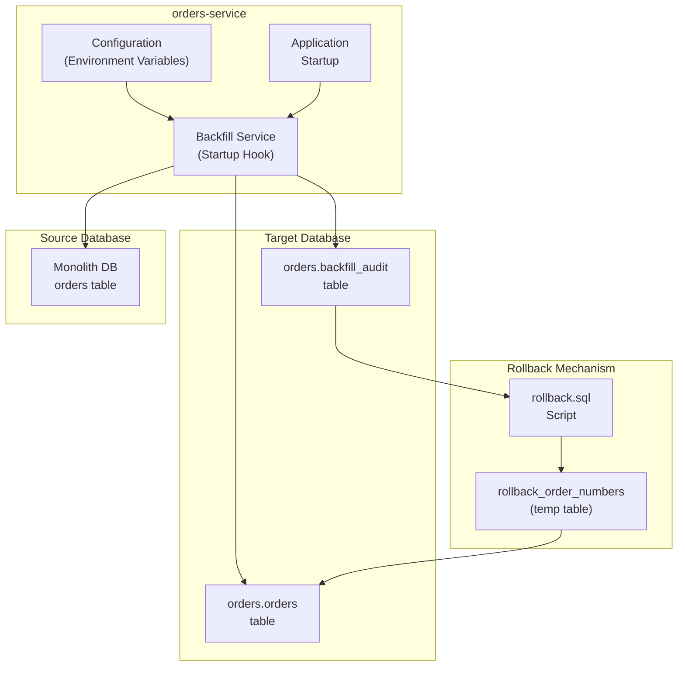
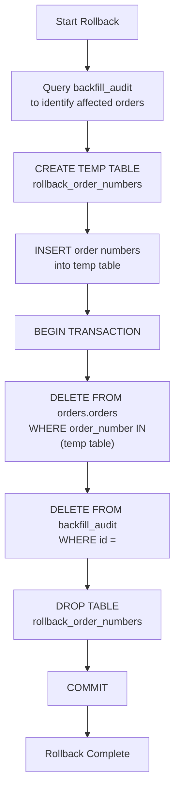

# Data Migration and Backfill

> **Relevant source files**
> * [README-deployment.md](https://github.com/philipz/spring-modulith-orders/blob/eb506991/README-deployment.md)
> * [pom.xml](https://github.com/philipz/spring-modulith-orders/blob/eb506991/pom.xml)
> * [scripts/rollback.sql](https://github.com/philipz/spring-modulith-orders/blob/eb506991/scripts/rollback.sql)

## Purpose and Scope

This document describes the historical order data migration mechanism that enables the orders-service to import legacy orders from a monolith database during initial deployment. The backfill process executes once at application startup, provides full audit traceability, and includes rollback capabilities for safe data migration.

For information about general deployment configuration, see [Deployment](/philipz/spring-modulith-orders/6-deployment). For Kubernetes-specific deployment steps, see [Kubernetes Deployment](/philipz/spring-modulith-orders/6.2-kubernetes-deployment).

---

## Overview

The orders-service includes a built-in data migration mechanism designed to populate the new microservice database with historical order records from the legacy monolith system. This one-time backfill operation:

* Executes automatically at application startup when enabled
* Connects to a separate source database (the monolith database)
* Imports orders within a configurable time window
* Records detailed audit information for compliance and rollback purposes
* Respects configurable limits to prevent overwhelming the system
* Can be safely disabled after successful migration

The backfill mechanism is optional and controlled entirely through environment variables, allowing operators to enable it only during initial deployment and disable it for normal operations.

**Sources:** [README-deployment.md L63-L82](https://github.com/philipz/spring-modulith-orders/blob/eb506991/README-deployment.md#L63-L82)

---

## Backfill Architecture

The following diagram illustrates the components and data flow involved in the backfill process:



**Key Components:**

| Component | Location | Purpose |
| --- | --- | --- |
| Backfill Service | Startup hook in infrastructure slice | Orchestrates migration logic |
| `orders.backfill_audit` | PostgreSQL schema | Persists audit trail of each backfill run |
| `rollback.sql` | [scripts/rollback.sql L1-L28](https://github.com/philipz/spring-modulith-orders/blob/eb506991/scripts/rollback.sql#L1-L28) | Transaction-safe rollback script |
| Source Connection | Configured via environment | JDBC connection to monolith database |
| Target Connection | Spring DataSource | Primary application database |

**Sources:** [README-deployment.md L65-L82](https://github.com/philipz/spring-modulith-orders/blob/eb506991/README-deployment.md#L65-L82)

 [scripts/rollback.sql L1-L28](https://github.com/philipz/spring-modulith-orders/blob/eb506991/scripts/rollback.sql#L1-L28)

---

## Configuration

The backfill process is controlled entirely through environment variables. All configuration is optional with sensible defaults.

### Environment Variables

| Variable | Required | Default | Description |
| --- | --- | --- | --- |
| `ORDERS_BACKFILL_ENABLED` | Yes | `false` | Master switch to enable/disable backfill |
| `ORDERS_BACKFILL_SOURCE_URL` | No | Service DB URL | JDBC URL for the source (monolith) database |
| `ORDERS_BACKFILL_SOURCE_USERNAME` | No | Service DB user | Username for source database connection |
| `ORDERS_BACKFILL_SOURCE_PASSWORD` | No | Service DB password | Password for source database connection |
| `ORDERS_BACKFILL_LOOKBACK_DAYS` | No | Unlimited | Maximum age of orders to migrate (e.g., `90` for last 90 days) |
| `ORDERS_BACKFILL_RECORD_LIMIT` | No | `500` | Maximum number of orders to import in a single run |

### Configuration Example

For Docker Compose deployment in [docker-compose.yml](https://github.com/philipz/spring-modulith-orders/blob/eb506991/docker-compose.yml)

:

```yaml
environment:
  ORDERS_BACKFILL_ENABLED: "true"
  ORDERS_BACKFILL_LOOKBACK_DAYS: "90"
  ORDERS_BACKFILL_RECORD_LIMIT: "500"
  ORDERS_BACKFILL_SOURCE_URL: "jdbc:postgresql://monolith-db:5432/postgres"
  ORDERS_BACKFILL_SOURCE_USERNAME: "postgres"
  ORDERS_BACKFILL_SOURCE_PASSWORD: "postgres"
```

For Kubernetes deployment, add to ConfigMap and Secret:

```yaml
# In configmap.yaml
data:
  ORDERS_BACKFILL_ENABLED: "true"
  ORDERS_BACKFILL_LOOKBACK_DAYS: "90"
  ORDERS_BACKFILL_RECORD_LIMIT: "500"
  ORDERS_BACKFILL_SOURCE_URL: "jdbc:postgresql://monolith-db:5432/postgres"

# In secret.yaml
stringData:
  ORDERS_BACKFILL_SOURCE_USERNAME: "postgres"
  ORDERS_BACKFILL_SOURCE_PASSWORD: "postgres"
```

**Sources:** [README-deployment.md L69-L76](https://github.com/philipz/spring-modulith-orders/blob/eb506991/README-deployment.md#L69-L76)

---

## Backfill Process Flow

The following sequence diagram shows the detailed execution flow during application startup:

```mermaid
sequenceDiagram
  participant Spring Boot
  participant Application
  participant Backfill Startup
  participant Listener
  participant Configuration
  participant Properties
  participant Monolith DB
  participant (Source)
  participant orders.orders
  participant (Target)
  participant orders.backfill_audit

  Spring Boot->>Spring Boot: "Start application"
  Spring Boot->>Spring Boot: "Initialize Liquibase
  Spring Boot->>Spring Boot: (create schemas)"
  Spring Boot->>Backfill Startup: "Create backfill_audit table"
  Backfill Startup->>Configuration: "@EventListener
  Configuration-->>Backfill Startup: (ApplicationReadyEvent)"
  Backfill Startup->>Configuration: "Check ORDERS_BACKFILL_ENABLED"
  Configuration-->>Backfill Startup: "true"
  Backfill Startup->>Monolith DB: "Read ORDERS_BACKFILL_SOURCE_URL,
  Monolith DB-->>Backfill Startup: LOOKBACK_DAYS, RECORD_LIMIT"
  note over Backfill Startup,(Source): "Query orders within lookback window"
  Backfill Startup->>Monolith DB: "Configuration values"
  Monolith DB-->>Backfill Startup: "Connect to source database"
  note over Backfill Startup,(Target): "Begin transaction"
  Backfill Startup->>orders.orders: "Connection established"
  loop ["For each order record"]
    Backfill Startup->>orders.orders: "SELECT * FROM orders
    orders.orders-->>Backfill Startup: WHERE created_at >= NOW() - lookback
  end
  Backfill Startup->>orders.backfill_audit: LIMIT record_limit"
  orders.backfill_audit-->>Backfill Startup: "Order records (max 500)"
  Backfill Startup->>orders.orders: "BEGIN TRANSACTION"
  orders.orders-->>Backfill Startup: "INSERT INTO orders.orders
  Backfill Startup->>Spring Boot: (order_number, customer, items, ...)"
  Spring Boot->>Spring Boot: "Row inserted"
```

### Execution Details

1. **Trigger**: The backfill executes via a Spring `@EventListener` listening for `ApplicationReadyEvent`, ensuring all infrastructure (Liquibase migrations, connection pools) is ready.
2. **Schema Validation**: Before backfill, Liquibase creates the `orders.backfill_audit` table if it doesn't exist.
3. **Query Construction**: The service builds a query with: * `WHERE created_at >= NOW() - INTERVAL '{lookback_days} days'` (if configured) * `LIMIT {record_limit}` to prevent memory exhaustion
4. **Transactional Safety**: All inserts occur within a single transaction, ensuring atomic success or rollback.
5. **Audit Recording**: Success and failure details are persisted before transaction commit, enabling traceability.
6. **Error Handling**: If any error occurs, the entire transaction rolls back and detailed error information is logged.

**Sources:** [README-deployment.md L77-L79](https://github.com/philipz/spring-modulith-orders/blob/eb506991/README-deployment.md#L77-L79)

---

## Audit Trail

The `orders.backfill_audit` table provides complete traceability for all backfill operations.

### Schema Structure

```sql
CREATE TABLE orders.backfill_audit (
    id SERIAL PRIMARY KEY,
    start_time TIMESTAMP NOT NULL,
    end_time TIMESTAMP,
    lookback_days INTEGER,
    record_limit INTEGER NOT NULL,
    processed_count INTEGER NOT NULL,
    error_count INTEGER NOT NULL,
    error_message TEXT,
    created_at TIMESTAMP DEFAULT CURRENT_TIMESTAMP
);
```

### Audit Record Fields

| Field | Type | Description |
| --- | --- | --- |
| `id` | SERIAL | Unique identifier for rollback operations |
| `start_time` | TIMESTAMP | When the backfill process began |
| `end_time` | TIMESTAMP | When the backfill process completed |
| `lookback_days` | INTEGER | Value of `ORDERS_BACKFILL_LOOKBACK_DAYS` used |
| `record_limit` | INTEGER | Value of `ORDERS_BACKFILL_RECORD_LIMIT` used |
| `processed_count` | INTEGER | Number of orders successfully migrated |
| `error_count` | INTEGER | Number of orders that failed to migrate |
| `error_message` | TEXT | Details of any errors encountered |
| `created_at` | TIMESTAMP | Record creation timestamp |

### Querying Audit History

```sql
-- View all backfill runs
SELECT id, start_time, processed_count, error_count 
FROM orders.backfill_audit 
ORDER BY start_time DESC;

-- Find the most recent successful run
SELECT id, start_time, processed_count
FROM orders.backfill_audit
WHERE error_count = 0
ORDER BY start_time DESC
LIMIT 1;

-- Get details of a specific run
SELECT * FROM orders.backfill_audit WHERE id = 1;
```

**Sources:** [README-deployment.md L82](https://github.com/philipz/spring-modulith-orders/blob/eb506991/README-deployment.md#L82-L82)

---

## Rollback Procedure

If a backfill operation needs to be reversed, use the transaction-safe rollback script.

### Rollback Script Workflow



### Step-by-Step Instructions

1. **Identify the Audit ID**: Query the `backfill_audit` table to find the `id` of the run to rollback: ```sql SELECT id, start_time, processed_count  FROM orders.backfill_audit  ORDER BY start_time DESC; ```
2. **Prepare the Script**: Edit [scripts/rollback.sql L1-L28](https://github.com/philipz/spring-modulith-orders/blob/eb506991/scripts/rollback.sql#L1-L28)  and insert the order numbers to delete. If you want to rollback the entire run, query the order numbers first: ```sql SELECT order_number FROM orders.orders  WHERE created_at >= (SELECT start_time FROM orders.backfill_audit WHERE id = <AUDIT_ID>) AND created_at <= (SELECT end_time FROM orders.backfill_audit WHERE id = <AUDIT_ID>); ```
3. **Edit the Script**: Replace `<AUDIT_ID>` placeholder in [scripts/rollback.sql L24](https://github.com/philipz/spring-modulith-orders/blob/eb506991/scripts/rollback.sql#L24-L24)  with the actual audit ID: ```sql DELETE FROM orders.backfill_audit WHERE id = 123;  -- Replace with actual audit ID ```
4. **Populate Order Numbers**: Add INSERT statements after line 15: ```sql INSERT INTO rollback_order_numbers(order_number) VALUES ('ORD-1001'); INSERT INTO rollback_order_numbers(order_number) VALUES ('ORD-1002'); -- Add all affected order numbers ```
5. **Execute in Transaction**: Run the entire script within a `psql` session or database client. The script is already wrapped in `BEGIN...COMMIT` for safety.
6. **Verify Results**: After rollback, confirm deletion: ```sql SELECT COUNT(*) FROM orders.orders WHERE order_number IN ('ORD-1001', 'ORD-1002'); -- Should return 0 SELECT * FROM orders.backfill_audit WHERE id = 123; -- Should return no rows ```

### Rollback Safety Features

* **Temporary Tables**: Uses session-scoped temporary tables that auto-cleanup on disconnect (line 13 in rollback.sql)
* **Transaction Wrapper**: Entire operation in `BEGIN...COMMIT` block ([scripts/rollback.sql L11-L28](https://github.com/philipz/spring-modulith-orders/blob/eb506991/scripts/rollback.sql#L11-L28) )
* **Explicit List**: Requires explicit order number list, preventing accidental mass deletion
* **Audit Removal**: Cleans up audit trail to reflect that the backfill was reversed

**Sources:** [scripts/rollback.sql L1-L28](https://github.com/philipz/spring-modulith-orders/blob/eb506991/scripts/rollback.sql#L1-L28)

 [README-deployment.md L80](https://github.com/philipz/spring-modulith-orders/blob/eb506991/README-deployment.md#L80-L80)

---

## Best Practices

### Before Backfill

1. **Test in Staging**: Always run backfill in a staging environment first with production-like data volumes.
2. **Validate Source Database**: Ensure the source database connection is read-only to prevent accidental modifications: ```sql GRANT SELECT ON ALL TABLES IN SCHEMA public TO backfill_user; ```
3. **Start Small**: Use `ORDERS_BACKFILL_RECORD_LIMIT` to migrate a small batch first (e.g., 50 orders) and verify data integrity.
4. **Plan Lookback Window**: Set `ORDERS_BACKFILL_LOOKBACK_DAYS` conservatively. For example, to migrate only the last quarter's orders: ``` ORDERS_BACKFILL_LOOKBACK_DAYS=90 ```
5. **Backup Target Database**: Take a snapshot before enabling backfill: ``` pg_dump -h localhost -U postgres -d ordersdb > backup_before_backfill.sql ```

### During Backfill

1. **Monitor Logs**: Watch application logs for the backfill completion message: ``` INFO : Backfill completed: processed=450, errors=0, audit_id=1 ```
2. **Check Audit Table**: Verify the audit record was created: ```sql SELECT * FROM orders.backfill_audit ORDER BY start_time DESC LIMIT 1; ```
3. **Verify Data**: Spot-check migrated orders: ```sql SELECT order_number, customer_email, total_amount  FROM orders.orders  ORDER BY created_at DESC  LIMIT 10; ```

### After Backfill

1. **Disable Backfill**: Prevent re-execution on subsequent restarts: ```javascript export ORDERS_BACKFILL_ENABLED=false # Or remove from docker-compose.yml / Kubernetes ConfigMap ```
2. **Preserve Audit Records**: Keep the `backfill_audit` table for compliance and audit purposes. Do not truncate or drop it.
3. **Update Documentation**: Record the audit ID and migration date for operational runbooks.
4. **Remove Source Credentials**: After successful migration, remove source database credentials from environment variables for security.

### Incremental Migration

For large datasets exceeding the record limit, run multiple backfill iterations:

```javascript
# First run: migrate 500 orders
export ORDERS_BACKFILL_ENABLED=true
export ORDERS_BACKFILL_RECORD_LIMIT=500
# Start service, wait for completion, stop service

# Second run: adjust lookback or manually exclude migrated orders
# (Requires custom modification of backfill logic to skip existing order_numbers)
```

**Note**: The current implementation does not automatically handle incremental migrations. For very large datasets, consider implementing idempotency checks in the backfill service to skip already-migrated orders.

### Troubleshooting

| Issue | Possible Cause | Resolution |
| --- | --- | --- |
| `Connection refused` to source DB | Network/firewall blocking connection | Verify `ORDERS_BACKFILL_SOURCE_URL` and network policies |
| Duplicate key errors | Orders already exist in target DB | Check for previous backfill runs; use rollback if needed |
| Transaction timeout | `RECORD_LIMIT` too high | Reduce `ORDERS_BACKFILL_RECORD_LIMIT` to 100-200 |
| Out of memory errors | Large order objects | Reduce `RECORD_LIMIT` or increase JVM heap (`-Xmx`) |
| `error_count > 0` in audit | Data validation failures | Check `error_message` in audit table for details |

**Sources:** [README-deployment.md L63-L82](https://github.com/philipz/spring-modulith-orders/blob/eb506991/README-deployment.md#L63-L82)

 [scripts/rollback.sql L1-L28](https://github.com/philipz/spring-modulith-orders/blob/eb506991/scripts/rollback.sql#L1-L28)