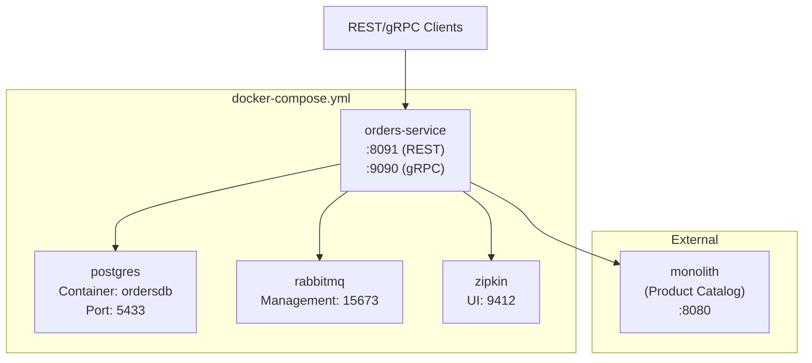
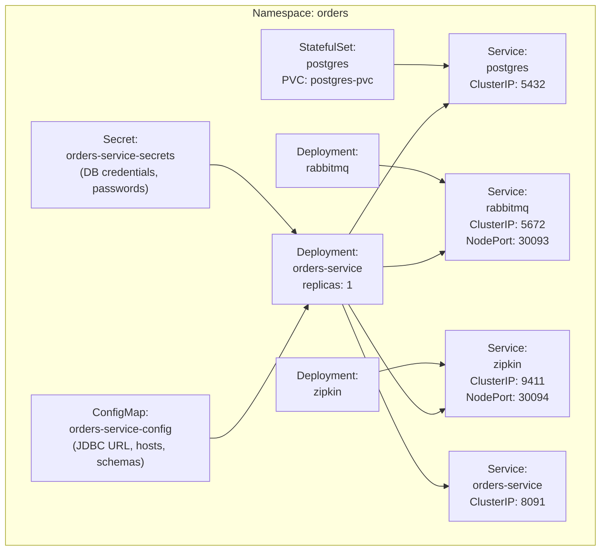
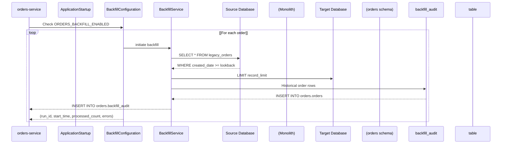

# Deployment

> **Relevant source files**
> * [README-deployment.md](https://github.com/philipz/spring-modulith-orders/blob/eb506991/README-deployment.md)

## Purpose and Scope

This document provides comprehensive guidance for deploying the `orders-service` in various environments, from local development to production-ready Kubernetes clusters. It covers container image creation using Cloud Native Buildpacks, Docker Compose setup for local testing, Kubernetes manifest application, configuration management, and the historical data backfill mechanism for migrating legacy orders from a monolith database.

For information about building and running the service during development, see [Getting Started](/philipz/spring-modulith-orders/2-getting-started). For configuration options and environment variables, see [Configuration](/philipz/spring-modulith-orders/8-configuration).

---

## Container Image Creation

The `orders-service` uses Spring Boot's Cloud Native Buildpacks integration to produce OCI-compliant container images without requiring a custom Dockerfile. The buildpack configuration is embedded in the Maven POM and automatically packages the application with an appropriate JRE base image.

### Building the Image

Execute the following command from the repository root:

```
./mvnw -pl orders spring-boot:build-image \
  -Dspring-boot.build-image.imageName=philipz/orders-service:latest
```

This invokes the `spring-boot-maven-plugin` with the `build-image` goal, which:

1. Analyzes the application's dependencies
2. Selects appropriate buildpack layers
3. Creates an optimized, layered container image
4. Tags it as `philipz/orders-service:latest`

The resulting image is available in the local Docker daemon. To push to a remote registry, ensure you are authenticated via `docker login` before running the build command.

**Sources:** [README-deployment.md L5-L14](https://github.com/philipz/spring-modulith-orders/blob/eb506991/README-deployment.md#L5-L14)

---

## Docker Compose Deployment

The Docker Compose configuration provides a complete local development environment with all required infrastructure services.

### Service Topology



### Starting the Stack

Navigate to the `orders` directory and execute:

```
cd orders
docker compose up
```

This command:

* Pulls or builds all required images
* Creates a dedicated Docker network
* Starts services in dependency order
* Exposes ports on the host

### Port Mappings

| Service | Internal Port | Host Port | Purpose |
| --- | --- | --- | --- |
| `orders-service` | 8091 | 8091 | REST API |
| `orders-service` | 9090 | 9090 | gRPC API |
| `postgres` | 5432 | 5433 | PostgreSQL JDBC |
| `rabbitmq` | 5672 | 5672 | AMQP Protocol |
| `rabbitmq` | 15672 | 15673 | Management UI |
| `zipkin` | 9411 | 9412 | Trace Collection/UI |

### Environment Configuration

Key environment variables configured in the Compose file:

* `SPRING_DATASOURCE_URL`: `jdbc:postgresql://postgres:5432/ordersdb`
* `SPRING_RABBITMQ_HOST`: `rabbitmq`
* `PRODUCT_API_BASE_URL`: Defaults to `http://monolith:8080`; override if the product catalog is hosted elsewhere
* `MANAGEMENT_ZIPKIN_TRACING_ENDPOINT`: `http://zipkin:9411/api/v2/spans`

### Stopping and Cleanup

To stop services while preserving data volumes:

```
docker compose down
```

To remove volumes and reset to a clean state:

```
docker compose down -v
```

**Sources:** [README-deployment.md L16-L33](https://github.com/philipz/spring-modulith-orders/blob/eb506991/README-deployment.md#L16-L33)

---

## Kubernetes Deployment

The Kubernetes deployment configuration provides production-ready orchestration with explicit resource management, secrets handling, and service discovery.

### Resource Topology



### Manifest Application Order

Apply manifests sequentially to respect dependency requirements:

```sql
# 1. Create namespace
kubectl apply -f orders/k8s/namespace.yaml

# 2. Create configuration resources
kubectl apply -f orders/k8s/secret.yaml
kubectl apply -f orders/k8s/configmap.yaml

# 3. Deploy infrastructure services
kubectl apply -f orders/k8s/postgres.yaml
kubectl apply -f orders/k8s/rabbitmq.yaml
kubectl apply -f orders/k8s/zipkin.yaml

# 4. Deploy application
kubectl apply -f orders/k8s/orders-service.yaml
```

### Container Image Configuration

The deployment manifest references `philipz/orders-service:latest`. To use a different tag or registry:

1. Update the `image` field in `orders/k8s/orders-service.yaml`
2. Ensure the cluster has pull access (configure `imagePullSecrets` if using a private registry)

### Service Access Patterns

**Within the cluster:**

```yaml
http://orders-service.orders.svc.cluster.local:8091
grpc://orders-service.orders.svc.cluster.local:9090
```

**External access via NodePort:**

* Zipkin UI: `http://<node-ip>:30094`
* RabbitMQ Management: `http://<node-ip>:30093`

For production deployments, replace NodePort services with LoadBalancer or Ingress resources.

### Resource Cleanup

Remove all deployed resources:

```csharp
kubectl delete namespace orders
```

This cascades deletion to all resources within the namespace.

**Sources:** [README-deployment.md L35-L90](https://github.com/philipz/spring-modulith-orders/blob/eb506991/README-deployment.md#L35-L90)

---

## Configuration Management

Configuration is externalized following 12-factor app principles, separating sensitive credentials from connection metadata.

### Configuration Resources

| Resource Type | Name | Contents |
| --- | --- | --- |
| Secret | `orders-service-secrets` | `SPRING_DATASOURCE_USERNAME``SPRING_DATASOURCE_PASSWORD``SPRING_RABBITMQ_USERNAME``SPRING_RABBITMQ_PASSWORD` |
| ConfigMap | `orders-service-config` | `SPRING_DATASOURCE_URL``SPRING_RABBITMQ_HOST``LIQUIBASE_DEFAULT_SCHEMA``SPRING_MODULITH_EVENTS_JDBC_SCHEMA_INITIALIZATION_SCHEMA` |

### Schema Assignment

The service uses dedicated PostgreSQL schemas for logical separation:

* `orders`: Main application schema containing `orders` table and Liquibase changelogs
* `orders_events`: Spring Modulith event store schema for transactional event persistence

These are configured via:

* `LIQUIBASE_DEFAULT_SCHEMA=orders`
* `SPRING_MODULITH_EVENTS_JDBC_SCHEMA_INITIALIZATION_SCHEMA=orders_events`

### Environment Variable Precedence

Spring Boot resolves configuration in the following order (highest to lowest priority):

1. Environment variables
2. ConfigMap/Secret values (in Kubernetes)
3. `application.properties` defaults

This allows environment-specific overrides without modifying the base configuration file.

**Sources:** [README-deployment.md L57-L62](https://github.com/philipz/spring-modulith-orders/blob/eb506991/README-deployment.md#L57-L62)

---

## Data Migration and Backfill

The service includes a startup hook that can import historical orders from a legacy monolith database, enabling seamless transition to the new microservice architecture.

### Backfill Architecture



### Configuration Variables

Control backfill behavior via environment variables:

| Variable | Purpose | Default |
| --- | --- | --- |
| `ORDERS_BACKFILL_ENABLED` | Master switch to enable/disable backfill | `false` |
| `ORDERS_BACKFILL_LOOKBACK_DAYS` | Maximum age of orders to migrate (days) | No limit |
| `ORDERS_BACKFILL_RECORD_LIMIT` | Maximum rows to process per run | `500` |
| `ORDERS_BACKFILL_SOURCE_URL` | JDBC URL of source database | Service database URL |
| `ORDERS_BACKFILL_SOURCE_USERNAME` | Source database username | Service database username |
| `ORDERS_BACKFILL_SOURCE_PASSWORD` | Source database password | Service database password |

### Execution Flow

1. **Enable Backfill:** ```javascript export ORDERS_BACKFILL_ENABLED=true export ORDERS_BACKFILL_LOOKBACK_DAYS=90 export ORDERS_BACKFILL_RECORD_LIMIT=500 export ORDERS_BACKFILL_SOURCE_URL=jdbc:postgresql://monolith-db:5432/postgres export ORDERS_BACKFILL_SOURCE_USERNAME=postgres export ORDERS_BACKFILL_SOURCE_PASSWORD=postgres ```
2. **Start Service:** * Docker Compose: `docker compose up orders-service` * Kubernetes: Apply deployment manifest with environment variables configured
3. **Monitor Execution:** * Backfill runs once at startup * Results recorded in `orders.backfill_audit` table * Columns: `id`, `run_timestamp`, `lookback_days`, `record_limit`, `processed_count`, `error_message`
4. **Disable After Completion:** ```javascript export ORDERS_BACKFILL_ENABLED=false ``` Prevents re-execution on subsequent restarts.

### Rollback Procedure

If a backfill introduces incorrect data:

1. Query `orders.backfill_audit` to identify the audit record: ```sql SELECT id, run_timestamp, processed_count FROM orders.backfill_audit ORDER BY run_timestamp DESC LIMIT 1; ```
2. Execute the rollback script: ``` psql -h localhost -p 5433 -U postgres -d ordersdb -f orders/scripts/rollback.sql ``` The script deletes orders created during the specified backfill run using the audit `id` as a filter criterion.
3. Optionally delete the audit record: ```sql DELETE FROM orders.backfill_audit WHERE id = <audit_id>; ```

**Sources:** [README-deployment.md L63-L83](https://github.com/philipz/spring-modulith-orders/blob/eb506991/README-deployment.md#L63-L83)

---

## Summary

The `orders-service` deployment strategy supports multiple target environments with consistent configuration patterns:

* **Container Image:** Generated via Cloud Native Buildpacks using `spring-boot:build-image`
* **Local Development:** Docker Compose orchestrates full stack on `localhost`
* **Production:** Kubernetes manifests provide declarative infrastructure with secrets management
* **Data Migration:** Configurable backfill mechanism with audit trail and rollback support

All deployment configurations externalize environment-specific values, enabling promotion across environments without code changes. For detailed configuration options, refer to [Configuration](/philipz/spring-modulith-orders/8-configuration). For building and testing before deployment, see [Getting Started](/philipz/spring-modulith-orders/2-getting-started).