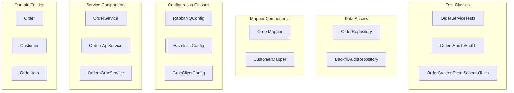
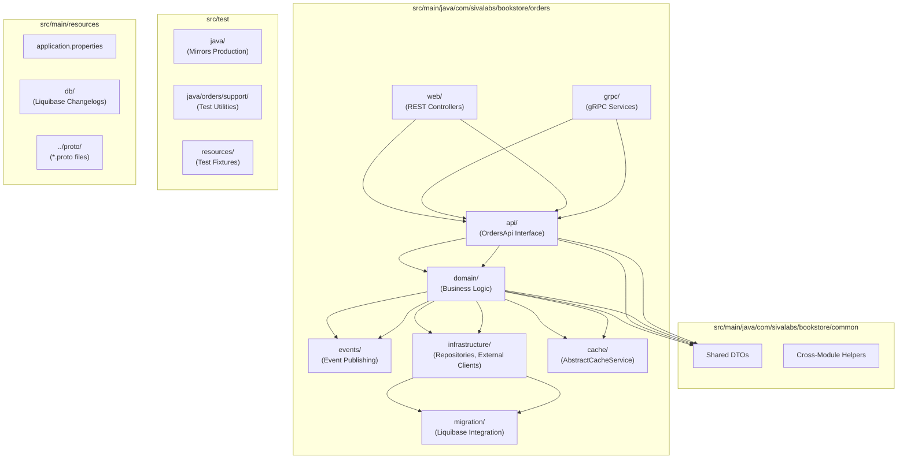
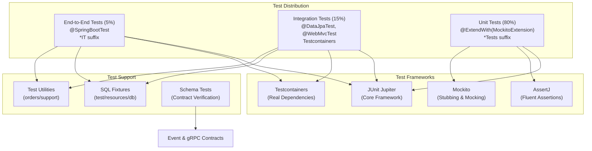

# Development Guidelines

> **Relevant source files**
> * [.gitignore](https://github.com/philipz/spring-modulith-orders/blob/eb506991/.gitignore)
> * [AGENTS.md](https://github.com/philipz/spring-modulith-orders/blob/eb506991/AGENTS.md)
> * [lightweight-test-example.md](https://github.com/philipz/spring-modulith-orders/blob/eb506991/lightweight-test-example.md)

This document establishes the coding standards, formatting rules, naming conventions, and development practices for the orders-service codebase. It covers code style enforcement through Spotless, module organization within the Spring Modulith structure, testing conventions, commit message format using Conventional Commits, and pull request requirements. For information about building and running the service, see [Building the Project](/philipz/spring-modulith-orders/2.2-building-the-project) and [Running Locally](/philipz/spring-modulith-orders/2.3-running-locally). For detailed testing strategies and patterns, see [Testing](/philipz/spring-modulith-orders/7-testing).

---

## Code Style and Formatting

The codebase enforces consistent code style through automated tooling to maintain readability and reduce merge conflicts.

### Spotless with Palantir Java Format

All Java source code is formatted using Palantir Java Format, enforced via the Spotless Maven plugin. This configuration is automatically applied during the build process.

**Key formatting rules:**

* **Indentation**: 4 spaces (no tabs)
* **Import ordering**: Automatically sorted and organized
* **Line length**: Managed by formatter
* **Wildcard imports**: Prohibited - use explicit imports

**Formatting Commands**

| Command | Purpose | When to Use |
| --- | --- | --- |
| `./mvnw spotless:check` | Verify formatting compliance | Before committing, run by CI |
| `./mvnw spotless:apply` | Auto-format all Java files | After structural refactoring, before large reviews |
| `./mvnw clean verify` | Full build with format check | Before pushing changes |

Sources: [AGENTS.md L14-L18](https://github.com/philipz/spring-modulith-orders/blob/eb506991/AGENTS.md#L14-L18)

### Java 21 Features

The project uses Java 21 and encourages idiomatic modern Java patterns:

* **Records**: Preferred for simple DTOs and immutable data carriers
* **Pattern matching**: Allowed for cleaner conditional logic
* **Text blocks**: Use for multi-line strings like SQL or JSON
* **Sealed classes**: Consider for closed hierarchies

Avoid overusing new features when simpler alternatives exist. Code should remain maintainable by all team members.

Sources: [AGENTS.md L17](https://github.com/philipz/spring-modulith-orders/blob/eb506991/AGENTS.md#L17-L17)

---

## Naming Conventions

Consistent naming improves code searchability and understanding of component roles.

### Class and Component Naming



**Naming patterns:**

| Component Type | Pattern | Example |
| --- | --- | --- |
| Domain entities | Singular noun | `Order`, `Customer`, `OrderItem` |
| Service classes | Noun + "Service" suffix | `OrderService`, `OrdersApiService` |
| gRPC services | Noun + "GrpcService" suffix | `OrdersGrpcService` |
| REST controllers | Noun + "Controller" suffix | `OrdersController` |
| Configuration classes | Noun + "Config" suffix | `RabbitMQConfig`, `HazelcastConfig` |
| Mappers | Entity name + "Mapper" suffix | `OrderMapper`, `CustomerMapper` |
| Repositories | Entity name + "Repository" suffix | `OrderRepository` |
| Unit test classes | Class under test + "Tests" suffix | `OrderServiceTests` |
| Integration test classes | Class under test + "IT" suffix | `OrdersEndToEndIT` |

### Variable and Method Naming

* **Variables**: camelCase, descriptive names (`orderNumber`, `customerEmail`)
* **Methods**: camelCase, verb-based for actions (`createOrder`, `validateOrderItem`)
* **Constants**: UPPER_SNAKE_CASE (`MAX_RETRY_ATTEMPTS`, `DEFAULT_PAGE_SIZE`)
* **Private fields**: camelCase, no prefixes or suffixes

Avoid abbreviations unless they are widely understood domain terms (`id`, `url`, `dto`).

Sources: [AGENTS.md L19-L20](https://github.com/philipz/spring-modulith-orders/blob/eb506991/AGENTS.md#L19-L20)

---

## Module Organization

The codebase uses Spring Modulith to organize code into cohesive slices with clear boundaries. Understanding where to place new code is critical for maintaining architectural integrity.

### Spring Modulith Slice Structure



### Placement Guidelines

| Type of Code | Destination Slice | Rationale |
| --- | --- | --- |
| Business rules, domain entities | `domain/` | Core business logic |
| REST endpoints | `web/` | HTTP presentation layer |
| gRPC service implementations | `grpc/` | gRPC presentation layer |
| Service interfaces (OrdersApi) | `api/` | Application facade |
| Event publishers/consumers | `events/` | Asynchronous integration |
| JPA repositories, external clients | `infrastructure/` | External system adapters |
| Cache services, circuit breakers | `cache/` | Cross-cutting cache concerns |
| Database migration configs | `migration/` | Schema evolution |
| Cross-module DTOs | `common/` | Shared data contracts |

**Important rules:**

1. Keep components within the slice that owns the use case - don't create dependencies across slices unless through the `api` layer
2. Reuse existing DTOs in `common/` before creating new duplicates
3. gRPC contracts are defined in `.proto` files - regenerate stubs through Maven, never edit generated code
4. Liquibase changelogs stay in `src/main/resources/db/`, test fixtures mirror this in `src/test/resources/db/`

Sources: [AGENTS.md L3-L8](https://github.com/philipz/spring-modulith-orders/blob/eb506991/AGENTS.md#L3-L8)

---

## Testing Standards

The project follows a testing pyramid strategy with specific conventions for different test types.

### Testing Pyramid



### Test Class Naming

| Test Type | Suffix | Example | Speed Target |
| --- | --- | --- | --- |
| Unit tests | `Tests` | `OrderServiceTests` | < 100ms |
| Integration tests | `IT` | `OrderRepositoryIT` | < 5s |
| End-to-end tests | `IT` | `OrdersEndToEndIT` | < 30s |

Test methods should read as behavior statements:

```
shouldCreateOrderSuccessfully()
shouldThrowExceptionWhenInvalidPrice()
shouldFallbackToDatabaseWhenCacheUnavailable()
```

### Framework Requirements

The project uses lightweight test dependencies instead of `spring-boot-starter-test` to improve test execution speed:

**Required dependencies:**

* `junit-jupiter` - Core test framework
* `mockito-junit-jupiter` - Mocking support
* `assertj-core` - Fluent assertions
* `testcontainers` - For database/messaging tests only
* `spring-test` - For Spring integration tests only

**Performance comparison:**

| Test Type | With spring-boot-starter-test | Lightweight Approach | Speedup |
| --- | --- | --- | --- |
| Unit tests | ~1s per class | ~100ms per class | 10x faster |
| Repository tests | ~15s | ~5s | 3x faster |
| Web tests | ~20s | ~10s | 2x faster |

Sources: [AGENTS.md L22-L26](https://github.com/philipz/spring-modulith-orders/blob/eb506991/AGENTS.md#L22-L26)

 [lightweight-test-example.md L1-L154](https://github.com/philipz/spring-modulith-orders/blob/eb506991/lightweight-test-example.md#L1-L154)

### Test Hermiticity

Integration tests must be hermetic - they should not depend on external state or affect other tests:

* Use SQL fixtures in `src/test/resources/db/` for test data
* Testcontainers provides isolated PostgreSQL and RabbitMQ instances
* Clean up test data between test methods
* Never rely on execution order

### Contract Testing

When adding new gRPC endpoints or events:

1. Update `.proto` files or event classes first
2. Regenerate stubs via `./mvnw compile`
3. Create schema tests like `OrderCreatedEventSchemaTests` to verify contracts
4. Ensure all contract changes are in the same commit

Sources: [AGENTS.md L26](https://github.com/philipz/spring-modulith-orders/blob/eb506991/AGENTS.md#L26-L26)

---

## Commit Message Format

The project uses Conventional Commits to maintain a searchable and CI-friendly commit history.

### Commit Structure

```
<type>(<scope>): <subject>

<body>

<footer>
```

**Type prefixes:**

| Type | Usage | Example |
| --- | --- | --- |
| `feat` | New feature | `feat(api): add pagination to order listing` |
| `fix` | Bug fix | `fix(cache): prevent NPE in CacheErrorHandler` |
| `chore` | Maintenance, dependencies | `chore(deps): upgrade Spring Boot to 3.5.1` |
| `docs` | Documentation only | `docs(readme): update deployment instructions` |
| `test` | Test additions/changes | `test(orders): add integration test for backfill` |
| `refactor` | Code restructuring | `refactor(domain): extract validation to separate class` |
| `perf` | Performance improvement | `perf(cache): optimize cache key generation` |
| `build` | Build system changes | `build(maven): add protobuf plugin configuration` |

### Scope Guidelines

The scope should indicate the affected Spring Modulith slice or component:

* `api`, `domain`, `web`, `grpc`, `events`, `infrastructure`, `cache`, `migration`
* `config` - for configuration changes
* `deps` - for dependency updates
* Omit scope for cross-cutting changes

### Subject Line Rules

* Use imperative mood ("add feature" not "added feature")
* Lowercase first letter after colon
* No period at the end
* Max 72 characters
* Be specific about what changed

### Body Content

Include in the commit body:

* **Why** the change was made (motivation)
* Configuration toggles affected (`ORDERS_REST_ENABLED`, `BOOKSTORE_CACHE_ENABLED`)
* Breaking changes or migration steps
* Related port changes (8091, 9090, etc.)

### Example Commits

**Good:**

```
feat(events): externalize order created events to RabbitMQ

Add @Externalized annotation to OrderCreatedEvent to publish
to BookStoreExchange. Configure routing key as orders.new.

Requires SPRING_RABBITMQ_HOST to be set in deployment.
```

**Good:**

```
fix(cache): handle Hazelcast connection failures gracefully

Implement fallback to database when cache circuit breaker opens.
Add consecutive failure tracking in CacheErrorHandler.

Related config: BOOKSTORE_CACHE_FAILURE_THRESHOLD=5
```

**Poor:**

```sql
update code
```

**Poor:**

```
Fixed bug in orders service that was causing problems
```

Sources: [AGENTS.md L28-L31](https://github.com/philipz/spring-modulith-orders/blob/eb506991/AGENTS.md#L28-L31)

---

## Pull Request Requirements

### PR Description Template

Every pull request should include:

1. **Summary**: One-paragraph description of what changed and why
2. **Affected Modules**: List Spring Modulith slices touched (`domain`, `api`, `web`, etc.)
3. **Validation Commands**: Commands reviewers can run to verify the change
4. **Infrastructure Changes**: New queues, database migrations, config variables
5. **Testing Evidence**: Test results, curl commands, or screenshots
6. **Related Issues**: Links to tracking tickets

### Example PR Description

```markdown
## Summary
Adds product validation by calling the Product Catalog service before 
order creation. Implements ProductCatalogPort interface with circuit 
breaker for resilience.

## Affected Modules
- `api/` - Added ProductCatalogPort interface
- `infrastructure/` - ProductCatalogClient implementation
- `domain/` - OrderService now validates products
- `config/` - Added Resilience4j circuit breaker config

## Validation Commands
```bash
./mvnw test
./mvnw spring-boot:run
curl -X POST http://localhost:8091/api/orders -H "Content-Type: application/json" -d @test-order.json
```

## Infrastructure Changes

* New env var: `PRODUCT_CATALOG_URL` (default: [http://localhost:8080](http://localhost:8080))
* Resilience4j circuit breaker: productCatalogCircuitBreaker
* No database migrations

## Testing

* Added ProductCatalogClientTests (unit)
* Added OrderServiceTests with mocked catalog (unit)
* Added OrdersEndToEndIT with Testcontainers (integration)
* All tests pass: [screenshot or CI link]

## Related Issues

Closes #123

```sql
### Pre-PR Checklist

Before submitting:

- [ ] Run `./mvnw clean verify` successfully
- [ ] Run `./mvnw spotless:apply` to format code
- [ ] All tests pass locally
- [ ] Add tests for new functionality
- [ ] Update relevant documentation
- [ ] Follow commit message conventions
- [ ] No merge conflicts with main branch
- [ ] Configuration changes documented in PR

### Review Requirements

- At least one approval required
- All CI checks must pass
- No unresolved review comments
- PR description complete with validation steps

### Screenshots and Evidence

Include for:
- API changes: curl request/response examples
- UI changes: before/after screenshots  
- Performance improvements: benchmark results
- Event publishing: RabbitMQ management UI screenshots

Sources: <FileRef file-url="https://github.com/philipz/spring-modulith-orders/blob/eb506991/AGENTS.md#L31-L32" min=31 max=32 file-path="AGENTS.md">Hii</FileRef>

---

## Development Workflow

### Standard Development Cycle

```mermaid
graph LR
    subgraph local["Local Development"]
        checkout["git checkout -b<br/>feature/new-feature"]
        code["Write Code<br/>(Follow module structure)"]
        format["./mvnw spotless:apply"]
        test["./mvnw test"]
        verify["./mvnw clean verify"]
    end
    
    subgraph commit["Commit"]
        stage["git add ."]
        commit_msg["git commit -m<br/>'feat(scope): message'"]
    end
    
    subgraph pr["Pull Request"]
        push["git push origin<br/>feature/new-feature"]
        create_pr["Create PR<br/>(Fill template)"]
        ci["CI Checks<br/>(build, test, format)"]
        review["Code Review"]
        merge["Merge to main"]
    end
    
    checkout --> code
    code --> format
    format --> test
    test --> verify
    verify --> stage
    stage --> commit_msg
    commit_msg -.->|"more changes?"| code
    commit_msg --> push
    push --> create_pr
    create_pr --> ci
    ci --> review
    review -.->|"changes requested"| code
    review --> merge
```



### Key Development Commands

| Command | Purpose | Frequency |
| --- | --- | --- |
| `./mvnw spring-boot:run` | Start service locally | Per session |
| `./mvnw test` | Run unit and integration tests | After each code change |
| `./mvnw spotless:apply` | Format all Java files | Before commit |
| `./mvnw clean verify` | Full build with all checks | Before push |
| `./mvnw compile` | Regenerate gRPC stubs | After proto changes |

Sources: [AGENTS.md L10-L14](https://github.com/philipz/spring-modulith-orders/blob/eb506991/AGENTS.md#L10-L14)

### Proto File Changes

When modifying gRPC contracts:

1. Edit `.proto` files in `src/main/proto/`
2. Run `./mvnw compile` to regenerate Java stubs
3. Update service implementations to match new contract
4. Add schema tests to verify contract structure
5. Include all changes in same commit

**Never:**

* Manually edit generated code in `target/generated-sources/`
* Commit without regenerating stubs
* Change proto structure without corresponding service updates

### Configuration Changes

When adding configuration properties:

1. Add default value to `src/main/resources/application.properties`
2. Document environment variable override in commit message
3. Update PR description with new config variables
4. Consider adding to [Environment Variables Reference](/philipz/spring-modulith-orders/8.3-environment-variables-reference)

Example:

```markdown
# New configuration in application.properties
bookstore.feature.new-feature.enabled=true
```

Document as: `BOOKSTORE_FEATURE_NEW_FEATURE_ENABLED` (environment variable format)

Sources: [AGENTS.md L34-L37](https://github.com/philipz/spring-modulith-orders/blob/eb506991/AGENTS.md#L34-L37)

---

## Code Review Guidelines

### What Reviewers Should Check

**Architecture:**

* Changes respect Spring Modulith slice boundaries
* Dependencies flow in correct direction (presentation → api → domain → infrastructure)
* No circular dependencies between slices

**Code Quality:**

* Follows naming conventions
* Properly formatted (Spotless passes)
* No unnecessary complexity
* Appropriate use of Java 21 features

**Testing:**

* Tests added for new functionality
* Test names follow conventions (`*Tests`, `*IT`)
* Tests are hermetic and don't depend on execution order
* Appropriate test level (unit vs integration)

**Configuration:**

* New config variables documented
* Defaults provided in application.properties
* Environment variable naming consistent

**Documentation:**

* PR description complete
* Complex logic has inline comments
* API changes reflected in OpenAPI spec

### Common Pitfalls to Avoid

1. **Cross-slice dependencies**: Don't import directly from other slices; use the `api` layer
2. **Missing validation**: Always validate external inputs at API boundary
3. **Hardcoded values**: Use configuration properties for environment-specific values
4. **Test pollution**: Ensure tests clean up after themselves
5. **Commit message ambiguity**: Be specific about what and why

---

## Summary

Following these guidelines ensures:

* **Consistency**: Uniform code style and structure across the codebase
* **Maintainability**: Clear module boundaries and naming make code easy to navigate
* **Quality**: Comprehensive testing and review processes catch issues early
* **Collaboration**: Structured commits and PRs facilitate effective code review
* **Velocity**: Automated formatting and clear conventions reduce friction

Refer to [Building the Project](/philipz/spring-modulith-orders/2.2-building-the-project) for build tooling details and [Testing Strategy](/philipz/spring-modulith-orders/7.1-testing-strategy) for comprehensive testing guidance.

Sources: [AGENTS.md L1-L38](https://github.com/philipz/spring-modulith-orders/blob/eb506991/AGENTS.md#L1-L38)

 [.gitignore L1-L47](https://github.com/philipz/spring-modulith-orders/blob/eb506991/.gitignore#L1-L47)