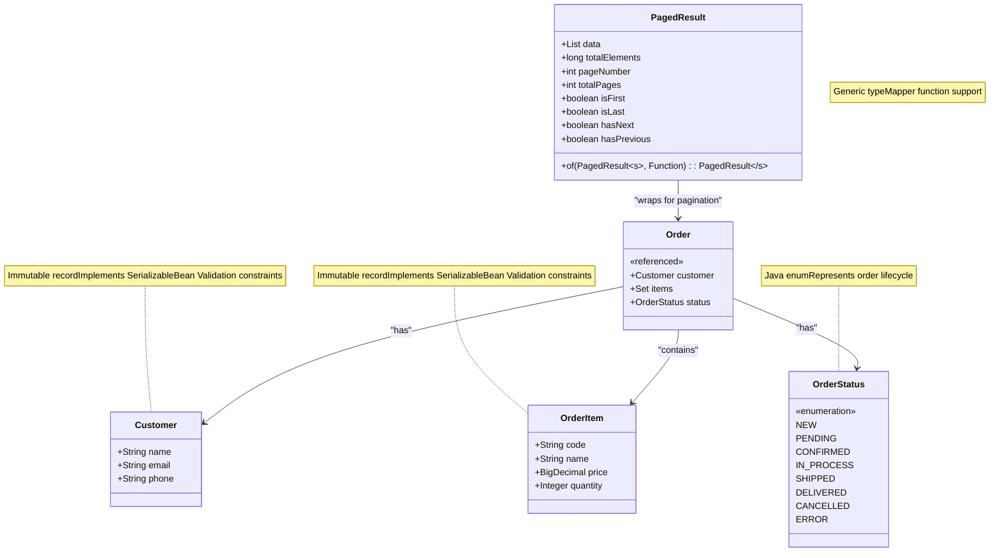
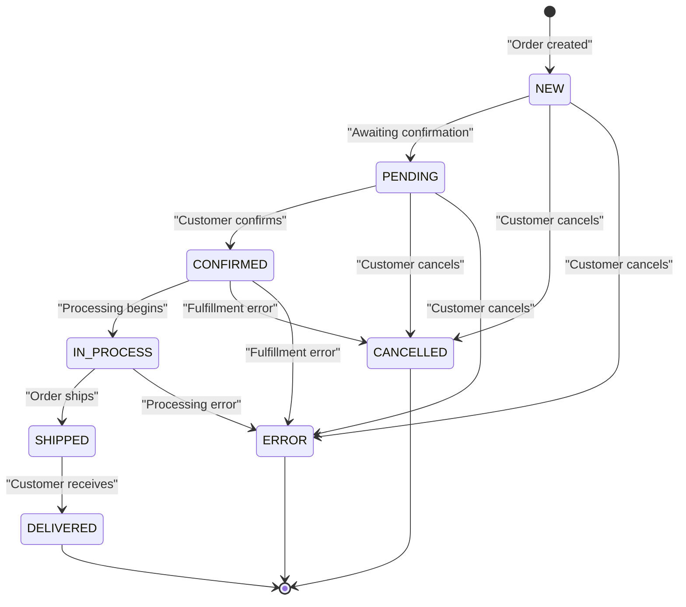
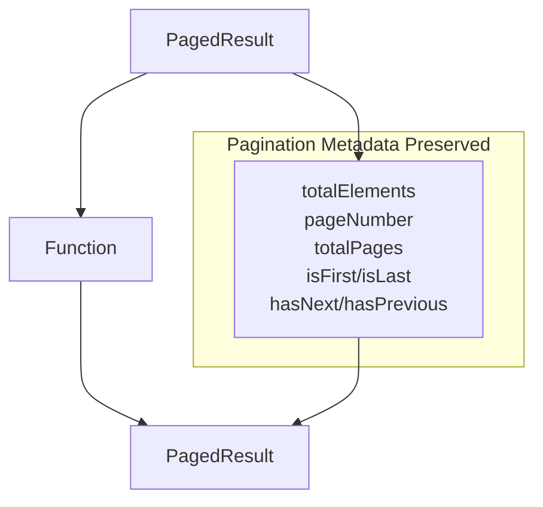

# Domain Models

> **Relevant source files**
> * [src/main/java/com/sivalabs/bookstore/common/models/PagedResult.java](https://github.com/philipz/spring-modulith-orders/blob/eb506991/src/main/java/com/sivalabs/bookstore/common/models/PagedResult.java)
> * [src/main/java/com/sivalabs/bookstore/orders/api/model/Customer.java](https://github.com/philipz/spring-modulith-orders/blob/eb506991/src/main/java/com/sivalabs/bookstore/orders/api/model/Customer.java)
> * [src/main/java/com/sivalabs/bookstore/orders/api/model/OrderItem.java](https://github.com/philipz/spring-modulith-orders/blob/eb506991/src/main/java/com/sivalabs/bookstore/orders/api/model/OrderItem.java)
> * [src/main/java/com/sivalabs/bookstore/orders/api/model/OrderStatus.java](https://github.com/philipz/spring-modulith-orders/blob/eb506991/src/main/java/com/sivalabs/bookstore/orders/api/model/OrderStatus.java)

This page documents the core domain models used throughout the orders-service. These models represent the fundamental business concepts in the order management domain: customers, order items, order status, and paginated result sets.

For information about API request/response DTOs (such as `CreateOrderRequest`, `OrderDto`, etc.), see [Request and Response Models](/philipz/spring-modulith-orders/4.3-request-and-response-models). For details about the service layer implementation that uses these models, see [Orders Service Implementation](/philipz/spring-modulith-orders/5.1-orders-service-implementation).

---

## Overview

The domain models in the orders-service are designed as immutable Java records located in the `order-api-model` named interface. These models are shared across all Spring Modulith slices and form the public contract for domain concepts. All models implement `Serializable` to support caching with Hazelcast and include OpenAPI annotations for documentation generation.

The following domain models are defined:

| Model | Location | Purpose |
| --- | --- | --- |
| `Customer` | [src/main/java/com/sivalabs/bookstore/orders/api/model/Customer.java](https://github.com/philipz/spring-modulith-orders/blob/eb506991/src/main/java/com/sivalabs/bookstore/orders/api/model/Customer.java) | Represents customer information for an order |
| `OrderItem` | [src/main/java/com/sivalabs/bookstore/orders/api/model/OrderItem.java](https://github.com/philipz/spring-modulith-orders/blob/eb506991/src/main/java/com/sivalabs/bookstore/orders/api/model/OrderItem.java) | Represents a line item within an order |
| `OrderStatus` | [src/main/java/com/sivalabs/bookstore/orders/api/model/OrderStatus.java](https://github.com/philipz/spring-modulith-orders/blob/eb506991/src/main/java/com/sivalabs/bookstore/orders/api/model/OrderStatus.java) | Enumerates possible order lifecycle states |
| `PagedResult<T>` | [src/main/java/com/sivalabs/bookstore/common/models/PagedResult.java](https://github.com/philipz/spring-modulith-orders/blob/eb506991/src/main/java/com/sivalabs/bookstore/common/models/PagedResult.java) | Generic pagination wrapper for list responses |

**Sources:**

* [src/main/java/com/sivalabs/bookstore/orders/api/model/Customer.java L1-L19](https://github.com/philipz/spring-modulith-orders/blob/eb506991/src/main/java/com/sivalabs/bookstore/orders/api/model/Customer.java#L1-L19)
* [src/main/java/com/sivalabs/bookstore/orders/api/model/OrderItem.java L1-L22](https://github.com/philipz/spring-modulith-orders/blob/eb506991/src/main/java/com/sivalabs/bookstore/orders/api/model/OrderItem.java#L1-L22)
* [src/main/java/com/sivalabs/bookstore/orders/api/model/OrderStatus.java L1-L30](https://github.com/philipz/spring-modulith-orders/blob/eb506991/src/main/java/com/sivalabs/bookstore/orders/api/model/OrderStatus.java#L1-L30)
* [src/main/java/com/sivalabs/bookstore/common/models/PagedResult.java L1-L33](https://github.com/philipz/spring-modulith-orders/blob/eb506991/src/main/java/com/sivalabs/bookstore/common/models/PagedResult.java#L1-L33)

---

## Domain Model Relationships



This diagram illustrates how domain models relate to each other in the context of an order. The `Order` entity (not shown in detail here, as it's part of the internal domain slice) aggregates a `Customer`, a collection of `OrderItem` instances, and an `OrderStatus`. The `PagedResult<T>` generic type wraps collections of any domain model for paginated responses.

**Sources:**

* [src/main/java/com/sivalabs/bookstore/orders/api/model/Customer.java L1-L19](https://github.com/philipz/spring-modulith-orders/blob/eb506991/src/main/java/com/sivalabs/bookstore/orders/api/model/Customer.java#L1-L19)
* [src/main/java/com/sivalabs/bookstore/orders/api/model/OrderItem.java L1-L22](https://github.com/philipz/spring-modulith-orders/blob/eb506991/src/main/java/com/sivalabs/bookstore/orders/api/model/OrderItem.java#L1-L22)
* [src/main/java/com/sivalabs/bookstore/orders/api/model/OrderStatus.java L1-L30](https://github.com/philipz/spring-modulith-orders/blob/eb506991/src/main/java/com/sivalabs/bookstore/orders/api/model/OrderStatus.java#L1-L30)
* [src/main/java/com/sivalabs/bookstore/common/models/PagedResult.java L1-L33](https://github.com/philipz/spring-modulith-orders/blob/eb506991/src/main/java/com/sivalabs/bookstore/common/models/PagedResult.java#L1-L33)

---

## Customer Model

The `Customer` record represents customer information associated with an order. It is defined at [src/main/java/com/sivalabs/bookstore/orders/api/model/Customer.java L9-L16](https://github.com/philipz/spring-modulith-orders/blob/eb506991/src/main/java/com/sivalabs/bookstore/orders/api/model/Customer.java#L9-L16)

### Structure

| Field | Type | Constraints | Description |
| --- | --- | --- | --- |
| `name` | `String` | `@NotBlank` | Customer's full name |
| `email` | `String` | `@NotBlank`, `@Email` | Customer's email address (validated format) |
| `phone` | `String` | `@NotBlank` | Customer's phone number |

### Validation Rules

The `Customer` model enforces the following Bean Validation constraints:

* **name**: Must not be blank. Error message: "Customer Name is required"
* **email**: Must not be blank and must be a valid email format. Error message: "Customer email is required"
* **phone**: Must not be blank. Error message: "Customer Phone number is required"

### Serialization

The model implements `Serializable` with `serialVersionUID = 1L` [src/main/java/com/sivalabs/bookstore/orders/api/model/Customer.java L18](https://github.com/philipz/spring-modulith-orders/blob/eb506991/src/main/java/com/sivalabs/bookstore/orders/api/model/Customer.java#L18-L18)

 enabling storage in Hazelcast distributed cache and support for Java serialization-based caching mechanisms.

### OpenAPI Documentation

The model includes Swagger/OpenAPI annotations (`@Schema`) for automatic API documentation generation. Example values are provided for each field:

* `name`: "John Doe"
* `email`: "[john.doe@example.com](mailto:john.doe@example.com)"
* `phone`: "+1-555-123-4567"

**Sources:** [src/main/java/com/sivalabs/bookstore/orders/api/model/Customer.java L1-L19](https://github.com/philipz/spring-modulith-orders/blob/eb506991/src/main/java/com/sivalabs/bookstore/orders/api/model/Customer.java#L1-L19)

---

## OrderItem Model

The `OrderItem` record represents a single line item within an order, containing product information and quantity. It is defined at [src/main/java/com/sivalabs/bookstore/orders/api/model/OrderItem.java L12-L18](https://github.com/philipz/spring-modulith-orders/blob/eb506991/src/main/java/com/sivalabs/bookstore/orders/api/model/OrderItem.java#L12-L18)

### Structure

| Field | Type | Constraints | Description |
| --- | --- | --- | --- |
| `code` | `String` | `@NotBlank` | Unique product code identifier |
| `name` | `String` | `@NotBlank` | Product name or description |
| `price` | `BigDecimal` | `@NotNull`, `@DecimalMin("0.01")` | Unit price (must be > 0) |
| `quantity` | `Integer` | `@NotNull`, `@Min(1)` | Number of units ordered (must be ≥ 1) |

### Validation Rules

The `OrderItem` model enforces business rules through Bean Validation:

* **code**: Must not be blank. Error message: "Code is required"
* **name**: Must not be blank. Error message: "Name is required"
* **price**: Must not be null and must be at least 0.01. Error message: "Price is required" / "Price must be greater than 0"
* **quantity**: Must not be null and must be at least 1 (no negative or zero quantities allowed)

### Serialization

The model implements `Serializable` with `serialVersionUID = 1L` [src/main/java/com/sivalabs/bookstore/orders/api/model/OrderItem.java L21](https://github.com/philipz/spring-modulith-orders/blob/eb506991/src/main/java/com/sivalabs/bookstore/orders/api/model/OrderItem.java#L21-L21)

 supporting caching and serialization requirements.

### OpenAPI Documentation

Example values provided in annotations:

* `code`: "P100"
* `name`: "Spring Boot in Action"
* `price`: "29.99"
* `quantity`: 2

**Sources:** [src/main/java/com/sivalabs/bookstore/orders/api/model/OrderItem.java L1-L22](https://github.com/philipz/spring-modulith-orders/blob/eb506991/src/main/java/com/sivalabs/bookstore/orders/api/model/OrderItem.java#L1-L22)

---

## OrderStatus Enumeration

The `OrderStatus` enum represents the lifecycle states of an order, defined at [src/main/java/com/sivalabs/bookstore/orders/api/model/OrderStatus.java L6-L29](https://github.com/philipz/spring-modulith-orders/blob/eb506991/src/main/java/com/sivalabs/bookstore/orders/api/model/OrderStatus.java#L6-L29)

### Status Values



This diagram shows the typical order lifecycle and state transitions.

### Enum Constants

| Constant | Description | Typical Usage |
| --- | --- | --- |
| `NEW` | Order is newly created | Initial state when order is first persisted |
| `PENDING` | Order is pending confirmation | Awaiting payment verification or customer confirmation |
| `CONFIRMED` | Order has been confirmed | Payment accepted, order validated |
| `IN_PROCESS` | Order is being processed | Fulfillment operations underway |
| `SHIPPED` | Order has been shipped | Package dispatched to customer |
| `DELIVERED` | Order has been delivered | Final successful state |
| `CANCELLED` | Order has been cancelled | Customer or system cancelled the order |
| `ERROR` | Order has encountered an error | Exception or validation failure occurred |

### OpenAPI Documentation

Each enum constant includes a `@Schema` annotation describing its semantic meaning [src/main/java/com/sivalabs/bookstore/orders/api/model/OrderStatus.java L7-L29](https://github.com/philipz/spring-modulith-orders/blob/eb506991/src/main/java/com/sivalabs/bookstore/orders/api/model/OrderStatus.java#L7-L29)

 This enables automatic generation of documentation showing all possible status values in API specifications.

**Sources:** [src/main/java/com/sivalabs/bookstore/orders/api/model/OrderStatus.java L1-L30](https://github.com/philipz/spring-modulith-orders/blob/eb506991/src/main/java/com/sivalabs/bookstore/orders/api/model/OrderStatus.java#L1-L30)

---

## PagedResult Generic Type

The `PagedResult<T>` record is a generic wrapper for paginated list responses, defined at [src/main/java/com/sivalabs/bookstore/common/models/PagedResult.java L8-L20](https://github.com/philipz/spring-modulith-orders/blob/eb506991/src/main/java/com/sivalabs/bookstore/common/models/PagedResult.java#L8-L20)

### Structure

| Field | Type | Description |
| --- | --- | --- |
| `data` | `List<T>` | List of items for the current page |
| `totalElements` | `long` | Total number of elements across all pages |
| `pageNumber` | `int` | Current page number (1-based indexing) |
| `totalPages` | `int` | Total number of pages available |
| `isFirst` | `boolean` | Whether this is the first page |
| `isLast` | `boolean` | Whether this is the last page |
| `hasNext` | `boolean` | Whether a next page exists |
| `hasPrevious` | `boolean` | Whether a previous page exists |

### Mapper Function

The `PagedResult` class provides a static factory method `of` for transforming paginated results from one type to another while preserving pagination metadata:

```
public static <S, T> PagedResult<T> of(PagedResult<S> pagedResult, Function<S, T> mapper)
```

This method is defined at [src/main/java/com/sivalabs/bookstore/common/models/PagedResult.java L22-L32](https://github.com/philipz/spring-modulith-orders/blob/eb506991/src/main/java/com/sivalabs/bookstore/common/models/PagedResult.java#L22-L32)

 It applies the provided `mapper` function to each element in the source `PagedResult<S>` and returns a new `PagedResult<T>` with all pagination metadata copied.

### Usage Example



This diagram shows how `PagedResult.of()` transforms entity pages to DTO pages while preserving pagination metadata.

### OpenAPI Documentation

All fields include `@Schema` annotations with:

* Descriptions explaining the field's purpose
* Example values (e.g., `pageNumber = 1`, `totalElements = 100`)
* Required flags (all fields are required)
* Constraints (e.g., `pageNumber` has minimum value of 1)

The annotations are defined at [src/main/java/com/sivalabs/bookstore/common/models/PagedResult.java L9-L20](https://github.com/philipz/spring-modulith-orders/blob/eb506991/src/main/java/com/sivalabs/bookstore/common/models/PagedResult.java#L9-L20)

**Sources:** [src/main/java/com/sivalabs/bookstore/common/models/PagedResult.java L1-L33](https://github.com/philipz/spring-modulith-orders/blob/eb506991/src/main/java/com/sivalabs/bookstore/common/models/PagedResult.java#L1-L33)

---

## Model Design Principles

The domain models in orders-service follow these design principles:

### Immutability

All models are defined as Java records, making them immutable by default. This provides:

* Thread-safety without synchronization
* Safe caching in Hazelcast distributed cache
* Predictable behavior in multi-threaded environments
* Protection against accidental mutation

### Serialization Support

All models implement `Serializable` to enable:

* Storage in Hazelcast `IMap` caches (see [Caching Layer](/philipz/spring-modulith-orders/5.2-caching-layer))
* Support for distributed session storage
* Compatibility with Java serialization frameworks

### Validation at the Model Level

Bean Validation constraints are declared directly on record components rather than in service layers. This ensures:

* Validation happens at construction time
* Invalid models cannot be instantiated
* Constraints are co-located with the data they protect
* Automatic validation by Spring's `@Valid` annotation in controllers

### OpenAPI First

All models include comprehensive `@Schema` annotations with:

* Human-readable descriptions
* Example values for documentation
* Constraint specifications (min, max, required)
* Type information for code generation

This enables automatic generation of OpenAPI specifications at `/api-docs` (see [REST API](/philipz/spring-modulith-orders/4.1-rest-api)).

**Sources:**

* [src/main/java/com/sivalabs/bookstore/orders/api/model/Customer.java L1-L19](https://github.com/philipz/spring-modulith-orders/blob/eb506991/src/main/java/com/sivalabs/bookstore/orders/api/model/Customer.java#L1-L19)
* [src/main/java/com/sivalabs/bookstore/orders/api/model/OrderItem.java L1-L22](https://github.com/philipz/spring-modulith-orders/blob/eb506991/src/main/java/com/sivalabs/bookstore/orders/api/model/OrderItem.java#L1-L22)
* [src/main/java/com/sivalabs/bookstore/orders/api/model/OrderStatus.java L1-L30](https://github.com/philipz/spring-modulith-orders/blob/eb506991/src/main/java/com/sivalabs/bookstore/orders/api/model/OrderStatus.java#L1-L30)
* [src/main/java/com/sivalabs/bookstore/common/models/PagedResult.java L1-L33](https://github.com/philipz/spring-modulith-orders/blob/eb506991/src/main/java/com/sivalabs/bookstore/common/models/PagedResult.java#L1-L33)