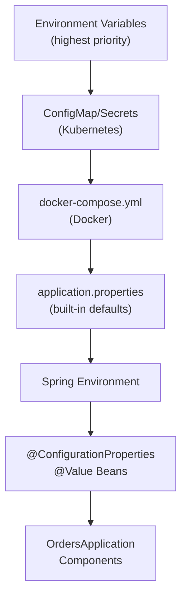
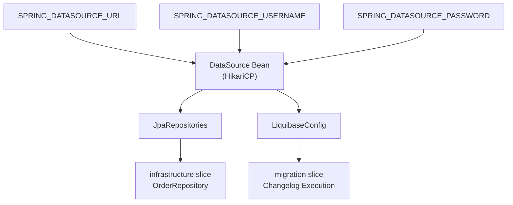
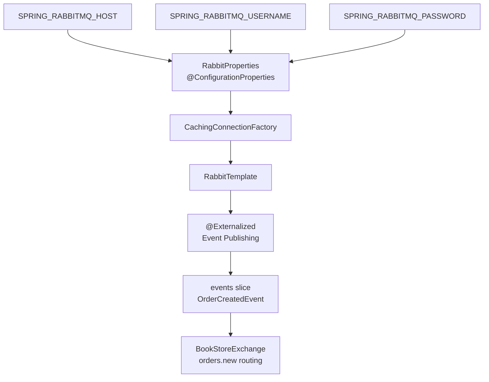
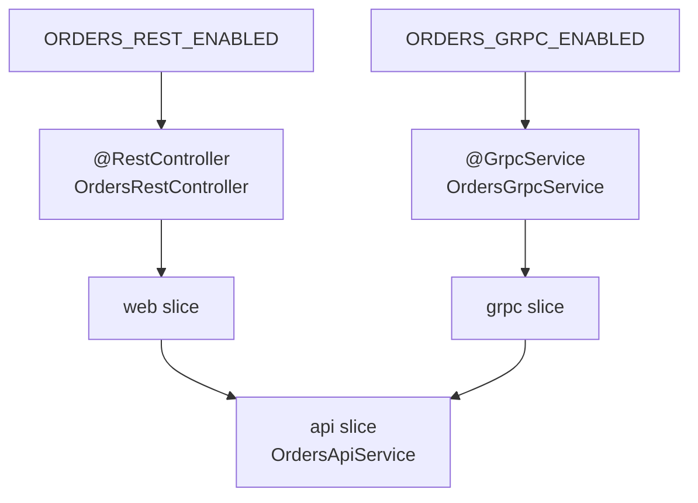
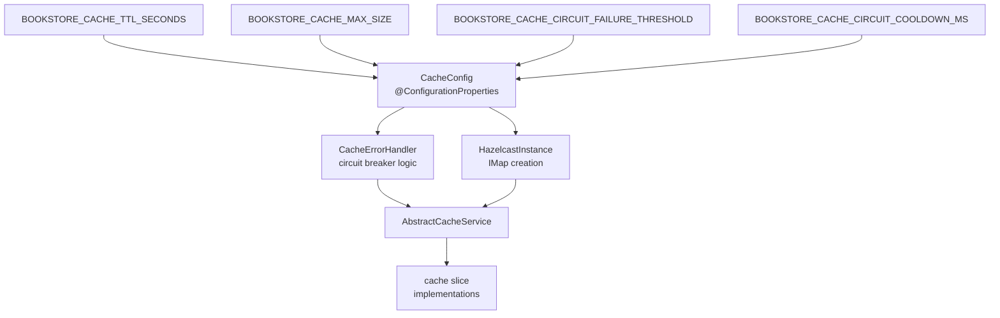
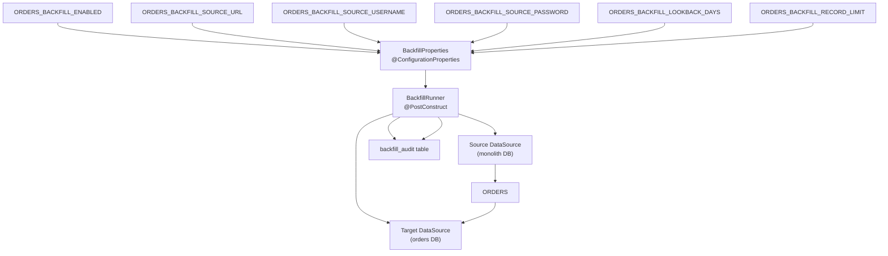
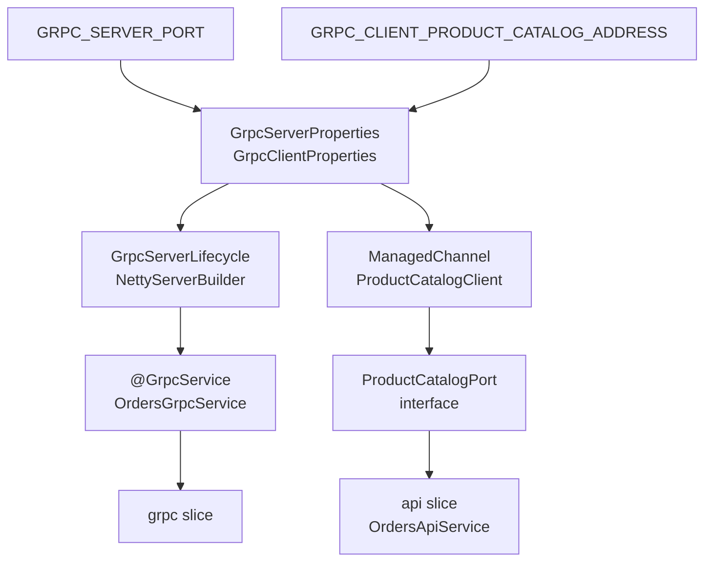
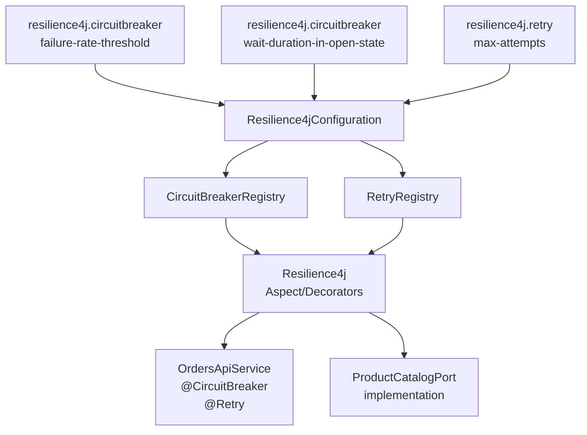
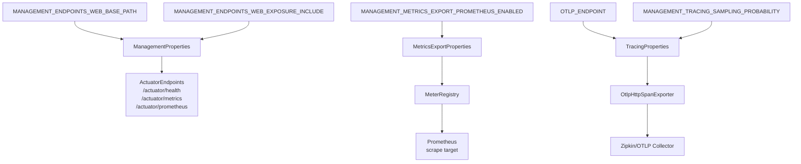
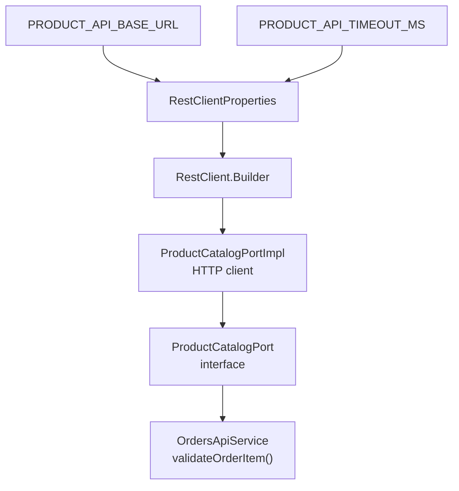

# Environment Variables Reference

> **Relevant source files**
> * [AGENTS.md](https://github.com/philipz/spring-modulith-orders/blob/eb506991/AGENTS.md)
> * [README-deployment.md](https://github.com/philipz/spring-modulith-orders/blob/eb506991/README-deployment.md)
> * [README.md](https://github.com/philipz/spring-modulith-orders/blob/eb506991/README.md)

This document provides a comprehensive reference for all environment variables used to configure the orders-service at runtime. These variables control database connections, message broker settings, feature toggles, caching behavior, data backfill operations, and observability integrations.

For information about the build-time configuration in `pom.xml`, see [Build Configuration](/philipz/spring-modulith-orders/8.2-build-configuration). For details on the `application.properties` defaults that these variables override, see [Application Configuration](/philipz/spring-modulith-orders/8.1-application-configuration).

---

## Configuration Sources and Priority

The orders-service follows Spring Boot's standard configuration property resolution order. Environment variables override defaults specified in `application.properties`.



**Diagram: Configuration Resolution Flow**

Environment variables can be set directly in the shell, passed via Docker Compose `environment` sections, or mounted from Kubernetes ConfigMaps and Secrets. The Spring `Environment` abstraction merges these sources and makes them available to `@ConfigurationProperties` classes and `@Value` annotations throughout the application.

**Sources:** [AGENTS.md L34-L37](https://github.com/philipz/spring-modulith-orders/blob/eb506991/AGENTS.md#L34-L37)

 [README-deployment.md L57-L61](https://github.com/philipz/spring-modulith-orders/blob/eb506991/README-deployment.md#L57-L61)

 [README.md L24-L27](https://github.com/philipz/spring-modulith-orders/blob/eb506991/README.md#L24-L27)

---

## Database Configuration

These variables control the PostgreSQL database connection used for order persistence and Liquibase schema migrations.

| Variable | Description | Default | Example |
| --- | --- | --- | --- |
| `SPRING_DATASOURCE_URL` | JDBC connection string for the orders database | `jdbc:postgresql://localhost:5432/postgres` | `jdbc:postgresql://orders-db:5432/ordersdb` |
| `SPRING_DATASOURCE_USERNAME` | Database username | `postgres` | `orders_user` |
| `SPRING_DATASOURCE_PASSWORD` | Database password | `postgres` | `secure_password` |
| `SPRING_DATASOURCE_DRIVER_CLASS_NAME` | JDBC driver class | `org.postgresql.Driver` | (rarely changed) |
| `SPRING_JPA_HIBERNATE_DDL_AUTO` | Hibernate schema generation mode | `validate` | `validate` (never use `update` in production) |



**Diagram: Database Configuration Flow to Components**

The Spring Boot auto-configured `DataSource` bean consumes these variables to establish connection pooling via HikariCP. Both JPA repositories in the `infrastructure` slice and Liquibase in the `migration` slice share this data source.

**Sources:** [README-deployment.md L57-L61](https://github.com/philipz/spring-modulith-orders/blob/eb506991/README-deployment.md#L57-L61)

 [README.md L24-L27](https://github.com/philipz/spring-modulith-orders/blob/eb506991/README.md#L24-L27)

 [AGENTS.md L35](https://github.com/philipz/spring-modulith-orders/blob/eb506991/AGENTS.md#L35-L35)

---

## RabbitMQ Configuration

These variables configure the AMQP connection to RabbitMQ for publishing domain events via Spring Modulith's `@Externalized` mechanism.

| Variable | Description | Default | Example |
| --- | --- | --- | --- |
| `SPRING_RABBITMQ_HOST` | RabbitMQ broker hostname | `localhost` | `rabbitmq.orders.svc.cluster.local` |
| `SPRING_RABBITMQ_PORT` | AMQP port | `5672` | `5672` |
| `SPRING_RABBITMQ_USERNAME` | Broker username | `guest` | `orders_publisher` |
| `SPRING_RABBITMQ_PASSWORD` | Broker password | `guest` | `secure_password` |
| `SPRING_RABBITMQ_VIRTUAL_HOST` | Virtual host | `/` | `/orders` |



**Diagram: RabbitMQ Configuration to Event Publishing**

Spring Boot's `RabbitAutoConfiguration` uses these variables to create a `CachingConnectionFactory`. Spring Modulith's AMQP externalization mechanism publishes events annotated with `@Externalized` to the `BookStoreExchange` exchange.

**Sources:** [README-deployment.md L25-L31](https://github.com/philipz/spring-modulith-orders/blob/eb506991/README-deployment.md#L25-L31)

 [README.md L24-L27](https://github.com/philipz/spring-modulith-orders/blob/eb506991/README.md#L24-L27)

 [AGENTS.md L35](https://github.com/philipz/spring-modulith-orders/blob/eb506991/AGENTS.md#L35-L35)

---

## Feature Flags

These boolean flags enable or disable specific API endpoints and features at runtime.

| Variable | Description | Default | Example |
| --- | --- | --- | --- |
| `ORDERS_REST_ENABLED` | Enable REST API endpoints on port 8091 | `false` | `true` |
| `ORDERS_GRPC_ENABLED` | Enable gRPC service on port 9090 | `true` | `true` |
| `ORDERS_BACKFILL_ENABLED` | Enable historical order backfill at startup | `false` | `true` |



**Diagram: Feature Flags Controlling API Layer Activation**

The `@ConditionalOnProperty` Spring Boot annotation gates component registration based on these flags. When `ORDERS_REST_ENABLED=false`, the REST controller beans are not created, and only the gRPC API is active.

**Sources:** [README.md L27](https://github.com/philipz/spring-modulith-orders/blob/eb506991/README.md#L27-L27)

 [AGENTS.md L35](https://github.com/philipz/spring-modulith-orders/blob/eb506991/AGENTS.md#L35-L35)

 [README-deployment.md L31](https://github.com/philipz/spring-modulith-orders/blob/eb506991/README-deployment.md#L31-L31)

---

## Cache Configuration

These variables configure Hazelcast distributed cache behavior and the circuit breaker protecting cache operations.

| Variable | Description | Default | Example |
| --- | --- | --- | --- |
| `BOOKSTORE_CACHE_TTL_SECONDS` | Cache entry time-to-live | `300` | `600` |
| `BOOKSTORE_CACHE_MAX_SIZE` | Maximum cache entries per map | `1000` | `5000` |
| `BOOKSTORE_CACHE_EVICTION_POLICY` | Eviction strategy | `LRU` | `LFU` |
| `BOOKSTORE_CACHE_CIRCUIT_FAILURE_THRESHOLD` | Circuit breaker failure count before opening | `5` | `10` |
| `BOOKSTORE_CACHE_CIRCUIT_COOLDOWN_MS` | Milliseconds before circuit attempts half-open | `30000` | `60000` |



**Diagram: Cache Configuration to Components**

A `@ConfigurationProperties` class (likely `CacheConfig`) binds these variables and provides them to both the Hazelcast instance configuration and the `CacheErrorHandler` circuit breaker. The `AbstractCacheService` base class uses both to provide fault-tolerant caching.

**Sources:** [AGENTS.md L37](https://github.com/philipz/spring-modulith-orders/blob/eb506991/AGENTS.md#L37-L37)

---

## Backfill Configuration

These variables control the one-time historical order migration from a legacy monolith database.

| Variable | Description | Default | Example |
| --- | --- | --- | --- |
| `ORDERS_BACKFILL_ENABLED` | Execute backfill on startup | `false` | `true` |
| `ORDERS_BACKFILL_SOURCE_URL` | JDBC URL for source database | (uses service DB if unset) | `jdbc:postgresql://monolith-db:5432/postgres` |
| `ORDERS_BACKFILL_SOURCE_USERNAME` | Source database username | `postgres` | `readonly_user` |
| `ORDERS_BACKFILL_SOURCE_PASSWORD` | Source database password | `postgres` | `secure_password` |
| `ORDERS_BACKFILL_LOOKBACK_DAYS` | Maximum age of orders to migrate (days) | `null` (unlimited) | `90` |
| `ORDERS_BACKFILL_RECORD_LIMIT` | Maximum rows to migrate per run | `null` (unlimited) | `500` |



**Diagram: Backfill Configuration and Execution Flow**

The `BackfillRunner` component (likely in the `migration` slice) reads these properties to establish a separate connection to the source database, execute a filtered query based on `LOOKBACK_DAYS` and `RECORD_LIMIT`, and insert rows into the target database. The `backfill_audit` table records execution metadata for traceability and rollback support.

**Sources:** [README-deployment.md L65-L82](https://github.com/philipz/spring-modulith-orders/blob/eb506991/README-deployment.md#L65-L82)

---

## gRPC Configuration

These variables configure the gRPC server and client connections for inter-service communication.

| Variable | Description | Default | Example |
| --- | --- | --- | --- |
| `GRPC_SERVER_PORT` | gRPC server listening port | `9090` | `9090` |
| `GRPC_CLIENT_PRODUCT_CATALOG_ADDRESS` | Target for ProductCatalogPort gRPC client | `static://localhost:9000` | `dns:///product-catalog.default.svc.cluster.local:9000` |
| `GRPC_CLIENT_PRODUCT_CATALOG_NEGOTIATION_TYPE` | TLS mode (PLAINTEXT or TLS) | `PLAINTEXT` | `TLS` |



**Diagram: gRPC Server and Client Configuration**

The gRPC server port is configured via `GrpcServerProperties` and used by the embedded Netty server hosting `@GrpcService` beans. The client address configures a `ManagedChannel` that implements the `ProductCatalogPort` interface for validating product data during order creation.

**Sources:** [README-deployment.md L30](https://github.com/philipz/spring-modulith-orders/blob/eb506991/README-deployment.md#L30-L30)

 [AGENTS.md L35](https://github.com/philipz/spring-modulith-orders/blob/eb506991/AGENTS.md#L35-L35)

---

## Resilience Configuration

These variables configure Resilience4j circuit breakers, retry policies, and rate limiters for fault tolerance.

| Variable | Description | Default | Example |
| --- | --- | --- | --- |
| `resilience4j.circuitbreaker.instances.default.failure-rate-threshold` | Percentage of failures to open circuit | `50` | `60` |
| `resilience4j.circuitbreaker.instances.default.minimum-number-of-calls` | Minimum calls before circuit activates | `10` | `20` |
| `resilience4j.circuitbreaker.instances.default.wait-duration-in-open-state` | Milliseconds before attempting half-open | `60000` | `30000` |
| `resilience4j.retry.instances.default.max-attempts` | Maximum retry attempts | `3` | `5` |
| `resilience4j.retry.instances.default.wait-duration` | Milliseconds between retries | `1000` | `500` |



**Diagram: Resilience4j Configuration Applied to Components**

Resilience4j registries are populated from these configuration properties. AOP aspects then wrap methods annotated with `@CircuitBreaker` or `@Retry`, such as those in `OrdersApiService` and external port implementations, providing automatic fault tolerance.

**Sources:** [AGENTS.md L37](https://github.com/philipz/spring-modulith-orders/blob/eb506991/AGENTS.md#L37-L37)

---

## Observability Configuration

These variables configure Actuator endpoints, Prometheus metrics, and OpenTelemetry trace export for monitoring and debugging.

| Variable | Description | Default | Example |
| --- | --- | --- | --- |
| `MANAGEMENT_ENDPOINTS_WEB_BASE_PATH` | Base path for Actuator endpoints | `/actuator` | `/management` |
| `MANAGEMENT_ENDPOINTS_WEB_EXPOSURE_INCLUDE` | Exposed Actuator endpoints | `health,info,metrics,prometheus` | `*` |
| `MANAGEMENT_METRICS_EXPORT_PROMETHEUS_ENABLED` | Enable Prometheus metrics endpoint | `true` | `true` |
| `MANAGEMENT_TRACING_SAMPLING_PROBABILITY` | Trace sampling rate (0.0 to 1.0) | `1.0` | `0.1` |
| `OTLP_ENDPOINT` | OpenTelemetry Protocol collector URL | `http://localhost:4318/v1/traces` | `http://zipkin:9411/api/v2/spans` |



**Diagram: Observability Configuration to Monitoring Stack**

Actuator exposes management endpoints at the configured base path. Micrometer's `MeterRegistry` publishes metrics to the `/actuator/prometheus` endpoint for scraping. OpenTelemetry's `OtlpHttpSpanExporter` sends distributed traces to the configured OTLP collector (typically Zipkin or Jaeger).

**Sources:** [README-deployment.md L29](https://github.com/philipz/spring-modulith-orders/blob/eb506991/README-deployment.md#L29-L29)

 [AGENTS.md L36](https://github.com/philipz/spring-modulith-orders/blob/eb506991/AGENTS.md#L36-L36)

---

## External Service Configuration

These variables configure connections to external services outside the orders-service boundary.

| Variable | Description | Default | Example |
| --- | --- | --- | --- |
| `PRODUCT_API_BASE_URL` | Base URL for the Product Catalog REST API | `http://localhost:8080` | `http://monolith:8080` |
| `PRODUCT_API_TIMEOUT_MS` | HTTP request timeout for product validation | `5000` | `3000` |



**Diagram: External Service Configuration to Integration**

These properties configure the `RestClient` used by the `ProductCatalogPort` implementation to validate product codes and prices during order creation. The timeout protects against slow external services blocking order processing.

**Sources:** [README-deployment.md L31](https://github.com/philipz/spring-modulith-orders/blob/eb506991/README-deployment.md#L31-L31)

---

## Complete Environment Variable Reference Table

The following table provides a consolidated view of all environment variables with their classification and default values.

| Category | Variable | Type | Default | Mandatory |
| --- | --- | --- | --- | --- |
| **Database** | `SPRING_DATASOURCE_URL` | String | `jdbc:postgresql://localhost:5432/postgres` | No |
|  | `SPRING_DATASOURCE_USERNAME` | String | `postgres` | No |
|  | `SPRING_DATASOURCE_PASSWORD` | String | `postgres` | No |
| **RabbitMQ** | `SPRING_RABBITMQ_HOST` | String | `localhost` | No |
|  | `SPRING_RABBITMQ_PORT` | Integer | `5672` | No |
|  | `SPRING_RABBITMQ_USERNAME` | String | `guest` | No |
|  | `SPRING_RABBITMQ_PASSWORD` | String | `guest` | No |
| **Feature Flags** | `ORDERS_REST_ENABLED` | Boolean | `false` | No |
|  | `ORDERS_GRPC_ENABLED` | Boolean | `true` | No |
|  | `ORDERS_BACKFILL_ENABLED` | Boolean | `false` | No |
| **Cache** | `BOOKSTORE_CACHE_TTL_SECONDS` | Integer | `300` | No |
|  | `BOOKSTORE_CACHE_MAX_SIZE` | Integer | `1000` | No |
|  | `BOOKSTORE_CACHE_CIRCUIT_FAILURE_THRESHOLD` | Integer | `5` | No |
|  | `BOOKSTORE_CACHE_CIRCUIT_COOLDOWN_MS` | Long | `30000` | No |
| **Backfill** | `ORDERS_BACKFILL_SOURCE_URL` | String | (uses service DB) | No |
|  | `ORDERS_BACKFILL_SOURCE_USERNAME` | String | `postgres` | No |
|  | `ORDERS_BACKFILL_SOURCE_PASSWORD` | String | `postgres` | No |
|  | `ORDERS_BACKFILL_LOOKBACK_DAYS` | Integer | `null` (unlimited) | No |
|  | `ORDERS_BACKFILL_RECORD_LIMIT` | Integer | `null` (unlimited) | No |
| **gRPC** | `GRPC_SERVER_PORT` | Integer | `9090` | No |
|  | `GRPC_CLIENT_PRODUCT_CATALOG_ADDRESS` | String | `static://localhost:9000` | No |
| **External Services** | `PRODUCT_API_BASE_URL` | String | `http://localhost:8080` | No |
|  | `PRODUCT_API_TIMEOUT_MS` | Integer | `5000` | No |
| **Observability** | `MANAGEMENT_ENDPOINTS_WEB_BASE_PATH` | String | `/actuator` | No |
|  | `MANAGEMENT_ENDPOINTS_WEB_EXPOSURE_INCLUDE` | String | `health,info,metrics,prometheus` | No |
|  | `OTLP_ENDPOINT` | String | `http://localhost:4318/v1/traces` | No |
|  | `MANAGEMENT_TRACING_SAMPLING_PROBABILITY` | Double | `1.0` | No |

**Sources:** [AGENTS.md L34-L37](https://github.com/philipz/spring-modulith-orders/blob/eb506991/AGENTS.md#L34-L37)

 [README-deployment.md L65-L82](https://github.com/philipz/spring-modulith-orders/blob/eb506991/README-deployment.md#L65-L82)

 [README.md L24-L27](https://github.com/philipz/spring-modulith-orders/blob/eb506991/README.md#L24-L27)

---

## Environment-Specific Configuration Examples

### Local Development (Docker Compose)

```javascript
# Minimal configuration for local development
export SPRING_DATASOURCE_URL=jdbc:postgresql://postgres:5432/ordersdb
export SPRING_RABBITMQ_HOST=rabbitmq
export ORDERS_REST_ENABLED=true
export PRODUCT_API_BASE_URL=http://monolith:8080
```

### Kubernetes Production

```javascript
# Production configuration with external secrets
export SPRING_DATASOURCE_URL=jdbc:postgresql://orders-db.orders.svc.cluster.local:5432/ordersdb
export SPRING_DATASOURCE_USERNAME=<from secret>
export SPRING_DATASOURCE_PASSWORD=<from secret>
export SPRING_RABBITMQ_HOST=rabbitmq.orders.svc.cluster.local
export SPRING_RABBITMQ_USERNAME=<from secret>
export SPRING_RABBITMQ_PASSWORD=<from secret>
export GRPC_CLIENT_PRODUCT_CATALOG_ADDRESS=dns:///product-catalog.default.svc.cluster.local:9000
export OTLP_ENDPOINT=http://zipkin.observability.svc.cluster.local:9411/api/v2/spans
export MANAGEMENT_TRACING_SAMPLING_PROBABILITY=0.1
export BOOKSTORE_CACHE_MAX_SIZE=10000
```

### One-Time Backfill Execution

```javascript
# Enable backfill for historical data migration
export ORDERS_BACKFILL_ENABLED=true
export ORDERS_BACKFILL_SOURCE_URL=jdbc:postgresql://monolith-db:5432/postgres
export ORDERS_BACKFILL_SOURCE_USERNAME=readonly_user
export ORDERS_BACKFILL_SOURCE_PASSWORD=secure_password
export ORDERS_BACKFILL_LOOKBACK_DAYS=90
export ORDERS_BACKFILL_RECORD_LIMIT=500

# After backfill completes, disable for subsequent starts
export ORDERS_BACKFILL_ENABLED=false
```

**Sources:** [README-deployment.md L65-L80](https://github.com/philipz/spring-modulith-orders/blob/eb506991/README-deployment.md#L65-L80)

---

## Validation and Troubleshooting

### Verifying Active Configuration

The Actuator `/actuator/env` endpoint displays all resolved configuration properties including their sources:

```
curl http://localhost:8091/actuator/env | jq '.propertySources'
```

### Common Configuration Issues

| Issue | Symptom | Resolution |
| --- | --- | --- |
| Database connection failure | `org.postgresql.util.PSQLException: Connection refused` | Verify `SPRING_DATASOURCE_URL` points to accessible host and port |
| RabbitMQ authentication failure | `PossibleAuthenticationFailureException` | Check `SPRING_RABBITMQ_USERNAME` and `SPRING_RABBITMQ_PASSWORD` |
| REST API not available | `404 Not Found` on `/api/orders` | Set `ORDERS_REST_ENABLED=true` |
| Backfill re-executing on restart | Duplicate orders inserted | Set `ORDERS_BACKFILL_ENABLED=false` after initial run |
| Cache circuit permanently open | All cache operations returning fallback | Reduce `BOOKSTORE_CACHE_CIRCUIT_FAILURE_THRESHOLD` or check Hazelcast connectivity |
| gRPC client connection timeout | `UNAVAILABLE: io exception` | Verify `GRPC_CLIENT_PRODUCT_CATALOG_ADDRESS` DNS resolution and network policies |

**Sources:** [README-deployment.md L79-L80](https://github.com/philipz/spring-modulith-orders/blob/eb506991/README-deployment.md#L79-L80)

 [AGENTS.md L34-L37](https://github.com/philipz/spring-modulith-orders/blob/eb506991/AGENTS.md#L34-L37)