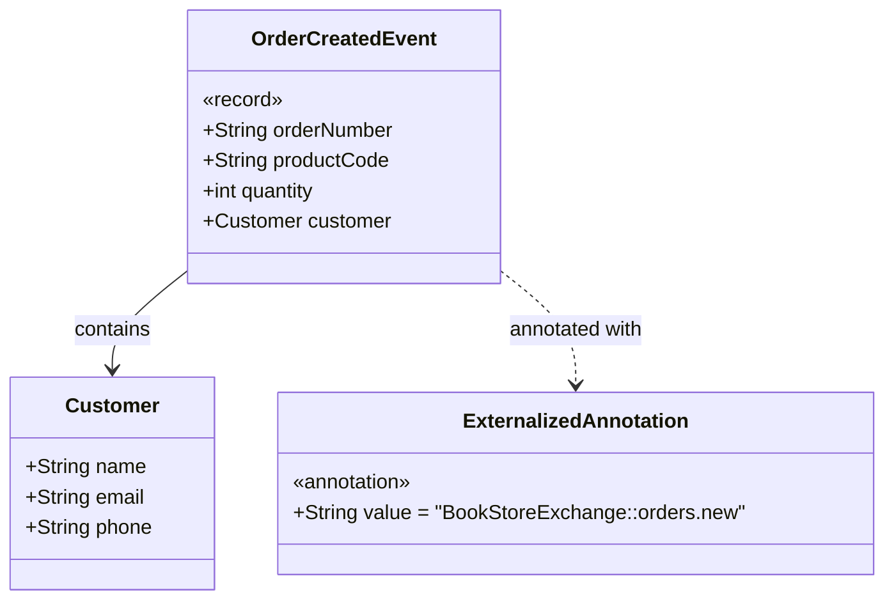
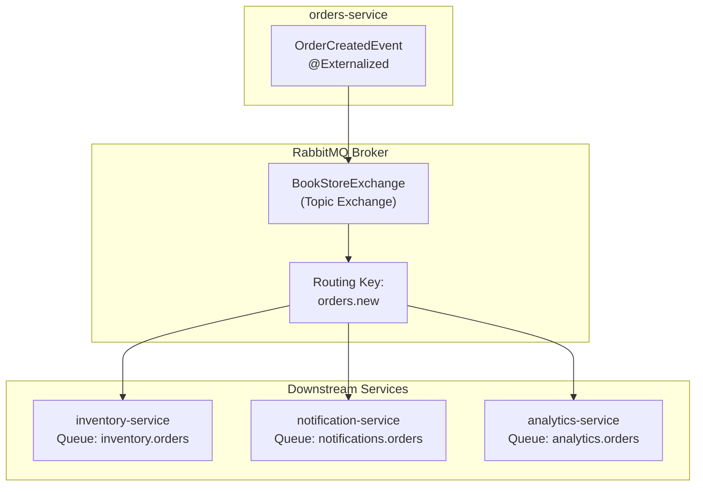

# Event Contracts

> **Relevant source files**
> * [src/main/java/com/sivalabs/bookstore/orders/api/events/OrderCreatedEvent.java](https://github.com/philipz/spring-modulith-orders/blob/eb506991/src/main/java/com/sivalabs/bookstore/orders/api/events/OrderCreatedEvent.java)
> * [src/main/java/com/sivalabs/bookstore/orders/api/events/package-info.java](https://github.com/philipz/spring-modulith-orders/blob/eb506991/src/main/java/com/sivalabs/bookstore/orders/api/events/package-info.java)

## Purpose and Scope

This document defines the event contracts published by the orders-service. Event contracts represent asynchronous messages that communicate order-related business events to external systems. These events are published through Spring Modulith's event externalization mechanism and routed to RabbitMQ for consumption by downstream services.

For information about how the event-driven architecture works internally, see [Event-Driven Architecture](/philipz/spring-modulith-orders/3.4-event-driven-architecture). For details about the domain models referenced in events, see [Domain Models](/philipz/spring-modulith-orders/4.4-domain-models). For implementation details of event publishing, see [Orders Service Implementation](/philipz/spring-modulith-orders/5.1-orders-service-implementation).

---

## Overview

The orders-service publishes domain events as part of its event-driven architecture. All published events are defined in the `order-api-events` named interface, which serves as a public contract for external consumers. The service uses Spring Modulith's `@Externalized` annotation to automatically route internal domain events to RabbitMQ for inter-service communication.

**Sources:** [src/main/java/com/sivalabs/bookstore/orders/api/events/package-info.java L1-L2](https://github.com/philipz/spring-modulith-orders/blob/eb506991/src/main/java/com/sivalabs/bookstore/orders/api/events/package-info.java#L1-L2)

---

## Named Interface: order-api-events

The `order-api-events` named interface is declared via the `package-info.java` file, marking this package as a public API boundary within the Spring Modulith architecture. This interface ensures that event contracts are explicitly exposed and versioned independently from internal implementation details.

```yaml
Package: com.sivalabs.bookstore.orders.api.events
Named Interface: order-api-events
```

The named interface pattern provides:

* **Explicit API boundaries** - Only types in this package are part of the public event contract
* **Versioning control** - Changes to events can be managed as contract evolution
* **Encapsulation** - Internal event structures remain hidden from consumers

**Sources:** [src/main/java/com/sivalabs/bookstore/orders/api/events/package-info.java L1-L2](https://github.com/philipz/spring-modulith-orders/blob/eb506991/src/main/java/com/sivalabs/bookstore/orders/api/events/package-info.java#L1-L2)

---

## Event: OrderCreatedEvent

### Event Structure



**Sources:** [src/main/java/com/sivalabs/bookstore/orders/api/events/OrderCreatedEvent.java L1-L8](https://github.com/philipz/spring-modulith-orders/blob/eb506991/src/main/java/com/sivalabs/bookstore/orders/api/events/OrderCreatedEvent.java#L1-L8)

### Field Definitions

| Field | Type | Description |
| --- | --- | --- |
| `orderNumber` | `String` | Unique identifier for the created order. This is the business key used to reference orders across systems. |
| `productCode` | `String` | The SKU or product identifier from the product catalog. Used to identify which product was ordered. |
| `quantity` | `int` | The number of units ordered. Must be a positive integer. |
| `customer` | `Customer` | Customer information including name, email, and phone. See [Domain Models](/philipz/spring-modulith-orders/4.4-domain-models) for the Customer structure. |

**Sources:** [src/main/java/com/sivalabs/bookstore/orders/api/events/OrderCreatedEvent.java L7](https://github.com/philipz/spring-modulith-orders/blob/eb506991/src/main/java/com/sivalabs/bookstore/orders/api/events/OrderCreatedEvent.java#L7-L7)

### @Externalized Configuration

The `OrderCreatedEvent` is annotated with `@Externalized("BookStoreExchange::orders.new")`, which instructs Spring Modulith to publish this event to an external message broker rather than keeping it internal.

**Annotation Breakdown:**

```
@Externalized("BookStoreExchange::orders.new")
              └─────┬─────┘   └─────┬─────┘
                Exchange          Routing Key
```

* **Exchange:** `BookStoreExchange` - The RabbitMQ topic exchange where the event is published
* **Routing Key:** `orders.new` - The routing key used for message routing within the exchange

External consumers can subscribe to the `BookStoreExchange` and bind queues with the `orders.new` routing key pattern to receive order creation notifications.

**Sources:** [src/main/java/com/sivalabs/bookstore/orders/api/events/OrderCreatedEvent.java L6](https://github.com/philipz/spring-modulith-orders/blob/eb506991/src/main/java/com/sivalabs/bookstore/orders/api/events/OrderCreatedEvent.java#L6-L6)

---

## Event Publication Flow

```mermaid
sequenceDiagram
  participant OrdersApiService
  participant Domain Layer
  participant Spring Modulith
  participant ApplicationEventPublisher
  participant Event Store
  participant (orders_events)
  participant @Externalized
  participant Event Externalization
  participant Spring AMQP
  participant RabbitMQ
  participant BookStoreExchange
  participant External Consumers

  OrdersApiService->>Domain Layer: createOrder(order)
  Domain Layer->>Domain Layer: persist order entity
  Domain Layer->>Spring Modulith: publishEvent(OrderCreatedEvent)
  Spring Modulith->>Event Store: store event (transactional)
  Event Store-->>Spring Modulith: event persisted
  Spring Modulith->>@Externalized: process @Externalized events
  @Externalized->>Spring AMQP: convert to AMQP message
  Spring AMQP->>RabbitMQ: publish to BookStoreExchange
  Domain Layer-->>OrdersApiService: routing key: orders.new
  RabbitMQ->>External Consumers: order created
  note over Event Store,BookStoreExchange: Events are stored transactionally
```

**Sources:** [src/main/java/com/sivalabs/bookstore/orders/api/events/OrderCreatedEvent.java L6-L7](https://github.com/philipz/spring-modulith-orders/blob/eb506991/src/main/java/com/sivalabs/bookstore/orders/api/events/OrderCreatedEvent.java#L6-L7)

---

## Event Contract Design Principles

### Immutability

The `OrderCreatedEvent` is implemented as a Java record, making it immutable by design. Once published, event data cannot be modified, ensuring consistency across all consumers.

### Minimal Payload

The event contains only essential information about the order creation:

* Order identifier (`orderNumber`) for correlation
* Product details (`productCode`, `quantity`) for fulfillment
* Customer information for notifications and shipping

This minimal design reduces coupling and allows consumers to fetch additional details from the orders-service REST API if needed.

### Backward Compatibility

When evolving event contracts:

* Add new optional fields rather than modifying existing fields
* Never remove or rename fields
* Use semantic versioning for major contract changes
* Consider creating new event types (e.g., `OrderCreatedEventV2`) for breaking changes

**Sources:** [src/main/java/com/sivalabs/bookstore/orders/api/events/OrderCreatedEvent.java L7](https://github.com/philipz/spring-modulith-orders/blob/eb506991/src/main/java/com/sivalabs/bookstore/orders/api/events/OrderCreatedEvent.java#L7-L7)

---

## RabbitMQ Exchange Configuration



### Exchange Details

| Property | Value |
| --- | --- |
| Name | `BookStoreExchange` |
| Type | Topic Exchange |
| Durability | Durable (survives broker restart) |
| Auto-delete | No |

### Routing Pattern

The `orders.new` routing key allows consumers to:

* Subscribe to all order events with pattern `orders.*`
* Subscribe to all events with pattern `#`
* Filter specific order event types as new events are added (e.g., `orders.updated`, `orders.cancelled`)

**Sources:** [src/main/java/com/sivalabs/bookstore/orders/api/events/OrderCreatedEvent.java L6](https://github.com/philipz/spring-modulith-orders/blob/eb506991/src/main/java/com/sivalabs/bookstore/orders/api/events/OrderCreatedEvent.java#L6-L6)

---

## Event Storage and Reliability

Spring Modulith stores all published events in a persistent event store before externalization. This provides:

1. **Transactional Guarantees** - Events are stored in the same transaction as domain entity changes
2. **Replay Capability** - Failed event publications can be retried from the event store
3. **Audit Trail** - Complete history of all published events
4. **At-Least-Once Delivery** - Events are externalized asynchronously, with retries on failure

The event store schema is located in the `orders_events` database schema. See [Event-Driven Architecture](/philipz/spring-modulith-orders/3.4-event-driven-architecture) for more details on event persistence.

**Sources:** [src/main/java/com/sivalabs/bookstore/orders/api/events/OrderCreatedEvent.java L6](https://github.com/philipz/spring-modulith-orders/blob/eb506991/src/main/java/com/sivalabs/bookstore/orders/api/events/OrderCreatedEvent.java#L6-L6)

---

## Integration Examples

### Consuming OrderCreatedEvent

External services can consume `OrderCreatedEvent` by:

1. **Creating a RabbitMQ queue** bound to `BookStoreExchange` with routing key pattern `orders.new` or `orders.*`
2. **Deserializing the message** into a compatible data structure matching the event fields
3. **Processing the event** based on business requirements (e.g., update inventory, send notifications, log analytics)

### Example Queue Configuration

```yaml
Exchange: BookStoreExchange
Queue: inventory-service.orders
Binding: orders.new
```

### Example Message Format

When `OrderCreatedEvent` is published to RabbitMQ, it is serialized as JSON:

```json
{
  "orderNumber": "ORDER-2024-001",
  "productCode": "BOOK-12345",
  "quantity": 2,
  "customer": {
    "name": "John Doe",
    "email": "john.doe@example.com",
    "phone": "+1234567890"
  }
}
```

**Sources:** [src/main/java/com/sivalabs/bookstore/orders/api/events/OrderCreatedEvent.java L7](https://github.com/philipz/spring-modulith-orders/blob/eb506991/src/main/java/com/sivalabs/bookstore/orders/api/events/OrderCreatedEvent.java#L7-L7)

---

## Future Event Contracts

The `order-api-events` named interface is designed to accommodate additional events as the system evolves. Potential future events include:

* `OrderUpdatedEvent` - Published when order details are modified
* `OrderCancelledEvent` - Published when an order is cancelled
* `OrderShippedEvent` - Published when an order is shipped
* `OrderDeliveredEvent` - Published when an order is delivered

All future events will follow the same pattern:

* Defined as immutable Java records
* Annotated with `@Externalized` for RabbitMQ publication
* Included in the `order-api-events` named interface package
* Documented in this Event Contracts page

**Sources:** [src/main/java/com/sivalabs/bookstore/orders/api/events/package-info.java L1-L2](https://github.com/philipz/spring-modulith-orders/blob/eb506991/src/main/java/com/sivalabs/bookstore/orders/api/events/package-info.java#L1-L2)