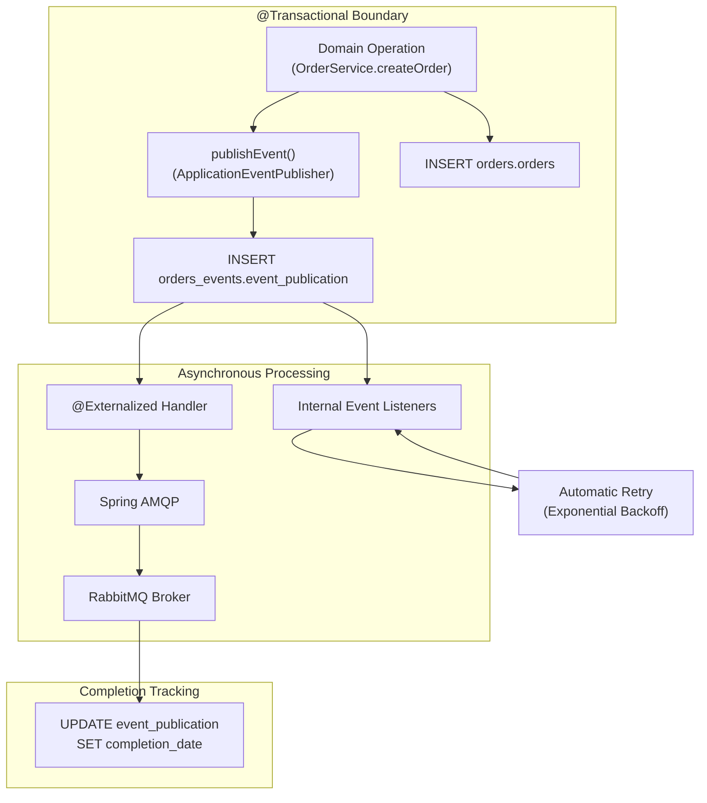
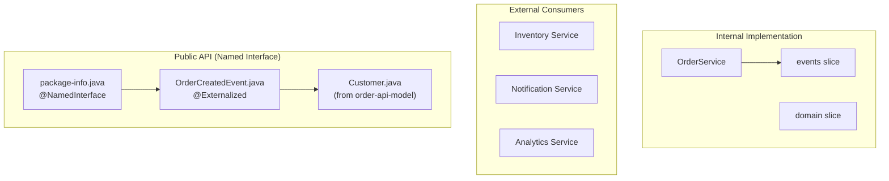
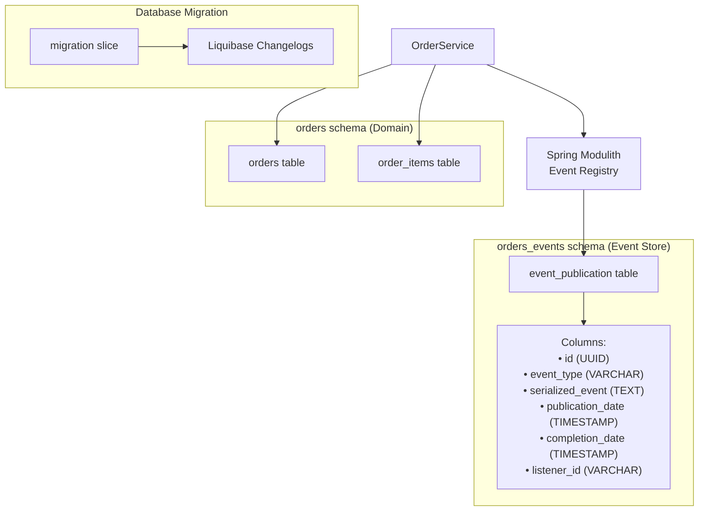

# Event-Driven Architecture

> **Relevant source files**
> * [AGENTS.md](https://github.com/philipz/spring-modulith-orders/blob/eb506991/AGENTS.md)
> * [pom.xml](https://github.com/philipz/spring-modulith-orders/blob/eb506991/pom.xml)
> * [src/main/java/com/sivalabs/bookstore/orders/api/events/OrderCreatedEvent.java](https://github.com/philipz/spring-modulith-orders/blob/eb506991/src/main/java/com/sivalabs/bookstore/orders/api/events/OrderCreatedEvent.java)
> * [src/main/java/com/sivalabs/bookstore/orders/api/events/package-info.java](https://github.com/philipz/spring-modulith-orders/blob/eb506991/src/main/java/com/sivalabs/bookstore/orders/api/events/package-info.java)

## Purpose and Scope

This document explains the event-driven architecture implementation in orders-service using Spring Modulith. It covers event publication patterns, the `@Externalized` annotation for AMQP integration, JDBC-based event store persistence, transactional guarantees, and the `OrderCreatedEvent` publishing mechanism. For general system architecture, see [System Architecture](/philipz/spring-modulith-orders/3.1-system-architecture). For API layer design patterns, see [API Layer Design](/philipz/spring-modulith-orders/3.3-api-layer-design).

---

## Overview

The orders-service implements event-driven communication using Spring Modulith's event publication registry and externalization capabilities. Domain events are published transactionally within the same database transaction as business state changes, then asynchronously externalized to RabbitMQ for consumption by external services. This architecture provides:

* **Transactional consistency**: Events are persisted atomically with domain changes
* **Guaranteed delivery**: Failed publications are automatically retried
* **Audit trail**: Complete event history stored in `orders_events` schema
* **Loose coupling**: External services consume events via RabbitMQ without direct dependencies

**Key Components:**

| Component | Implementation | Purpose |
| --- | --- | --- |
| Event Registry | `spring-modulith-starter-jdbc` | JDBC-based event store for transactional persistence |
| Event Externalization | `spring-modulith-events-amqp` | Routes events to RabbitMQ message broker |
| Message Broker | RabbitMQ | Distributes events to external consumers |
| Event Contracts | `order-api-events` named interface | Public API for event schemas |

Sources: [pom.xml L129-L156](https://github.com/philipz/spring-modulith-orders/blob/eb506991/pom.xml#L129-L156)

 [src/main/java/com/sivalabs/bookstore/orders/api/events/package-info.java L1-L3](https://github.com/philipz/spring-modulith-orders/blob/eb506991/src/main/java/com/sivalabs/bookstore/orders/api/events/package-info.java#L1-L3)

---

## Spring Modulith Event System

### Event Publication Registry

Spring Modulith provides a JDBC-based event publication registry that stores domain events transactionally. When `ApplicationEventPublisher.publishEvent()` is called within a transaction, Spring Modulith:

1. Persists the event to the `orders_events.event_publication` table
2. Commits both the domain state change and event record atomically
3. Asynchronously processes the event after transaction completion
4. Marks the event as completed in the registry
5. Retries failed publications automatically



**Event Store Schema:**

The `orders_events.event_publication` table stores all published events with the following key fields:

| Column | Type | Purpose |
| --- | --- | --- |
| `id` | UUID | Unique event identifier |
| `event_type` | VARCHAR | Fully qualified class name of the event |
| `serialized_event` | TEXT | JSON serialization of the event payload |
| `publication_date` | TIMESTAMP | When the event was published |
| `completion_date` | TIMESTAMP | When externalization completed (NULL if pending) |
| `listener_id` | VARCHAR | Identifies the externalization handler |

Sources: [pom.xml L138-L141](https://github.com/philipz/spring-modulith-orders/blob/eb506991/pom.xml#L138-L141)

 High-level Diagram 5

---

## Event Externalization with @Externalized

### The @Externalized Annotation

The `@Externalized` annotation marks domain events for publication to external message brokers. This annotation is applied to event records at the class level and specifies the routing destination.

```
@Externalized("BookStoreExchange::orders.new")
public record OrderCreatedEvent(String orderNumber, String productCode, int quantity, Customer customer) {}
```

**Annotation Format:** `"ExchangeName::RoutingKey"`

* **Exchange**: `BookStoreExchange` - RabbitMQ topic exchange
* **Routing Key**: `orders.new` - Routes to queues bound to this pattern

When Spring Modulith detects an `@Externalized` event in the event publication registry, it:

1. Serializes the event to JSON
2. Publishes to the specified RabbitMQ exchange with the routing key
3. Marks the event as completed in the registry upon successful acknowledgment
4. Retries on failure with exponential backoff

Sources: [src/main/java/com/sivalabs/bookstore/orders/api/events/OrderCreatedEvent.java L1-L8](https://github.com/philipz/spring-modulith-orders/blob/eb506991/src/main/java/com/sivalabs/bookstore/orders/api/events/OrderCreatedEvent.java#L1-L8)

### AMQP Integration

The `spring-modulith-events-amqp` runtime dependency provides automatic AMQP externalization. The integration:

* Detects `@Externalized` events from the event publication registry
* Uses Spring AMQP's `RabbitTemplate` for message publishing
* Configures message converters for JSON serialization
* Handles connection failures with the broker
* Provides delivery confirmations back to the event registry

**Configuration Requirements:**

| Property | Purpose | Example Value |
| --- | --- | --- |
| `spring.rabbitmq.host` | RabbitMQ broker hostname | `localhost` |
| `spring.rabbitmq.port` | AMQP port | `5672` |
| `spring.rabbitmq.username` | Authentication username | `guest` |
| `spring.rabbitmq.password` | Authentication password | `guest` |

The `BookStoreExchange` must be pre-created as a topic exchange in RabbitMQ. External services bind queues to this exchange with routing patterns like `orders.*` or `orders.new` to receive order events.

Sources: [pom.xml L142-L146](https://github.com/philipz/spring-modulith-orders/blob/eb506991/pom.xml#L142-L146)

 [src/main/java/com/sivalabs/bookstore/orders/api/events/OrderCreatedEvent.java L6](https://github.com/philipz/spring-modulith-orders/blob/eb506991/src/main/java/com/sivalabs/bookstore/orders/api/events/OrderCreatedEvent.java#L6-L6)

---

## Event Contracts via Named Interfaces

### Named Interface Pattern

Event contracts are exposed as a Spring Modulith named interface, making them part of the public API that external modules can depend on. This follows the Named Interface pattern for explicit API boundaries.



**Named Interface Declaration:**

The `package-info.java` file declares the `order-api-events` named interface:

```go
@org.springframework.modulith.NamedInterface("order-api-events")
package com.sivalabs.bookstore.orders.api.events;
```

This declaration means:

* External modules can explicitly depend on `order-api-events`
* Spring Modulith enforces architectural boundaries at build time
* Only classes in this package are part of the public event contract
* Internal event classes in other packages remain hidden

### Event Schema

The `OrderCreatedEvent` record defines the contract for order creation events:

```python
public record OrderCreatedEvent(
    String orderNumber,    // Unique order identifier
    String productCode,    // Product SKU
    int quantity,         // Quantity ordered
    Customer customer     // Customer details (from order-api-model)
)
```

**Fields:**

| Field | Type | Purpose | Source |
| --- | --- | --- | --- |
| `orderNumber` | `String` | Unique order identifier generated by the system | Order entity |
| `productCode` | `String` | Product SKU from the catalog | OrderItem entity |
| `quantity` | `int` | Quantity of items ordered | OrderItem entity |
| `customer` | `Customer` | Customer information including name, email, phone, address | Order entity |

The `Customer` type is imported from the `order-api-model` named interface, demonstrating cross-interface dependencies within the public API.

Sources: [src/main/java/com/sivalabs/bookstore/orders/api/events/OrderCreatedEvent.java L1-L8](https://github.com/philipz/spring-modulith-orders/blob/eb506991/src/main/java/com/sivalabs/bookstore/orders/api/events/OrderCreatedEvent.java#L1-L8)

 [src/main/java/com/sivalabs/bookstore/orders/api/events/package-info.java L1-L3](https://github.com/philipz/spring-modulith-orders/blob/eb506991/src/main/java/com/sivalabs/bookstore/orders/api/events/package-info.java#L1-L3)

---

## Event Publishing Flow

### End-to-End Sequence

```

```

### Publishing Process Steps

1. **Transaction Initiation**: `OrderService.createOrder()` begins a database transaction
2. **Domain Persistence**: Order entity is saved to `orders.orders` table
3. **Event Publication**: `ApplicationEventPublisher.publishEvent(OrderCreatedEvent)` is called
4. **Event Storage**: Spring Modulith intercepts the event and writes to `orders_events.event_publication`
5. **Transaction Commit**: Both domain and event changes are committed atomically
6. **Asynchronous Processing**: Spring Modulith's event processor queries for pending events
7. **Externalization Detection**: Processor detects `@Externalized` annotation on `OrderCreatedEvent`
8. **AMQP Publishing**: Event is serialized and published to RabbitMQ via `RabbitTemplate`
9. **Completion Marking**: Upon successful AMQP acknowledgment, event is marked as completed
10. **Retry Handling**: If AMQP publishing fails, the event remains in pending state for retry

Sources: High-level Diagram 5, [src/main/java/com/sivalabs/bookstore/orders/api/events/OrderCreatedEvent.java L1-L8](https://github.com/philipz/spring-modulith-orders/blob/eb506991/src/main/java/com/sivalabs/bookstore/orders/api/events/OrderCreatedEvent.java#L1-L8)

---

## Event Store and Persistence

### Database Schema Structure

The Spring Modulith event store uses a dedicated schema for isolation:



**Event Lifecycle States:**

| State | `completion_date` | Description |
| --- | --- | --- |
| Pending | `NULL` | Event persisted but not yet externalized |
| Processing | `NULL` | Event being processed by externalization handler |
| Completed | `TIMESTAMP` | Successfully externalized to RabbitMQ |
| Failed (Retry) | `NULL` | Processing failed, will be retried |

The event store provides several key benefits:

* **Auditability**: Complete history of all published events
* **Replay Capability**: Events can be republished if external systems need reprocessing
* **Transactional Safety**: No events are lost even if the application crashes
* **Monitoring**: Query pending events to detect processing delays or failures

Sources: [pom.xml L138-L141](https://github.com/philipz/spring-modulith-orders/blob/eb506991/pom.xml#L138-L141)

 High-level Diagram 5

---

## Configuration

### Application Properties

Event-driven behavior is configured through Spring Boot properties:

```css
# RabbitMQ Connection
spring.rabbitmq.host=${SPRING_RABBITMQ_HOST:localhost}
spring.rabbitmq.port=${SPRING_RABBITMQ_PORT:5672}
spring.rabbitmq.username=${SPRING_RABBITMQ_USERNAME:guest}
spring.rabbitmq.password=${SPRING_RABBITMQ_PASSWORD:guest}

# Spring Modulith Event Store
spring.modulith.events.jdbc.schema-initialization.enabled=true
```

**Environment Variables:**

| Variable | Purpose | Default |
| --- | --- | --- |
| `SPRING_RABBITMQ_HOST` | RabbitMQ broker hostname | `localhost` |
| `SPRING_RABBITMQ_PORT` | AMQP protocol port | `5672` |
| `SPRING_RABBITMQ_USERNAME` | Authentication username | `guest` |
| `SPRING_RABBITMQ_PASSWORD` | Authentication password | `guest` |

### Maven Dependencies

The event-driven architecture requires these dependencies:

```xml
<!-- Spring Modulith Core -->
<dependency>
    <groupId>org.springframework.modulith</groupId>
    <artifactId>spring-modulith-starter-core</artifactId>
</dependency>

<!-- JDBC-based Event Store -->
<dependency>
    <groupId>org.springframework.modulith</groupId>
    <artifactId>spring-modulith-starter-jdbc</artifactId>
</dependency>

<!-- AMQP Externalization -->
<dependency>
    <groupId>org.springframework.modulith</groupId>
    <artifactId>spring-modulith-events-amqp</artifactId>
    <scope>runtime</scope>
</dependency>

<!-- RabbitMQ Client -->
<dependency>
    <groupId>org.springframework.boot</groupId>
    <artifactId>spring-boot-starter-amqp</artifactId>
</dependency>
```

The `spring-modulith-events-amqp` dependency is runtime-scoped because it provides automatic externalization without requiring code changes to the event publishing logic.

Sources: [pom.xml L129-L146](https://github.com/philipz/spring-modulith-orders/blob/eb506991/pom.xml#L129-L146)

 [AGENTS.md L34-L37](https://github.com/philipz/spring-modulith-orders/blob/eb506991/AGENTS.md#L34-L37)

---

## Testing Event Publication

### Schema Tests

Event contracts should be validated with schema tests to detect breaking changes:

```python
// Example pattern from AGENTS.md
@Test
void orderCreatedEventSchemaTest() {
    // Verify event structure matches expected schema
    // Prevents accidental changes to public contracts
}
```

Tests should verify:

* Event field names and types remain stable
* `@Externalized` routing configuration is correct
* JSON serialization produces expected output
* Event can be deserialized by consumers

### Integration Testing

Integration tests should use Testcontainers to verify end-to-end event flow:

1. Start PostgreSQL container for event store
2. Start RabbitMQ container for message broker
3. Publish domain event through service layer
4. Query `event_publication` table to verify persistence
5. Consume message from RabbitMQ queue to verify externalization
6. Verify `completion_date` is set after successful delivery

The `awaitility` library (available in test scope) can be used to handle asynchronous event processing timing.

Sources: [AGENTS.md L22-L27](https://github.com/philipz/spring-modulith-orders/blob/eb506991/AGENTS.md#L22-L27)

 [pom.xml L233-L237](https://github.com/philipz/spring-modulith-orders/blob/eb506991/pom.xml#L233-L237)