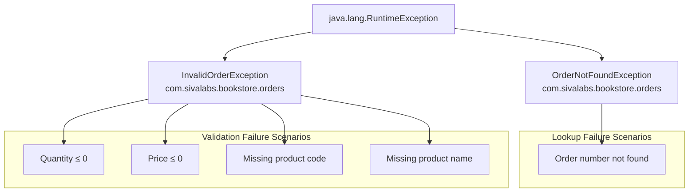

# Exception Handling

> **Relevant source files**
> * [src/main/java/com/sivalabs/bookstore/orders/InvalidOrderException.java](https://github.com/philipz/spring-modulith-orders/blob/eb506991/src/main/java/com/sivalabs/bookstore/orders/InvalidOrderException.java)
> * [src/main/java/com/sivalabs/bookstore/orders/OrderNotFoundException.java](https://github.com/philipz/spring-modulith-orders/blob/eb506991/src/main/java/com/sivalabs/bookstore/orders/OrderNotFoundException.java)
> * [src/main/java/com/sivalabs/bookstore/orders/OrdersApiService.java](https://github.com/philipz/spring-modulith-orders/blob/eb506991/src/main/java/com/sivalabs/bookstore/orders/OrdersApiService.java)

## Purpose and Scope

This document describes the exception handling strategy used in the orders-service, including custom exception types, their usage patterns, and how errors propagate through the application layers. The focus is on domain-level and validation exceptions rather than infrastructure or framework-level exceptions.

For information about resilience patterns and circuit breaker error handling, see [Resilience and Fault Tolerance](/philipz/spring-modulith-orders/3.5-resilience-and-fault-tolerance). For API-level validation constraints, see [Request and Response Models](/philipz/spring-modulith-orders/4.3-request-and-response-models).

## Exception Strategy Overview

The orders-service employs a focused exception handling approach with two custom runtime exceptions that represent specific business and validation failure scenarios:

| Exception Type | Purpose | Thrown From | Recovery Action |
| --- | --- | --- | --- |
| `InvalidOrderException` | Business rule or validation failures during order creation | API layer validation | Return 400 Bad Request with validation message |
| `OrderNotFoundException` | Order lookup failures when order does not exist | Domain layer queries | Return 404 Not Found |

Both exceptions extend `RuntimeException`, allowing them to propagate unchecked through the call stack. This design choice aligns with Spring's exception handling conventions where framework code (controllers, exception handlers) catches and translates runtime exceptions into appropriate HTTP responses.

**Sources:** [src/main/java/com/sivalabs/bookstore/orders/InvalidOrderException.java L1-L9](https://github.com/philipz/spring-modulith-orders/blob/eb506991/src/main/java/com/sivalabs/bookstore/orders/InvalidOrderException.java#L1-L9)

 [src/main/java/com/sivalabs/bookstore/orders/OrderNotFoundException.java L1-L13](https://github.com/philipz/spring-modulith-orders/blob/eb506991/src/main/java/com/sivalabs/bookstore/orders/OrderNotFoundException.java#L1-L13)

## Custom Exception Types

### InvalidOrderException

`InvalidOrderException` represents violations of business rules or validation constraints during order processing. It has a simple structure with a single constructor accepting a descriptive error message.

```yaml
Class: InvalidOrderException
Location: com.sivalabs.bookstore.orders package
Hierarchy: RuntimeException → InvalidOrderException
Constructor: InvalidOrderException(String message)
```

This exception is thrown when:

* Order item quantity is zero or negative
* Order item price is zero or negative
* Product code is null, empty, or whitespace-only
* Product name is null, empty, or whitespace-only

The exception message provides specific details about which validation rule was violated, enabling clients to display meaningful error feedback.

**Sources:** [src/main/java/com/sivalabs/bookstore/orders/InvalidOrderException.java L1-L9](https://github.com/philipz/spring-modulith-orders/blob/eb506991/src/main/java/com/sivalabs/bookstore/orders/InvalidOrderException.java#L1-L9)

### OrderNotFoundException

`OrderNotFoundException` represents scenarios where an order lookup by order number fails to find a matching record. This exception uses a static factory pattern to enforce consistent message formatting.

```yaml
Class: OrderNotFoundException
Location: com.sivalabs.bookstore.orders package
Hierarchy: RuntimeException → OrderNotFoundException
Factory Method: forOrderNumber(String orderNumber)
Private Constructor: OrderNotFoundException(String message)
```

The static factory method `forOrderNumber(String)` at [src/main/java/com/sivalabs/bookstore/orders/OrderNotFoundException.java L9-L11](https://github.com/philipz/spring-modulith-orders/blob/eb506991/src/main/java/com/sivalabs/bookstore/orders/OrderNotFoundException.java#L9-L11)

 creates instances with a standardized message format: `"Order not found with orderNumber: {orderNumber}"`. The private constructor prevents direct instantiation, ensuring all instances use the factory method's consistent messaging.

**Sources:** [src/main/java/com/sivalabs/bookstore/orders/OrderNotFoundException.java L1-L13](https://github.com/philipz/spring-modulith-orders/blob/eb506991/src/main/java/com/sivalabs/bookstore/orders/OrderNotFoundException.java#L1-L13)

## Exception Hierarchy



**Sources:** [src/main/java/com/sivalabs/bookstore/orders/InvalidOrderException.java L3](https://github.com/philipz/spring-modulith-orders/blob/eb506991/src/main/java/com/sivalabs/bookstore/orders/InvalidOrderException.java#L3-L3)

 [src/main/java/com/sivalabs/bookstore/orders/OrderNotFoundException.java L3](https://github.com/philipz/spring-modulith-orders/blob/eb506991/src/main/java/com/sivalabs/bookstore/orders/OrderNotFoundException.java#L3-L3)

## Usage Patterns in OrdersApiService

The primary exception throwing logic resides in `OrdersApiService`, specifically in the `validateOrderItem` method and the order creation flow.

### Validation Pipeline

The `createOrder` method at [src/main/java/com/sivalabs/bookstore/orders/OrdersApiService.java L29-L36](https://github.com/philipz/spring-modulith-orders/blob/eb506991/src/main/java/com/sivalabs/bookstore/orders/OrdersApiService.java#L29-L36)

 implements a multi-stage validation pipeline:

1. **Business Rule Validation**: Calls `validateOrderItem` to check domain constraints
2. **External Validation**: Invokes `productCatalogPort.validate()` to verify product existence and pricing
3. **Entity Conversion**: Proceeds with `OrderMapper.convertToEntity()` only after validation passes

### InvalidOrderException Throwing Points

The `validateOrderItem` method at [src/main/java/com/sivalabs/bookstore/orders/OrdersApiService.java L38-L51](https://github.com/philipz/spring-modulith-orders/blob/eb506991/src/main/java/com/sivalabs/bookstore/orders/OrdersApiService.java#L38-L51)

 contains four validation checks, each throwing `InvalidOrderException` with a specific message:

| Line | Validation Check | Exception Message |
| --- | --- | --- |
| [40](https://github.com/philipz/spring-modulith-orders/blob/eb506991/40) | `item.quantity() <= 0` | `"Quantity must be greater than 0"` |
| [43](https://github.com/philipz/spring-modulith-orders/blob/eb506991/43) | `item.price().compareTo(ZERO) <= 0` | `"Price must be greater than 0"` |
| [46](https://github.com/philipz/spring-modulith-orders/blob/eb506991/46) | `item.code() == null \|\| item.code().trim().isEmpty()` | `"Product code is required"` |
| [49](https://github.com/philipz/spring-modulith-orders/blob/eb506991/49) | `item.name() == null \|\| item.name().trim().isEmpty()` | `"Product name is required"` |

Each validation follows the fail-fast principle: if a check fails, an exception is immediately thrown with a descriptive message, halting further processing.

**Sources:** [src/main/java/com/sivalabs/bookstore/orders/OrdersApiService.java L29-L51](https://github.com/philipz/spring-modulith-orders/blob/eb506991/src/main/java/com/sivalabs/bookstore/orders/OrdersApiService.java#L29-L51)

## Exception Propagation Flow

```

```

**Sources:** [src/main/java/com/sivalabs/bookstore/orders/OrdersApiService.java L29-L51](https://github.com/philipz/spring-modulith-orders/blob/eb506991/src/main/java/com/sivalabs/bookstore/orders/OrdersApiService.java#L29-L51)

## Exception Usage by Layer

### API Layer (OrdersApiService)

The `OrdersApiService` class at [src/main/java/com/sivalabs/bookstore/orders/OrdersApiService.java L18](https://github.com/philipz/spring-modulith-orders/blob/eb506991/src/main/java/com/sivalabs/bookstore/orders/OrdersApiService.java#L18-L18)

 is the primary exception-throwing component:

* **Throws**: `InvalidOrderException` for business rule violations
* **Location**: `validateOrderItem` method [lines 38-51](https://github.com/philipz/spring-modulith-orders/blob/eb506991/lines 38-51)
* **Trigger**: Order creation requests with invalid item data
* **Pattern**: Explicit validation checks with fail-fast throwing

### Domain Layer (OrderService)

The `OrderService` component (referenced but not shown in provided files) is expected to:

* **Throw**: `OrderNotFoundException` when order lookups fail
* **Usage**: `findOrder(String orderNumber)` method
* **Pattern**: Static factory method `OrderNotFoundException.forOrderNumber(orderNumber)`

Example expected usage pattern:

```
return orderRepository.findByOrderNumber(orderNumber)
    .orElseThrow(() -> OrderNotFoundException.forOrderNumber(orderNumber));
```

### Presentation Layer (REST/gRPC Controllers)

Controllers in the `web` and `grpc` slices rely on framework exception handlers to catch and translate exceptions:

* **Catch**: Not directly caught in controllers
* **Translation**: Handled by `@ControllerAdvice` or gRPC exception interceptors
* **Response Mapping**: * `InvalidOrderException` → 400 Bad Request * `OrderNotFoundException` → 404 Not Found

**Sources:** [src/main/java/com/sivalabs/bookstore/orders/OrdersApiService.java L1-L76](https://github.com/philipz/spring-modulith-orders/blob/eb506991/src/main/java/com/sivalabs/bookstore/orders/OrdersApiService.java#L1-L76)

## Error Response Handling

While exception handler implementations are not shown in the provided files, the standard Spring exception handling approach maps runtime exceptions to HTTP status codes:

| Exception | HTTP Status | Response Body Pattern |
| --- | --- | --- |
| `InvalidOrderException` | 400 Bad Request | `{"error": "message from exception"}` |
| `OrderNotFoundException` | 404 Not Found | `{"error": "Order not found with orderNumber: ..."}` |
| Bean Validation Failures | 400 Bad Request | `{"errors": [field-level validation messages]}` |

The exception messages are designed to be client-facing, providing clear information about what went wrong without exposing internal system details.

## Exception Design Patterns

### Static Factory Pattern (OrderNotFoundException)

The `OrderNotFoundException` uses a static factory method to enforce consistent message formatting and prevent direct instantiation:

```java
// Factory method enforces message format
public static OrderNotFoundException forOrderNumber(String orderNumber)

// Private constructor prevents direct instantiation
private OrderNotFoundException(String message)
```

**Benefits:**

* Consistent error messages across the codebase
* Type-safe API (can't accidentally pass wrong parameters)
* Self-documenting code (method name describes the scenario)
* Extensible (additional factory methods can be added for other lookup types)

**Sources:** [src/main/java/com/sivalabs/bookstore/orders/OrderNotFoundException.java L5-L11](https://github.com/philipz/spring-modulith-orders/blob/eb506991/src/main/java/com/sivalabs/bookstore/orders/OrderNotFoundException.java#L5-L11)

### Fail-Fast Validation (InvalidOrderException)

The `validateOrderItem` method employs fail-fast validation where the first validation failure immediately throws an exception:

```
if (item.quantity() <= 0) {
    throw new InvalidOrderException("Quantity must be greater than 0");
}
if (item.price().compareTo(ZERO) <= 0) {
    throw new InvalidOrderException("Price must be greater than 0");
}
// ... subsequent checks only execute if previous ones pass
```

**Benefits:**

* Simple control flow (no complex nested conditions)
* Clear error messages (reports first problem encountered)
* Efficient (stops processing on first failure)
* Easy to unit test (one validation per test case)

**Sources:** [src/main/java/com/sivalabs/bookstore/orders/OrdersApiService.java L38-L51](https://github.com/philipz/spring-modulith-orders/blob/eb506991/src/main/java/com/sivalabs/bookstore/orders/OrdersApiService.java#L38-L51)

## Exception Handling Best Practices

### When to Throw InvalidOrderException

Throw `InvalidOrderException` when:

1. Business rules are violated (e.g., negative quantities, zero prices)
2. Required data is missing after Bean Validation passes
3. Data format is valid but semantically incorrect
4. Cross-field validation fails

Do not throw for:

* Null pointer scenarios (let NPE surface for true bugs)
* Infrastructure failures (use appropriate infrastructure exceptions)
* External service failures (let those exceptions propagate or wrap them)

### When to Throw OrderNotFoundException

Throw `OrderNotFoundException` when:

1. Order lookup by order number returns empty
2. Order exists but is logically deleted/archived and should not be accessible

Always use the factory method:

```
// Correct
throw OrderNotFoundException.forOrderNumber(orderNumber);

// Incorrect - bypasses factory method
throw new OrderNotFoundException("Order not found with orderNumber: " + orderNumber);
```

### Message Writing Guidelines

Exception messages should:

* Be specific about what failed (e.g., "Quantity must be greater than 0" not "Invalid quantity")
* Use business terminology (e.g., "order number" not "order ID")
* Avoid technical jargon (e.g., "required" not "cannot be null")
* Be suitable for display to end users
* Not include sensitive data (e.g., internal IDs, stack traces)

**Sources:** [src/main/java/com/sivalabs/bookstore/orders/OrdersApiService.java L38-L51](https://github.com/philipz/spring-modulith-orders/blob/eb506991/src/main/java/com/sivalabs/bookstore/orders/OrdersApiService.java#L38-L51)

 [src/main/java/com/sivalabs/bookstore/orders/OrderNotFoundException.java L9-L11](https://github.com/philipz/spring-modulith-orders/blob/eb506991/src/main/java/com/sivalabs/bookstore/orders/OrderNotFoundException.java#L9-L11)