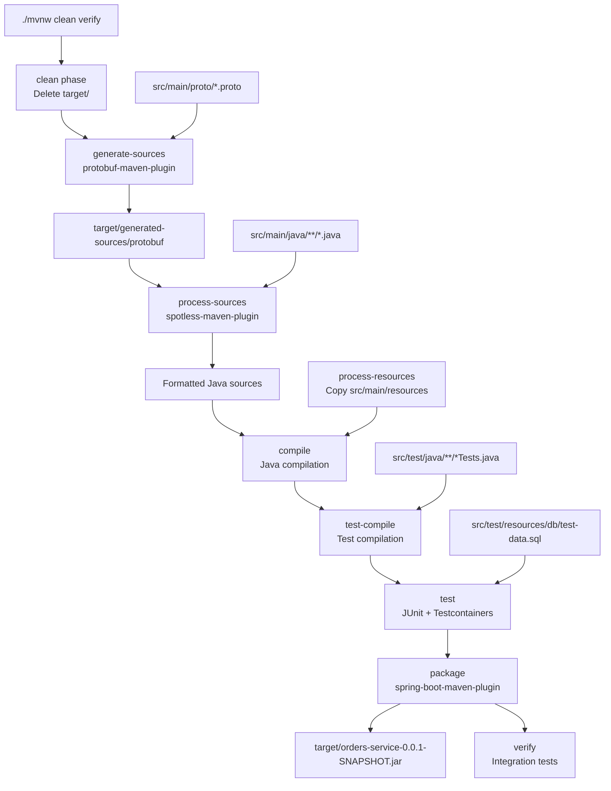
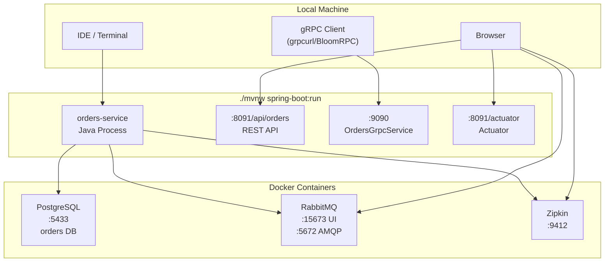
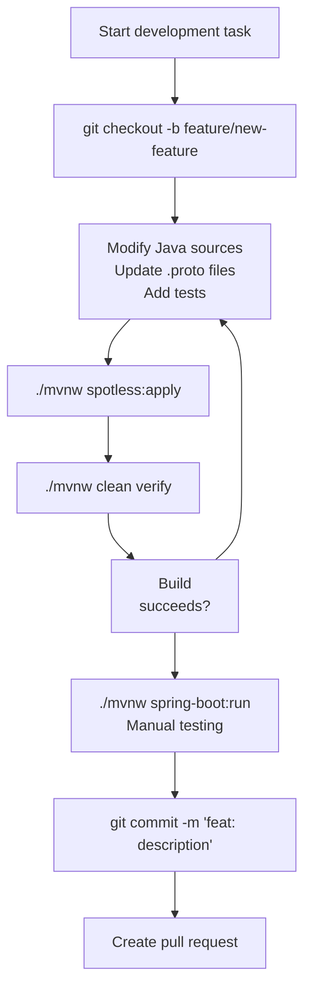

# Getting Started

> **Relevant source files**
> * [AGENTS.md](https://github.com/philipz/spring-modulith-orders/blob/eb506991/AGENTS.md)
> * [README.md](https://github.com/philipz/spring-modulith-orders/blob/eb506991/README.md)

This document guides developers through the initial setup, building, and running of the `orders-service` microservice. It covers prerequisite installation, the Maven build process, local execution options, and essential development workflows.

For detailed API documentation, see [REST API](/philipz/spring-modulith-orders/4.1-rest-api) and [gRPC API](/philipz/spring-modulith-orders/4.2-grpc-api). For deployment to production environments, see [Kubernetes Deployment](/philipz/spring-modulith-orders/6.2-kubernetes-deployment).

---

## Prerequisites and Environment Setup

The orders-service requires the following tools and runtime dependencies:

### Required Software

| Tool | Version | Purpose |
| --- | --- | --- |
| JDK | 21 | Java runtime and compilation |
| Docker | Latest | Runs Testcontainers for integration tests and local infrastructure |
| Maven | 3.9+ | Build automation (provided via wrapper) |

**Sources:** [README.md L12-L15](https://github.com/philipz/spring-modulith-orders/blob/eb506991/README.md#L12-L15)

 [AGENTS.md L13](https://github.com/philipz/spring-modulith-orders/blob/eb506991/AGENTS.md#L13-L13)

### Maven Wrapper

The repository includes a Maven Wrapper (`mvnw`/`mvnw.cmd`) that automatically downloads the correct Maven version. No separate Maven installation is required.

```markdown
# Linux/macOS
./mvnw --version

# Windows
mvnw.cmd --version
```

**Sources:** [README.md L15](https://github.com/philipz/spring-modulith-orders/blob/eb506991/README.md#L15-L15)

 [AGENTS.md L11-L14](https://github.com/philipz/spring-modulith-orders/blob/eb506991/AGENTS.md#L11-L14)

### Docker Configuration

Docker must be running before executing tests or starting local infrastructure. Integration tests use Testcontainers to provision PostgreSQL and RabbitMQ containers automatically.

Verify Docker is running:

```
docker ps
```

**Sources:** [README.md L14](https://github.com/philipz/spring-modulith-orders/blob/eb506991/README.md#L14-L14)

 [AGENTS.md L13](https://github.com/philipz/spring-modulith-orders/blob/eb506991/AGENTS.md#L13-L13)

---

## Building the Project

The build process includes code generation, formatting validation, compilation, and testing. The Maven lifecycle coordinates these phases.

### Build Pipeline Overview



**Sources:** [AGENTS.md L11](https://github.com/philipz/spring-modulith-orders/blob/eb506991/AGENTS.md#L11-L11)

 [README.md L18-L22](https://github.com/philipz/spring-modulith-orders/blob/eb506991/README.md#L18-L22)

### Standard Build Commands

| Command | Purpose | Duration |
| --- | --- | --- |
| `./mvnw clean verify` | Full build with all checks | ~2-3 minutes |
| `./mvnw compile` | Compile source code only | ~30 seconds |
| `./mvnw test` | Run unit and integration tests | ~1-2 minutes |
| `./mvnw package` | Create executable JAR | ~1 minute |
| `./mvnw spotless:apply` | Format code to Palantir style | ~10 seconds |

**Sources:** [AGENTS.md L11-L14](https://github.com/philipz/spring-modulith-orders/blob/eb506991/AGENTS.md#L11-L14)

 [README.md L18-L22](https://github.com/philipz/spring-modulith-orders/blob/eb506991/README.md#L18-L22)

### Code Generation from Protocol Buffers

The `protobuf-maven-plugin` generates Java stubs from `.proto` files during the `generate-sources` phase. Generated code appears in `target/generated-sources/protobuf/`.

```markdown
# Regenerate gRPC stubs after modifying .proto files
./mvnw clean generate-sources
```

gRPC contract definitions are located in [src/main/proto/](https://github.com/philipz/spring-modulith-orders/blob/eb506991/src/main/proto/)

**Sources:** [AGENTS.md L6](https://github.com/philipz/spring-modulith-orders/blob/eb506991/AGENTS.md#L6-L6)

 [README.md L7](https://github.com/philipz/spring-modulith-orders/blob/eb506991/README.md#L7-L7)

### Code Formatting with Spotless

The build enforces code formatting using Spotless with Palantir Java Format. Formatting violations fail the build during `verify`.

```markdown
# Check formatting without modifying files
./mvnw spotless:check

# Auto-format all Java sources
./mvnw spotless:apply
```

Formatting rules include:

* 4-space indentation
* No wildcard imports
* Ordered imports
* Consistent whitespace

**Sources:** [AGENTS.md L14-L18](https://github.com/philipz/spring-modulith-orders/blob/eb506991/AGENTS.md#L14-L18)

### Running Tests

Tests execute automatically during `./mvnw verify`. Testcontainers provisions PostgreSQL and RabbitMQ containers for integration tests.

```go
# Run all tests (requires Docker)
./mvnw test

# Run only unit tests (lightweight)
./mvnw -Dgroups=lightweight test

# Skip tests during build
./mvnw package -DskipTests
```

Test fixtures are loaded from [src/test/resources/db/test-data.sql](https://github.com/philipz/spring-modulith-orders/blob/eb506991/src/test/resources/db/test-data.sql)

 The `orders/support` package contains reusable test utilities.

**Sources:** [AGENTS.md L13-L24](https://github.com/philipz/spring-modulith-orders/blob/eb506991/AGENTS.md#L13-L24)

 [README.md L29-L31](https://github.com/philipz/spring-modulith-orders/blob/eb506991/README.md#L29-L31)

---

## Running Locally

The service can run in two modes: standalone via Spring Boot or containerized via Docker Compose.

### Development Environment Architecture



**Sources:** [AGENTS.md L12](https://github.com/philipz/spring-modulith-orders/blob/eb506991/AGENTS.md#L12-L12)

 [README.md L20](https://github.com/philipz/spring-modulith-orders/blob/eb506991/README.md#L20-L20)

### Standalone Execution with Spring Boot

Start the service using the Spring Boot Maven plugin. This mode uses default configuration from [src/main/resources/application.properties](https://github.com/philipz/spring-modulith-orders/blob/eb506991/src/main/resources/application.properties)

```
./mvnw spring-boot:run
```

The service binds to:

* **REST API:** `http://localhost:8091/api/orders`
* **gRPC API:** `localhost:9090`
* **Actuator:** `http://localhost:8091/actuator`

This mode expects infrastructure services (PostgreSQL, RabbitMQ) to be running separately, typically via Docker Compose.

**Sources:** [AGENTS.md L12](https://github.com/philipz/spring-modulith-orders/blob/eb506991/AGENTS.md#L12-L12)

 [README.md L20](https://github.com/philipz/spring-modulith-orders/blob/eb506991/README.md#L20-L20)

### Local Infrastructure with Docker Compose

The `docker-compose.yml` file provisions PostgreSQL, RabbitMQ, and Zipkin containers with consistent port mappings.

```markdown
# Start infrastructure services
docker-compose up -d

# Verify services are healthy
docker-compose ps

# View logs
docker-compose logs -f orders-service

# Stop all services
docker-compose down
```

Port assignments:

* **PostgreSQL:** 5433 (host) → 5432 (container)
* **RabbitMQ UI:** 15673 (host) → 15672 (container)
* **RabbitMQ AMQP:** 5672
* **Zipkin UI:** 9412 (host) → 9411 (container)
* **orders-service REST:** 8091
* **orders-service gRPC:** 9090

Access RabbitMQ management UI at `http://localhost:15673` (credentials: `guest`/`guest`).

**Sources:** [README.md L8](https://github.com/philipz/spring-modulith-orders/blob/eb506991/README.md#L8-L8)

### Environment Variable Overrides

Override default configuration using environment variables:

```javascript
# Custom database connection
export SPRING_DATASOURCE_URL=jdbc:postgresql://custom-host:5432/orders
export SPRING_DATASOURCE_USERNAME=custom_user
export SPRING_DATASOURCE_PASSWORD=custom_pass

# Custom RabbitMQ connection
export SPRING_RABBITMQ_HOST=custom-rabbitmq
export SPRING_RABBITMQ_PORT=5672

# Enable REST API (disabled by default)
export ORDERS_REST_ENABLED=true

# Run with custom configuration
./mvnw spring-boot:run
```

For the complete list of configuration options, see [Application Configuration](/philipz/spring-modulith-orders/8.1-application-configuration).

**Sources:** [AGENTS.md L35](https://github.com/philipz/spring-modulith-orders/blob/eb506991/AGENTS.md#L35-L35)

 [README.md L24-L27](https://github.com/philipz/spring-modulith-orders/blob/eb506991/README.md#L24-L27)

### Verifying the Running Service

Once started, verify the service is healthy:

```markdown
# Check health endpoint
curl http://localhost:8091/actuator/health

# List all orders (REST API, if enabled)
curl http://localhost:8091/api/orders

# Test gRPC endpoint
grpcurl -plaintext localhost:9090 list

# View Liquibase migration status
curl http://localhost:8091/actuator/liquibase
```

**Sources:** [AGENTS.md L36](https://github.com/philipz/spring-modulith-orders/blob/eb506991/AGENTS.md#L36-L36)

---

## Development Workflow

### Typical Development Cycle



**Sources:** [AGENTS.md L11-L32](https://github.com/philipz/spring-modulith-orders/blob/eb506991/AGENTS.md#L11-L32)

### Code Formatting Standards

The project uses Palantir Java Format enforced by Spotless. Always format code before committing:

```markdown
# Format all sources
./mvnw spotless:apply

# Verify formatting without changes
./mvnw spotless:check
```

**Formatting Rules:**

* 4-space indentation (not tabs)
* No wildcard imports (`import com.example.*`)
* Imports ordered alphabetically
* Consistent line breaks and whitespace

**Sources:** [AGENTS.md L14-L18](https://github.com/philipz/spring-modulith-orders/blob/eb506991/AGENTS.md#L14-L18)

### Naming Conventions

| Entity Type | Convention | Example |
| --- | --- | --- |
| Classes | PascalCase | `OrdersApiService` |
| Spring Beans | Descriptive names | `OrderMapper` |
| Configuration Classes | Suffix with `Config` | `CacheConfig` |
| Test Classes | Suffix with `Tests` or `IT` | `OrderServiceUnitTests`, `OrdersEndToEndIT` |
| Test Methods | Behavior statements | `shouldCreateOrderWhenValidRequest()` |
| REST Endpoints | Kebab-case paths | `/api/orders` |
| gRPC Services | PascalCase | `OrdersGrpcService` |

**Sources:** [AGENTS.md L19-L20](https://github.com/philipz/spring-modulith-orders/blob/eb506991/AGENTS.md#L19-L20)

### Commit Message Format

Use Conventional Commits format for clear, searchable history:

```
<type>(<scope>): <short description>

<optional body>

<optional footer>
```

**Types:**

* `feat:` - New feature
* `fix:` - Bug fix
* `chore:` - Maintenance task
* `docs:` - Documentation changes
* `test:` - Test additions or modifications
* `refactor:` - Code restructuring without functional changes

**Examples:**

```
git commit -m "feat(api): add pagination support to GET /api/orders"

git commit -m "fix(cache): handle Hazelcast connection failures gracefully"

git commit -m "chore(deps): upgrade Spring Boot to 3.5.1"
```

**Sources:** [AGENTS.md L29](https://github.com/philipz/spring-modulith-orders/blob/eb506991/AGENTS.md#L29-L29)

### Running Selective Tests

The test suite includes both fast unit tests and slower integration tests. Use Maven profiles to control test execution:

```markdown
# All tests (unit + integration)
./mvnw test

# Only lightweight tests
./mvnw -Dgroups=lightweight test

# Only integration tests
./mvnw -Dgroups=integration test

# Specific test class
./mvnw test -Dtest=OrderServiceUnitTests

# Specific test method
./mvnw test -Dtest=OrderServiceUnitTests#shouldCreateOrderWhenValidRequest
```

Integration tests require Docker for Testcontainers. Test fixtures are located in [src/test/resources/db/](https://github.com/philipz/spring-modulith-orders/blob/eb506991/src/test/resources/db/)

**Sources:** [AGENTS.md L23-L24](https://github.com/philipz/spring-modulith-orders/blob/eb506991/AGENTS.md#L23-L24)

 [README.md L30-L31](https://github.com/philipz/spring-modulith-orders/blob/eb506991/README.md#L30-L31)

### Pull Request Checklist

Before submitting a pull request:

1. ✅ Run full build: `./mvnw clean verify`
2. ✅ Format code: `./mvnw spotless:apply`
3. ✅ Verify tests pass: `./mvnw test`
4. ✅ Test locally: `./mvnw spring-boot:run`
5. ✅ Update `.proto` files if gRPC contracts changed
6. ✅ Add schema tests for new events (similar to [src/test/java/.../events/OrderCreatedEventSchemaTests.java](https://github.com/philipz/spring-modulith-orders/blob/eb506991/src/test/java/.../events/OrderCreatedEventSchemaTests.java) )
7. ✅ Document environment variables in [application.properties](https://github.com/philipz/spring-modulith-orders/blob/eb506991/application.properties)  if new configuration added
8. ✅ Update Liquibase changelogs in [src/main/resources/db/](https://github.com/philipz/spring-modulith-orders/blob/eb506991/src/main/resources/db/)  for schema changes
9. ✅ Write commit messages using Conventional Commits format

**Pull Request Description Template:**

```css
## Summary
Brief description of the change

## Affected Modules
- [ ] domain
- [ ] api
- [ ] web
- [ ] grpc
- [ ] events
- [ ] infrastructure
- [ ] cache

## Validation Commands
```bash
./mvnw test
curl -X POST http://localhost:8091/api/orders -d '{...}'
```

## Configuration Changes

* Added `ORDERS_NEW_FEATURE_ENABLED` (default: false)
* Updated RabbitMQ routing key: `orders.new` → `orders.created`

## Related Issues

Fixes #123

```xml
**Sources:** <FileRef file-url="https://github.com/philipz/spring-modulith-orders/blob/eb506991/AGENTS.md#L31-L32" min=31 max=32 file-path="AGENTS.md">Hii</FileRef>

### Module Structure and Component Placement

When adding new components, place them in the appropriate Spring Modulith slice:

| Slice | Location | Purpose |
|-------|----------|---------|
| `domain` | <FileRef file-url="https://github.com/philipz/spring-modulith-orders/blob/eb506991/src/main/java/.../orders/domain/" undefined  file-path="src/main/java/.../orders/domain/">Hii</FileRef> | Business logic, entities, domain services |
| `web` | <FileRef file-url="https://github.com/philipz/spring-modulith-orders/blob/eb506991/src/main/java/.../orders/web/" undefined  file-path="src/main/java/.../orders/web/">Hii</FileRef> | REST controllers, web configuration |
| `api` | <FileRef file-url="https://github.com/philipz/spring-modulith-orders/blob/eb506991/src/main/java/.../orders/api/" undefined  file-path="src/main/java/.../orders/api/">Hii</FileRef> | `OrdersApi` interface, `OrdersApiService` implementation |
| `grpc` | <FileRef file-url="https://github.com/philipz/spring-modulith-orders/blob/eb506991/src/main/java/.../orders/grpc/" undefined  file-path="src/main/java/.../orders/grpc/">Hii</FileRef> | gRPC service implementations |
| `events` | <FileRef file-url="https://github.com/philipz/spring-modulith-orders/blob/eb506991/src/main/java/.../orders/events/" undefined  file-path="src/main/java/.../orders/events/">Hii</FileRef> | Event publishing, `@Externalized` configuration |
| `infrastructure` | <FileRef file-url="https://github.com/philipz/spring-modulith-orders/blob/eb506991/src/main/java/.../orders/infrastructure/" undefined  file-path="src/main/java/.../orders/infrastructure/">Hii</FileRef> | Repositories, external clients, database access |
| `cache` | <FileRef file-url="https://github.com/philipz/spring-modulith-orders/blob/eb506991/src/main/java/.../orders/cache/" undefined  file-path="src/main/java/.../orders/cache/">Hii</FileRef> | `AbstractCacheService`, `CacheErrorHandler` |
| `migration` | <FileRef file-url="https://github.com/philipz/spring-modulith-orders/blob/eb506991/src/main/java/.../orders/migration/" undefined  file-path="src/main/java/.../orders/migration/">Hii</FileRef> | Liquibase configuration, backfill service |

Shared DTOs belong in <FileRef file-url="https://github.com/philipz/spring-modulith-orders/blob/eb506991/src/main/java/com/sivalabs/bookstore/common/" undefined  file-path="src/main/java/com/sivalabs/bookstore/common/">Hii</FileRef>

**Sources:** <FileRef file-url="https://github.com/philipz/spring-modulith-orders/blob/eb506991/AGENTS.md#L4-L5" min=4 max=5 file-path="AGENTS.md">Hii</FileRef> <FileRef file-url="https://github.com/philipz/spring-modulith-orders/blob/eb506991/README.md#L6-L6" min=6  file-path="README.md">Hii</FileRef>

---

## Quick Reference

### Essential Commands

```bash
# Initial setup
git clone <repository-url>
cd spring-modulith-orders
docker-compose up -d  # Start infrastructure

# Build and test
./mvnw clean verify   # Full build
./mvnw test           # Run tests
./mvnw spotless:apply # Format code

# Run locally
./mvnw spring-boot:run # Start service

# Verify service
curl http://localhost:8091/actuator/health
grpcurl -plaintext localhost:9090 list

# Stop infrastructure
docker-compose down
```

**Sources:** [AGENTS.md L11-L14](https://github.com/philipz/spring-modulith-orders/blob/eb506991/AGENTS.md#L11-L14)

 [README.md L18-L22](https://github.com/philipz/spring-modulith-orders/blob/eb506991/README.md#L18-L22)

### Port Reference

| Service | Port | Protocol | URL |
| --- | --- | --- | --- |
| REST API | 8091 | HTTP | `http://localhost:8091/api/orders` |
| gRPC API | 9090 | gRPC | `localhost:9090` |
| Actuator | 8091 | HTTP | `http://localhost:8091/actuator` |
| PostgreSQL | 5433 | PostgreSQL | `jdbc:postgresql://localhost:5433/orders` |
| RabbitMQ Management | 15673 | HTTP | `http://localhost:15673` |
| RabbitMQ AMQP | 5672 | AMQP | `amqp://localhost:5672` |
| Zipkin UI | 9412 | HTTP | `http://localhost:9412` |

**Sources:** [AGENTS.md L12](https://github.com/philipz/spring-modulith-orders/blob/eb506991/AGENTS.md#L12-L12)

 [README.md L20](https://github.com/philipz/spring-modulith-orders/blob/eb506991/README.md#L20-L20)

### Key File Locations

| File | Purpose |
| --- | --- |
| [src/main/proto/](https://github.com/philipz/spring-modulith-orders/blob/eb506991/src/main/proto/) | gRPC contract definitions |
| [src/main/resources/application.properties](https://github.com/philipz/spring-modulith-orders/blob/eb506991/src/main/resources/application.properties) | Default configuration |
| [src/main/resources/db/](https://github.com/philipz/spring-modulith-orders/blob/eb506991/src/main/resources/db/) | Liquibase database changelogs |
| [src/test/resources/db/](https://github.com/philipz/spring-modulith-orders/blob/eb506991/src/test/resources/db/) | Test data fixtures |
| [src/test/java/orders/support/](https://github.com/philipz/spring-modulith-orders/blob/eb506991/src/test/java/orders/support/) | Reusable test utilities |
| [scripts/rollback.sql](https://github.com/philipz/spring-modulith-orders/blob/eb506991/scripts/rollback.sql) | Manual rollback script |
| [docker-compose.yml](https://github.com/philipz/spring-modulith-orders/blob/eb506991/docker-compose.yml) | Local infrastructure definition |

**Sources:** [AGENTS.md L7-L8](https://github.com/philipz/spring-modulith-orders/blob/eb506991/AGENTS.md#L7-L8)

 [README.md L6-L10](https://github.com/philipz/spring-modulith-orders/blob/eb506991/README.md#L6-L10)