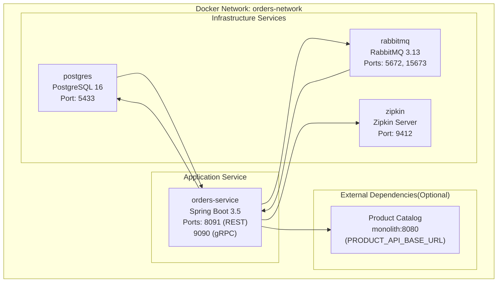
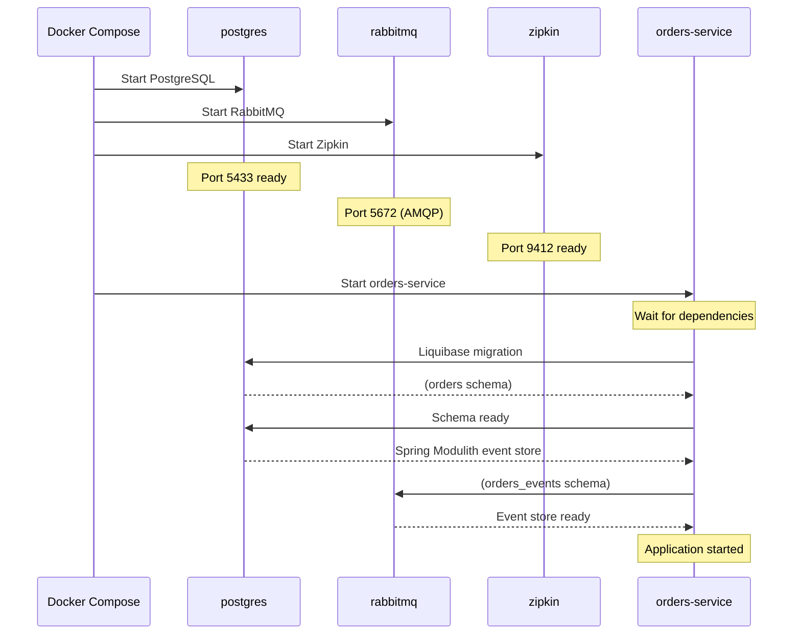
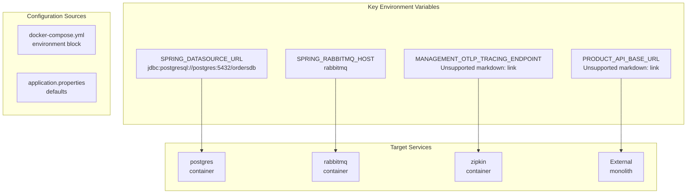
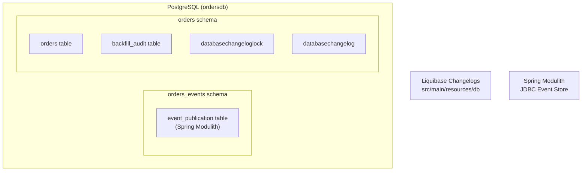
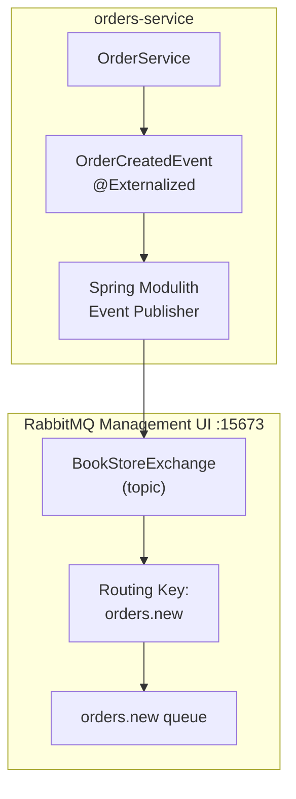
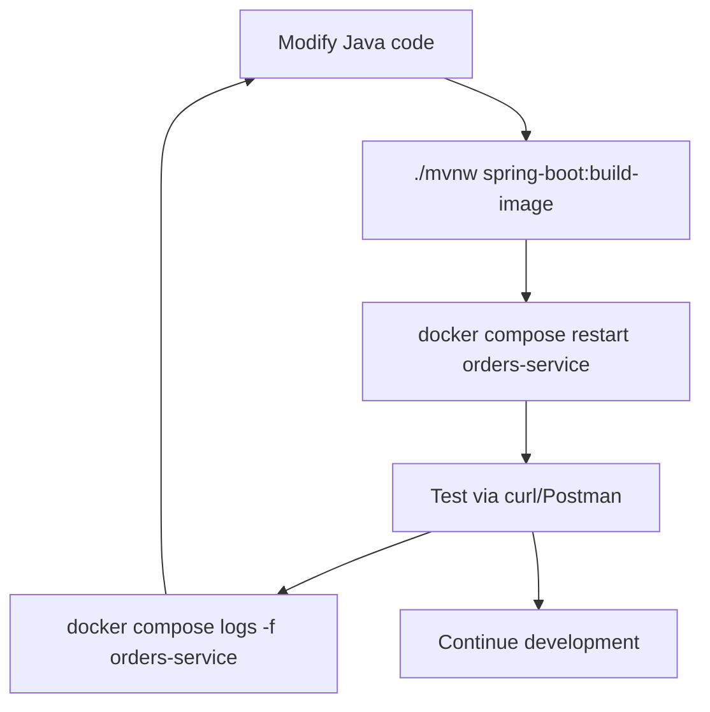

# Local Development with Docker Compose

> **Relevant source files**
> * [AGENTS.md](https://github.com/philipz/spring-modulith-orders/blob/eb506991/AGENTS.md)
> * [README-deployment.md](https://github.com/philipz/spring-modulith-orders/blob/eb506991/README-deployment.md)
> * [README.md](https://github.com/philipz/spring-modulith-orders/blob/eb506991/README.md)

## Purpose and Scope

This page explains how to run the `orders-service` locally using Docker Compose for development and testing. The Docker Compose stack provides a complete self-contained environment with all infrastructure dependencies (PostgreSQL, RabbitMQ, Zipkin, Hazelcast) and the orders-service itself.

For building the project and generating artifacts, see [Building the Project](/philipz/spring-modulith-orders/2.2-building-the-project). For Kubernetes deployment in staging or production environments, see [Kubernetes Deployment](/philipz/spring-modulith-orders/6.2-kubernetes-deployment). For configuring environment-specific settings, see [Application Configuration](/philipz/spring-modulith-orders/8.1-application-configuration) and [Environment Variables Reference](/philipz/spring-modulith-orders/8.3-environment-variables-reference).

**Sources:** [README-deployment.md L1-L33](https://github.com/philipz/spring-modulith-orders/blob/eb506991/README-deployment.md#L1-L33)

 [README.md L1-L37](https://github.com/philipz/spring-modulith-orders/blob/eb506991/README.md#L1-L37)

---

## Docker Compose Stack Architecture

The `docker-compose.yml` file at the repository root defines a multi-service stack that provides everything needed to run and test the orders-service locally. The stack includes:



**Service Dependencies:**

| Service | Image | Purpose | Depends On |
| --- | --- | --- | --- |
| `postgres` | `postgres:16-alpine` | Persistent storage for order data and event store | None |
| `rabbitmq` | `rabbitmq:3.13-management-alpine` | Event broker for `@Externalized` events | None |
| `zipkin` | `openzipkin/zipkin` | Distributed tracing collector and UI | None |
| `orders-service` | `philipz/orders-service:latest` | The orders microservice | `postgres`, `rabbitmq`, `zipkin` |

**Sources:** [README-deployment.md L16-L33](https://github.com/philipz/spring-modulith-orders/blob/eb506991/README-deployment.md#L16-L33)

 [Diagram 1 from high-level architecture](https://github.com/philipz/spring-modulith-orders/blob/eb506991/Diagram 1 from high-level architecture)

---

## Starting the Local Stack

### Prerequisites

Before starting the Docker Compose stack, ensure:

1. **Docker Engine** is installed and running (Docker Desktop or Docker CE)
2. **Docker Compose V2** is available (`docker compose version` should return 2.x or higher)
3. **Ports are available**: Ensure ports `5433`, `8091`, `9090`, `9412`, and `15673` are not in use by other processes

### Build the Container Image

The orders-service image must be built before starting the stack. From the repository root:

```
./mvnw -pl orders spring-boot:build-image \
  -Dspring-boot.build-image.imageName=philipz/orders-service:latest
```

This command uses Spring Boot's Cloud Native Buildpacks integration to create a production-ready container image without requiring a `Dockerfile`. The image is tagged as `philipz/orders-service:latest` and stored in the local Docker registry.

**Sources:** [README-deployment.md L5-L14](https://github.com/philipz/spring-modulith-orders/blob/eb506991/README-deployment.md#L5-L14)

### Start the Stack

Navigate to the project directory and start all services:

```
cd orders
docker compose up
```

To run in detached mode (background):

```
docker compose up -d
```

**Startup Sequence:**



The service logs will indicate when it's ready to accept requests:

```
orders-service | Started OrdersApplication in X.XXX seconds
orders-service | Exposing 2 endpoint(s) beneath base path '/actuator'
```

**Sources:** [README-deployment.md L16-L25](https://github.com/philipz/spring-modulith-orders/blob/eb506991/README-deployment.md#L16-L25)

 [AGENTS.md L12](https://github.com/philipz/spring-modulith-orders/blob/eb506991/AGENTS.md#L12-L12)

---

## Service Endpoints and Port Mappings

All services in the Docker Compose stack expose ports on `localhost` for easy access during development:

| Service | Internal Port | Host Port | Access URL | Purpose |
| --- | --- | --- | --- | --- |
| `orders-service` (REST) | 8091 | 8091 | `http://localhost:8091` | REST API endpoints |
| `orders-service` (gRPC) | 9090 | 9090 | `localhost:9090` | gRPC API endpoints |
| `orders-service` (Actuator) | 8091 | 8091 | `http://localhost:8091/actuator` | Health checks, metrics, modulith events |
| `postgres` | 5432 | 5433 | `localhost:5433` | Direct database access (ordersdb) |
| `rabbitmq` (AMQP) | 5672 | 5672 | `localhost:5672` | Message broker protocol |
| `rabbitmq` (Management) | 15672 | 15673 | `http://localhost:15673` | RabbitMQ admin UI (guest/guest) |
| `zipkin` | 9411 | 9412 | `http://localhost:9412` | Trace visualization UI |

### Testing Connectivity

After the stack starts, verify services are accessible:

```markdown
# Check service health
curl http://localhost:8091/actuator/health

# View available actuator endpoints
curl http://localhost:8091/actuator

# Check RabbitMQ management UI
open http://localhost:15673  # macOS
# or navigate to http://localhost:15673 in browser
# Login: guest / guest

# Check Zipkin UI
open http://localhost:9412

# Query PostgreSQL directly
psql -h localhost -p 5433 -U postgres -d ordersdb
# Password: postgres
```

**Sources:** [README-deployment.md L25-L31](https://github.com/philipz/spring-modulith-orders/blob/eb506991/README-deployment.md#L25-L31)

 [AGENTS.md L12](https://github.com/philipz/spring-modulith-orders/blob/eb506991/AGENTS.md#L12-L12)

---

## Environment Configuration

The Docker Compose stack applies default environment variables suitable for local development. These are defined in the `environment` section of the `orders-service` service definition.

### Default Environment Variables



### Customizing Configuration

To override environment variables without modifying `docker-compose.yml`, create a `.env` file in the same directory:

```markdown
# .env file
SPRING_PROFILES_ACTIVE=dev,debug
ORDERS_REST_ENABLED=true
BOOKSTORE_CACHE_STATS_LOGGING_ENABLED=true
PRODUCT_API_BASE_URL=http://host.docker.internal:8080
```

Alternatively, pass environment variables directly via the command line:

```
docker compose up -e ORDERS_REST_ENABLED=true -e SPRING_PROFILES_ACTIVE=dev
```

### Product Catalog Integration

The `PRODUCT_API_BASE_URL` environment variable defaults to `http://monolith:8080`, expecting a product catalog service to be available. If you don't have this service running, the orders-service will function but product validation via `ProductCatalogPort` will fail.

To point to a different product catalog service:

```javascript
# Point to a service on host machine
export PRODUCT_API_BASE_URL=http://host.docker.internal:8080

# Or disable product validation (requires code changes)
# See ProductCatalogPort interface for integration points
```

**Sources:** [README-deployment.md L25-L32](https://github.com/philipz/spring-modulith-orders/blob/eb506991/README-deployment.md#L25-L32)

 [AGENTS.md L35-L37](https://github.com/philipz/spring-modulith-orders/blob/eb506991/AGENTS.md#L35-L37)

 [README.md L24-L27](https://github.com/philipz/spring-modulith-orders/blob/eb506991/README.md#L24-L27)

---

## Managing the Stack

### Viewing Logs

View logs for all services:

```
docker compose logs -f
```

View logs for a specific service:

```
docker compose logs -f orders-service
docker compose logs -f postgres
docker compose logs -f rabbitmq
```

### Stopping the Stack

Stop all services while preserving data volumes:

```
docker compose down
```

Stop services and remove volumes (deletes database data):

```
docker compose down -v
```

### Restarting Individual Services

Restart only the orders-service after making code changes:

```markdown
# Rebuild the image
./mvnw spring-boot:build-image -Dspring-boot.build-image.imageName=philipz/orders-service:latest

# Restart the service
docker compose restart orders-service

# Or recreate the service
docker compose up -d --force-recreate orders-service
```

### Inspecting Container State

```markdown
# List running containers
docker compose ps

# Execute commands inside a container
docker compose exec postgres psql -U postgres -d ordersdb
docker compose exec orders-service /bin/bash

# View resource usage
docker compose stats
```

**Sources:** [README-deployment.md L33](https://github.com/philipz/spring-modulith-orders/blob/eb506991/README-deployment.md#L33-L33)

---

## Database Access and Schema Inspection

The PostgreSQL container is accessible on port `5433` with credentials defined in `docker-compose.yml`:

* **Host:** `localhost:5433`
* **Database:** `ordersdb`
* **Username:** `postgres`
* **Password:** `postgres`

### Liquibase Schema Structure

The orders-service uses Liquibase to manage two database schemas:



Connect and inspect the schema:

```sql
# Connect via psql
docker compose exec postgres psql -U postgres -d ordersdb

# List schemas
\dn

# List tables in orders schema
\dt orders.*

# List tables in orders_events schema
\dt orders_events.*

# View order data
SELECT order_number, customer_name, status, created_at 
FROM orders.orders 
ORDER BY created_at DESC 
LIMIT 10;

# View published events
SELECT id, event_type, serialized_event, completion_date
FROM orders_events.event_publication
ORDER BY publication_date DESC
LIMIT 5;
```

**Sources:** [README-deployment.md L58-L62](https://github.com/philipz/spring-modulith-orders/blob/eb506991/README-deployment.md#L58-L62)

 [Diagram 6 from high-level architecture](https://github.com/philipz/spring-modulith-orders/blob/eb506991/Diagram 6 from high-level architecture)

---

## Working with RabbitMQ Events

The orders-service publishes domain events to RabbitMQ using Spring Modulith's `@Externalized` annotation. Events are routed through the `BookStoreExchange` exchange.

### Accessing RabbitMQ Management UI

Navigate to `http://localhost:15673` and log in with credentials:

* **Username:** `guest`
* **Password:** `guest`

### Monitoring Event Publishing



To verify event publishing:

1. **Create an order** via REST API: ``` curl -X POST http://localhost:8091/api/orders \   -H "Content-Type: application/json" \   -d '{     "customer": {       "name": "John Doe",       "email": "john@example.com",       "phone": "555-1234"     },     "items": [       {"code": "P001", "name": "Book", "price": 29.99, "quantity": 2}     ]   }' ```
2. **Check RabbitMQ UI**: * Navigate to **Exchanges** → `BookStoreExchange` * View bindings and routing keys * Navigate to **Queues** → inspect message counts * Use **Get messages** to view message payload
3. **Check event store** in database: ```sql SELECT * FROM orders_events.event_publication  WHERE completion_date IS NOT NULL  ORDER BY publication_date DESC; ```

**Sources:** [Diagram 5 from high-level architecture](https://github.com/philipz/spring-modulith-orders/blob/eb506991/Diagram 5 from high-level architecture)

 [README-deployment.md L27-L29](https://github.com/philipz/spring-modulith-orders/blob/eb506991/README-deployment.md#L27-L29)

---

## Observability and Monitoring

### Actuator Endpoints

The orders-service exposes Spring Boot Actuator endpoints at `http://localhost:8091/actuator`:

| Endpoint | URL | Purpose |
| --- | --- | --- |
| Health | `/actuator/health` | Service health status |
| Info | `/actuator/info` | Application metadata |
| Metrics | `/actuator/metrics` | Micrometer metrics |
| Modulith | `/actuator/modulith` | Spring Modulith module structure |
| Beans | `/actuator/beans` | Spring beans listing |

Example requests:

```markdown
# Check health
curl http://localhost:8091/actuator/health | jq

# View metrics list
curl http://localhost:8091/actuator/metrics | jq

# View specific metric (e.g., JVM memory)
curl http://localhost:8091/actuator/metrics/jvm.memory.used | jq

# View Modulith module structure
curl http://localhost:8091/actuator/modulith | jq
```

### Zipkin Distributed Tracing

Zipkin is available at `http://localhost:9412`. The orders-service automatically exports trace data via OpenTelemetry.

**Using Zipkin UI:**

1. Navigate to `http://localhost:9412`
2. Click **Run Query** to view recent traces
3. Filter by service name: `orders-service`
4. Click on a trace to view the detailed span timeline
5. Inspect span annotations for: * Database queries * RabbitMQ publishing * gRPC/REST handler execution * Cache operations

**Sources:** [README-deployment.md L29](https://github.com/philipz/spring-modulith-orders/blob/eb506991/README-deployment.md#L29-L29)

 [Diagram 6 from high-level architecture](https://github.com/philipz/spring-modulith-orders/blob/eb506991/Diagram 6 from high-level architecture)

---

## Historical Order Backfill

The Docker Compose stack supports running the historical order backfill process to migrate legacy data from a monolith database. This is controlled via environment variables in the `orders-service` configuration.

### Enabling Backfill

To enable one-time backfill during service startup, set these environment variables in `docker-compose.yml` or a `.env` file:

```yaml
environment:
  ORDERS_BACKFILL_ENABLED: "true"
  ORDERS_BACKFILL_LOOKBACK_DAYS: "90"
  ORDERS_BACKFILL_RECORD_LIMIT: "500"
  ORDERS_BACKFILL_SOURCE_URL: "jdbc:postgresql://monolith-db:5432/postgres"
  ORDERS_BACKFILL_SOURCE_USERNAME: "postgres"
  ORDERS_BACKFILL_SOURCE_PASSWORD: "postgres"
```

### Monitoring Backfill Progress

Check the `backfill_audit` table for execution records:

```sql
SELECT * FROM orders.backfill_audit 
ORDER BY executed_at DESC;
```

The audit table records:

* `executed_at`: Timestamp of backfill run
* `records_processed`: Number of orders migrated
* `lookback_days`: Time window configuration
* `record_limit`: Maximum records per run
* `status`: Success or error state

### Rollback Migrated Data

If backfill needs to be reversed, use the provided rollback script:

```python
# Get audit ID from backfill_audit table
docker compose exec postgres psql -U postgres -d ordersdb \
  -c "SELECT id, executed_at, records_processed FROM orders.backfill_audit;"

# Execute rollback for specific audit ID
docker compose exec postgres psql -U postgres -d ordersdb \
  -f /scripts/rollback.sql \
  -v audit_id=<AUDIT_ID>
```

**Important:** Disable backfill after successful migration by setting `ORDERS_BACKFILL_ENABLED=false` to prevent re-running on subsequent restarts.

**Sources:** [README-deployment.md L63-L83](https://github.com/philipz/spring-modulith-orders/blob/eb506991/README-deployment.md#L63-L83)

 [Diagram 1 from high-level architecture - Backfill subgraph](https://github.com/philipz/spring-modulith-orders/blob/eb506991/Diagram 1 from high-level architecture - Backfill subgraph)

---

## Common Development Workflows

### Workflow 1: Making Code Changes



```markdown
# 1. Make code changes
# 2. Rebuild image
./mvnw spring-boot:build-image -Dspring-boot.build-image.imageName=philipz/orders-service:latest

# 3. Restart service
docker compose restart orders-service

# 4. Test changes
curl http://localhost:8091/api/orders

# 5. View logs if needed
docker compose logs -f orders-service
```

### Workflow 2: Testing gRPC APIs

```css
# Install grpcurl for gRPC testing
brew install grpcurl  # macOS
# or download from: https://github.com/fullstorydev/grpcurl

# List available services
grpcurl -plaintext localhost:9090 list

# List methods for OrdersService
grpcurl -plaintext localhost:9090 list com.sivalabs.bookstore.orders.grpc.OrdersService

# Call a gRPC method
grpcurl -plaintext -d '{
  "customer": {"name": "Jane Doe", "email": "jane@example.com"},
  "items": [{"code": "P100", "name": "Item", "price": 19.99, "quantity": 1}]
}' localhost:9090 com.sivalabs.bookstore.orders.grpc.OrdersService/CreateOrder
```

### Workflow 3: Debugging Database State

```sql
# Connect to database
docker compose exec postgres psql -U postgres -d ordersdb

# Check table contents
SELECT COUNT(*) FROM orders.orders;
SELECT * FROM orders.orders ORDER BY created_at DESC LIMIT 5;

# Check event publication status
SELECT event_type, COUNT(*) as count, 
       SUM(CASE WHEN completion_date IS NULL THEN 1 ELSE 0 END) as pending
FROM orders_events.event_publication
GROUP BY event_type;

# View Liquibase change history
SELECT id, author, filename, dateexecuted 
FROM orders.databasechangelog 
ORDER BY dateexecuted DESC;
```

### Workflow 4: Testing Circuit Breaker Behavior

To test the cache circuit breaker (`CacheErrorHandler`), simulate cache failures:

```markdown
# Stop Hazelcast (if running separately) or trigger cache errors
# The circuit breaker should open after consecutive failures

# Monitor circuit breaker metrics
curl http://localhost:8091/actuator/metrics/cache.circuit.state | jq

# Check logs for circuit breaker state transitions
docker compose logs -f orders-service | grep -i circuit
```

**Sources:** [AGENTS.md L11-L14](https://github.com/philipz/spring-modulith-orders/blob/eb506991/AGENTS.md#L11-L14)

 [README.md L18-L22](https://github.com/philipz/spring-modulith-orders/blob/eb506991/README.md#L18-L22)

---

## Troubleshooting

### Service Won't Start

**Problem:** `orders-service` container exits immediately or fails health checks.

**Solutions:**

1. Check dependency health: ```markdown docker compose ps # Ensure postgres, rabbitmq, and zipkin are "Up (healthy)" ```
2. View startup logs: ```markdown docker compose logs orders-service # Look for connection errors or Liquibase failures ```
3. Verify database connectivity: ``` docker compose exec orders-service ping postgres docker compose exec postgres pg_isready ```
4. Check port conflicts: ```markdown # On macOS/Linux lsof -i :8091 lsof -i :9090 lsof -i :5433 ```

### Database Connection Errors

**Problem:** `PSQLException: Connection refused` or timeout errors.

**Solutions:**

1. Verify PostgreSQL is running: ``` docker compose logs postgres docker compose exec postgres pg_isready ```
2. Check Liquibase migration logs: ``` docker compose logs orders-service | grep Liquibase ```
3. Reset database if schema is corrupted: ```markdown docker compose down -v  # Removes volumes docker compose up -d postgres # Wait for postgres to be ready docker compose up -d orders-service ```

### RabbitMQ Connection Issues

**Problem:** `IOException: connection refused` to RabbitMQ.

**Solutions:**

1. Check RabbitMQ readiness: ```markdown docker compose logs rabbitmq # Wait until you see "Server startup complete" ```
2. Verify AMQP port is accessible: ``` telnet localhost 5672 ```
3. Check RabbitMQ management UI: * Navigate to `http://localhost:15673` * Verify exchanges and queues exist

### Port Already in Use

**Problem:** `Error starting userland proxy: listen tcp 0.0.0.0:8091: bind: address already in use`

**Solutions:**

1. Find process using the port: ```markdown # Linux/macOS lsof -i :8091 # Windows netstat -ano | findstr :8091 ```
2. Stop conflicting process or change port mapping in `docker-compose.yml`: ```yaml ports:   - "8092:8091"  # Map to different host port ```

### Image Build Failures

**Problem:** `./mvnw spring-boot:build-image` fails or times out.

**Solutions:**

1. Increase Docker memory allocation (Docker Desktop → Settings → Resources)
2. Clean Maven cache and rebuild: ``` ./mvnw clean rm -rf ~/.m2/repository/com/sivalabs/bookstore ./mvnw spring-boot:build-image ```
3. Check Docker daemon is running: ``` docker info ```

**Sources:** [README-deployment.md L16-L33](https://github.com/philipz/spring-modulith-orders/blob/eb506991/README-deployment.md#L16-L33)

 [AGENTS.md L11-L14](https://github.com/philipz/spring-modulith-orders/blob/eb506991/AGENTS.md#L11-L14)

---

## Cleanup and Reset

### Remove All Containers and Networks

```markdown
# Stop and remove containers, networks
docker compose down

# Also remove volumes (database data)
docker compose down -v

# Remove the orders-service image
docker rmi philipz/orders-service:latest
```

### Reset to Clean State

For a complete fresh start:

```markdown
# Remove everything including volumes
docker compose down -v

# Rebuild the image
./mvnw clean spring-boot:build-image \
  -Dspring-boot.build-image.imageName=philipz/orders-service:latest

# Start fresh stack
docker compose up
```

### Disk Space Management

```markdown
# View Docker disk usage
docker system df

# Remove unused images, containers, volumes
docker system prune -a --volumes

# Remove only stopped containers and dangling images
docker system prune
```

**Sources:** [README-deployment.md L33](https://github.com/philipz/spring-modulith-orders/blob/eb506991/README-deployment.md#L33-L33)

 [README-deployment.md L86-L90](https://github.com/philipz/spring-modulith-orders/blob/eb506991/README-deployment.md#L86-L90)