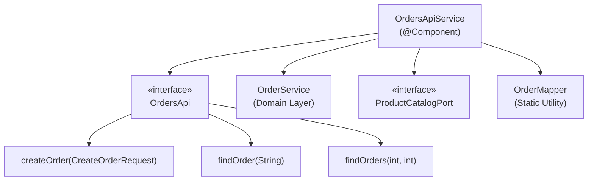
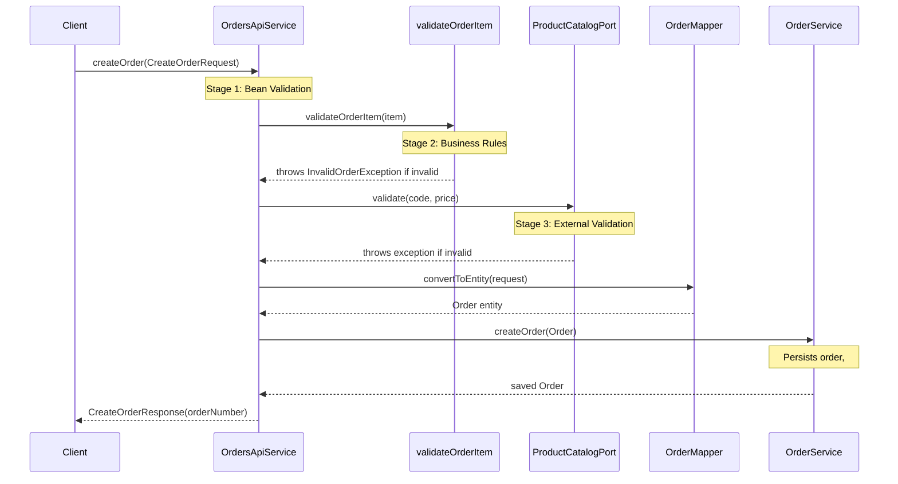
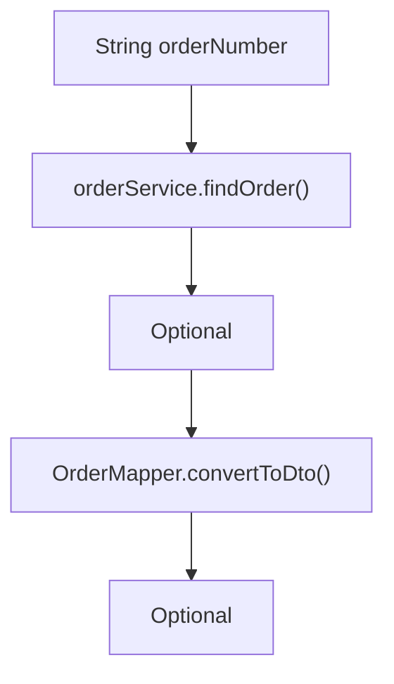
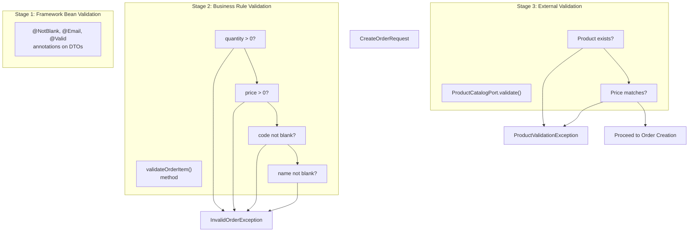
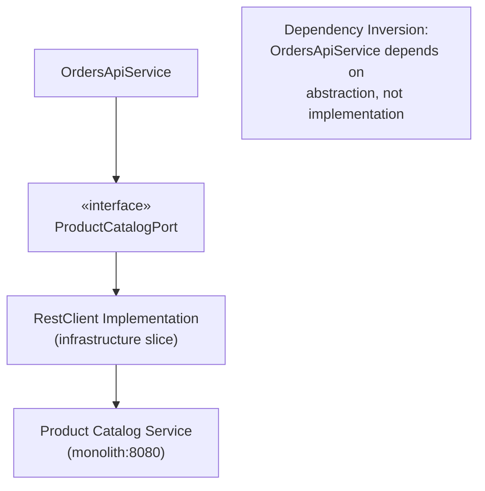
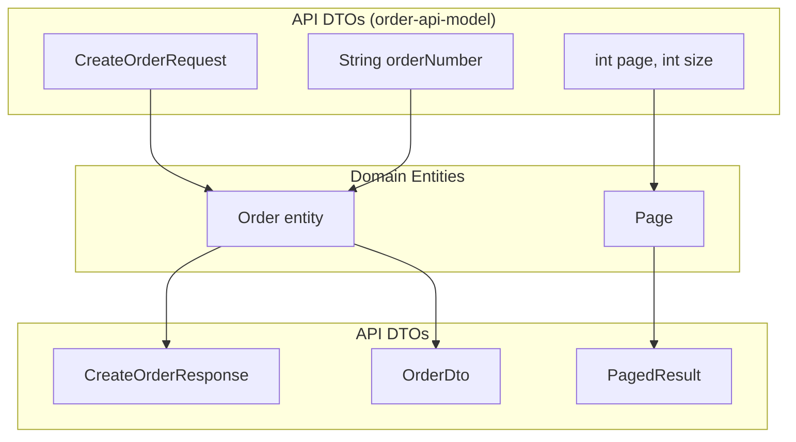
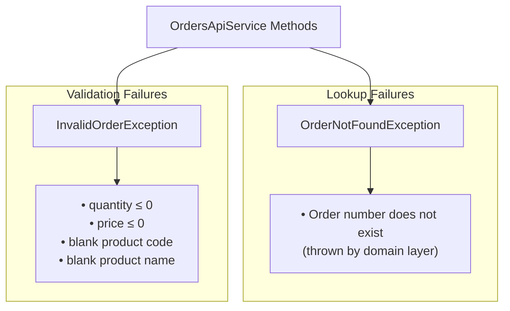
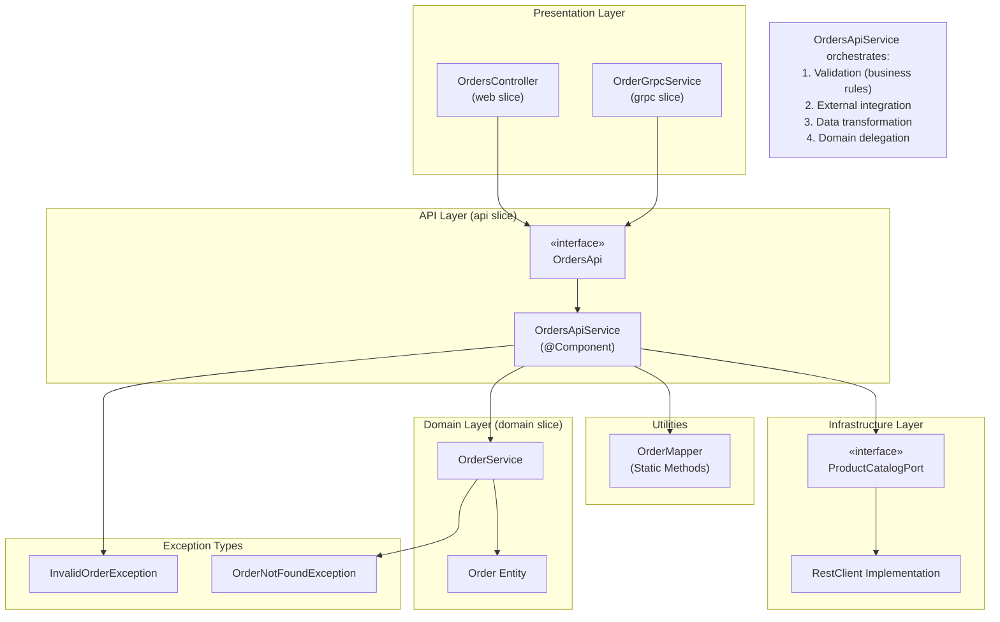

# Orders Service Implementation

> **Relevant source files**
> * [src/main/java/com/sivalabs/bookstore/orders/InvalidOrderException.java](https://github.com/philipz/spring-modulith-orders/blob/eb506991/src/main/java/com/sivalabs/bookstore/orders/InvalidOrderException.java)
> * [src/main/java/com/sivalabs/bookstore/orders/OrderNotFoundException.java](https://github.com/philipz/spring-modulith-orders/blob/eb506991/src/main/java/com/sivalabs/bookstore/orders/OrderNotFoundException.java)
> * [src/main/java/com/sivalabs/bookstore/orders/OrdersApiService.java](https://github.com/philipz/spring-modulith-orders/blob/eb506991/src/main/java/com/sivalabs/bookstore/orders/OrdersApiService.java)
> * [src/main/java/com/sivalabs/bookstore/orders/api/OrdersApi.java](https://github.com/philipz/spring-modulith-orders/blob/eb506991/src/main/java/com/sivalabs/bookstore/orders/api/OrdersApi.java)

## Purpose and Scope

This document details the implementation of the `OrdersApiService` class, which serves as the primary facade for all order-related operations in the orders-service. The `OrdersApiService` implements the `OrdersApi` interface and orchestrates the interaction between the API layer, domain layer, external services, and data transformation logic.

This page covers the internal workings of the service implementation, validation logic, and integration patterns. For architectural context of the API layer, see [API Layer Design](/philipz/spring-modulith-orders/3.3-api-layer-design). For detailed exception specifications, see [Exception Handling](/philipz/spring-modulith-orders/5.3-exception-handling). For API contract definitions, see [Request and Response Models](/philipz/spring-modulith-orders/4.3-request-and-response-models).

---

## Component Overview

The `OrdersApiService` class is a Spring-managed component (`@Component`) that implements the `OrdersApi` interface defined in the `order-api-model` named interface. It acts as an application service layer between the presentation layer (REST/gRPC) and the domain layer.

### Key Responsibilities

| Responsibility | Description |
| --- | --- |
| **API Contract Implementation** | Implements the three methods defined in `OrdersApi`: `createOrder`, `findOrder`, and `findOrders` |
| **Business Validation** | Validates order items beyond basic bean validation constraints |
| **External Integration** | Coordinates with `ProductCatalogPort` for product validation |
| **Data Transformation** | Uses `OrderMapper` to convert between API DTOs and domain entities |
| **Domain Coordination** | Delegates business logic execution to `OrderService` in the domain layer |

### Dependencies



**Sources:** [src/main/java/com/sivalabs/bookstore/orders/OrdersApiService.java L17-L26](https://github.com/philipz/spring-modulith-orders/blob/eb506991/src/main/java/com/sivalabs/bookstore/orders/OrdersApiService.java#L17-L26)

 [src/main/java/com/sivalabs/bookstore/orders/api/OrdersApi.java L1-L13](https://github.com/philipz/spring-modulith-orders/blob/eb506991/src/main/java/com/sivalabs/bookstore/orders/api/OrdersApi.java#L1-L13)

---

## Service Methods Implementation

### createOrder Method

The `createOrder` method implements the order creation workflow with a three-stage validation and transformation pipeline.

#### Method Signature and Flow



#### Implementation Details

The method performs operations in this strict order:

1. **Business Validation** - Calls `validateOrderItem(request.item())` at [src/main/java/com/sivalabs/bookstore/orders/OrdersApiService.java L31](https://github.com/philipz/spring-modulith-orders/blob/eb506991/src/main/java/com/sivalabs/bookstore/orders/OrdersApiService.java#L31-L31)
2. **External Validation** - Invokes `productCatalogPort.validate()` at [src/main/java/com/sivalabs/bookstore/orders/OrdersApiService.java L33](https://github.com/philipz/spring-modulith-orders/blob/eb506991/src/main/java/com/sivalabs/bookstore/orders/OrdersApiService.java#L33-L33)
3. **Entity Conversion** - Transforms DTO to entity using `OrderMapper.convertToEntity()` at [src/main/java/com/sivalabs/bookstore/orders/OrdersApiService.java L34](https://github.com/philipz/spring-modulith-orders/blob/eb506991/src/main/java/com/sivalabs/bookstore/orders/OrdersApiService.java#L34-L34)
4. **Domain Execution** - Delegates to `orderService.createOrder()` at [src/main/java/com/sivalabs/bookstore/orders/OrdersApiService.java L34](https://github.com/philipz/spring-modulith-orders/blob/eb506991/src/main/java/com/sivalabs/bookstore/orders/OrdersApiService.java#L34-L34)
5. **Response Construction** - Wraps order number in `CreateOrderResponse` at [src/main/java/com/sivalabs/bookstore/orders/OrdersApiService.java L35](https://github.com/philipz/spring-modulith-orders/blob/eb506991/src/main/java/com/sivalabs/bookstore/orders/OrdersApiService.java#L35-L35)

**Sources:** [src/main/java/com/sivalabs/bookstore/orders/OrdersApiService.java L28-L36](https://github.com/philipz/spring-modulith-orders/blob/eb506991/src/main/java/com/sivalabs/bookstore/orders/OrdersApiService.java#L28-L36)

---

### findOrder Method

The `findOrder` method retrieves a single order by its order number and transforms it to a DTO.

#### Implementation Pattern



The method uses Java's `Optional.map()` to perform transformation only when an order exists:

```
return orderService.findOrder(orderNumber).map(OrderMapper::convertToDto);
```

This pattern ensures:

* **Null Safety** - No explicit null checks required
* **Lazy Transformation** - DTO conversion only occurs if order exists
* **Clean Semantics** - Method signature clearly indicates optional result

**Sources:** [src/main/java/com/sivalabs/bookstore/orders/OrdersApiService.java L53-L56](https://github.com/philipz/spring-modulith-orders/blob/eb506991/src/main/java/com/sivalabs/bookstore/orders/OrdersApiService.java#L53-L56)

---

### findOrders Method

The `findOrders` method implements paginated order listing with defensive parameter handling.

#### Pagination Logic

| Step | Logic | Line Reference |
| --- | --- | --- |
| **Input Sanitization** | `pageNumber = Math.max(page, 1)` ensures minimum page 1 | [59-61](https://github.com/philipz/spring-modulith-orders/blob/eb506991/59-61) |
| **Page Size Validation** | `pageSize = Math.max(size, 1)` ensures minimum size 1 | [59-61](https://github.com/philipz/spring-modulith-orders/blob/eb506991/59-61) |
| **Sort Configuration** | Orders by `id` descending (newest first) | [63](https://github.com/philipz/spring-modulith-orders/blob/eb506991/63) |
| **Zero-Based Conversion** | Converts to zero-based indexing: `pageNumber - 1` | [63](https://github.com/philipz/spring-modulith-orders/blob/eb506991/63) |
| **Domain Query** | Fetches `Page<Order>` from `orderService` | [64](https://github.com/philipz/spring-modulith-orders/blob/eb506991/64) |
| **Entity Mapping** | Transforms to `OrderView` via `OrderMapper` | [65](https://github.com/philipz/spring-modulith-orders/blob/eb506991/65) |
| **Response Construction** | Builds `PagedResult` with metadata | [66-74](https://github.com/philipz/spring-modulith-orders/blob/eb506991/66-74) |

#### PagedResult Construction

The method constructs a `PagedResult` wrapper containing:

* `content` - List of `OrderView` objects
* `totalElements` - Total count across all pages
* `pageNumber` - One-based page number (converted back from zero-based)
* `totalPages` - Total number of pages
* `isFirst`, `isLast`, `hasNext`, `hasPrevious` - Navigation flags

**Sources:** [src/main/java/com/sivalabs/bookstore/orders/OrdersApiService.java L58-L75](https://github.com/philipz/spring-modulith-orders/blob/eb506991/src/main/java/com/sivalabs/bookstore/orders/OrdersApiService.java#L58-L75)

---

## Validation Pipeline

The service implements a multi-layered validation strategy that executes in a defined order.

### Validation Stages



### validateOrderItem Method Implementation

The private `validateOrderItem` method at [src/main/java/com/sivalabs/bookstore/orders/OrdersApiService.java L38-L51](https://github.com/philipz/spring-modulith-orders/blob/eb506991/src/main/java/com/sivalabs/bookstore/orders/OrdersApiService.java#L38-L51)

 enforces business invariants:

| Validation Rule | Condition | Exception Message |
| --- | --- | --- |
| **Positive Quantity** | `quantity > 0` | "Quantity must be greater than 0" |
| **Positive Price** | `price.compareTo(ZERO) > 0` | "Price must be greater than 0" |
| **Code Presence** | `code != null && !code.trim().isEmpty()` | "Product code is required" |
| **Name Presence** | `name != null && !name.trim().isEmpty()` | "Product name is required" |

All validation failures throw `InvalidOrderException` with descriptive messages. The method uses explicit checks rather than annotations to provide custom error messages and enforce domain-specific rules.

**Sources:** [src/main/java/com/sivalabs/bookstore/orders/OrdersApiService.java L38-L51](https://github.com/philipz/spring-modulith-orders/blob/eb506991/src/main/java/com/sivalabs/bookstore/orders/OrdersApiService.java#L38-L51)

---

## External Integration

The service integrates with external systems through the `ProductCatalogPort` interface, following the ports-and-adapters pattern.

### ProductCatalogPort Usage



#### Integration Pattern

The `productCatalogPort.validate(request.item().code(), request.item().price())` call at [src/main/java/com/sivalabs/bookstore/orders/OrdersApiService.java L33](https://github.com/philipz/spring-modulith-orders/blob/eb506991/src/main/java/com/sivalabs/bookstore/orders/OrdersApiService.java#L33-L33)

 performs:

1. **Product Existence Check** - Verifies the product code exists in the catalog
2. **Price Consistency** - Validates the submitted price matches the catalog price
3. **Exception Propagation** - Throws exceptions on validation failure (implementation-specific)

This design allows the service to:

* Remain decoupled from HTTP client implementation details
* Support multiple implementations (REST, gRPC, mock)
* Test validation logic independently via port mocking

**Sources:** [src/main/java/com/sivalabs/bookstore/orders/OrdersApiService.java L23-L26](https://github.com/philipz/spring-modulith-orders/blob/eb506991/src/main/java/com/sivalabs/bookstore/orders/OrdersApiService.java#L23-L26)

 [src/main/java/com/sivalabs/bookstore/orders/OrdersApiService.java L33](https://github.com/philipz/spring-modulith-orders/blob/eb506991/src/main/java/com/sivalabs/bookstore/orders/OrdersApiService.java#L33-L33)

---

## Data Transformation

The `OrdersApiService` delegates all data transformation to the `OrderMapper` utility class, maintaining separation of concerns.

### Transformation Points



### Mapper Invocations

| Location | Transformation | Purpose |
| --- | --- | --- |
| [OrdersApiService.java L34](https://github.com/philipz/spring-modulith-orders/blob/eb506991/OrdersApiService.java#L34-L34) | `OrderMapper.convertToEntity(request)` | Converts `CreateOrderRequest` to `Order` entity |
| [OrdersApiService.java L55](https://github.com/philipz/spring-modulith-orders/blob/eb506991/OrdersApiService.java#L55-L55) | `OrderMapper::convertToDto` | Converts `Order` entity to `OrderDto` |
| [OrdersApiService.java L65](https://github.com/philipz/spring-modulith-orders/blob/eb506991/OrdersApiService.java#L65-L65) | `OrderMapper::convertToOrderView` | Converts `Order` entity to `OrderView` (lightweight) |

The service never performs direct field mapping, ensuring:

* **Single Responsibility** - Service focuses on orchestration, mapper handles transformation
* **Testability** - Mapping logic can be tested independently
* **Maintainability** - Field mapping changes isolated to `OrderMapper`

**Sources:** [src/main/java/com/sivalabs/bookstore/orders/OrdersApiService.java L34](https://github.com/philipz/spring-modulith-orders/blob/eb506991/src/main/java/com/sivalabs/bookstore/orders/OrdersApiService.java#L34-L34)

 [src/main/java/com/sivalabs/bookstore/orders/OrdersApiService.java L55](https://github.com/philipz/spring-modulith-orders/blob/eb506991/src/main/java/com/sivalabs/bookstore/orders/OrdersApiService.java#L55-L55)

 [src/main/java/com/sivalabs/bookstore/orders/OrdersApiService.java L65](https://github.com/philipz/spring-modulith-orders/blob/eb506991/src/main/java/com/sivalabs/bookstore/orders/OrdersApiService.java#L65-L65)

---

## Exception Handling

The service throws two custom exceptions to signal different error conditions.

### Exception Types and Usage



### InvalidOrderException

Thrown by `validateOrderItem()` when business validation rules fail. The exception is instantiated with descriptive messages at:

* [src/main/java/com/sivalabs/bookstore/orders/OrdersApiService.java L40](https://github.com/philipz/spring-modulith-orders/blob/eb506991/src/main/java/com/sivalabs/bookstore/orders/OrdersApiService.java#L40-L40)  - Invalid quantity
* [src/main/java/com/sivalabs/bookstore/orders/OrdersApiService.java L43](https://github.com/philipz/spring-modulith-orders/blob/eb506991/src/main/java/com/sivalabs/bookstore/orders/OrdersApiService.java#L43-L43)  - Invalid price
* [src/main/java/com/sivalabs/bookstore/orders/OrdersApiService.java L46](https://github.com/philipz/spring-modulith-orders/blob/eb506991/src/main/java/com/sivalabs/bookstore/orders/OrdersApiService.java#L46-L46)  - Missing product code
* [src/main/java/com/sivalabs/bookstore/orders/OrdersApiService.java L49](https://github.com/philipz/spring-modulith-orders/blob/eb506991/src/main/java/com/sivalabs/bookstore/orders/OrdersApiService.java#L49-L49)  - Missing product name

The exception class is a simple `RuntimeException` wrapper at [src/main/java/com/sivalabs/bookstore/orders/InvalidOrderException.java L1-L8](https://github.com/philipz/spring-modulith-orders/blob/eb506991/src/main/java/com/sivalabs/bookstore/orders/InvalidOrderException.java#L1-L8)

### OrderNotFoundException

This exception is typically thrown by the domain layer when an order lookup fails. The `OrdersApiService` does not directly throw this exception but propagates it from `OrderService.findOrder()`.

The exception provides a factory method `forOrderNumber(String)` at [src/main/java/com/sivalabs/bookstore/orders/OrderNotFoundException.java L9-L11](https://github.com/philipz/spring-modulith-orders/blob/eb506991/src/main/java/com/sivalabs/bookstore/orders/OrderNotFoundException.java#L9-L11)

 for standardized error messages.

Note that the `findOrder` method returns `Optional<OrderDto>` at [src/main/java/com/sivalabs/bookstore/orders/OrdersApiService.java L54](https://github.com/philipz/spring-modulith-orders/blob/eb506991/src/main/java/com/sivalabs/bookstore/orders/OrdersApiService.java#L54-L54)

 so the exception is only thrown internally if the domain layer chooses to, not as part of the API contract.

**Sources:** [src/main/java/com/sivalabs/bookstore/orders/OrdersApiService.java L38-L51](https://github.com/philipz/spring-modulith-orders/blob/eb506991/src/main/java/com/sivalabs/bookstore/orders/OrdersApiService.java#L38-L51)

 [src/main/java/com/sivalabs/bookstore/orders/InvalidOrderException.java L1-L8](https://github.com/philipz/spring-modulith-orders/blob/eb506991/src/main/java/com/sivalabs/bookstore/orders/InvalidOrderException.java#L1-L8)

 [src/main/java/com/sivalabs/bookstore/orders/OrderNotFoundException.java L1-L12](https://github.com/philipz/spring-modulith-orders/blob/eb506991/src/main/java/com/sivalabs/bookstore/orders/OrderNotFoundException.java#L1-L12)

---

## Component Interaction Summary

The following diagram shows the complete interaction model for `OrdersApiService` within the application architecture:



**Sources:** [src/main/java/com/sivalabs/bookstore/orders/OrdersApiService.java L1-L77](https://github.com/philipz/spring-modulith-orders/blob/eb506991/src/main/java/com/sivalabs/bookstore/orders/OrdersApiService.java#L1-L77)

 [src/main/java/com/sivalabs/bookstore/orders/api/OrdersApi.java L1-L13](https://github.com/philipz/spring-modulith-orders/blob/eb506991/src/main/java/com/sivalabs/bookstore/orders/api/OrdersApi.java#L1-L13)