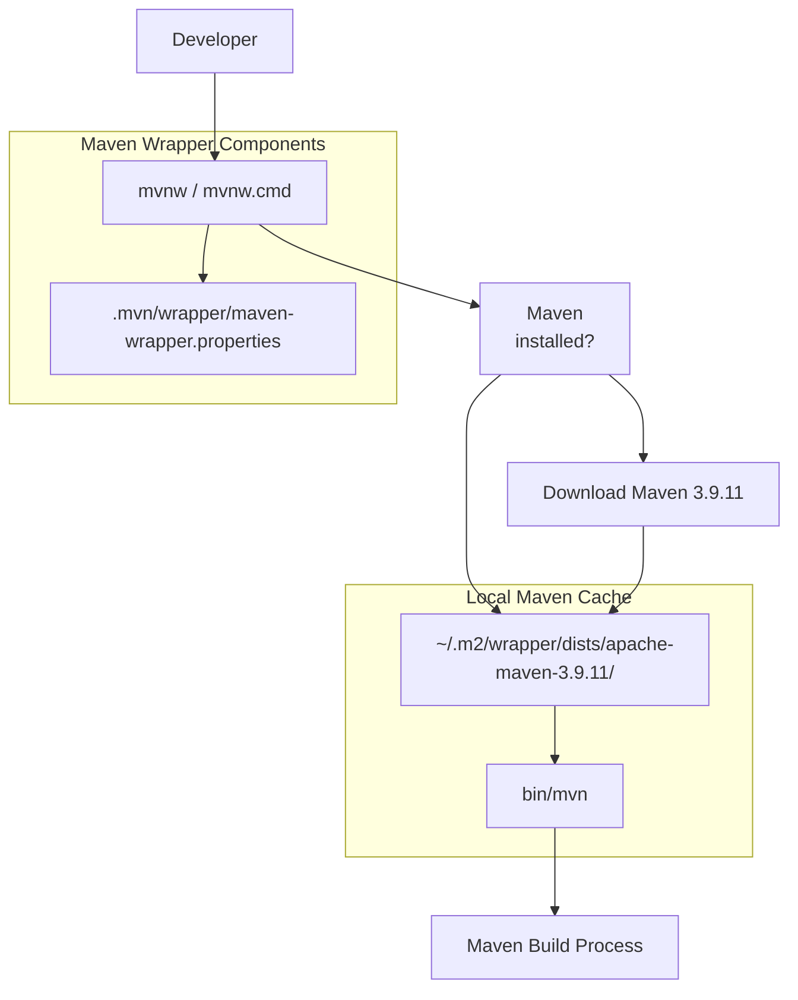
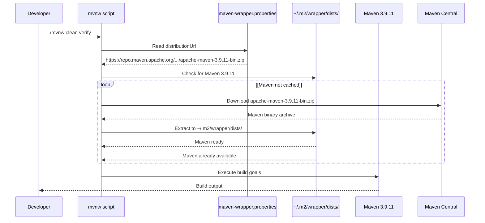
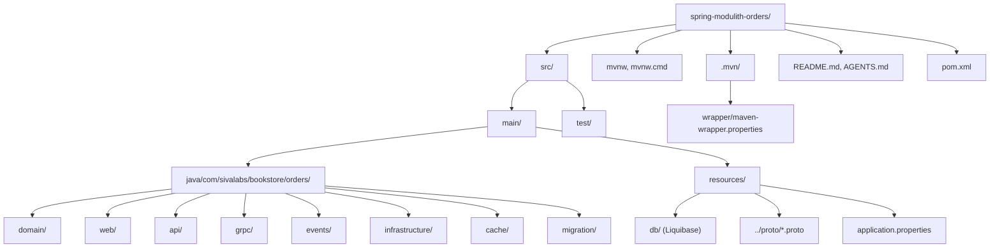
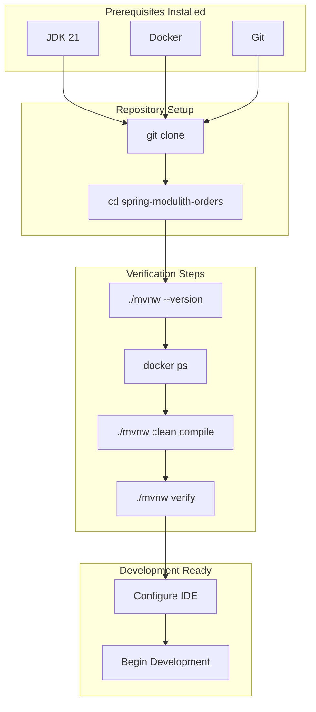

# Prerequisites and Setup

> **Relevant source files**
> * [.mvn/wrapper/maven-wrapper.properties](https://github.com/philipz/spring-modulith-orders/blob/eb506991/.mvn/wrapper/maven-wrapper.properties)
> * [AGENTS.md](https://github.com/philipz/spring-modulith-orders/blob/eb506991/AGENTS.md)
> * [README.md](https://github.com/philipz/spring-modulith-orders/blob/eb506991/README.md)
> * [mvnw](https://github.com/philipz/spring-modulith-orders/blob/eb506991/mvnw)
> * [mvnw.cmd](https://github.com/philipz/spring-modulith-orders/blob/eb506991/mvnw.cmd)

This page documents the required tools, software versions, and initial setup steps needed to develop, build, and run the orders-service microservice. It covers environment preparation, Maven Wrapper usage, and repository initialization.

For build procedures and compilation, see [Building the Project](/philipz/spring-modulith-orders/2.2-building-the-project). For instructions on starting the service, see [Running Locally](/philipz/spring-modulith-orders/2.3-running-locally).

## Purpose and Scope

This section ensures developers have the correct environment to work with the orders-service codebase. The service requires specific versions of Java and Docker, and uses an embedded Maven wrapper to eliminate the need for a system-wide Maven installation. Initial setup involves cloning the repository and verifying that all prerequisites are available.

## Required Software

The orders-service has minimal external dependencies. The following table lists required tools with their minimum versions and purposes:

| Tool | Version | Purpose | Verification Command |
| --- | --- | --- | --- |
| Java Development Kit (JDK) | 21 | Compilation and runtime for Spring Boot 3.5 application using modern Java features | `java -version` |
| Docker | Latest stable | Required by Testcontainers for integration tests; launches PostgreSQL, RabbitMQ containers | `docker --version` |
| Git | Any recent version | Version control for cloning repository | `git --version` |
| Maven | Not required | Build tool (provided via Maven Wrapper) | N/A |

**Sources:** [README.md L12-L15](https://github.com/philipz/spring-modulith-orders/blob/eb506991/README.md#L12-L15)

 [AGENTS.md L17](https://github.com/philipz/spring-modulith-orders/blob/eb506991/AGENTS.md#L17-L17)

### Java 21 Requirements

The codebase uses Java 21 language features and requires a compatible JDK for compilation and execution. The Spring Boot 3.5 framework mandates Java 17 as minimum, but this project standardizes on Java 21 for access to modern language constructs including records, pattern matching, and virtual threads.

**Verification:**

```markdown
java -version
# Expected output should include "version 21" or higher
```

**Sources:** [README.md L13](https://github.com/philipz/spring-modulith-orders/blob/eb506991/README.md#L13-L13)

 [AGENTS.md L17](https://github.com/philipz/spring-modulith-orders/blob/eb506991/AGENTS.md#L17-L17)

### Docker Requirements

Docker is essential for running integration tests via Testcontainers. The test suite automatically launches containerized instances of PostgreSQL and RabbitMQ to provide isolated test environments. Docker must be running and accessible to the current user.

**Verification:**

```markdown
docker --version
docker ps
# Should return version info and running containers (or empty list if none running)
```

**Sources:** [README.md L14](https://github.com/philipz/spring-modulith-orders/blob/eb506991/README.md#L14-L14)

 [AGENTS.md L13](https://github.com/philipz/spring-modulith-orders/blob/eb506991/AGENTS.md#L13-L13)

## Maven Wrapper Usage

The repository includes a Maven Wrapper that eliminates the need for a system-wide Maven installation. The wrapper automatically downloads and uses Maven 3.9.11, ensuring consistent builds across all development environments.

### Maven Wrapper Architecture



**Sources:** [mvnw L1-L296](https://github.com/philipz/spring-modulith-orders/blob/eb506991/mvnw#L1-L296)

 [mvnw.cmd L1-L190](https://github.com/philipz/spring-modulith-orders/blob/eb506991/mvnw.cmd#L1-L190)

 [.mvn/wrapper/maven-wrapper.properties L1-L3](https://github.com/philipz/spring-modulith-orders/blob/eb506991/.mvn/wrapper/maven-wrapper.properties#L1-L3)

### Wrapper Scripts

The repository provides platform-specific wrapper scripts:

| Script | Platform | Location | Purpose |
| --- | --- | --- | --- |
| `mvnw` | Unix/Linux/macOS | Root directory | Shell script that downloads and invokes Maven |
| `mvnw.cmd` | Windows | Root directory | Batch/PowerShell script for Windows environments |

Both scripts read configuration from [.mvn/wrapper/maven-wrapper.properties L1-L3](https://github.com/philipz/spring-modulith-orders/blob/eb506991/.mvn/wrapper/maven-wrapper.properties#L1-L3)

 which specifies:

* `distributionUrl`: Points to Maven 3.9.11 binary distribution on Maven Central
* `distributionType`: Set to `only-script` for wrapper-only distribution

**Sources:** [mvnw L1-L296](https://github.com/philipz/spring-modulith-orders/blob/eb506991/mvnw#L1-L296)

 [mvnw.cmd L1-L190](https://github.com/philipz/spring-modulith-orders/blob/eb506991/mvnw.cmd#L1-L190)

 [.mvn/wrapper/maven-wrapper.properties L1-L3](https://github.com/philipz/spring-modulith-orders/blob/eb506991/.mvn/wrapper/maven-wrapper.properties#L1-L3)

### Maven Wrapper Execution Flow



**Sources:** [mvnw L111-L147](https://github.com/philipz/spring-modulith-orders/blob/eb506991/mvnw#L111-L147)

 [mvnw.cmd L53-L100](https://github.com/philipz/spring-modulith-orders/blob/eb506991/mvnw.cmd#L53-L100)

## Initial Repository Setup

### Clone the Repository

```
git clone https://github.com/philipz/spring-modulith-orders.git
cd spring-modulith-orders
```

### Repository Structure Overview

After cloning, the directory structure should match:



**Sources:** [README.md L5-L10](https://github.com/philipz/spring-modulith-orders/blob/eb506991/README.md#L5-L10)

 [AGENTS.md L3-L8](https://github.com/philipz/spring-modulith-orders/blob/eb506991/AGENTS.md#L3-L8)

### Verify Setup

Execute the following commands to confirm the environment is correctly configured:

#### 1. Verify Maven Wrapper

```
./mvnw --version
```

Expected output includes:

* Apache Maven 3.9.11
* Java version 21.x.x
* Operating system details

On first execution, the wrapper will download Maven 3.9.11 to `~/.m2/wrapper/dists/apache-maven-3.9.11/`. Subsequent invocations use the cached version.

**Sources:** [README.md L17-L22](https://github.com/philipz/spring-modulith-orders/blob/eb506991/README.md#L17-L22)

 [AGENTS.md L11](https://github.com/philipz/spring-modulith-orders/blob/eb506991/AGENTS.md#L11-L11)

#### 2. Verify Docker Availability

```
docker ps
```

This command should execute without errors. If Docker is not running, start the Docker daemon before proceeding.

**Sources:** [README.md L14](https://github.com/philipz/spring-modulith-orders/blob/eb506991/README.md#L14-L14)

 [AGENTS.md L13](https://github.com/philipz/spring-modulith-orders/blob/eb506991/AGENTS.md#L13-L13)

#### 3. Test Compilation

```
./mvnw clean compile
```

This performs a minimal build that:

* Downloads project dependencies
* Applies Spotless code formatting checks
* Generates Java sources from `.proto` files via `protobuf-maven-plugin`
* Compiles Java sources

Expected final output: `BUILD SUCCESS`

**Sources:** [AGENTS.md L11](https://github.com/philipz/spring-modulith-orders/blob/eb506991/AGENTS.md#L11-L11)

 [README.md L19](https://github.com/philipz/spring-modulith-orders/blob/eb506991/README.md#L19-L19)

## Environment Variable Preparation

While not required for initial setup, certain environment variables can be configured to customize runtime behavior. The service reads configuration from [src/main/resources/application.properties](https://github.com/philipz/spring-modulith-orders/blob/eb506991/src/main/resources/application.properties)

 with overrides via environment variables.

Key variables include:

| Variable | Default | Purpose |
| --- | --- | --- |
| `JAVA_HOME` | System-dependent | Points to JDK 21 installation |
| `DOCKER_HOST` | `unix:///var/run/docker.sock` | Docker daemon connection for Testcontainers |
| `SPRING_PROFILES_ACTIVE` | None | Activates Spring profiles (e.g., `dev`, `prod`) |

For comprehensive configuration options, see [Application Configuration](/philipz/spring-modulith-orders/8.1-application-configuration) and [Environment Variables Reference](/philipz/spring-modulith-orders/8.3-environment-variables-reference).

**Sources:** [AGENTS.md L34-L37](https://github.com/philipz/spring-modulith-orders/blob/eb506991/AGENTS.md#L34-L37)

## Setup Validation

Execute the following comprehensive check to validate the entire setup:

```markdown
# Clean any previous build artifacts
./mvnw clean

# Run full verification including tests
./mvnw verify

# Expected: All tests pass, BUILD SUCCESS
```

This command performs:

1. Spotless formatting verification
2. Protocol buffer code generation
3. Java compilation
4. Unit test execution
5. Integration test execution with Testcontainers (launches PostgreSQL, RabbitMQ)
6. JAR packaging

If this completes successfully, the development environment is fully configured and ready for development work.

**Sources:** [AGENTS.md L11](https://github.com/philipz/spring-modulith-orders/blob/eb506991/AGENTS.md#L11-L11)

 [README.md L19-L22](https://github.com/philipz/spring-modulith-orders/blob/eb506991/README.md#L19-L22)

## Development Environment Setup Diagram



**Sources:** [README.md L12-L22](https://github.com/philipz/spring-modulith-orders/blob/eb506991/README.md#L12-L22)

 [AGENTS.md L11-L13](https://github.com/philipz/spring-modulith-orders/blob/eb506991/AGENTS.md#L11-L13)

## Troubleshooting Common Setup Issues

### Maven Wrapper Download Failures

If `./mvnw` fails to download Maven:

* **Cause**: Network connectivity issues or firewall blocking Maven Central
* **Solution**: Set `MVNW_REPOURL` environment variable to point to a mirror or internal repository
* **Reference**: [mvnw L141](https://github.com/philipz/spring-modulith-orders/blob/eb506991/mvnw#L141-L141)

### Docker Not Available During Tests

If tests fail with "Cannot connect to Docker daemon":

* **Cause**: Docker is not running or current user lacks permissions
* **Solution**: Start Docker daemon and ensure user is in `docker` group (Linux) or Docker Desktop is running (macOS/Windows)
* **Reference**: [AGENTS.md L24](https://github.com/philipz/spring-modulith-orders/blob/eb506991/AGENTS.md#L24-L24)

### Java Version Mismatch

If compilation fails with unsupported class file version:

* **Cause**: `JAVA_HOME` points to JDK version < 21
* **Solution**: Update `JAVA_HOME` to point to JDK 21 installation
* **Verification**: `echo $JAVA_HOME` and `$JAVA_HOME/bin/java -version`

**Sources:** [mvnw L24-L30](https://github.com/philipz/spring-modulith-orders/blob/eb506991/mvnw#L24-L30)

 [README.md L13-L14](https://github.com/philipz/spring-modulith-orders/blob/eb506991/README.md#L13-L14)

## Next Steps

After completing this setup:

1. Proceed to [Building the Project](/philipz/spring-modulith-orders/2.2-building-the-project) for detailed build instructions
2. Review [Development Guidelines](/philipz/spring-modulith-orders/2.4-development-guidelines) for coding standards
3. Start the service locally following [Running Locally](/philipz/spring-modulith-orders/2.3-running-locally)

**Sources:** [README.md L1-L37](https://github.com/philipz/spring-modulith-orders/blob/eb506991/README.md#L1-L37)

 [AGENTS.md L1-L38](https://github.com/philipz/spring-modulith-orders/blob/eb506991/AGENTS.md#L1-L38)