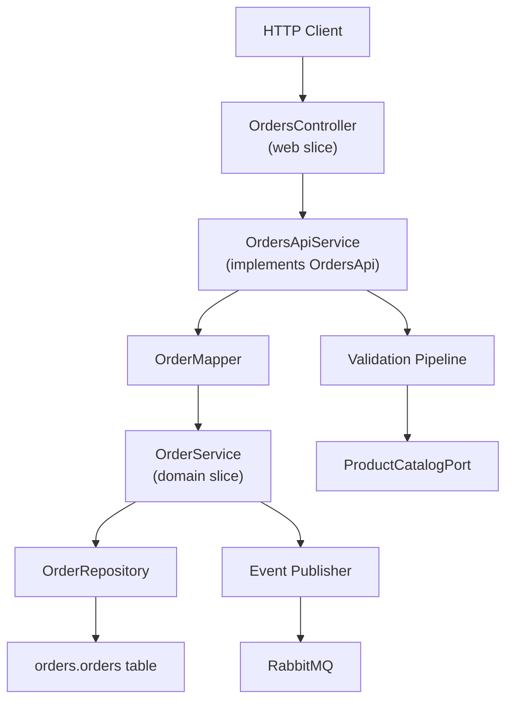
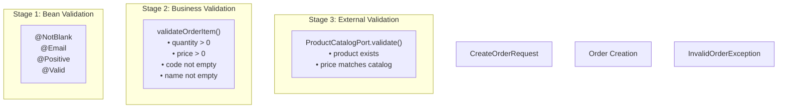

# REST API

> **Relevant source files**
> * [AGENTS.md](https://github.com/philipz/spring-modulith-orders/blob/eb506991/AGENTS.md)
> * [README-OpenAPI.md](https://github.com/philipz/spring-modulith-orders/blob/eb506991/README-OpenAPI.md)
> * [src/main/java/com/sivalabs/bookstore/orders/OrdersApiService.java](https://github.com/philipz/spring-modulith-orders/blob/eb506991/src/main/java/com/sivalabs/bookstore/orders/OrdersApiService.java)
> * [src/main/java/com/sivalabs/bookstore/orders/api/OrdersApi.java](https://github.com/philipz/spring-modulith-orders/blob/eb506991/src/main/java/com/sivalabs/bookstore/orders/api/OrdersApi.java)

## Purpose and Scope

This document provides a complete reference for the REST API exposed by the orders-service. The REST API is the primary HTTP-based interface for creating and retrieving orders, running on port 8091 by default. All REST endpoints follow RESTful conventions and are fully documented via OpenAPI 3.0.

For gRPC API documentation, see [gRPC API](/philipz/spring-modulith-orders/4.2-grpc-api). For detailed information about request and response data models, see [Request and Response Models](/philipz/spring-modulith-orders/4.3-request-and-response-models). For implementation details of the API layer, see [API Layer Design](/philipz/spring-modulith-orders/3.3-api-layer-design).

Sources: [README-OpenAPI.md L1-L64](https://github.com/philipz/spring-modulith-orders/blob/eb506991/README-OpenAPI.md#L1-L64)

 [AGENTS.md L12](https://github.com/philipz/spring-modulith-orders/blob/eb506991/AGENTS.md#L12-L12)

## OpenAPI Documentation

The service provides comprehensive OpenAPI documentation for all REST endpoints. Once the service is running, the following resources are available:

| Resource | URL | Description |
| --- | --- | --- |
| **OpenAPI Specification** | `http://localhost:8091/api-docs` | Raw OpenAPI 3.0 specification in JSON format |
| **Swagger UI** | `http://localhost:8091/swagger-ui.html` | Interactive web interface for exploring and testing the API |

The OpenAPI specification includes complete schema documentation with field descriptions, validation constraints, required field indicators, and data type information for all DTOs.

**Configuration Details:**

* Service title: "Orders Service API"
* Description: "Orders microservice extracted from the bookstore modular monolith"
* Version: "1.0.0"
* Development server: `http://localhost:8091`
* Actuator endpoints are excluded from the documentation

Sources: [README-OpenAPI.md L8-L53](https://github.com/philipz/spring-modulith-orders/blob/eb506991/README-OpenAPI.md#L8-L53)

## Base URL and Port Configuration

The REST API listens on port **8091** by default. The base path for all order-related endpoints is `/api`.

**Default Base URL:**

```yaml
http://localhost:8091/api
```

**Port Configuration:**
The REST API port can be configured via the `server.port` property in [application.properties](https://github.com/philipz/spring-modulith-orders/blob/eb506991/application.properties)

 or overridden with the `SERVER_PORT` environment variable.

**Feature Toggle:**
The REST API can be disabled entirely by setting `ORDERS_REST_ENABLED=false`. This is useful when running the service in gRPC-only mode.

Sources: [AGENTS.md L12](https://github.com/philipz/spring-modulith-orders/blob/eb506991/AGENTS.md#L12-L12)

 [README-OpenAPI.md L50](https://github.com/philipz/spring-modulith-orders/blob/eb506991/README-OpenAPI.md#L50-L50)

## REST API Architecture

The following diagram illustrates how REST requests flow through the orders-service architecture, from the HTTP endpoint to domain logic and persistence:



**Key Components:**

* `OrdersController` in the web slice receives HTTP requests and routes them to `OrdersApiService`
* `OrdersApiService` [src/main/java/com/sivalabs/bookstore/orders/OrdersApiService.java L18](https://github.com/philipz/spring-modulith-orders/blob/eb506991/src/main/java/com/sivalabs/bookstore/orders/OrdersApiService.java#L18-L18)  implements the `OrdersApi` [src/main/java/com/sivalabs/bookstore/orders/api/OrdersApi.java L6](https://github.com/philipz/spring-modulith-orders/blob/eb506991/src/main/java/com/sivalabs/bookstore/orders/api/OrdersApi.java#L6-L6)  interface
* Three-stage validation pipeline ensures data integrity
* `OrderMapper` transforms between DTOs and domain entities
* `OrderService` encapsulates domain logic and persistence

Sources: [src/main/java/com/sivalabs/bookstore/orders/OrdersApiService.java L1-L76](https://github.com/philipz/spring-modulith-orders/blob/eb506991/src/main/java/com/sivalabs/bookstore/orders/OrdersApiService.java#L1-L76)

 [src/main/java/com/sivalabs/bookstore/orders/api/OrdersApi.java L1-L13](https://github.com/philipz/spring-modulith-orders/blob/eb506991/src/main/java/com/sivalabs/bookstore/orders/api/OrdersApi.java#L1-L13)

## Endpoints Reference

### POST /api/orders

Creates a new order after validating the request and product information.

**Request:**

```
POST /api/orders
Content-Type: application/json

{
  "customer": {
    "name": "John Doe",
    "email": "john.doe@example.com",
    "phone": "+1234567890"
  },
  "deliveryAddress": {
    "addressLine1": "123 Main St",
    "addressLine2": "Apt 4B",
    "city": "Springfield",
    "state": "IL",
    "zipCode": "62701",
    "country": "USA"
  },
  "item": {
    "code": "P100",
    "name": "The Great Gatsby",
    "price": 15.99,
    "quantity": 2
  }
}
```

**Response (201 Created):**

```json
{
  "orderNumber": "order-1234567890123"
}
```

**Implementation:**
The endpoint is implemented in [OrdersApiService.java L29-L36](https://github.com/philipz/spring-modulith-orders/blob/eb506991/OrdersApiService.java#L29-L36)

 The method performs the following steps:

1. **Business validation** via `validateOrderItem()` [src/main/java/com/sivalabs/bookstore/orders/OrdersApiService.java L38-L51](https://github.com/philipz/spring-modulith-orders/blob/eb506991/src/main/java/com/sivalabs/bookstore/orders/OrdersApiService.java#L38-L51)
2. **External validation** by calling `productCatalogPort.validate()` [src/main/java/com/sivalabs/bookstore/orders/OrdersApiService.java L33](https://github.com/philipz/spring-modulith-orders/blob/eb506991/src/main/java/com/sivalabs/bookstore/orders/OrdersApiService.java#L33-L33)
3. **Entity conversion** via `OrderMapper.convertToEntity()` [src/main/java/com/sivalabs/bookstore/orders/OrdersApiService.java L34](https://github.com/philipz/spring-modulith-orders/blob/eb506991/src/main/java/com/sivalabs/bookstore/orders/OrdersApiService.java#L34-L34)
4. **Order creation** via `orderService.createOrder()` [src/main/java/com/sivalabs/bookstore/orders/OrdersApiService.java L34](https://github.com/philipz/spring-modulith-orders/blob/eb506991/src/main/java/com/sivalabs/bookstore/orders/OrdersApiService.java#L34-L34)
5. **Response construction** with generated order number [src/main/java/com/sivalabs/bookstore/orders/OrdersApiService.java L35](https://github.com/philipz/spring-modulith-orders/blob/eb506991/src/main/java/com/sivalabs/bookstore/orders/OrdersApiService.java#L35-L35)

Sources: [src/main/java/com/sivalabs/bookstore/orders/OrdersApiService.java L29-L36](https://github.com/philipz/spring-modulith-orders/blob/eb506991/src/main/java/com/sivalabs/bookstore/orders/OrdersApiService.java#L29-L36)

 [README-OpenAPI.md L23](https://github.com/philipz/spring-modulith-orders/blob/eb506991/README-OpenAPI.md#L23-L23)

### GET /api/orders

Retrieves a paginated list of all orders sorted by ID in descending order.

**Request:**

```
GET /api/orders?page=1&size=10
```

**Query Parameters:**

| Parameter | Type | Required | Default | Description |
| --- | --- | --- | --- | --- |
| `page` | integer | No | 1 | Page number (1-indexed) |
| `size` | integer | No | 10 | Number of items per page |

**Response (200 OK):**

```json
{
  "data": [
    {
      "orderNumber": "order-1234567890123",
      "customer": "John Doe",
      "status": "NEW",
      "createdAt": "2024-01-15T10:30:00Z"
    }
  ],
  "totalElements": 100,
  "pageNumber": 1,
  "totalPages": 10,
  "isFirst": true,
  "isLast": false,
  "hasNext": true,
  "hasPrevious": false
}
```

**Implementation:**
The endpoint is implemented in [OrdersApiService.java L59-L75](https://github.com/philipz/spring-modulith-orders/blob/eb506991/OrdersApiService.java#L59-L75)

 The method:

1. Normalizes page and size parameters to ensure minimum value of 1 [src/main/java/com/sivalabs/bookstore/orders/OrdersApiService.java L60-L61](https://github.com/philipz/spring-modulith-orders/blob/eb506991/src/main/java/com/sivalabs/bookstore/orders/OrdersApiService.java#L60-L61)
2. Creates a `PageRequest` with 0-indexed page number and descending sort by ID [src/main/java/com/sivalabs/bookstore/orders/OrdersApiService.java L62-L63](https://github.com/philipz/spring-modulith-orders/blob/eb506991/src/main/java/com/sivalabs/bookstore/orders/OrdersApiService.java#L62-L63)
3. Retrieves orders from `orderService.findOrders()` [src/main/java/com/sivalabs/bookstore/orders/OrdersApiService.java L64](https://github.com/philipz/spring-modulith-orders/blob/eb506991/src/main/java/com/sivalabs/bookstore/orders/OrdersApiService.java#L64-L64)
4. Maps entities to `OrderView` DTOs via `OrderMapper.convertToOrderView()` [src/main/java/com/sivalabs/bookstore/orders/OrdersApiService.java L65](https://github.com/philipz/spring-modulith-orders/blob/eb506991/src/main/java/com/sivalabs/bookstore/orders/OrdersApiService.java#L65-L65)
5. Constructs `PagedResult` with 1-indexed page number for API consumers [src/main/java/com/sivalabs/bookstore/orders/OrdersApiService.java L66-L74](https://github.com/philipz/spring-modulith-orders/blob/eb506991/src/main/java/com/sivalabs/bookstore/orders/OrdersApiService.java#L66-L74)

Sources: [src/main/java/com/sivalabs/bookstore/orders/OrdersApiService.java L59-L75](https://github.com/philipz/spring-modulith-orders/blob/eb506991/src/main/java/com/sivalabs/bookstore/orders/OrdersApiService.java#L59-L75)

 [README-OpenAPI.md L24](https://github.com/philipz/spring-modulith-orders/blob/eb506991/README-OpenAPI.md#L24-L24)

### GET /api/orders/{orderNumber}

Retrieves a specific order by its order number.

**Request:**

```
GET /api/orders/order-1234567890123
```

**Path Parameters:**

| Parameter | Type | Required | Description |
| --- | --- | --- | --- |
| `orderNumber` | string | Yes | Unique order identifier |

**Response (200 OK):**

```json
{
  "orderNumber": "order-1234567890123",
  "customer": {
    "name": "John Doe",
    "email": "john.doe@example.com",
    "phone": "+1234567890"
  },
  "deliveryAddress": {
    "addressLine1": "123 Main St",
    "addressLine2": "Apt 4B",
    "city": "Springfield",
    "state": "IL",
    "zipCode": "62701",
    "country": "USA"
  },
  "item": {
    "code": "P100",
    "name": "The Great Gatsby",
    "price": 15.99,
    "quantity": 2
  },
  "status": "NEW",
  "createdAt": "2024-01-15T10:30:00Z"
}
```

**Response (404 Not Found):**

```json
{
  "error": "Order not found",
  "orderNumber": "order-invalid"
}
```

**Implementation:**
The endpoint is implemented in [OrdersApiService.java L54-L56](https://github.com/philipz/spring-modulith-orders/blob/eb506991/OrdersApiService.java#L54-L56)

 The method:

1. Calls `orderService.findOrder()` with the order number [src/main/java/com/sivalabs/bookstore/orders/OrdersApiService.java L55](https://github.com/philipz/spring-modulith-orders/blob/eb506991/src/main/java/com/sivalabs/bookstore/orders/OrdersApiService.java#L55-L55)
2. Maps the result to `OrderDto` via `OrderMapper.convertToDto()` if present [src/main/java/com/sivalabs/bookstore/orders/OrdersApiService.java L55](https://github.com/philipz/spring-modulith-orders/blob/eb506991/src/main/java/com/sivalabs/bookstore/orders/OrdersApiService.java#L55-L55)
3. Returns an `Optional<OrderDto>`, which the web layer converts to 404 if empty

Sources: [src/main/java/com/sivalabs/bookstore/orders/OrdersApiService.java L54-L56](https://github.com/philipz/spring-modulith-orders/blob/eb506991/src/main/java/com/sivalabs/bookstore/orders/OrdersApiService.java#L54-L56)

 [README-OpenAPI.md L25](https://github.com/philipz/spring-modulith-orders/blob/eb506991/README-OpenAPI.md#L25-L25)

## Validation Pipeline

The REST API implements a three-stage validation pipeline to ensure data integrity and consistency:



### Stage 1: Bean Validation

Bean Validation annotations on DTOs provide syntax-level validation. These constraints are defined in the API model classes and automatically enforced by Spring Boot.

**Common Constraints:**

* `@NotBlank` - Ensures string fields are not null or empty
* `@Email` - Validates email format
* `@Positive` - Ensures numeric fields are positive
* `@Valid` - Enables cascading validation on nested objects

Sources: [README-OpenAPI.md L29-L32](https://github.com/philipz/spring-modulith-orders/blob/eb506991/README-OpenAPI.md#L29-L32)

### Stage 2: Business Validation

Business validation is performed in the `validateOrderItem()` method [src/main/java/com/sivalabs/bookstore/orders/OrdersApiService.java L38-L51](https://github.com/philipz/spring-modulith-orders/blob/eb506991/src/main/java/com/sivalabs/bookstore/orders/OrdersApiService.java#L38-L51)

 This stage enforces domain-specific rules:

**Validation Rules:**

* **Quantity**: Must be greater than 0 [src/main/java/com/sivalabs/bookstore/orders/OrdersApiService.java L39-L41](https://github.com/philipz/spring-modulith-orders/blob/eb506991/src/main/java/com/sivalabs/bookstore/orders/OrdersApiService.java#L39-L41)
* **Price**: Must be greater than 0 [src/main/java/com/sivalabs/bookstore/orders/OrdersApiService.java L42-L44](https://github.com/philipz/spring-modulith-orders/blob/eb506991/src/main/java/com/sivalabs/bookstore/orders/OrdersApiService.java#L42-L44)
* **Product Code**: Cannot be null or empty [src/main/java/com/sivalabs/bookstore/orders/OrdersApiService.java L45-L47](https://github.com/philipz/spring-modulith-orders/blob/eb506991/src/main/java/com/sivalabs/bookstore/orders/OrdersApiService.java#L45-L47)
* **Product Name**: Cannot be null or empty [src/main/java/com/sivalabs/bookstore/orders/OrdersApiService.java L48-L50](https://github.com/philipz/spring-modulith-orders/blob/eb506991/src/main/java/com/sivalabs/bookstore/orders/OrdersApiService.java#L48-L50)

All business validation failures throw `InvalidOrderException` with a descriptive error message.

Sources: [src/main/java/com/sivalabs/bookstore/orders/OrdersApiService.java L38-L51](https://github.com/philipz/spring-modulith-orders/blob/eb506991/src/main/java/com/sivalabs/bookstore/orders/OrdersApiService.java#L38-L51)

### Stage 3: External Validation

External validation verifies that the product exists in the Product Catalog service and that the price matches the catalog price [src/main/java/com/sivalabs/bookstore/orders/OrdersApiService.java L33](https://github.com/philipz/spring-modulith-orders/blob/eb506991/src/main/java/com/sivalabs/bookstore/orders/OrdersApiService.java#L33-L33)

This validation uses the `ProductCatalogPort` interface, which calls the Product Catalog service running at `monolith:8080`. If the product code is invalid or the price doesn't match, the validation fails and the order is rejected.

Sources: [src/main/java/com/sivalabs/bookstore/orders/OrdersApiService.java L33](https://github.com/philipz/spring-modulith-orders/blob/eb506991/src/main/java/com/sivalabs/bookstore/orders/OrdersApiService.java#L33-L33)

 [AGENTS.md L4](https://github.com/philipz/spring-modulith-orders/blob/eb506991/AGENTS.md#L4-L4)

## Data Transformation

The `OrderMapper` utility class handles bidirectional transformation between API DTOs and domain entities:

| Method | Input | Output | Purpose |
| --- | --- | --- | --- |
| `convertToEntity()` | `CreateOrderRequest` | `Order` entity | Converts creation request to domain entity |
| `convertToDto()` | `Order` entity | `OrderDto` | Converts entity to full DTO for single-order responses |
| `convertToOrderView()` | `Order` entity | `OrderView` | Converts entity to simplified view for list responses |

The mapper is invoked at key points in the request flow:

* **Order Creation**: [OrdersApiService.java L34](https://github.com/philipz/spring-modulith-orders/blob/eb506991/OrdersApiService.java#L34-L34)  - Converts `CreateOrderRequest` to entity
* **Single Order Retrieval**: [OrdersApiService.java L55](https://github.com/philipz/spring-modulith-orders/blob/eb506991/OrdersApiService.java#L55-L55)  - Converts entity to `OrderDto`
* **Order Listing**: [OrdersApiService.java L65](https://github.com/philipz/spring-modulith-orders/blob/eb506991/OrdersApiService.java#L65-L65)  - Converts entity to `OrderView`

Sources: [src/main/java/com/sivalabs/bookstore/orders/OrdersApiService.java L34-L65](https://github.com/philipz/spring-modulith-orders/blob/eb506991/src/main/java/com/sivalabs/bookstore/orders/OrdersApiService.java#L34-L65)

 [AGENTS.md L11](https://github.com/philipz/spring-modulith-orders/blob/eb506991/AGENTS.md#L11-L11)

## Error Handling

The REST API uses standard HTTP status codes and custom exceptions to communicate errors:

### HTTP Status Codes

| Status Code | Scenario | Example |
| --- | --- | --- |
| **200 OK** | Successful GET request | Order retrieval successful |
| **201 Created** | Successful POST request | Order created successfully |
| **400 Bad Request** | Validation failure | Invalid email format, negative quantity |
| **404 Not Found** | Resource not found | Order number doesn't exist |
| **500 Internal Server Error** | Unexpected server error | Database connection failure |

### Custom Exceptions

The API layer uses custom exceptions for domain-specific errors:

**`InvalidOrderException`**

* Thrown by: `validateOrderItem()` [src/main/java/com/sivalabs/bookstore/orders/OrdersApiService.java L40-L49](https://github.com/philipz/spring-modulith-orders/blob/eb506991/src/main/java/com/sivalabs/bookstore/orders/OrdersApiService.java#L40-L49)
* HTTP Status: 400 Bad Request
* Use Cases: * Quantity less than or equal to 0 * Price less than or equal to 0 * Missing product code * Missing product name

**`OrderNotFoundException`**

* HTTP Status: 404 Not Found
* Use Cases: * GET request for non-existent order number

For more details on exception handling patterns, see [Exception Handling](/philipz/spring-modulith-orders/5.3-exception-handling).

Sources: [src/main/java/com/sivalabs/bookstore/orders/OrdersApiService.java L38-L51](https://github.com/philipz/spring-modulith-orders/blob/eb506991/src/main/java/com/sivalabs/bookstore/orders/OrdersApiService.java#L38-L51)

 [AGENTS.md L32](https://github.com/philipz/spring-modulith-orders/blob/eb506991/AGENTS.md#L32-L32)

## Pagination Details

The `GET /api/orders` endpoint uses Spring Data's pagination support with specific conventions:

### Page Indexing

* **API Layer**: Uses 1-based page indexing (page 1 is the first page)
* **Database Layer**: Uses 0-based page indexing (page 0 is the first page)
* **Conversion**: [OrdersApiService.java L63](https://github.com/philipz/spring-modulith-orders/blob/eb506991/OrdersApiService.java#L63-L63)  converts API page number to database page number by subtracting 1
* **Response**: [OrdersApiService.java L69](https://github.com/philipz/spring-modulith-orders/blob/eb506991/OrdersApiService.java#L69-L69)  converts database page number back to API page number by adding 1

### Sorting

Orders are sorted by ID in descending order [src/main/java/com/sivalabs/bookstore/orders/OrdersApiService.java L63](https://github.com/philipz/spring-modulith-orders/blob/eb506991/src/main/java/com/sivalabs/bookstore/orders/OrdersApiService.java#L63-L63)

 ensuring that the most recent orders appear first.

### PagedResult Structure

The `PagedResult` wrapper includes comprehensive pagination metadata:

* `data`: Array of `OrderView` items
* `totalElements`: Total number of orders across all pages
* `pageNumber`: Current page number (1-indexed)
* `totalPages`: Total number of pages
* `isFirst`: Boolean indicating if this is the first page
* `isLast`: Boolean indicating if this is the last page
* `hasNext`: Boolean indicating if there is a next page
* `hasPrevious`: Boolean indicating if there is a previous page

Sources: [src/main/java/com/sivalabs/bookstore/orders/OrdersApiService.java L59-L75](https://github.com/philipz/spring-modulith-orders/blob/eb506991/src/main/java/com/sivalabs/bookstore/orders/OrdersApiService.java#L59-L75)

## Configuration Reference

The REST API behavior can be customized via environment variables:

| Variable | Type | Default | Description |
| --- | --- | --- | --- |
| `ORDERS_REST_ENABLED` | boolean | `true` | Enable or disable REST API endpoints |
| `SERVER_PORT` | integer | `8091` | HTTP server port for REST API |
| `SPRING_DATASOURCE_URL` | string | See config | PostgreSQL connection URL |
| `BOOKSTORE_PRODUCT_CATALOG_SERVICE_URL` | string | `http://monolith:8080` | Product Catalog service URL for validation |

For complete configuration reference, see [Application Configuration](/philipz/spring-modulith-orders/8.1-application-configuration) and [Environment Variables Reference](/philipz/spring-modulith-orders/8.3-environment-variables-reference).

Sources: [AGENTS.md L35](https://github.com/philipz/spring-modulith-orders/blob/eb506991/AGENTS.md#L35-L35)

 [README-OpenAPI.md L50](https://github.com/philipz/spring-modulith-orders/blob/eb506991/README-OpenAPI.md#L50-L50)