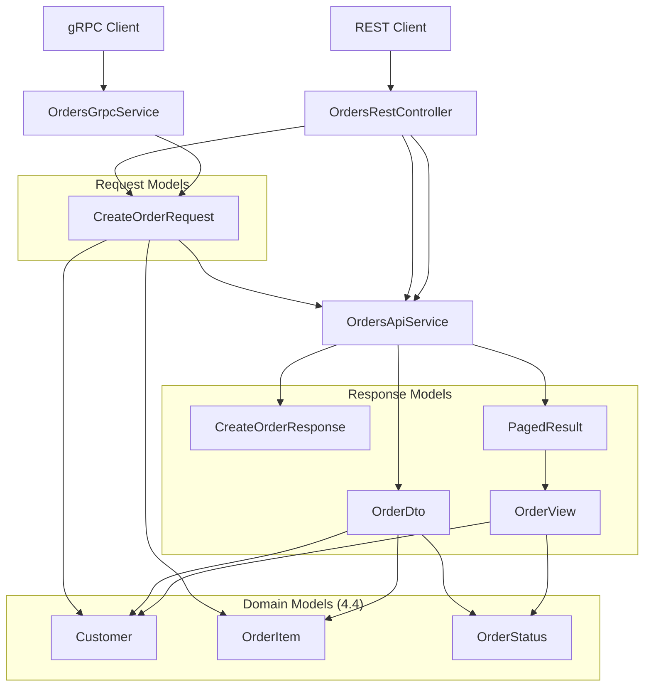
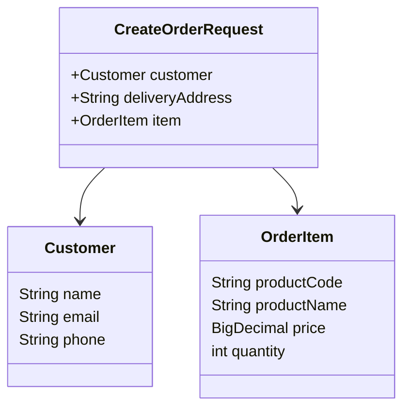
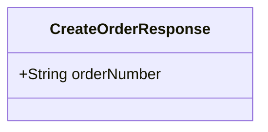
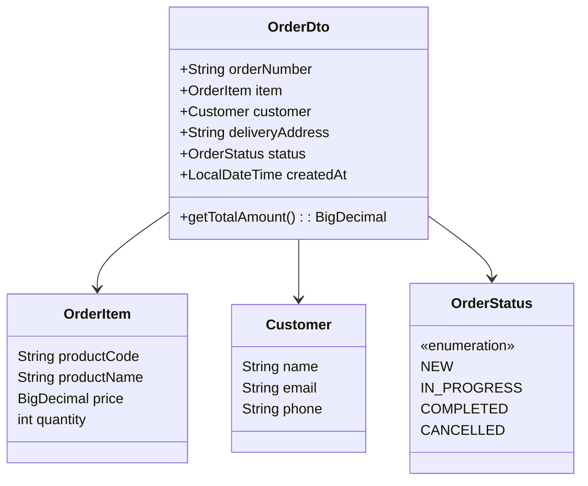
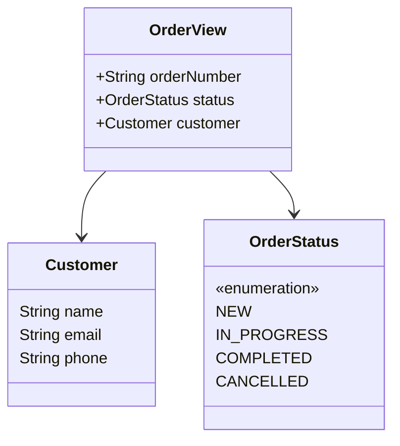
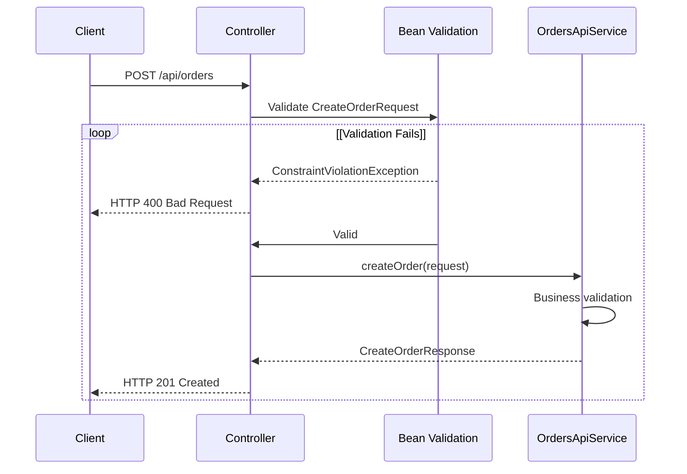

# Request and Response Models

> **Relevant source files**
> * [src/main/java/com/sivalabs/bookstore/orders/api/CreateOrderRequest.java](https://github.com/philipz/spring-modulith-orders/blob/eb506991/src/main/java/com/sivalabs/bookstore/orders/api/CreateOrderRequest.java)
> * [src/main/java/com/sivalabs/bookstore/orders/api/CreateOrderResponse.java](https://github.com/philipz/spring-modulith-orders/blob/eb506991/src/main/java/com/sivalabs/bookstore/orders/api/CreateOrderResponse.java)
> * [src/main/java/com/sivalabs/bookstore/orders/api/OrderDto.java](https://github.com/philipz/spring-modulith-orders/blob/eb506991/src/main/java/com/sivalabs/bookstore/orders/api/OrderDto.java)
> * [src/main/java/com/sivalabs/bookstore/orders/api/OrderView.java](https://github.com/philipz/spring-modulith-orders/blob/eb506991/src/main/java/com/sivalabs/bookstore/orders/api/OrderView.java)

## Purpose and Scope

This page documents the Data Transfer Objects (DTOs) used for REST and gRPC API communication in the orders-service. These models define the structure of request payloads and response bodies for order management operations.

The models documented here are:

* **CreateOrderRequest** - Input model for order creation
* **CreateOrderResponse** - Output model after successful order creation
* **OrderDto** - Complete order representation for retrieval operations
* **OrderView** - Simplified order representation for listing operations

For the underlying domain models referenced by these DTOs (Customer, OrderItem, OrderStatus), see [Domain Models](/philipz/spring-modulith-orders/4.4-domain-models). For event models used in asynchronous communication, see [Event Contracts](/philipz/spring-modulith-orders/4.5-event-contracts).

---

## API Model Architecture

The following diagram illustrates how request and response models flow through the API layer:



**Sources:** [src/main/java/com/sivalabs/bookstore/orders/api/CreateOrderRequest.java](https://github.com/philipz/spring-modulith-orders/blob/eb506991/src/main/java/com/sivalabs/bookstore/orders/api/CreateOrderRequest.java)

 [src/main/java/com/sivalabs/bookstore/orders/api/CreateOrderResponse.java](https://github.com/philipz/spring-modulith-orders/blob/eb506991/src/main/java/com/sivalabs/bookstore/orders/api/CreateOrderResponse.java)

 [src/main/java/com/sivalabs/bookstore/orders/api/OrderDto.java](https://github.com/philipz/spring-modulith-orders/blob/eb506991/src/main/java/com/sivalabs/bookstore/orders/api/OrderDto.java)

 [src/main/java/com/sivalabs/bookstore/orders/api/OrderView.java](https://github.com/philipz/spring-modulith-orders/blob/eb506991/src/main/java/com/sivalabs/bookstore/orders/api/OrderView.java)

---

## CreateOrderRequest

`CreateOrderRequest` is the input model for the order creation endpoint. It encapsulates all required information to create a new order in the system.

### Structure



### Field Reference

| Field | Type | Required | Validation | Description |
| --- | --- | --- | --- | --- |
| `customer` | `Customer` | Yes | `@Valid` | Customer information including name, email, and phone |
| `deliveryAddress` | `String` | Yes | `@NotEmpty` | Delivery address for the order |
| `item` | `OrderItem` | Yes | `@Valid` | Order item details including product code, name, price, and quantity |

### Annotations

The model uses OpenAPI schema annotations for API documentation:

* **`@Schema(description = "Request to create a new order")`** - Applied at class level [src/main/java/com/sivalabs/bookstore/orders/api/CreateOrderRequest.java L9](https://github.com/philipz/spring-modulith-orders/blob/eb506991/src/main/java/com/sivalabs/bookstore/orders/api/CreateOrderRequest.java#L9-L9)
* **Field-level schemas** - Each field has descriptive annotations with examples [src/main/java/com/sivalabs/bookstore/orders/api/CreateOrderRequest.java L11-L17](https://github.com/philipz/spring-modulith-orders/blob/eb506991/src/main/java/com/sivalabs/bookstore/orders/api/CreateOrderRequest.java#L11-L17)

### Validation Constraints

The following validation constraints are enforced:

1. **Customer validation** - The `@Valid` annotation triggers nested validation on the `Customer` object [src/main/java/com/sivalabs/bookstore/orders/api/CreateOrderRequest.java L11](https://github.com/philipz/spring-modulith-orders/blob/eb506991/src/main/java/com/sivalabs/bookstore/orders/api/CreateOrderRequest.java#L11-L11)
2. **Delivery address** - Must not be empty (`@NotEmpty`) [src/main/java/com/sivalabs/bookstore/orders/api/CreateOrderRequest.java L16](https://github.com/philipz/spring-modulith-orders/blob/eb506991/src/main/java/com/sivalabs/bookstore/orders/api/CreateOrderRequest.java#L16-L16)
3. **Item validation** - The `@Valid` annotation triggers nested validation on the `OrderItem` object [src/main/java/com/sivalabs/bookstore/orders/api/CreateOrderRequest.java L17](https://github.com/philipz/spring-modulith-orders/blob/eb506991/src/main/java/com/sivalabs/bookstore/orders/api/CreateOrderRequest.java#L17-L17)

Nested validation constraints from `Customer` and `OrderItem` are documented in [Domain Models](/philipz/spring-modulith-orders/4.4-domain-models).

### Usage Context

`CreateOrderRequest` is used in:

* REST endpoint: `POST /api/orders`
* gRPC method: `CreateOrder`
* Implementation: `OrdersApiService.createOrder(CreateOrderRequest)` (see [Orders Service Implementation](/philipz/spring-modulith-orders/5.1-orders-service-implementation))

**Sources:** [src/main/java/com/sivalabs/bookstore/orders/api/CreateOrderRequest.java L1-L18](https://github.com/philipz/spring-modulith-orders/blob/eb506991/src/main/java/com/sivalabs/bookstore/orders/api/CreateOrderRequest.java#L1-L18)

---

## CreateOrderResponse

`CreateOrderResponse` is the output model returned after successfully creating an order. It provides the unique order identifier for tracking and retrieval.

### Structure



### Field Reference

| Field | Type | Required | Description | Example |
| --- | --- | --- | --- | --- |
| `orderNumber` | `String` | Yes | Unique order identifier with "BK-" prefix | `BK-1234567890` |

### Annotations

* **`@Schema(description = "Response after successfully creating an order")`** - Class-level documentation [src/main/java/com/sivalabs/bookstore/orders/api/CreateOrderResponse.java L5](https://github.com/philipz/spring-modulith-orders/blob/eb506991/src/main/java/com/sivalabs/bookstore/orders/api/CreateOrderResponse.java#L5-L5)
* **`@Schema(description = "Unique order number", example = "BK-1234567890")`** - Field-level documentation with example [src/main/java/com/sivalabs/bookstore/orders/api/CreateOrderResponse.java L7](https://github.com/philipz/spring-modulith-orders/blob/eb506991/src/main/java/com/sivalabs/bookstore/orders/api/CreateOrderResponse.java#L7-L7)

### Order Number Format

The `orderNumber` follows the format `BK-{timestamp}` where:

* `BK-` is a fixed prefix identifying bookstore orders
* The suffix is a timestamp-based unique identifier generated during order persistence

### Usage Context

`CreateOrderResponse` is returned by:

* REST endpoint: `POST /api/orders` with HTTP 201 status
* gRPC method: `CreateOrder` response
* Implementation: `OrdersApiService.createOrder(CreateOrderRequest)` returns this model

**Sources:** [src/main/java/com/sivalabs/bookstore/orders/api/CreateOrderResponse.java L1-L8](https://github.com/philipz/spring-modulith-orders/blob/eb506991/src/main/java/com/sivalabs/bookstore/orders/api/CreateOrderResponse.java#L1-L8)

---

## OrderDto

`OrderDto` is the complete representation of an order, including all order details, customer information, and calculated fields. It is used for single-order retrieval operations.

### Structure



### Field Reference

| Field | Type | Required | Access | Description | Example |
| --- | --- | --- | --- | --- | --- |
| `orderNumber` | `String` | Yes | Read/Write | Unique order identifier | `BK-1234567890` |
| `item` | `OrderItem` | Yes | Read/Write | Order item details | - |
| `customer` | `Customer` | Yes | Read/Write | Customer information | - |
| `deliveryAddress` | `String` | Yes | Read/Write | Delivery address | `123 Main St, City, State 12345` |
| `status` | `OrderStatus` | Yes | Read/Write | Current order status | `NEW`, `IN_PROGRESS`, etc. |
| `createdAt` | `LocalDateTime` | Yes | Read/Write | Order creation timestamp | `2024-01-15T10:30:00` |
| `totalAmount` | `BigDecimal` | N/A | Read-only | Calculated total (price × quantity) | `99.98` |

### Calculated Fields

The `getTotalAmount()` method is a calculated field that computes the total order amount:

```
totalAmount = item.price × item.quantity
```

This field is:

* **Read-only** - Annotated with `@JsonProperty(access = JsonProperty.Access.READ_ONLY)` [src/main/java/com/sivalabs/bookstore/orders/api/OrderDto.java L21](https://github.com/philipz/spring-modulith-orders/blob/eb506991/src/main/java/com/sivalabs/bookstore/orders/api/OrderDto.java#L21-L21)
* **Not persisted** - Calculated on-the-fly from item price and quantity [src/main/java/com/sivalabs/bookstore/orders/api/OrderDto.java L22-L24](https://github.com/philipz/spring-modulith-orders/blob/eb506991/src/main/java/com/sivalabs/bookstore/orders/api/OrderDto.java#L22-L24)
* **OpenAPI documented** - Marked with `accessMode = Schema.AccessMode.READ_ONLY` [src/main/java/com/sivalabs/bookstore/orders/api/OrderDto.java L20](https://github.com/philipz/spring-modulith-orders/blob/eb506991/src/main/java/com/sivalabs/bookstore/orders/api/OrderDto.java#L20-L20)

### Annotations

* **Class-level**: `@Schema(description = "Complete order information")` [src/main/java/com/sivalabs/bookstore/orders/api/OrderDto.java L11](https://github.com/philipz/spring-modulith-orders/blob/eb506991/src/main/java/com/sivalabs/bookstore/orders/api/OrderDto.java#L11-L11)
* **Field-level**: Each field has descriptive `@Schema` annotations with examples [src/main/java/com/sivalabs/bookstore/orders/api/OrderDto.java L13-L18](https://github.com/philipz/spring-modulith-orders/blob/eb506991/src/main/java/com/sivalabs/bookstore/orders/api/OrderDto.java#L13-L18)

### Usage Context

`OrderDto` is returned by:

* REST endpoint: `GET /api/orders/{orderNumber}`
* gRPC method: `GetOrder`
* Implementation: `OrdersApiService.getOrder(String orderNumber)`

**Sources:** [src/main/java/com/sivalabs/bookstore/orders/api/OrderDto.java L1-L26](https://github.com/philipz/spring-modulith-orders/blob/eb506991/src/main/java/com/sivalabs/bookstore/orders/api/OrderDto.java#L1-L26)

---

## OrderView

`OrderView` is a simplified order representation optimized for listing operations. It includes only essential fields for displaying orders in a list or table view.

### Structure



### Field Reference

| Field | Type | Required | Description | Example |
| --- | --- | --- | --- | --- |
| `orderNumber` | `String` | Yes | Unique order identifier | `BK-1234567890` |
| `status` | `OrderStatus` | Yes | Current order status | `NEW`, `IN_PROGRESS`, etc. |
| `customer` | `Customer` | Yes | Customer information | - |

### Design Rationale

`OrderView` excludes the following fields present in `OrderDto`:

* `item` - Full item details not needed for list views
* `deliveryAddress` - Address not typically shown in lists
* `createdAt` - Timestamp can be added if pagination metadata includes it
* `totalAmount` - Calculated field not needed for basic listing

This lighter model:

* **Reduces payload size** for paginated list responses
* **Improves query performance** by fetching fewer columns
* **Simplifies UI rendering** for order list views

### Annotations

* **Class-level**: `@Schema(description = "Simplified order view for listing")` [src/main/java/com/sivalabs/bookstore/orders/api/OrderView.java L7](https://github.com/philipz/spring-modulith-orders/blob/eb506991/src/main/java/com/sivalabs/bookstore/orders/api/OrderView.java#L7-L7)
* **Field-level**: Each field has descriptive `@Schema` annotations [src/main/java/com/sivalabs/bookstore/orders/api/OrderView.java L9-L11](https://github.com/philipz/spring-modulith-orders/blob/eb506991/src/main/java/com/sivalabs/bookstore/orders/api/OrderView.java#L9-L11)

### Usage Context

`OrderView` is used in:

* REST endpoint: `GET /api/orders` (paginated list)
* Response wrapper: `PagedResult<OrderView>`
* Implementation: `OrdersApiService.getOrders(int pageNo)`

**Sources:** [src/main/java/com/sivalabs/bookstore/orders/api/OrderView.java L1-L12](https://github.com/philipz/spring-modulith-orders/blob/eb506991/src/main/java/com/sivalabs/bookstore/orders/api/OrderView.java#L1-L12)

---

## Validation Summary

The following table summarizes all validation constraints applied to request models:

| Model | Field | Constraint | Description |
| --- | --- | --- | --- |
| `CreateOrderRequest` | `customer` | `@Valid` | Triggers nested validation on Customer object |
| `CreateOrderRequest` | `deliveryAddress` | `@NotEmpty` | Must contain at least one non-whitespace character |
| `CreateOrderRequest` | `item` | `@Valid` | Triggers nested validation on OrderItem object |

For nested validation constraints on `Customer` and `OrderItem`, see [Domain Models](/philipz/spring-modulith-orders/4.4-domain-models).

### Validation Flow



**Sources:** [src/main/java/com/sivalabs/bookstore/orders/api/CreateOrderRequest.java L6-L17](https://github.com/philipz/spring-modulith-orders/blob/eb506991/src/main/java/com/sivalabs/bookstore/orders/api/CreateOrderRequest.java#L6-L17)

---

## OpenAPI Schema Integration

All request and response models include OpenAPI 3.0 annotations (`@Schema`) for automatic API documentation generation. These annotations enable:

### Features

1. **Swagger UI Integration** * Interactive API documentation at `/swagger-ui.html` * Automatic generation of request/response examples * Field-level descriptions and constraints
2. **OpenAPI Specification** * JSON specification available at `/v3/api-docs` * Complete schema definitions for all models * Validation rules exposed in the specification
3. **Code Generation Support** * Client SDKs can be generated from the OpenAPI spec * Consistent type definitions across languages * Validation rules preserved in generated code

### Schema Annotation Patterns

| Annotation Attribute | Usage | Example |
| --- | --- | --- |
| `description` | Human-readable field description | `"Customer information"` |
| `required` | Marks field as mandatory | `required = true` |
| `example` | Provides sample value | `example = "BK-1234567890"` |
| `accessMode` | Controls read/write access | `accessMode = Schema.AccessMode.READ_ONLY` |

### Model Coverage

All four API models are fully annotated:

* **CreateOrderRequest** - Class and all fields annotated [src/main/java/com/sivalabs/bookstore/orders/api/CreateOrderRequest.java L9-L17](https://github.com/philipz/spring-modulith-orders/blob/eb506991/src/main/java/com/sivalabs/bookstore/orders/api/CreateOrderRequest.java#L9-L17)
* **CreateOrderResponse** - Class and field annotated [src/main/java/com/sivalabs/bookstore/orders/api/CreateOrderResponse.java L5-L7](https://github.com/philipz/spring-modulith-orders/blob/eb506991/src/main/java/com/sivalabs/bookstore/orders/api/CreateOrderResponse.java#L5-L7)
* **OrderDto** - Class and all fields annotated, including calculated field [src/main/java/com/sivalabs/bookstore/orders/api/OrderDto.java L11-L24](https://github.com/philipz/spring-modulith-orders/blob/eb506991/src/main/java/com/sivalabs/bookstore/orders/api/OrderDto.java#L11-L24)
* **OrderView** - Class and all fields annotated [src/main/java/com/sivalabs/bookstore/orders/api/OrderView.java L7-L11](https://github.com/philipz/spring-modulith-orders/blob/eb506991/src/main/java/com/sivalabs/bookstore/orders/api/OrderView.java#L7-L11)

For accessing the OpenAPI documentation, see [REST API](/philipz/spring-modulith-orders/4.1-rest-api).

**Sources:** [src/main/java/com/sivalabs/bookstore/orders/api/CreateOrderRequest.java](https://github.com/philipz/spring-modulith-orders/blob/eb506991/src/main/java/com/sivalabs/bookstore/orders/api/CreateOrderRequest.java)

 [src/main/java/com/sivalabs/bookstore/orders/api/CreateOrderResponse.java](https://github.com/philipz/spring-modulith-orders/blob/eb506991/src/main/java/com/sivalabs/bookstore/orders/api/CreateOrderResponse.java)

 [src/main/java/com/sivalabs/bookstore/orders/api/OrderDto.java](https://github.com/philipz/spring-modulith-orders/blob/eb506991/src/main/java/com/sivalabs/bookstore/orders/api/OrderDto.java)

 [src/main/java/com/sivalabs/bookstore/orders/api/OrderView.java](https://github.com/philipz/spring-modulith-orders/blob/eb506991/src/main/java/com/sivalabs/bookstore/orders/api/OrderView.java)