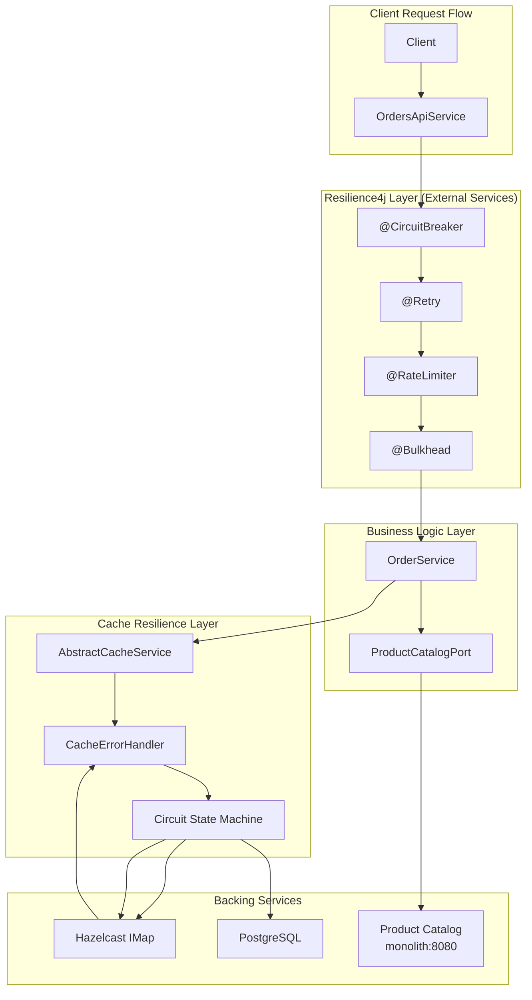
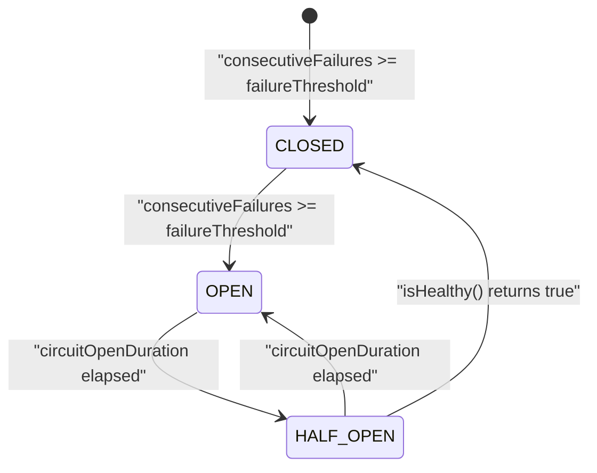
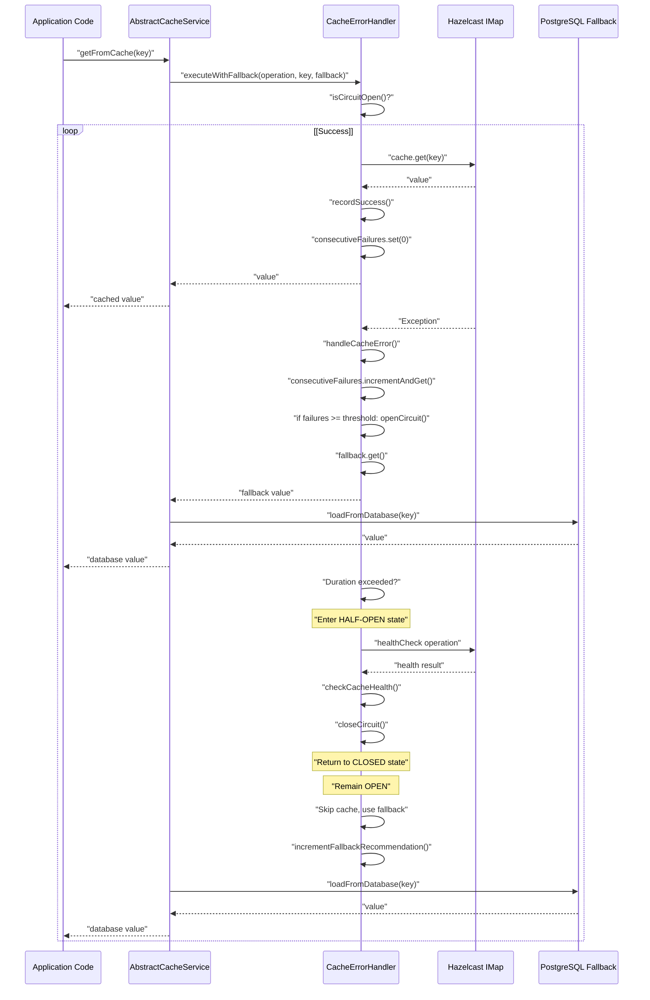
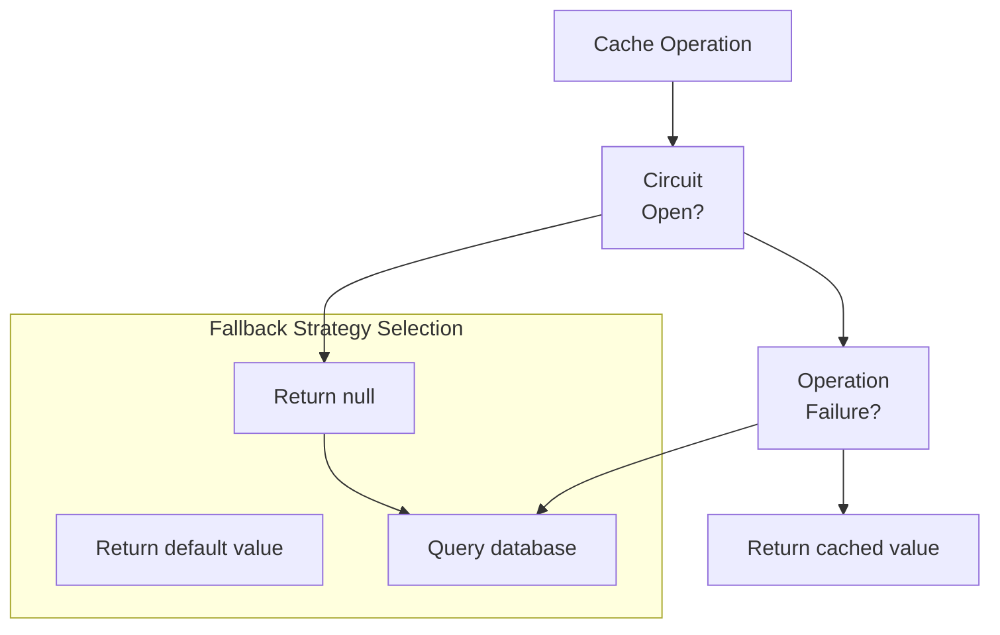
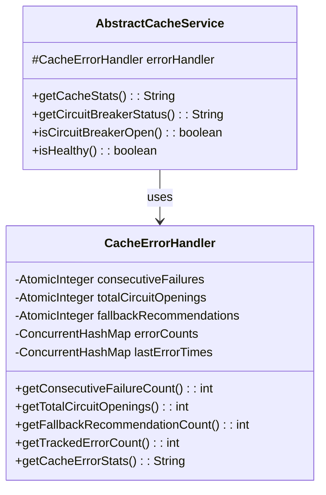
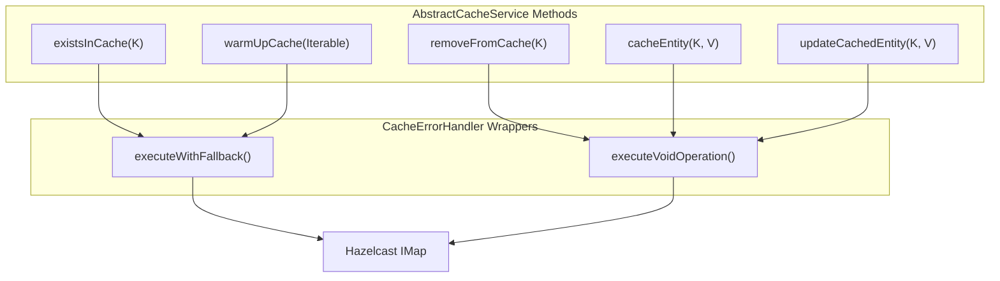

# Resilience and Fault Tolerance

> **Relevant source files**
> * [AGENTS.md](https://github.com/philipz/spring-modulith-orders/blob/eb506991/AGENTS.md)
> * [pom.xml](https://github.com/philipz/spring-modulith-orders/blob/eb506991/pom.xml)
> * [src/main/java/com/sivalabs/bookstore/orders/cache/AbstractCacheService.java](https://github.com/philipz/spring-modulith-orders/blob/eb506991/src/main/java/com/sivalabs/bookstore/orders/cache/AbstractCacheService.java)
> * [src/main/java/com/sivalabs/bookstore/orders/cache/CacheErrorHandler.java](https://github.com/philipz/spring-modulith-orders/blob/eb506991/src/main/java/com/sivalabs/bookstore/orders/cache/CacheErrorHandler.java)

This page documents the multi-layered resilience architecture of the orders-service, including circuit breaker patterns, retry mechanisms, and fallback strategies. It covers both the Resilience4j integration for external service calls and the custom cache resilience layer built around Hazelcast operations.

For information about the event-driven architecture and message delivery guarantees, see [Event-Driven Architecture](/philipz/spring-modulith-orders/3.4-event-driven-architecture). For cache implementation details beyond resilience patterns, see [Caching Layer](/philipz/spring-modulith-orders/5.2-caching-layer).

## Overview

The orders-service implements resilience at two distinct layers to prevent cascading failures and maintain availability:

1. **External Service Resilience**: Resilience4j patterns (circuit breaker, retry, rate limiter, bulkhead) protect calls to external dependencies like the Product Catalog service
2. **Cache Resilience**: Custom `CacheErrorHandler` implements a specialized circuit breaker for Hazelcast operations, ensuring cache failures don't impact application availability

This dual-layer approach ensures that both transient and persistent failures are handled gracefully, with intelligent fallback mechanisms that maintain service degradation rather than complete failure.

**Sources:** [pom.xml L77-L80](https://github.com/philipz/spring-modulith-orders/blob/eb506991/pom.xml#L77-L80)

 [src/main/java/com/sivalabs/bookstore/orders/cache/CacheErrorHandler.java L1-L209](https://github.com/philipz/spring-modulith-orders/blob/eb506991/src/main/java/com/sivalabs/bookstore/orders/cache/CacheErrorHandler.java#L1-L209)

## Resilience Architecture



**Sources:** [pom.xml L77-L80](https://github.com/philipz/spring-modulith-orders/blob/eb506991/pom.xml#L77-L80)

 [src/main/java/com/sivalabs/bookstore/orders/cache/AbstractCacheService.java L1-L193](https://github.com/philipz/spring-modulith-orders/blob/eb506991/src/main/java/com/sivalabs/bookstore/orders/cache/AbstractCacheService.java#L1-L193)

 [src/main/java/com/sivalabs/bookstore/orders/cache/CacheErrorHandler.java L1-L209](https://github.com/philipz/spring-modulith-orders/blob/eb506991/src/main/java/com/sivalabs/bookstore/orders/cache/CacheErrorHandler.java#L1-L209)

## Resilience4j Integration

The service integrates Resilience4j through Spring Boot 3 starter dependencies to provide resilience patterns for external service calls. While the codebase doesn't include explicit `@CircuitBreaker` annotations in the provided files, the framework is configured and available for protecting calls to the Product Catalog service via `ProductCatalogPort`.

### Available Patterns

| Pattern | Purpose | Typical Use Case |
| --- | --- | --- |
| Circuit Breaker | Fail fast when service is unavailable | Product Catalog validation |
| Retry | Automatically retry transient failures | Network timeouts |
| Rate Limiter | Prevent overwhelming downstream services | API throttling |
| Bulkhead | Isolate thread pools for different operations | Separate threads for cache vs DB |

### Configuration

Resilience4j configuration is managed through Spring Boot properties with the prefix `resilience4j.*`. Configuration includes failure rate thresholds, wait durations, and retry attempts.

**Sources:** [pom.xml L77-L80](https://github.com/philipz/spring-modulith-orders/blob/eb506991/pom.xml#L77-L80)

 [AGENTS.md L37](https://github.com/philipz/spring-modulith-orders/blob/eb506991/AGENTS.md#L37-L37)

## Cache Resilience Layer

The cache resilience layer is implemented through `CacheErrorHandler`, which provides a specialized circuit breaker for all Hazelcast operations. This prevents cache failures from cascading to the application layer.

### CacheErrorHandler Circuit Breaker



The `CacheErrorHandler` class [src/main/java/com/sivalabs/bookstore/orders/cache/CacheErrorHandler.java L14-L208](https://github.com/philipz/spring-modulith-orders/blob/eb506991/src/main/java/com/sivalabs/bookstore/orders/cache/CacheErrorHandler.java#L14-L208)

 implements a state machine that tracks consecutive failures and opens the circuit when a threshold is reached.

### Key Components

| Component | Type | Purpose |
| --- | --- | --- |
| `consecutiveFailures` | `AtomicInteger` | Tracks sequential failures for circuit breaker |
| `circuitOpen` | `volatile boolean` | Current circuit state (open/closed) |
| `circuitOpenedAt` | `volatile LocalDateTime` | Timestamp when circuit opened |
| `failureThreshold` | `int` | Number of failures before opening circuit |
| `circuitOpenDuration` | `Duration` | Time before attempting recovery |
| `errorCounts` | `ConcurrentHashMap` | Per-operation error tracking |

**Sources:** [src/main/java/com/sivalabs/bookstore/orders/cache/CacheErrorHandler.java L21-L28](https://github.com/philipz/spring-modulith-orders/blob/eb506991/src/main/java/com/sivalabs/bookstore/orders/cache/CacheErrorHandler.java#L21-L28)

### Failure Handling Flow



**Sources:** [src/main/java/com/sivalabs/bookstore/orders/cache/CacheErrorHandler.java L42-L63](https://github.com/philipz/spring-modulith-orders/blob/eb506991/src/main/java/com/sivalabs/bookstore/orders/cache/CacheErrorHandler.java#L42-L63)

 [src/main/java/com/sivalabs/bookstore/orders/cache/CacheErrorHandler.java L84-L97](https://github.com/philipz/spring-modulith-orders/blob/eb506991/src/main/java/com/sivalabs/bookstore/orders/cache/CacheErrorHandler.java#L84-L97)

### Execute with Fallback Pattern

The `CacheErrorHandler` provides two primary execution methods that wrap cache operations with resilience:

**Generic Fallback:**

```
<T> T executeWithFallback(
    Supplier<T> operation,
    String operationName, 
    String key,
    Supplier<T> fallback
)
```

[src/main/java/com/sivalabs/bookstore/orders/cache/CacheErrorHandler.java L46-L63](https://github.com/philipz/spring-modulith-orders/blob/eb506991/src/main/java/com/sivalabs/bookstore/orders/cache/CacheErrorHandler.java#L46-L63)

**Void Operation:**

```
boolean executeVoidOperation(
    Runnable operation,
    String operationName,
    String key
)
```

[src/main/java/com/sivalabs/bookstore/orders/cache/CacheErrorHandler.java L65-L82](https://github.com/philipz/spring-modulith-orders/blob/eb506991/src/main/java/com/sivalabs/bookstore/orders/cache/CacheErrorHandler.java#L65-L82)

Both methods follow the same pattern:

1. Check if circuit is open → return fallback immediately
2. Execute operation → on success, record success and reset failure counter
3. On failure → handle error, increment failure counter, potentially open circuit
4. Return fallback value

**Sources:** [src/main/java/com/sivalabs/bookstore/orders/cache/CacheErrorHandler.java L42-L82](https://github.com/philipz/spring-modulith-orders/blob/eb506991/src/main/java/com/sivalabs/bookstore/orders/cache/CacheErrorHandler.java#L42-L82)

## Circuit Breaker Mechanics

### Opening the Circuit

The circuit opens when consecutive failures reach the configured threshold:

```java
private void openCircuit() {
    circuitOpen = true;
    circuitOpenedAt = LocalDateTime.now();
    totalCircuitOpenings.incrementAndGet();
    logger.warn("Cache circuit breaker OPENED after {} consecutive failures", 
                failureThreshold);
}
```

Located at [src/main/java/com/sivalabs/bookstore/orders/cache/CacheErrorHandler.java L170-L175](https://github.com/philipz/spring-modulith-orders/blob/eb506991/src/main/java/com/sivalabs/bookstore/orders/cache/CacheErrorHandler.java#L170-L175)

### Half-Open State

After `circuitOpenDuration` elapses, the circuit enters a half-open state to test recovery:

```
public boolean isCircuitOpen() {
    if (!circuitOpen) {
        return false;
    }
    
    LocalDateTime openedAt = circuitOpenedAt;
    if (openedAt != null && 
        Duration.between(openedAt, LocalDateTime.now())
                .compareTo(circuitOpenDuration) > 0) {
        logger.info("Circuit breaker entering half-open state - " +
                   "attempting cache recovery");
        return false;
    }
    
    return true;
}
```

Located at [src/main/java/com/sivalabs/bookstore/orders/cache/CacheErrorHandler.java L99-L111](https://github.com/philipz/spring-modulith-orders/blob/eb506991/src/main/java/com/sivalabs/bookstore/orders/cache/CacheErrorHandler.java#L99-L111)

### Health Check Recovery

The `AbstractCacheService` implements health checks that test cache availability:

```
public boolean isHealthy() {
    return errorHandler.checkCacheHealth(() -> {
        try {
            K healthCheckKey = createHealthCheckKey();
            cache.put(healthCheckKey, "health-check-value");
            Object value = cache.get(healthCheckKey);
            cache.remove(healthCheckKey);
            return "health-check-value".equals(value);
        } catch (Exception e) {
            logger.debug("Cache health check failed", e);
            return false;
        }
    });
}
```

Located at [src/main/java/com/sivalabs/bookstore/orders/cache/AbstractCacheService.java L48-L61](https://github.com/philipz/spring-modulith-orders/blob/eb506991/src/main/java/com/sivalabs/bookstore/orders/cache/AbstractCacheService.java#L48-L61)

**Sources:** [src/main/java/com/sivalabs/bookstore/orders/cache/CacheErrorHandler.java L113-L128](https://github.com/philipz/spring-modulith-orders/blob/eb506991/src/main/java/com/sivalabs/bookstore/orders/cache/CacheErrorHandler.java#L113-L128)

 [src/main/java/com/sivalabs/bookstore/orders/cache/AbstractCacheService.java L48-L61](https://github.com/philipz/spring-modulith-orders/blob/eb506991/src/main/java/com/sivalabs/bookstore/orders/cache/AbstractCacheService.java#L48-L61)

## Fallback Strategies

### Database Fallback Decision

The `shouldFallbackToDatabase` method provides intelligent decision-making for when to bypass the cache entirely:

```
public boolean shouldFallbackToDatabase(String operationName) {
    if (errorHandler.isCircuitOpen()) {
        logger.debug("Circuit breaker is open - " +
                    "recommending database fallback for {}", operationName);
        return true;
    }
    return errorHandler.shouldFallbackToDatabase(operationName);
}
```

Located at [src/main/java/com/sivalabs/bookstore/orders/cache/AbstractCacheService.java L78-L84](https://github.com/philipz/spring-modulith-orders/blob/eb506991/src/main/java/com/sivalabs/bookstore/orders/cache/AbstractCacheService.java#L78-L84)

The `CacheErrorHandler` tracks per-operation error rates:

```
public boolean shouldFallbackToDatabase(String operationName) {
    AtomicInteger count = errorCounts.get(operationName);
    if (count != null && count.get() > failureThreshold / 2) {
        logger.debug("Frequent cache errors detected for {} - " +
                    "recommending database fallback", operationName);
        incrementFallbackRecommendation();
        return true;
    }
    return false;
}
```

Located at [src/main/java/com/sivalabs/bookstore/orders/cache/CacheErrorHandler.java L130-L138](https://github.com/philipz/spring-modulith-orders/blob/eb506991/src/main/java/com/sivalabs/bookstore/orders/cache/CacheErrorHandler.java#L130-L138)

### Fallback Types



| Fallback Type | When Used | Implementation |
| --- | --- | --- |
| Null Fallback | Non-critical reads, existence checks | Returns `null` or `false` |
| Default Fallback | Stats, metadata queries | Returns placeholder string |
| Database Fallback | Critical data retrieval | Queries PostgreSQL directly |

**Sources:** [src/main/java/com/sivalabs/bookstore/orders/cache/CacheErrorHandler.java L42-L63](https://github.com/philipz/spring-modulith-orders/blob/eb506991/src/main/java/com/sivalabs/bookstore/orders/cache/CacheErrorHandler.java#L42-L63)

 [src/main/java/com/sivalabs/bookstore/orders/cache/AbstractCacheService.java L23-L46](https://github.com/philipz/spring-modulith-orders/blob/eb506991/src/main/java/com/sivalabs/bookstore/orders/cache/AbstractCacheService.java#L23-L46)

## Error Tracking and Statistics

### Per-Operation Error Tracking

The `CacheErrorHandler` maintains granular error statistics per operation type:

```java
private final ConcurrentHashMap<String, AtomicInteger> errorCounts;
private final ConcurrentHashMap<String, LocalDateTime> lastErrorTimes;

private void recordError(String operationName, String errorMessage) {
    errorCounts.computeIfAbsent(operationName, 
                                key -> new AtomicInteger(0))
               .incrementAndGet();
    lastErrorTimes.put(operationName, LocalDateTime.now());
    logger.debug("Recorded cache error for operation {}: {}", 
                operationName, errorMessage);
}
```

Located at [src/main/java/com/sivalabs/bookstore/orders/cache/CacheErrorHandler.java L27-L28](https://github.com/philipz/spring-modulith-orders/blob/eb506991/src/main/java/com/sivalabs/bookstore/orders/cache/CacheErrorHandler.java#L27-L28)

 [src/main/java/com/sivalabs/bookstore/orders/cache/CacheErrorHandler.java L203-L207](https://github.com/philipz/spring-modulith-orders/blob/eb506991/src/main/java/com/sivalabs/bookstore/orders/cache/CacheErrorHandler.java#L203-L207)

### Statistics Retrieval



Metrics available for monitoring:

* **Consecutive Failures**: Current failure streak tracked at [src/main/java/com/sivalabs/bookstore/orders/cache/CacheErrorHandler.java L183-L185](https://github.com/philipz/spring-modulith-orders/blob/eb506991/src/main/java/com/sivalabs/bookstore/orders/cache/CacheErrorHandler.java#L183-L185)
* **Total Circuit Openings**: Cumulative count at [src/main/java/com/sivalabs/bookstore/orders/cache/CacheErrorHandler.java L187-L189](https://github.com/philipz/spring-modulith-orders/blob/eb506991/src/main/java/com/sivalabs/bookstore/orders/cache/CacheErrorHandler.java#L187-L189)
* **Fallback Recommendations**: Times fallback was suggested at [src/main/java/com/sivalabs/bookstore/orders/cache/CacheErrorHandler.java L191-L193](https://github.com/philipz/spring-modulith-orders/blob/eb506991/src/main/java/com/sivalabs/bookstore/orders/cache/CacheErrorHandler.java#L191-L193)
* **Error Breakdown**: Per-operation error statistics at [src/main/java/com/sivalabs/bookstore/orders/cache/CacheErrorHandler.java L150-L159](https://github.com/philipz/spring-modulith-orders/blob/eb506991/src/main/java/com/sivalabs/bookstore/orders/cache/CacheErrorHandler.java#L150-L159)

**Sources:** [src/main/java/com/sivalabs/bookstore/orders/cache/CacheErrorHandler.java L150-L197](https://github.com/philipz/spring-modulith-orders/blob/eb506991/src/main/java/com/sivalabs/bookstore/orders/cache/CacheErrorHandler.java#L150-L197)

 [src/main/java/com/sivalabs/bookstore/orders/cache/AbstractCacheService.java L23-L72](https://github.com/philipz/spring-modulith-orders/blob/eb506991/src/main/java/com/sivalabs/bookstore/orders/cache/AbstractCacheService.java#L23-L72)

## Configuration

### Cache Circuit Breaker Configuration

| Property | Default | Description |
| --- | --- | --- |
| `bookstore.cache.circuit-breaker-failure-threshold` | `5` | Consecutive failures before opening circuit |
| `bookstore.cache.circuit-breaker-recovery-timeout-ms` | `30000` | Milliseconds before attempting recovery (30s) |

Configured in the `CacheErrorHandler` constructor at [src/main/java/com/sivalabs/bookstore/orders/cache/CacheErrorHandler.java L30-L35](https://github.com/philipz/spring-modulith-orders/blob/eb506991/src/main/java/com/sivalabs/bookstore/orders/cache/CacheErrorHandler.java#L30-L35)

### Resilience4j Configuration

Resilience4j patterns are configured through standard Spring Boot properties with the `resilience4j.*` prefix. While specific configurations aren't visible in the provided files, typical configurations include:

```markdown
# Circuit Breaker
resilience4j.circuitbreaker.instances.productCatalog.failure-rate-threshold=50
resilience4j.circuitbreaker.instances.productCatalog.wait-duration-in-open-state=10s

# Retry
resilience4j.retry.instances.productCatalog.max-attempts=3
resilience4j.retry.instances.productCatalog.wait-duration=500ms

# Rate Limiter
resilience4j.ratelimiter.instances.productCatalog.limit-for-period=10
resilience4j.ratelimiter.instances.productCatalog.limit-refresh-period=1s

# Bulkhead
resilience4j.bulkhead.instances.productCatalog.max-concurrent-calls=5
```

**Sources:** [AGENTS.md L37](https://github.com/philipz/spring-modulith-orders/blob/eb506991/AGENTS.md#L37-L37)

 [src/main/java/com/sivalabs/bookstore/orders/cache/CacheErrorHandler.java L30-L35](https://github.com/philipz/spring-modulith-orders/blob/eb506991/src/main/java/com/sivalabs/bookstore/orders/cache/CacheErrorHandler.java#L30-L35)

## Manual Circuit Control

### Resetting the Circuit Breaker

For recovery scenarios or testing, the circuit breaker can be manually reset:

```
public boolean resetCircuitBreaker() {
    logger.warn("Manually resetting cache circuit breaker - " +
               "used for recovery or testing");
    return errorHandler.executeVoidOperation(
        () -> {
            errorHandler.resetErrorState();
            logger.info("Cache circuit breaker has been manually reset");
        },
        "resetCircuitBreaker",
        "manual-reset");
}
```

Located at [src/main/java/com/sivalabs/bookstore/orders/cache/AbstractCacheService.java L86-L95](https://github.com/philipz/spring-modulith-orders/blob/eb506991/src/main/java/com/sivalabs/bookstore/orders/cache/AbstractCacheService.java#L86-L95)

The `resetErrorState` method clears all tracked state:

```
public void resetErrorState() {
    consecutiveFailures.set(0);
    circuitOpen = false;
    circuitOpenedAt = null;
    fallbackRecommendations.set(0);
    errorCounts.clear();
    lastErrorTimes.clear();
}
```

Located at [src/main/java/com/sivalabs/bookstore/orders/cache/CacheErrorHandler.java L161-L168](https://github.com/philipz/spring-modulith-orders/blob/eb506991/src/main/java/com/sivalabs/bookstore/orders/cache/CacheErrorHandler.java#L161-L168)

**Sources:** [src/main/java/com/sivalabs/bookstore/orders/cache/AbstractCacheService.java L86-L95](https://github.com/philipz/spring-modulith-orders/blob/eb506991/src/main/java/com/sivalabs/bookstore/orders/cache/AbstractCacheService.java#L86-L95)

 [src/main/java/com/sivalabs/bookstore/orders/cache/CacheErrorHandler.java L161-L168](https://github.com/philipz/spring-modulith-orders/blob/eb506991/src/main/java/com/sivalabs/bookstore/orders/cache/CacheErrorHandler.java#L161-L168)

## Integration with AbstractCacheService

### Protected Cache Operations

All cache operations in `AbstractCacheService` are protected by the `CacheErrorHandler`:



Each operation specifies its own fallback behavior appropriate to its semantics:

* **existsInCache**: Falls back to `false` [src/main/java/com/sivalabs/bookstore/orders/cache/AbstractCacheService.java L97-L110](https://github.com/philipz/spring-modulith-orders/blob/eb506991/src/main/java/com/sivalabs/bookstore/orders/cache/AbstractCacheService.java#L97-L110)
* **removeFromCache**: Returns `false` on failure [src/main/java/com/sivalabs/bookstore/orders/cache/AbstractCacheService.java L112-L125](https://github.com/philipz/spring-modulith-orders/blob/eb506991/src/main/java/com/sivalabs/bookstore/orders/cache/AbstractCacheService.java#L112-L125)
* **cacheEntity/updateCachedEntity**: Fail silently, return `false` [src/main/java/com/sivalabs/bookstore/orders/cache/AbstractCacheService.java L147-L173](https://github.com/philipz/spring-modulith-orders/blob/eb506991/src/main/java/com/sivalabs/bookstore/orders/cache/AbstractCacheService.java#L147-L173)
* **warmUpCache**: Continues with remaining keys [src/main/java/com/sivalabs/bookstore/orders/cache/AbstractCacheService.java L127-L145](https://github.com/philipz/spring-modulith-orders/blob/eb506991/src/main/java/com/sivalabs/bookstore/orders/cache/AbstractCacheService.java#L127-L145)

**Sources:** [src/main/java/com/sivalabs/bookstore/orders/cache/AbstractCacheService.java L97-L173](https://github.com/philipz/spring-modulith-orders/blob/eb506991/src/main/java/com/sivalabs/bookstore/orders/cache/AbstractCacheService.java#L97-L173)

## Monitoring and Observability

### Health Checks

The service exposes cache health information through `AbstractCacheService`:

```
public boolean isHealthy() {
    return errorHandler.checkCacheHealth(() -> {
        try {
            K healthCheckKey = createHealthCheckKey();
            cache.put(healthCheckKey, "health-check-value");
            Object value = cache.get(healthCheckKey);
            cache.remove(healthCheckKey);
            return "health-check-value".equals(value);
        } catch (Exception e) {
            logger.debug("Cache health check failed", e);
            return false;
        }
    });
}
```

### Circuit Breaker Status

The circuit breaker status is available through:

```
public String getCircuitBreakerStatus() {
    StringBuilder status = new StringBuilder();
    status.append("Cache Circuit Breaker Status:\n");
    status.append(String.format(
        "  Circuit State: %s\n",
        errorHandler.isCircuitOpen() 
            ? "OPEN (Bypassing Cache)" 
            : "CLOSED (Cache Active)"));
    status.append("  Error Statistics:\n");
    status.append(errorHandler.getCacheErrorStats());
    return status.toString();
}
```

Located at [src/main/java/com/sivalabs/bookstore/orders/cache/AbstractCacheService.java L63-L72](https://github.com/philipz/spring-modulith-orders/blob/eb506991/src/main/java/com/sivalabs/bookstore/orders/cache/AbstractCacheService.java#L63-L72)

### Metrics for Observability

Key metrics exposed for monitoring:

| Metric | Method | Purpose |
| --- | --- | --- |
| Circuit State | `isCircuitBreakerOpen()` | Current open/closed state |
| Consecutive Failures | `getConsecutiveFailureCount()` | Current failure streak |
| Total Opens | `getTotalCircuitOpenings()` | Historical circuit openings |
| Fallback Count | `getFallbackRecommendationCount()` | Database fallback frequency |
| Error Breakdown | `getCacheErrorStats()` | Per-operation error details |
| Cache Statistics | `getCacheStats()` | Cache hits, size, operations |

These metrics integrate with Spring Boot Actuator endpoints at `/actuator` and can be scraped by Prometheus for visualization in Grafana.

**Sources:** [src/main/java/com/sivalabs/bookstore/orders/cache/AbstractCacheService.java L23-L95](https://github.com/philipz/spring-modulith-orders/blob/eb506991/src/main/java/com/sivalabs/bookstore/orders/cache/AbstractCacheService.java#L23-L95)

 [src/main/java/com/sivalabs/bookstore/orders/cache/CacheErrorHandler.java L150-L197](https://github.com/philipz/spring-modulith-orders/blob/eb506991/src/main/java/com/sivalabs/bookstore/orders/cache/CacheErrorHandler.java#L150-L197)