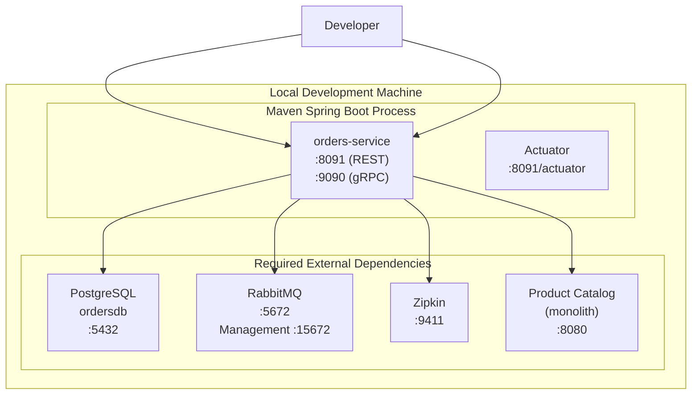
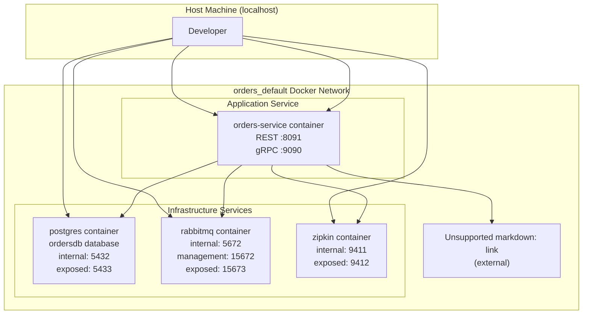
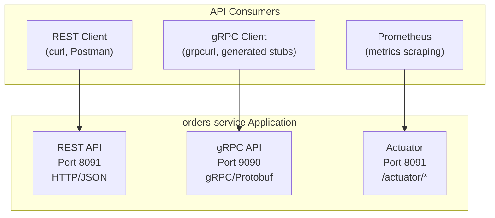

# Running Locally

> **Relevant source files**
> * [AGENTS.md](https://github.com/philipz/spring-modulith-orders/blob/eb506991/AGENTS.md)
> * [README-deployment.md](https://github.com/philipz/spring-modulith-orders/blob/eb506991/README-deployment.md)
> * [README.md](https://github.com/philipz/spring-modulith-orders/blob/eb506991/README.md)

This document explains how to start the `orders-service` on a local development machine. It covers two primary approaches: running the Spring Boot application directly via Maven, and running the full stack using Docker Compose. For information about building the project before running it, see [Building the Project](/philipz/spring-modulith-orders/2.2-building-the-project). For deployment to production environments, see [Local Development with Docker Compose](/philipz/spring-modulith-orders/6.1-local-development-with-docker-compose) and [Kubernetes Deployment](/philipz/spring-modulith-orders/6.2-kubernetes-deployment).

---

## Running with Maven Spring Boot Plugin

The simplest way to start the service during development is to use the Maven Spring Boot plugin. This approach launches only the `orders-service` application, assuming external dependencies (PostgreSQL, RabbitMQ) are already running.

### Basic Startup Command

```
./mvnw spring-boot:run
```

This command starts the application with default configuration from [src/main/resources/application.properties](https://github.com/philipz/spring-modulith-orders/blob/eb506991/src/main/resources/application.properties)

 The service exposes two API endpoints:

* **REST API**: `http://localhost:8091`
* **gRPC API**: `localhost:9090`

The Maven wrapper handles all dependency resolution and classpath configuration automatically. No separate Maven installation is required.

Sources: [AGENTS.md L12](https://github.com/philipz/spring-modulith-orders/blob/eb506991/AGENTS.md#L12-L12)

 [README.md L18-L22](https://github.com/philipz/spring-modulith-orders/blob/eb506991/README.md#L18-L22)

### Local Development Architecture (Maven Run)



**Local Development Architecture with Maven**: This diagram shows the minimal setup when running via `spring-boot:run`. The application process requires external PostgreSQL, RabbitMQ, and Zipkin instances to be accessible. The Product Catalog service (`monolith`) is optional but required for full order validation.

Sources: [AGENTS.md L12](https://github.com/philipz/spring-modulith-orders/blob/eb506991/AGENTS.md#L12-L12)

 [README-deployment.md L26-L31](https://github.com/philipz/spring-modulith-orders/blob/eb506991/README-deployment.md#L26-L31)

### Overriding Configuration with Environment Variables

When running via Maven, you can override application properties using environment variables or system properties:

```javascript
# Using environment variables
export SPRING_DATASOURCE_URL=jdbc:postgresql://localhost:5433/ordersdb
export SPRING_RABBITMQ_HOST=localhost
export SPRING_RABBITMQ_PORT=5672
./mvnw spring-boot:run

# Using Maven system properties
./mvnw spring-boot:run \
  -Dspring-boot.run.arguments="--spring.datasource.url=jdbc:postgresql://localhost:5433/ordersdb"
```

Key configuration properties for local development:

| Environment Variable | Default Value | Purpose |
| --- | --- | --- |
| `SPRING_DATASOURCE_URL` | `jdbc:postgresql://localhost:5432/postgres` | PostgreSQL connection string |
| `SPRING_DATASOURCE_USERNAME` | `postgres` | Database username |
| `SPRING_DATASOURCE_PASSWORD` | `postgres` | Database password |
| `SPRING_RABBITMQ_HOST` | `localhost` | RabbitMQ broker host |
| `SPRING_RABBITMQ_PORT` | `5672` | RabbitMQ AMQP port |
| `ORDERS_REST_ENABLED` | `true` | Enable REST API endpoints |
| `ORDERS_GRPC_SERVER_PORT` | `9090` | gRPC server port |

Sources: [README.md L24-L27](https://github.com/philipz/spring-modulith-orders/blob/eb506991/README.md#L24-L27)

 [AGENTS.md L35](https://github.com/philipz/spring-modulith-orders/blob/eb506991/AGENTS.md#L35-L35)

---

## Running with Docker Compose

For a complete local environment including all dependencies, use the provided Docker Compose configuration. This approach provisions PostgreSQL, RabbitMQ, Zipkin, and the `orders-service` as interconnected containers.

### Starting the Full Stack

Navigate to the service directory and start all services:

```
cd orders
docker compose up
```

To run in detached mode (background):

```
docker compose up -d
```

The Docker Compose file [orders/docker-compose.yml](https://github.com/philipz/spring-modulith-orders/blob/eb506991/orders/docker-compose.yml)

 defines the complete service topology:

Sources: [README-deployment.md L16-L23](https://github.com/philipz/spring-modulith-orders/blob/eb506991/README-deployment.md#L16-L23)

### Docker Compose Service Topology



**Docker Compose Service Topology**: This diagram maps the services defined in `docker-compose.yml` to their container names, internal ports, and host-exposed ports. All services communicate within the `orders_default` network using container names as hostnames.

Sources: [README-deployment.md L18-L31](https://github.com/philipz/spring-modulith-orders/blob/eb506991/README-deployment.md#L18-L31)

### Port Mappings and Access Points

The Docker Compose configuration exposes services on the following host ports:

| Service | Container Port | Host Port | Access URL | Purpose |
| --- | --- | --- | --- | --- |
| `orders-service` | 8091 | 8091 | `http://localhost:8091` | REST API |
| `orders-service` | 9090 | 9090 | `localhost:9090` | gRPC API |
| `postgres` | 5432 | 5433 | `localhost:5433` | Database access (SQL client) |
| `rabbitmq` | 5672 | 5672 | `localhost:5672` | AMQP protocol |
| `rabbitmq` | 15672 | 15673 | `http://localhost:15673` | Management UI (guest/guest) |
| `zipkin` | 9411 | 9412 | `http://localhost:9412` | Distributed tracing UI |

**Note**: PostgreSQL is exposed on port `5433` (not 5432) to avoid conflicts with locally-running PostgreSQL instances.

Sources: [README-deployment.md L26-L31](https://github.com/philipz/spring-modulith-orders/blob/eb506991/README-deployment.md#L26-L31)

### Docker Compose Configuration Details

The `orders-service` container in Docker Compose is configured with the following environment bindings from [orders/docker-compose.yml](https://github.com/philipz/spring-modulith-orders/blob/eb506991/orders/docker-compose.yml)

:

```markdown
# Key environment variables set in docker-compose.yml
SPRING_DATASOURCE_URL=jdbc:postgresql://postgres:5432/ordersdb
SPRING_RABBITMQ_HOST=rabbitmq
MANAGEMENT_ZIPKIN_TRACING_ENDPOINT=http://zipkin:9411/api/v2/spans
PRODUCT_API_BASE_URL=http://monolith:8080
```

The `PRODUCT_API_BASE_URL` defaults to `http://monolith:8080`, which assumes a separate Product Catalog service. Override this variable if your catalog service runs at a different location:

```
PRODUCT_API_BASE_URL=http://host.docker.internal:8080 docker compose up
```

Sources: [README-deployment.md L26-L31](https://github.com/philipz/spring-modulith-orders/blob/eb506991/README-deployment.md#L26-L31)

### Stopping and Cleaning Up

Stop all services while preserving data volumes:

```
docker compose down
```

Stop all services and remove volumes (destroys data):

```
docker compose down -v
```

View logs from all services:

```
docker compose logs -f
```

View logs from a specific service:

```
docker compose logs -f orders-service
```

Sources: [README-deployment.md L33](https://github.com/philipz/spring-modulith-orders/blob/eb506991/README-deployment.md#L33-L33)

---

## Port Assignment Reference

The `orders-service` uses well-defined port assignments across all runtime modes. Understanding these ports is essential for local development, testing, and integration with other services.

### Service Port Summary



**Service Port Architecture**: This diagram shows the dual-protocol design where port 8091 serves both REST API and Spring Boot Actuator endpoints, while port 9090 is dedicated to gRPC traffic.

Sources: [AGENTS.md L12](https://github.com/philipz/spring-modulith-orders/blob/eb506991/AGENTS.md#L12-L12)

 [README.md L20](https://github.com/philipz/spring-modulith-orders/blob/eb506991/README.md#L20-L20)

### Complete Port Reference Table

| Port | Protocol | Service | Configuration Property | Notes |
| --- | --- | --- | --- | --- |
| 8091 | HTTP | REST API | `server.port` | Serves `/api/*` endpoints |
| 8091 | HTTP | Actuator | `management.server.port` (shares with `server.port`) | Serves `/actuator/*` endpoints |
| 9090 | gRPC | gRPC API | `grpc.server.port` or `ORDERS_GRPC_SERVER_PORT` | Binary protocol (Protobuf) |
| 5432/5433 | TCP | PostgreSQL | `spring.datasource.url` | 5433 when using Docker Compose |
| 5672 | AMQP | RabbitMQ | `spring.rabbitmq.port` | Message broker protocol |
| 15672/15673 | HTTP | RabbitMQ Management | N/A (infrastructure only) | Web UI for queue inspection |
| 9411/9412 | HTTP | Zipkin | `management.zipkin.tracing.endpoint` | Distributed tracing collector |

The REST and Actuator endpoints share port 8091 as configured in [src/main/resources/application.properties](https://github.com/philipz/spring-modulith-orders/blob/eb506991/src/main/resources/application.properties)

 The gRPC server runs on a separate port to isolate binary protocol traffic from HTTP traffic.

Sources: [AGENTS.md L12](https://github.com/philipz/spring-modulith-orders/blob/eb506991/AGENTS.md#L12-L12)

 [README-deployment.md L26-L31](https://github.com/philipz/spring-modulith-orders/blob/eb506991/README-deployment.md#L26-L31)

---

## Environment Configuration for Local Development

When running locally, several environment variables control service behavior. These can be set in your shell or IDE run configuration.

### Core Database Configuration

```javascript
# PostgreSQL connection (Docker Compose uses internal hostnames)
export SPRING_DATASOURCE_URL=jdbc:postgresql://localhost:5433/ordersdb
export SPRING_DATASOURCE_USERNAME=postgres
export SPRING_DATASOURCE_PASSWORD=postgres
```

The database URL differs between runtime modes:

* **Maven run**: `jdbc:postgresql://localhost:5432/postgres` (assumes local PostgreSQL)
* **Docker Compose**: `jdbc:postgresql://postgres:5432/ordersdb` (uses container name)

Sources: [README-deployment.md L26-L31](https://github.com/philipz/spring-modulith-orders/blob/eb506991/README-deployment.md#L26-L31)

### Message Broker Configuration

```javascript
# RabbitMQ connection
export SPRING_RABBITMQ_HOST=localhost
export SPRING_RABBITMQ_PORT=5672
export SPRING_RABBITMQ_USERNAME=guest
export SPRING_RABBITMQ_PASSWORD=guest
```

The service publishes `OrderCreatedEvent` to the `BookStoreExchange` exchange. Verify event publication by accessing the RabbitMQ management UI at `http://localhost:15673` (Docker Compose) or `http://localhost:15672` (local RabbitMQ).

Sources: [README-deployment.md L28](https://github.com/philipz/spring-modulith-orders/blob/eb506991/README-deployment.md#L28-L28)

 [AGENTS.md L35-L36](https://github.com/philipz/spring-modulith-orders/blob/eb506991/AGENTS.md#L35-L36)

### Feature Flags

```javascript
# Enable/disable API protocols
export ORDERS_REST_ENABLED=true      # Enable REST endpoints (default: true)
export ORDERS_GRPC_ENABLED=true      # Enable gRPC server (default: true)
```

These flags control which API protocols are active. Disabling `ORDERS_REST_ENABLED` removes all `/api/*` endpoints from the HTTP server.

Sources: [README.md L27](https://github.com/philipz/spring-modulith-orders/blob/eb506991/README.md#L27-L27)

 [AGENTS.md L35](https://github.com/philipz/spring-modulith-orders/blob/eb506991/AGENTS.md#L35-L35)

### Observability Configuration

```javascript
# Distributed tracing
export MANAGEMENT_ZIPKIN_TRACING_ENDPOINT=http://localhost:9412/api/v2/spans

# OpenTelemetry Protocol (alternative to Zipkin)
export MANAGEMENT_OTLP_TRACING_ENDPOINT=http://localhost:4318/v1/traces

# Actuator endpoints
export MANAGEMENT_ENDPOINTS_WEB_EXPOSURE_INCLUDE=health,info,metrics,prometheus
```

Actuator endpoints are enabled by default. Access them at `http://localhost:8091/actuator` to verify service health and metrics.

Sources: [AGENTS.md L36](https://github.com/philipz/spring-modulith-orders/blob/eb506991/AGENTS.md#L36-L36)

### Cache Configuration

```javascript
# Hazelcast distributed cache settings
export BOOKSTORE_CACHE_ENABLED=true
export BOOKSTORE_CACHE_TTL_MINUTES=30
export BOOKSTORE_CACHE_MAX_SIZE=10000

# Circuit breaker for cache failures
export BOOKSTORE_CACHE_CIRCUIT_FAILURE_THRESHOLD=5
export BOOKSTORE_CACHE_CIRCUIT_WAIT_DURATION_SECONDS=60
```

The cache layer uses `CacheErrorHandler` to implement a circuit breaker pattern. When the cache becomes unavailable, the circuit opens and requests fall back to direct database access.

Sources: [AGENTS.md L37](https://github.com/philipz/spring-modulith-orders/blob/eb506991/AGENTS.md#L37-L37)

### External Service Integration

```javascript
# Product Catalog service (for order validation)
export PRODUCT_API_BASE_URL=http://localhost:8080

# Alternative: use monolith container name in Docker Compose
export PRODUCT_API_BASE_URL=http://monolith:8080
```

The `ProductCatalogPort` interface validates product codes and prices against the Product Catalog service before creating orders. This integration is defined in [orders/infrastructure slice](https://github.com/philipz/spring-modulith-orders/blob/eb506991/orders/infrastructure slice)

Sources: [README-deployment.md L31](https://github.com/philipz/spring-modulith-orders/blob/eb506991/README-deployment.md#L31-L31)

---

## Verifying the Service is Running

After starting the service, verify that all components are operational.

### Health Check Endpoints

Check basic application health:

```
curl http://localhost:8091/actuator/health
```

Expected response:

```json
{
  "status": "UP",
  "groups": ["liveness", "readiness"]
}
```

Check detailed health including infrastructure dependencies:

```
curl http://localhost:8091/actuator/health/readiness
```

This endpoint reports the status of PostgreSQL, RabbitMQ, and other dependencies.

Sources: [AGENTS.md L36](https://github.com/philipz/spring-modulith-orders/blob/eb506991/AGENTS.md#L36-L36)

### REST API Verification

List all orders (returns empty array initially):

```
curl http://localhost:8091/api/orders
```

Create a test order:

```
curl -X POST http://localhost:8091/api/orders \
  -H "Content-Type: application/json" \
  -d '{
    "customer": {
      "name": "John Doe",
      "email": "john@example.com",
      "phone": "123-456-7890"
    },
    "items": [
      {
        "code": "P100",
        "name": "Test Product",
        "price": 29.99,
        "quantity": 2
      }
    ]
  }'
```

Expected response:

```json
{
  "orderNumber": "order_1234567890"
}
```

Sources: [AGENTS.md L31](https://github.com/philipz/spring-modulith-orders/blob/eb506991/AGENTS.md#L31-L31)

### gRPC API Verification

Using `grpcurl` (install from [https://github.com/fullstorydev/grpcurl](https://github.com/fullstorydev/grpcurl)):

List available gRPC services:

```
grpcurl -plaintext localhost:9090 list
```

Expected output:

```
com.sivalabs.bookstore.orders.OrdersService
grpc.health.v1.Health
grpc.reflection.v1alpha.ServerReflection
```

Create an order via gRPC:

```
grpcurl -plaintext -d '{
  "customer": {
    "name": "Jane Smith",
    "email": "jane@example.com",
    "phone": "098-765-4321"
  },
  "items": [
    {
      "code": "P200",
      "name": "Another Product",
      "price": 49.99,
      "quantity": 1
    }
  ]
}' localhost:9090 com.sivalabs.bookstore.orders.OrdersService/CreateOrder
```

Sources: [README-deployment.md L30](https://github.com/philipz/spring-modulith-orders/blob/eb506991/README-deployment.md#L30-L30)

### Database Verification

Connect to PostgreSQL to inspect the database schema:

```markdown
# When using Docker Compose
docker exec -it orders-postgres-1 psql -U postgres -d ordersdb

# When using local PostgreSQL
psql -h localhost -p 5433 -U postgres -d ordersdb
```

List Liquibase-managed schemas:

```
\dn
```

Expected schemas:

* `orders` - Application tables
* `orders_events` - Spring Modulith event store

List orders table:

```sql
SELECT * FROM orders.orders;
```

Sources: [README-deployment.md L27](https://github.com/philipz/spring-modulith-orders/blob/eb506991/README-deployment.md#L27-L27)

### RabbitMQ Verification

Access the RabbitMQ Management UI:

* **Docker Compose**: `http://localhost:15673`
* **Local RabbitMQ**: `http://localhost:15672`
* **Credentials**: `guest` / `guest`

Navigate to **Exchanges** and verify `BookStoreExchange` exists. After creating an order, check **Queues** for published `OrderCreatedEvent` messages.

Sources: [README-deployment.md L28](https://github.com/philipz/spring-modulith-orders/blob/eb506991/README-deployment.md#L28-L28)

### Zipkin Trace Verification

Access the Zipkin UI:

* **Docker Compose**: `http://localhost:9412`
* **Local Zipkin**: `http://localhost:9411`

After making API requests, search for traces to visualize request flow through the service layers. Each trace shows the complete lifecycle from REST/gRPC endpoint through domain logic to database and event publication.

Sources: [README-deployment.md L29](https://github.com/philipz/spring-modulith-orders/blob/eb506991/README-deployment.md#L29-L29)

---

## Troubleshooting Common Issues

### Port Conflicts

If port 8091 or 9090 is already in use:

```javascript
# Find process using port 8091
lsof -i :8091

# Override ports
export SERVER_PORT=8092
export ORDERS_GRPC_SERVER_PORT=9091
./mvnw spring-boot:run
```

### Database Connection Failures

Verify PostgreSQL is running and accessible:

```sql
# Test connection
psql -h localhost -p 5433 -U postgres -d ordersdb -c "SELECT 1"
```

If using Docker Compose and seeing connection errors, ensure the `postgres` container is healthy:

```
docker compose ps
docker compose logs postgres
```

### RabbitMQ Connection Issues

Check RabbitMQ container logs:

```
docker compose logs rabbitmq
```

Verify RabbitMQ is accepting connections:

```markdown
# Test AMQP port
telnet localhost 5672
```

### Hazelcast Cache Errors

If cache initialization fails, the circuit breaker opens automatically and requests fall back to the database. Check logs for:

```yaml
CacheErrorHandler: Circuit breaker opened due to consecutive failures
```

This is expected behavior when Hazelcast is unavailable. The service remains operational with degraded caching.

Sources: [AGENTS.md L37](https://github.com/philipz/spring-modulith-orders/blob/eb506991/AGENTS.md#L37-L37)

---

## Next Steps

After successfully running the service locally:

* Review [REST API](/philipz/spring-modulith-orders/4.1-rest-api) and [gRPC API](/philipz/spring-modulith-orders/4.2-grpc-api) documentation for detailed endpoint reference
* Explore [Event-Driven Architecture](/philipz/spring-modulith-orders/3.4-event-driven-architecture) to understand event publishing and consumption
* Learn about [Testing](/philipz/spring-modulith-orders/7-testing) to write integration tests against your local instance
* See [Configuration](/philipz/spring-modulith-orders/8.1-application-configuration) for a complete reference of all configuration options

Sources: [README.md L33-L36](https://github.com/philipz/spring-modulith-orders/blob/eb506991/README.md#L33-L36)