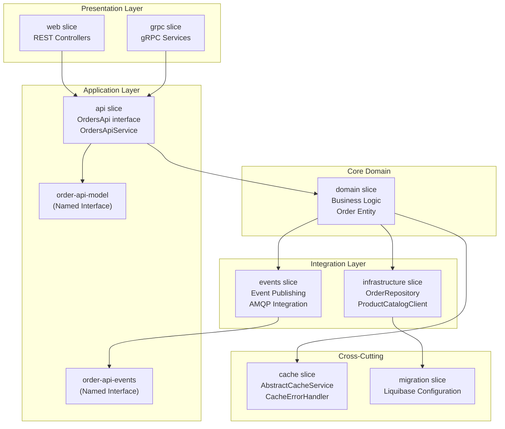
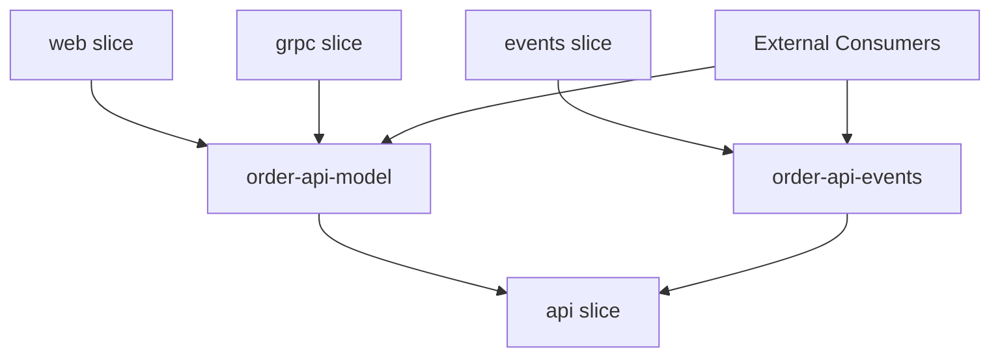
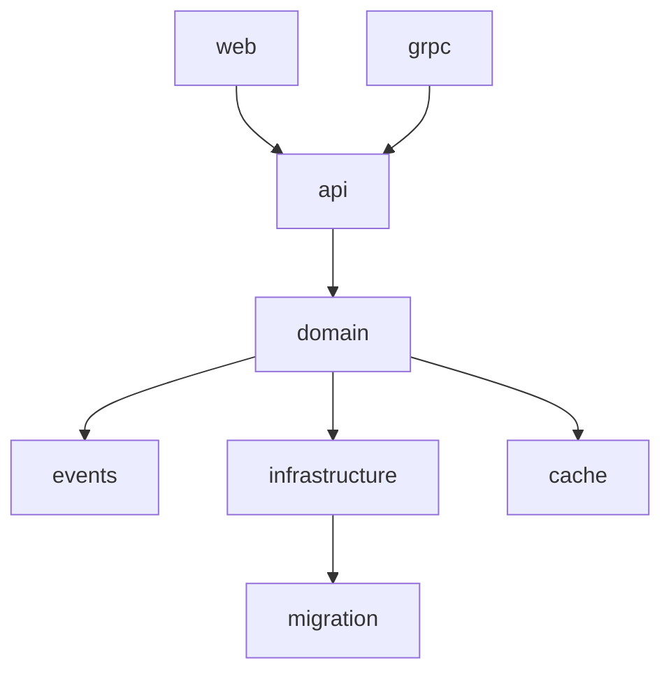
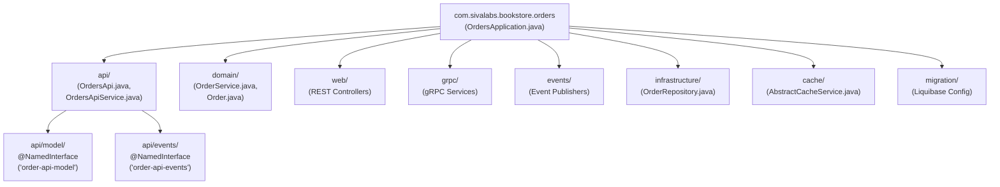

# Spring Modulith Organization

> **Relevant source files**
> * [AGENTS.md](https://github.com/philipz/spring-modulith-orders/blob/eb506991/AGENTS.md)
> * [README.md](https://github.com/philipz/spring-modulith-orders/blob/eb506991/README.md)
> * [src/main/java/com/sivalabs/bookstore/orders/OrdersApplication.java](https://github.com/philipz/spring-modulith-orders/blob/eb506991/src/main/java/com/sivalabs/bookstore/orders/OrdersApplication.java)
> * [src/main/java/com/sivalabs/bookstore/orders/api/events/package-info.java](https://github.com/philipz/spring-modulith-orders/blob/eb506991/src/main/java/com/sivalabs/bookstore/orders/api/events/package-info.java)
> * [src/main/java/com/sivalabs/bookstore/orders/api/model/package-info.java](https://github.com/philipz/spring-modulith-orders/blob/eb506991/src/main/java/com/sivalabs/bookstore/orders/api/model/package-info.java)
> * [src/main/java/com/sivalabs/bookstore/orders/api/package-info.java](https://github.com/philipz/spring-modulith-orders/blob/eb506991/src/main/java/com/sivalabs/bookstore/orders/api/package-info.java)

## Purpose and Scope

This document explains the Spring Modulith architecture used to organize the orders-service codebase. It details the slice-based structure, named interfaces, module boundaries, and dependency rules that maintain separation of concerns and enforce architectural boundaries. For information about the overall system architecture and external integrations, see [System Architecture](/philipz/spring-modulith-orders/3.1-system-architecture). For API layer implementation details, see [API Layer Design](/philipz/spring-modulith-orders/3.3-api-layer-design).

## Spring Modulith Overview

Spring Modulith is an architectural approach that applies modular design principles within a single Spring Boot application. Rather than organizing code by technical layers (controllers, services, repositories), Spring Modulith organizes code into **slices** or **modules** that represent vertical capabilities or cross-cutting concerns.

The orders-service uses Spring Modulith to:

* Enforce architectural boundaries at compile time
* Make module dependencies explicit and verifiable
* Support incremental extraction to microservices if needed
* Provide clear separation between public APIs and internal implementation

All slices reside under `src/main/java/com/sivalabs/bookstore/orders/` and follow a consistent organizational pattern.

**Sources:** [AGENTS.md L4](https://github.com/philipz/spring-modulith-orders/blob/eb506991/AGENTS.md#L4-L4)

 [README.md L6](https://github.com/philipz/spring-modulith-orders/blob/eb506991/README.md#L6-L6)

## Slice Structure Overview

The application is organized into eight distinct slices:

| Slice | Location | Primary Responsibility |
| --- | --- | --- |
| `domain` | `orders/domain/` | Core business logic and entities |
| `api` | `orders/api/` | Application service facade and contracts |
| `web` | `orders/web/` | REST API controllers |
| `grpc` | `orders/grpc/` | gRPC service implementations |
| `events` | `orders/events/` | Event publishing and consumption |
| `infrastructure` | `orders/infrastructure/` | Database access and external clients |
| `cache` | `orders/cache/` | Distributed caching with Hazelcast |
| `migration` | `orders/migration/` | Database schema versioning |

This structure separates presentation concerns (web, grpc), application orchestration (api), domain logic (domain), integration concerns (events, infrastructure), and cross-cutting capabilities (cache, migration).

### Slice Organization Diagram

**Sources:** [AGENTS.md L4](https://github.com/philipz/spring-modulith-orders/blob/eb506991/AGENTS.md#L4-L4)

 [README.md L6](https://github.com/philipz/spring-modulith-orders/blob/eb506991/README.md#L6-L6)

## Named Interfaces

Spring Modulith uses **named interfaces** to expose explicit public contracts from modules. The orders-service defines two named interfaces in the `api` slice:

### order-api-model

This named interface exposes data transfer objects (DTOs) that represent the public API contract. It includes request and response models used by both REST and gRPC interfaces.

The interface is declared with the `@NamedInterface` annotation:

[src/main/java/com/sivalabs/bookstore/orders/api/model/package-info.java L1-L2](https://github.com/philipz/spring-modulith-orders/blob/eb506991/src/main/java/com/sivalabs/bookstore/orders/api/model/package-info.java#L1-L2)

Key types exposed through this interface:

* `CreateOrderRequest` - Input for order creation
* `CreateOrderResponse` - Output containing order number
* `OrderDto` - Detailed order representation
* `OrderView` - Summary view for lists
* `Customer` - Customer information
* `OrderItem` - Line item details
* `OrderStatus` - Enumeration of order states

### order-api-events

This named interface exposes event contracts published by the orders domain. External systems and other slices can depend on these events without coupling to internal implementation.

[src/main/java/com/sivalabs/bookstore/orders/api/events/package-info.java L1-L2](https://github.com/philipz/spring-modulith-orders/blob/eb506991/src/main/java/com/sivalabs/bookstore/orders/api/events/package-info.java#L1-L2)

Key events exposed:

* `OrderCreatedEvent` - Published when a new order is created

These named interfaces serve as stability boundaries. External consumers depend only on these contracts, allowing internal implementation to evolve independently.

**Sources:** [src/main/java/com/sivalabs/bookstore/orders/api/model/package-info.java L1-L2](https://github.com/philipz/spring-modulith-orders/blob/eb506991/src/main/java/com/sivalabs/bookstore/orders/api/model/package-info.java#L1-L2)

 [src/main/java/com/sivalabs/bookstore/orders/api/events/package-info.java L1-L2](https://github.com/philipz/spring-modulith-orders/blob/eb506991/src/main/java/com/sivalabs/bookstore/orders/api/events/package-info.java#L1-L2)

### Named Interface Dependencies

**Sources:** [src/main/java/com/sivalabs/bookstore/orders/api/model/package-info.java L1-L2](https://github.com/philipz/spring-modulith-orders/blob/eb506991/src/main/java/com/sivalabs/bookstore/orders/api/model/package-info.java#L1-L2)

 [src/main/java/com/sivalabs/bookstore/orders/api/events/package-info.java L1-L2](https://github.com/philipz/spring-modulith-orders/blob/eb506991/src/main/java/com/sivalabs/bookstore/orders/api/events/package-info.java#L1-L2)

## Detailed Slice Descriptions

### domain Slice

The `domain` slice contains core business logic, entity models, and domain services. This is the heart of the application where business rules are enforced.

**Location:** `src/main/java/com/sivalabs/bookstore/orders/domain/`

**Key responsibilities:**

* Define `Order` entity with lifecycle management
* Implement business validation rules
* Coordinate with infrastructure for persistence
* Trigger domain events on state changes

**Key components:**

* `OrderService` - Core business logic for order operations
* `Order` - Aggregate root entity
* Domain validation methods

The domain slice depends on:

* `infrastructure` slice for database access
* `events` slice for publishing domain events
* `cache` slice for performance optimization

**Exports:** The domain slice exposes `OrderService` as its public API but keeps entity implementations internal.

### api Slice

The `api` slice provides the application service layer, acting as a facade between presentation layers (web, grpc) and the domain.

**Location:** `src/main/java/com/sivalabs/bookstore/orders/api/`

**Key responsibilities:**

* Define `OrdersApi` interface as the application contract
* Implement `OrdersApiService` for orchestration logic
* Perform request validation (bean validation, business rules)
* Transform between DTOs and domain entities using `OrderMapper`
* Coordinate external service calls via `ProductCatalogPort`

**Key components:**

* `OrdersApi` interface - Application service contract
* `OrdersApiService` - Implementation class
* `OrderMapper` - DTO ↔ Entity transformation
* `ProductCatalogPort` - External service interface

The api slice depends on:

* `domain` slice for business logic
* Named interfaces for public contracts

**Exports:** `OrdersApi` interface and all types in `order-api-model` named interface.

### web Slice

The `web` slice provides the REST API layer for HTTP-based clients.

**Location:** `src/main/java/com/sivalabs/bookstore/orders/web/`

**Key responsibilities:**

* Expose REST endpoints using Spring MVC `@RestController`
* Handle HTTP request/response marshalling
* Provide OpenAPI documentation
* Map application exceptions to HTTP status codes

**Key components:**

* REST controllers for order operations
* Exception handlers for HTTP error responses
* OpenAPI configuration

The web slice depends on:

* `api` slice for business operations
* `order-api-model` for request/response types

**Exports:** REST endpoints exposed on port 8091 (configurable via `ORDERS_REST_ENABLED`).

### grpc Slice

The `grpc` slice provides the gRPC API layer for high-performance, type-safe communication.

**Location:** `src/main/java/com/sivalabs/bookstore/orders/grpc/`

**Key responsibilities:**

* Implement gRPC service definitions using `@GrpcService`
* Transform between Protocol Buffer messages and API models
* Handle gRPC-specific error codes and metadata

**Key components:**

* gRPC service implementations
* Message adapters for protobuf ↔ Java transformations

The grpc slice depends on:

* `api` slice for business operations
* `order-api-model` for internal data representation
* Generated protobuf classes from `src/main/proto/`

**Exports:** gRPC services exposed on port 9090.

### events Slice

The `events` slice manages asynchronous event publishing and consumption using Spring Modulith's event system.

**Location:** `src/main/java/com/sivalabs/bookstore/orders/events/`

**Key responsibilities:**

* Publish domain events to internal event store
* Externalize events to RabbitMQ using `@Externalized` annotation
* Configure AMQP routing (BookStoreExchange)
* Provide event serialization for external systems

**Key components:**

* Event publishers using Spring Modulith's `ApplicationEventPublisher`
* `@Externalized` configuration for AMQP integration
* Event serialization adapters

The events slice depends on:

* `order-api-events` for event contract definitions
* Spring Modulith JDBC event store
* Spring AMQP for RabbitMQ integration

**Exports:** Publishes events to both internal event store and external RabbitMQ broker.

### infrastructure Slice

The `infrastructure` slice handles all external system interactions including database access and external service clients.

**Location:** `src/main/java/com/sivalabs/bookstore/orders/infrastructure/`

**Key responsibilities:**

* Implement Spring Data JPA repositories
* Provide database entity mappings
* Implement external service clients (ProductCatalog)
* Handle connection pooling and transaction management

**Key components:**

* `OrderRepository` - JPA repository for Order entity
* `ProductCatalogClient` - REST client for product validation
* Database configuration classes

The infrastructure slice depends on:

* `migration` slice for schema management
* PostgreSQL database

**Exports:** Repository interfaces and external client implementations to domain slice.

### cache Slice

The `cache` slice provides distributed caching capabilities with built-in resilience.

**Location:** `src/main/java/com/sivalabs/bookstore/orders/cache/`

**Key responsibilities:**

* Abstract Hazelcast distributed cache operations
* Implement circuit breaker for cache failures
* Provide cache statistics and health checks
* Define fallback strategies when cache is unavailable

**Key components:**

* `AbstractCacheService` - Base class for cache operations
* `CacheErrorHandler` - Circuit breaker implementation
* Cache configuration for Hazelcast `IMap`

The cache slice is used by:

* `domain` slice for performance optimization
* Any slice requiring distributed caching

**Exports:** `AbstractCacheService` base class and cache-related utilities.

### migration Slice

The `migration` slice manages database schema versioning using Liquibase.

**Location:** `src/main/java/com/sivalabs/bookstore/orders/migration/`

**Key responsibilities:**

* Configure Liquibase change log scanning
* Manage database schema evolution
* Coordinate with Spring Boot auto-configuration
* Track applied migrations

**Key components:**

* Liquibase configuration classes
* Change logs in `src/main/resources/db/`

The migration slice is used by:

* `infrastructure` slice before database access
* Application startup process

**Exports:** Database schema setup as a precondition for application operation.

**Sources:** [AGENTS.md L4-L8](https://github.com/philipz/spring-modulith-orders/blob/eb506991/AGENTS.md#L4-L8)

 [README.md L6-L10](https://github.com/philipz/spring-modulith-orders/blob/eb506991/README.md#L6-L10)

## Module Boundaries and Dependency Rules

Spring Modulith enforces dependency rules to maintain architectural integrity. The following diagram shows allowed dependencies between slices:

### Dependency Flow Diagram

### Dependency Rules

1. **Presentation → Application:** The `web` and `grpc` slices may only depend on the `api` slice, never directly on `domain`.
2. **Application → Domain:** The `api` slice orchestrates domain operations but doesn't contain business logic.
3. **Domain → Integration:** The `domain` slice coordinates with `infrastructure`, `events`, and `cache` but doesn't depend on presentation layers.
4. **Layered Dependencies:** Lower-level slices (`migration`, `infrastructure`) cannot depend on higher-level slices (`domain`, `api`).
5. **Named Interface Isolation:** External consumers depend only on named interfaces (`order-api-model`, `order-api-events`), not on slice internals.
6. **No Circular Dependencies:** Spring Modulith validates at build time that no circular dependencies exist between slices.

**Sources:** [AGENTS.md L4](https://github.com/philipz/spring-modulith-orders/blob/eb506991/AGENTS.md#L4-L4)

## Package Structure in Code

The physical package structure mirrors the slice organization:

All slices are located under the root package defined in `OrdersApplication`:

[src/main/java/com/sivalabs/bookstore/orders/OrdersApplication.java L1-L12](https://github.com/philipz/spring-modulith-orders/blob/eb506991/src/main/java/com/sivalabs/bookstore/orders/OrdersApplication.java#L1-L12)

Named interfaces are declared using `package-info.java` files with the `@NamedInterface` annotation:

* [src/main/java/com/sivalabs/bookstore/orders/api/model/package-info.java L1-L2](https://github.com/philipz/spring-modulith-orders/blob/eb506991/src/main/java/com/sivalabs/bookstore/orders/api/model/package-info.java#L1-L2)
* [src/main/java/com/sivalabs/bookstore/orders/api/events/package-info.java L1-L2](https://github.com/philipz/spring-modulith-orders/blob/eb506991/src/main/java/com/sivalabs/bookstore/orders/api/events/package-info.java#L1-L2)

**Sources:** [src/main/java/com/sivalabs/bookstore/orders/OrdersApplication.java L1-L12](https://github.com/philipz/spring-modulith-orders/blob/eb506991/src/main/java/com/sivalabs/bookstore/orders/OrdersApplication.java#L1-L12)

 [src/main/java/com/sivalabs/bookstore/orders/api/model/package-info.java L1-L2](https://github.com/philipz/spring-modulith-orders/blob/eb506991/src/main/java/com/sivalabs/bookstore/orders/api/model/package-info.java#L1-L2)

 [src/main/java/com/sivalabs/bookstore/orders/api/events/package-info.java L1-L2](https://github.com/philipz/spring-modulith-orders/blob/eb506991/src/main/java/com/sivalabs/bookstore/orders/api/events/package-info.java#L1-L2)

## Benefits of This Organization

The Spring Modulith slice structure provides several advantages:

| Benefit | Description |
| --- | --- |
| **Clear Boundaries** | Each slice has explicit responsibilities and dependencies |
| **Compile-Time Verification** | Spring Modulith validates architecture rules at build time |
| **Independent Evolution** | Internal implementation can change without affecting consumers of named interfaces |
| **Testability** | Slices can be tested in isolation with defined integration points |
| **Migration Path** | Well-defined slices can be extracted to separate services if needed |
| **Reduced Coupling** | Named interfaces prevent direct dependencies on implementation details |
| **Documentation** | Architecture is self-documenting through package structure |

**Sources:** [AGENTS.md L4](https://github.com/philipz/spring-modulith-orders/blob/eb506991/AGENTS.md#L4-L4)

## Verification

Spring Modulith provides tools to verify architectural compliance. The build process can include module structure tests that fail if dependencies violate the defined rules. This ensures that the documented architecture remains consistent with the actual implementation.

For more details on how these slices work together in practice, see:

* [API Layer Design](/philipz/spring-modulith-orders/3.3-api-layer-design) for details on `OrdersApi` and validation pipeline
* [Event-Driven Architecture](/philipz/spring-modulith-orders/3.4-event-driven-architecture) for event publishing mechanics
* [Core Components](/philipz/spring-modulith-orders/5-core-components) for implementation details of key services

**Sources:** [AGENTS.md L4-L8](https://github.com/philipz/spring-modulith-orders/blob/eb506991/AGENTS.md#L4-L8)

 [README.md L6](https://github.com/philipz/spring-modulith-orders/blob/eb506991/README.md#L6-L6)