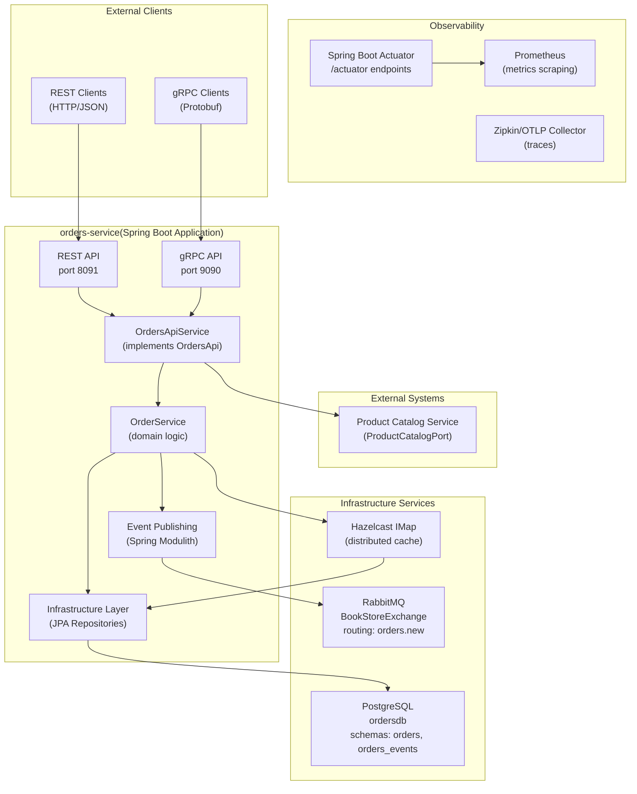
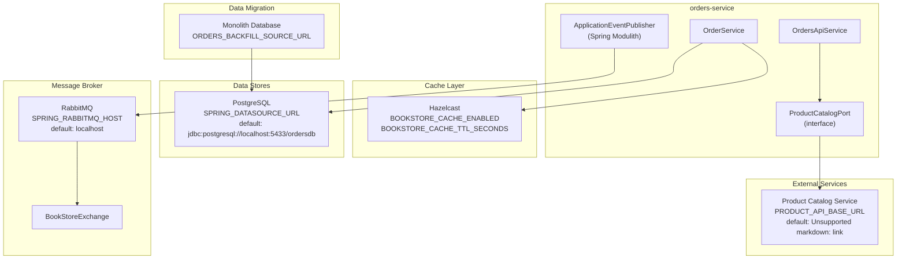
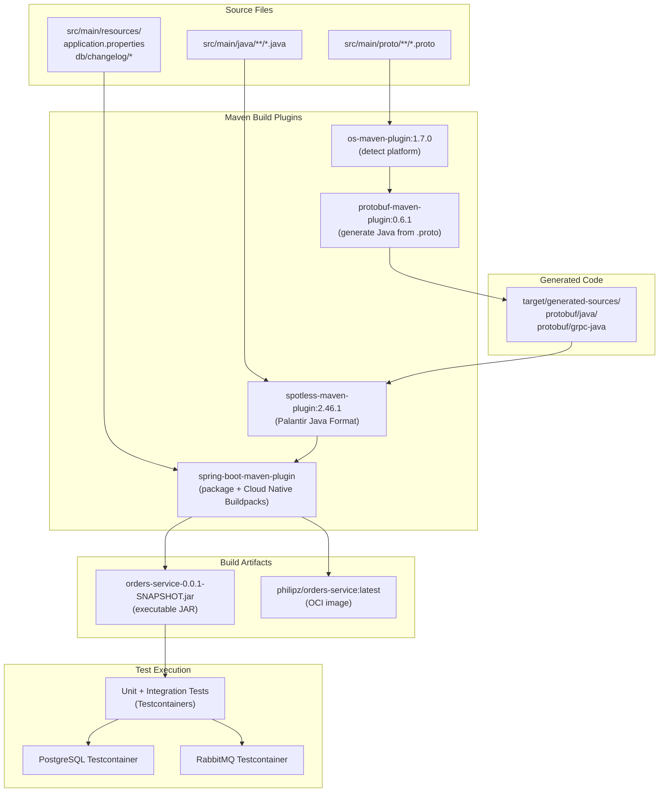

# System Architecture

> **Relevant source files**
> * [README-deployment.md](https://github.com/philipz/spring-modulith-orders/blob/eb506991/README-deployment.md)
> * [README.md](https://github.com/philipz/spring-modulith-orders/blob/eb506991/README.md)
> * [pom.xml](https://github.com/philipz/spring-modulith-orders/blob/eb506991/pom.xml)
> * [src/main/java/com/sivalabs/bookstore/orders/OrdersApiService.java](https://github.com/philipz/spring-modulith-orders/blob/eb506991/src/main/java/com/sivalabs/bookstore/orders/OrdersApiService.java)
> * [src/main/java/com/sivalabs/bookstore/orders/OrdersApplication.java](https://github.com/philipz/spring-modulith-orders/blob/eb506991/src/main/java/com/sivalabs/bookstore/orders/OrdersApplication.java)

## Purpose and Scope

This document describes the high-level technical architecture of the `orders-service` microservice, including its technology stack, external dependencies, component structure, and deployment characteristics. It covers the framework versions, integration points, port assignments, and build pipeline configuration.

For details about the internal Spring Modulith slice organization, see [Spring Modulith Organization](/philipz/spring-modulith-orders/3.2-spring-modulith-organization). For API-specific design patterns, see [API Layer Design](/philipz/spring-modulith-orders/3.3-api-layer-design). For deployment procedures and environment configuration, see [Local Development with Docker Compose](/philipz/spring-modulith-orders/6.1-local-development-with-docker-compose) and [Kubernetes Deployment](/philipz/spring-modulith-orders/6.2-kubernetes-deployment).

**Sources:** [README.md L1-L37](https://github.com/philipz/spring-modulith-orders/blob/eb506991/README.md#L1-L37)

 [README-deployment.md L1-L91](https://github.com/philipz/spring-modulith-orders/blob/eb506991/README-deployment.md#L1-L91)

 [pom.xml L1-L315](https://github.com/philipz/spring-modulith-orders/blob/eb506991/pom.xml#L1-L315)

---

## Technology Stack

The `orders-service` is built on Spring Boot 3.5 with Java 21 and uses Spring Modulith for internal module organization. The following table lists the core technologies and their versions as defined in [pom.xml L21-L31](https://github.com/philipz/spring-modulith-orders/blob/eb506991/pom.xml#L21-L31)

:

| Technology | Version | Purpose |
| --- | --- | --- |
| Java | 21 | Runtime platform |
| Spring Boot | 3.5.5 | Application framework |
| Spring Modulith | 1.4.3 | Module boundaries and event system |
| PostgreSQL | Runtime | Primary persistence store |
| Liquibase | Spring Boot default | Database schema migrations |
| RabbitMQ | Spring Boot default | Asynchronous messaging |
| Hazelcast | 5.5.6 | Distributed caching and session storage |
| gRPC | 1.58.0 | RPC protocol (via `grpc-spring-boot-starter` 2.15.0.RELEASE) |
| Resilience4j | 2.2.0 | Circuit breaker, retry, rate limiting |
| OpenTelemetry | Spring Boot default | Distributed tracing |
| Micrometer | Spring Boot default | Metrics collection |

**Sources:** [pom.xml L7-L31](https://github.com/philipz/spring-modulith-orders/blob/eb506991/pom.xml#L7-L31)

 [pom.xml L45-L238](https://github.com/philipz/spring-modulith-orders/blob/eb506991/pom.xml#L45-L238)

---

## Core Framework Dependencies

The service leverages the following Spring Boot starters and Spring Modulith modules as defined in [pom.xml L45-L156](https://github.com/philipz/spring-modulith-orders/blob/eb506991/pom.xml#L45-L156)

:

```mermaid
flowchart TD

App["OrdersApplication<br>(Main Entry Point)"]
Web["spring-boot-starter-web"]
Validation["spring-boot-starter-validation"]
AOP["spring-boot-starter-aop"]
JPA["spring-boot-starter-data-jpa"]
AMQP["spring-boot-starter-amqp"]
Actuator["spring-boot-starter-actuator"]
Core["spring-modulith-starter-core"]
JDBC["spring-modulith-starter-jdbc<br>(Event Store)"]
EventsAMQP["spring-modulith-events-amqp<br>(@Externalized)"]
ModulithActuator["spring-modulith-actuator"]
ModulithObs["spring-modulith-observability"]
GrpcStarter["grpc-spring-boot-starter<br>(net.devh:2.15.0)"]
GrpcProto["grpc-protobuf:1.58.0"]
GrpcStub["grpc-stub:1.58.0"]
GrpcNetty["grpc-netty:1.58.0"]
Postgres["postgresql<br>(runtime)"]
Liquibase["liquibase-core"]
HZ["hazelcast:5.5.6"]
HZSpring["hazelcast-spring:5.5.6"]
Session["spring-session-hazelcast"]
R4J["resilience4j-spring-boot3:2.2.0"]
Prometheus["micrometer-registry-prometheus"]
OTEL["micrometer-tracing-bridge-otel"]
OTLPExporter["opentelemetry-exporter-otlp"]

App --> Web
App --> Validation
App --> AOP
App --> JPA
App --> AMQP
App --> Actuator
App --> Core
App --> JDBC
App --> GrpcStarter
JPA --> Postgres
JPA --> Liquibase
Web --> R4J
Actuator --> Prometheus
Actuator --> OTEL
App --> HZ
App --> HZSpring
App --> Session

subgraph Observability ["Observability"]
    Prometheus
    OTEL
    OTLPExporter
    OTEL --> OTLPExporter
end

subgraph Resilience ["Resilience"]
    R4J
end

subgraph Cache ["Caching"]
    HZ
    HZSpring
    Session
end

subgraph Persistence ["Persistence"]
    Postgres
    Liquibase
end

subgraph gRPC ["gRPC Stack"]
    GrpcStarter
    GrpcProto
    GrpcStub
    GrpcNetty
    GrpcStarter --> GrpcProto
    GrpcStarter --> GrpcStub
    GrpcStarter --> GrpcNetty
end

subgraph Modulith ["Spring Modulith 1.4.3"]
    Core
    JDBC
    EventsAMQP
    ModulithActuator
    ModulithObs
    Core --> EventsAMQP
    Core --> ModulithActuator
    Core --> ModulithObs
end

subgraph SpringBoot ["Spring Boot 3.5.5 Starters"]
    Web
    Validation
    AOP
    JPA
    AMQP
    Actuator
end
```

**Sources:** [pom.xml L45-L156](https://github.com/philipz/spring-modulith-orders/blob/eb506991/pom.xml#L45-L156)

 [pom.xml L159-L178](https://github.com/philipz/spring-modulith-orders/blob/eb506991/pom.xml#L159-L178)

 [pom.xml L82-L112](https://github.com/philipz/spring-modulith-orders/blob/eb506991/pom.xml#L82-L112)

 [src/main/java/com/sivalabs/bookstore/orders/OrdersApplication.java L1-L12](https://github.com/philipz/spring-modulith-orders/blob/eb506991/src/main/java/com/sivalabs/bookstore/orders/OrdersApplication.java#L1-L12)

---

## High-Level Component Architecture

The `orders-service` operates as a standalone Spring Boot application with dual API interfaces and multiple external integration points:

**Sources:** [src/main/java/com/sivalabs/bookstore/orders/OrdersApiService.java L1-L77](https://github.com/philipz/spring-modulith-orders/blob/eb506991/src/main/java/com/sivalabs/bookstore/orders/OrdersApiService.java#L1-L77)

 [README-deployment.md L18-L31](https://github.com/philipz/spring-modulith-orders/blob/eb506991/README-deployment.md#L18-L31)

 [README.md L1-L37](https://github.com/philipz/spring-modulith-orders/blob/eb506991/README.md#L1-L37)

---

## External Dependencies and Integration Points

The service integrates with external systems through well-defined ports and adapters:

**Environment Variables Referenced:**

* `PRODUCT_API_BASE_URL`: Product catalog service endpoint
* `SPRING_DATASOURCE_URL`: PostgreSQL connection string
* `SPRING_RABBITMQ_HOST`: RabbitMQ broker hostname
* `BOOKSTORE_CACHE_ENABLED`: Enable/disable Hazelcast caching
* `ORDERS_BACKFILL_ENABLED`: Enable historical data import
* `ORDERS_BACKFILL_SOURCE_URL`: Legacy database connection string

**Sources:** [README-deployment.md L25-L31](https://github.com/philipz/spring-modulith-orders/blob/eb506991/README-deployment.md#L25-L31)

 [README-deployment.md L65-L82](https://github.com/philipz/spring-modulith-orders/blob/eb506991/README-deployment.md#L65-L82)

 [README.md L24-L27](https://github.com/philipz/spring-modulith-orders/blob/eb506991/README.md#L24-L27)

 [src/main/java/com/sivalabs/bookstore/orders/OrdersApiService.java L10-L11](https://github.com/philipz/spring-modulith-orders/blob/eb506991/src/main/java/com/sivalabs/bookstore/orders/OrdersApiService.java#L10-L11)

 [src/main/java/com/sivalabs/bookstore/orders/OrdersApiService.java L21-L26](https://github.com/philipz/spring-modulith-orders/blob/eb506991/src/main/java/com/sivalabs/bookstore/orders/OrdersApiService.java#L21-L26)

---

## Port Assignments and Network Topology

The service exposes multiple network endpoints for different purposes:

| Port | Protocol | Purpose | Configuration Key |
| --- | --- | --- | --- |
| 8091 | HTTP | REST API and Actuator endpoints | Default (Spring Boot embedded Tomcat) |
| 9090 | gRPC | gRPC service endpoints | `grpc.server.port=9090` |

**Database Connection (PostgreSQL):**

* Development: `localhost:5433` (see [README-deployment.md L27](https://github.com/philipz/spring-modulith-orders/blob/eb506991/README-deployment.md#L27-L27) )
* Kubernetes: `postgres.orders.svc.cluster.local:5432`
* Schema isolation: `orders` (domain tables), `orders_events` (Spring Modulith event store)

**RabbitMQ Connection:**

* Management UI: `http://localhost:15673` (development)
* AMQP port: `5672` (default)
* Exchange: `BookStoreExchange` with routing key `orders.new`

**Observability Endpoints:**

* Actuator: `http://localhost:8091/actuator`
* Prometheus metrics: `http://localhost:8091/actuator/prometheus`
* Health check: `http://localhost:8091/actuator/health`
* Zipkin (trace collector): `http://localhost:9412`

**Kubernetes NodePort Services:**

* Zipkin UI: `http://<node-ip>:30094` (see [README-deployment.md L54](https://github.com/philipz/spring-modulith-orders/blob/eb506991/README-deployment.md#L54-L54) )
* RabbitMQ Management: `http://<node-ip>:30093` (see [README-deployment.md L55](https://github.com/philipz/spring-modulith-orders/blob/eb506991/README-deployment.md#L55-L55) )

**Sources:** [README-deployment.md L27-L31](https://github.com/philipz/spring-modulith-orders/blob/eb506991/README-deployment.md#L27-L31)

 [README-deployment.md L52-L55](https://github.com/philipz/spring-modulith-orders/blob/eb506991/README-deployment.md#L52-L55)

 [README.md L20](https://github.com/philipz/spring-modulith-orders/blob/eb506991/README.md#L20-L20)

---

## Build and Packaging Architecture

The service uses Maven for build orchestration with specialized plugins for code generation, formatting, and containerization:

**Maven Commands:**

| Command | Purpose |
| --- | --- |
| `./mvnw clean verify` | Full build with code formatting, compilation, and tests |
| `./mvnw spring-boot:run` | Run application locally (ports 8091, 9090) |
| `./mvnw package` | Generate executable JAR in `target/` |
| `./mvnw spring-boot:build-image` | Create Docker image using Cloud Native Buildpacks |

**Key Plugin Configurations:**

* **protobuf-maven-plugin** ([pom.xml L256-L273](https://github.com/philipz/spring-modulith-orders/blob/eb506991/pom.xml#L256-L273) ): Generates Java classes and gRPC stubs from `.proto` files using `protoc:3.24.0` and `protoc-gen-grpc-java:1.58.0`
* **spotless-maven-plugin** ([pom.xml L290-L312](https://github.com/philipz/spring-modulith-orders/blob/eb506991/pom.xml#L290-L312) ): Enforces Palantir Java Format style, runs during `compile` phase
* **spring-boot-maven-plugin** ([pom.xml L274-L289](https://github.com/philipz/spring-modulith-orders/blob/eb506991/pom.xml#L274-L289) ): Creates executable JAR and OCI images with tag `philipz/orders-service:${project.version}`

**Test Framework:**

* Spring Boot Test: JUnit Jupiter, Mockito, AssertJ, MockMvc (see [pom.xml L203-L237](https://github.com/philipz/spring-modulith-orders/blob/eb506991/pom.xml#L203-L237) )
* Testcontainers: Real PostgreSQL and RabbitMQ instances for integration tests
* OkHttp MockWebServer: Mock external HTTP services
* Awaitility: Asynchronous assertions for event-driven tests

**Sources:** [pom.xml L247-L314](https://github.com/philipz/spring-modulith-orders/blob/eb506991/pom.xml#L247-L314)

 [README.md L17-L22](https://github.com/philipz/spring-modulith-orders/blob/eb506991/README.md#L17-L22)

 [README-deployment.md L5-L14](https://github.com/philipz/spring-modulith-orders/blob/eb506991/README-deployment.md#L5-L14)

 [pom.xml L203-L237](https://github.com/philipz/spring-modulith-orders/blob/eb506991/pom.xml#L203-L237)

---

## Configuration and Externalization

The service follows the 12-factor app methodology with externalized configuration:

**Configuration Files:**

* `src/main/resources/application.properties`: Default configuration with placeholder support
* `orders/k8s/configmap.yaml`: Kubernetes environment-specific overrides
* `orders/k8s/secret.yaml`: Sensitive credentials (database password, RabbitMQ credentials)

**Liquibase Schema Management:**

* Changelog location: `src/main/resources/db/changelog/`
* Schema assignment: `orders` (domain tables), `orders_events` (event store)
* Configuration key: `spring.liquibase.default-schema=orders`

**Spring Modulith Event Store:**

* Persistence: JDBC-backed event publication registry
* Dependency: `spring-modulith-starter-jdbc` (see [pom.xml L139-L141](https://github.com/philipz/spring-modulith-orders/blob/eb506991/pom.xml#L139-L141) )
* Schema: `orders_events` (separate from domain schema for isolation)

**Feature Flags:**

* `ORDERS_REST_ENABLED`: Toggle REST API availability (default: false, uses gRPC by default)
* `ORDERS_BACKFILL_ENABLED`: Enable/disable historical data migration at startup
* `BOOKSTORE_CACHE_ENABLED`: Enable/disable Hazelcast distributed caching

**Sources:** [README.md L24-L27](https://github.com/philipz/spring-modulith-orders/blob/eb506991/README.md#L24-L27)

 [README-deployment.md L57-L61](https://github.com/philipz/spring-modulith-orders/blob/eb506991/README-deployment.md#L57-L61)

 [README-deployment.md L65-L82](https://github.com/philipz/spring-modulith-orders/blob/eb506991/README-deployment.md#L65-L82)

 [pom.xml L139-L141](https://github.com/philipz/spring-modulith-orders/blob/eb506991/pom.xml#L139-L141)