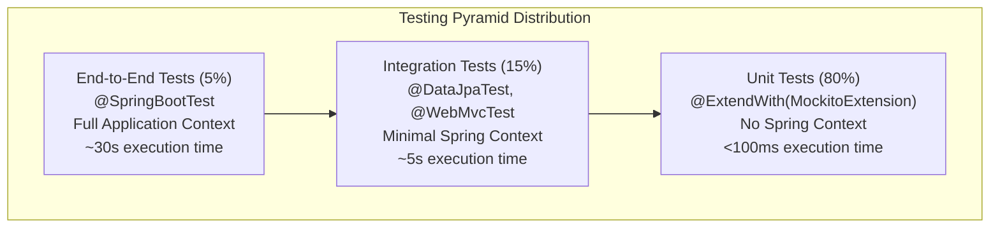
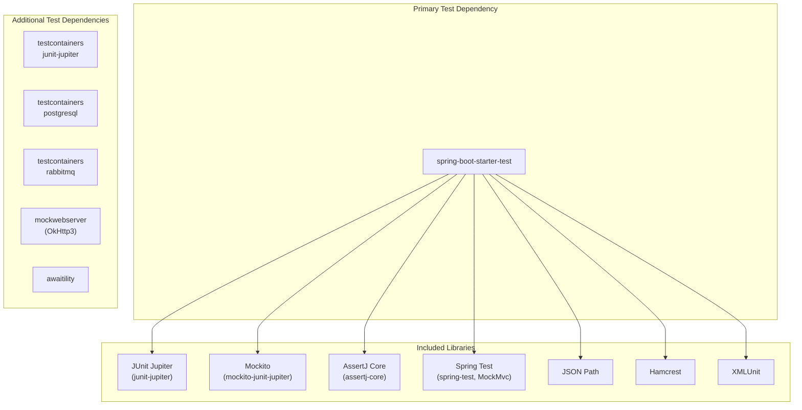
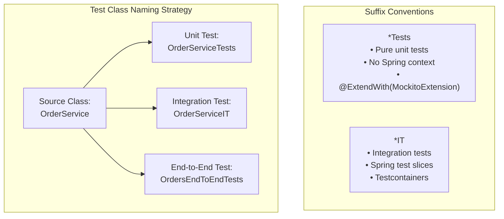

# Testing Strategy

> **Relevant source files**
> * [AGENTS.md](https://github.com/philipz/spring-modulith-orders/blob/eb506991/AGENTS.md)
> * [lightweight-test-example.md](https://github.com/philipz/spring-modulith-orders/blob/eb506991/lightweight-test-example.md)
> * [pom.xml](https://github.com/philipz/spring-modulith-orders/blob/eb506991/pom.xml)

## Purpose and Scope

This document explains the overall testing strategy for the orders-service, including the testing pyramid distribution, test categorization, dependency choices, and performance considerations. For practical guidance on writing tests, test fixtures, and Testcontainers usage, see [Writing Tests](/philipz/spring-modulith-orders/7.2-writing-tests). For build configuration details, see [Build Configuration](/philipz/spring-modulith-orders/8.2-build-configuration).

---

## Testing Pyramid

The orders-service follows a traditional testing pyramid approach with the following distribution:

* **80% Unit Tests**: Fast, isolated tests with no Spring context
* **15% Integration Tests**: Focused tests with minimal Spring context (e.g., `@DataJpaTest`, `@WebMvcTest`)
* **5% End-to-End Tests**: Full application tests with `@SpringBootTest`



**Rationale**: This pyramid distribution optimizes for fast feedback cycles. Unit tests execute in milliseconds and provide immediate feedback on business logic correctness. Integration tests verify component interactions without the overhead of full application startup. End-to-end tests validate critical business flows but are kept minimal to avoid slow build times.

**Sources**: [lightweight-test-example.md L42-L73](https://github.com/philipz/spring-modulith-orders/blob/eb506991/lightweight-test-example.md#L42-L73)

---

## Test Categories

The codebase uses three distinct test categories, each with specific purposes and characteristics:

| Category | Annotation Pattern | Spring Context | Target Use Case | Execution Time |
| --- | --- | --- | --- | --- |
| **Unit Tests** | `@ExtendWith(MockitoExtension.class)` | None | Pure business logic, domain model validation, mapper transformations | < 100ms |
| **Integration Tests** | `@DataJpaTest`, `@WebMvcTest` | Slice-specific | Repository layer, API controllers, specific slices | < 5s |
| **End-to-End Tests** | `@SpringBootTest(webEnvironment = RANDOM_PORT)` | Full application | Critical business flows, contract validation, cross-slice interactions | < 30s |

### Unit Tests (80%)

Unit tests validate individual components in isolation using `@ExtendWith(MockitoExtension.class)`. These tests have no Spring framework dependencies and execute in pure JVM time.

**Typical structure**:

* Mock all dependencies using `@Mock` annotations
* Inject mocks using `@InjectMocks`
* Use AssertJ for fluent assertions
* No database or external service calls

**Common test targets**:

* Business logic in `domain` slice services
* Data transformations in `OrderMapper`
* Validation logic in `OrdersApiService`
* Cache logic in `AbstractCacheService` subclasses

### Integration Tests (15%)

Integration tests verify interactions between components using Spring test slices. These tests start a minimal Spring context focused on the layer under test.

**Common slice annotations**:

* `@DataJpaTest`: Tests repository layer with in-memory database
* `@WebMvcTest`: Tests REST controllers with MockMvc
* Custom slice tests for specific modulith slices

**Infrastructure support**:

* Testcontainers for PostgreSQL [pom.xml L217-L220](https://github.com/philipz/spring-modulith-orders/blob/eb506991/pom.xml#L217-L220)
* Testcontainers for RabbitMQ [pom.xml L221-L225](https://github.com/philipz/spring-modulith-orders/blob/eb506991/pom.xml#L221-L225)
* SQL fixtures loaded from `src/test/resources/db`

### End-to-End Tests (5%)

End-to-end tests validate complete business flows with `@SpringBootTest`. These tests start the full application context and may use Testcontainers for infrastructure dependencies.

**Characteristics**:

* Full Spring Boot application context
* Real database via Testcontainers
* Real message broker via Testcontainers
* REST and gRPC client testing
* Event publication and consumption validation

**Sources**: [AGENTS.md L22-L26](https://github.com/philipz/spring-modulith-orders/blob/eb506991/AGENTS.md#L22-L26)

 [lightweight-test-example.md L42-L73](https://github.com/philipz/spring-modulith-orders/blob/eb506991/lightweight-test-example.md#L42-L73)

---

## Test Dependencies

The orders-service currently uses `spring-boot-starter-test` as the primary test dependency, which provides a comprehensive testing toolkit.



**Current dependency declaration** [pom.xml L203-L208](https://github.com/philipz/spring-modulith-orders/blob/eb506991/pom.xml#L203-L208)

:

```xml
<dependency>
    <groupId>org.springframework.boot</groupId>
    <artifactId>spring-boot-starter-test</artifactId>
    <scope>test</scope>
</dependency>
```

**Additional test infrastructure** [pom.xml L210-L237](https://github.com/philipz/spring-modulith-orders/blob/eb506991/pom.xml#L210-L237)

:

* **Testcontainers**: Provides Docker-based integration testing with PostgreSQL and RabbitMQ
* **MockWebServer**: Mocks external HTTP services (e.g., ProductCatalogPort)
* **Awaitility**: Enables asynchronous test assertions for event-driven scenarios

**Sources**: [pom.xml L203-L237](https://github.com/philipz/spring-modulith-orders/blob/eb506991/pom.xml#L203-L237)

---

## Lightweight Testing Alternatives

The codebase documentation includes analysis of lightweight testing alternatives that can improve test execution speed by reducing Spring context overhead.

### Performance Comparison

| Test Type | spring-boot-starter-test | Lightweight Alternative | Performance Gain |
| --- | --- | --- | --- |
| Unit Tests | `@SpringBootTest` | `@ExtendWith(MockitoExtension)` | **10x faster** |
| Repository Tests | `@SpringBootTest` | `@DataJpaTest` | **3x faster** |
| Web Tests | `@SpringBootTest` | `@WebMvcTest` | **2x faster** |
| Integration Tests | `@SpringBootTest` | Custom minimal context | **1.5x faster** |

### Dependency Size Comparison

| Dependency Package | Size |
| --- | --- |
| `spring-boot-starter-test` | ~15 MB |
| JUnit 5 + Mockito + AssertJ | ~3 MB |
| TestNG + Mockito | ~2.5 MB |
| Pure JUnit 5 | ~1 MB |

### Minimal Test Dependency Configuration

For projects prioritizing fast test execution and minimal dependencies, the following configuration provides core testing capabilities:

**Core test framework** [lightweight-test-example.md L6-L11](https://github.com/philipz/spring-modulith-orders/blob/eb506991/lightweight-test-example.md#L6-L11)

:

```xml
<dependency>
    <groupId>org.junit.jupiter</groupId>
    <artifactId>junit-jupiter</artifactId>
    <scope>test</scope>
</dependency>
```

**Mock framework** [lightweight-test-example.md L13-L18](https://github.com/philipz/spring-modulith-orders/blob/eb506991/lightweight-test-example.md#L13-L18)

:

```xml
<dependency>
    <groupId>org.mockito</groupId>
    <artifactId>mockito-junit-jupiter</artifactId>
    <scope>test</scope>
</dependency>
```

**Assertion library** [lightweight-test-example.md L20-L25](https://github.com/philipz/spring-modulith-orders/blob/eb506991/lightweight-test-example.md#L20-L25)

:

```xml
<dependency>
    <groupId>org.assertj</groupId>
    <artifactId>assertj-core</artifactId>
    <scope>test</scope>
</dependency>
```

**Conditional dependencies**:

* Add Testcontainers only for database integration tests
* Add `spring-test` only when Spring integration is required

**Trade-offs**: The lightweight approach requires explicit dependency management and loses some convenience features like automatic configuration and test slice annotations. It is most beneficial for projects with predominantly unit tests.

**Sources**: [lightweight-test-example.md L1-L154](https://github.com/philipz/spring-modulith-orders/blob/eb506991/lightweight-test-example.md#L1-L154)

---

## Test Organization and Naming

Tests follow strict organizational conventions to maintain consistency and enable easy navigation.

### Naming Conventions



**Naming rules** [AGENTS.md L20](https://github.com/philipz/spring-modulith-orders/blob/eb506991/AGENTS.md#L20-L20)

:

* **Unit tests**: Suffix with `Tests` (e.g., `OrderServiceTests`, `OrderMapperTests`)
* **Integration tests**: Suffix with `IT` (e.g., `OrderRepositoryIT`, `OrdersApiServiceIT`)
* **End-to-end tests**: Descriptive names ending in `Tests` (e.g., `OrdersEndToEndTests`)

### Package Structure

Tests mirror the production package structure [AGENTS.md L8](https://github.com/philipz/spring-modulith-orders/blob/eb506991/AGENTS.md#L8-L8)

:

```
src/
├── main/java/com/sivalabs/bookstore/orders/
│   ├── domain/
│   │   └── OrderService.java
│   ├── web/
│   │   └── OrdersController.java
│   └── infrastructure/
│       └── OrderRepository.java
└── test/java/com/sivalabs/bookstore/orders/
    ├── domain/
    │   └── OrderServiceTests.java
    ├── web/
    │   └── OrdersControllerTests.java
    ├── infrastructure/
    │   └── OrderRepositoryIT.java
    └── support/
        └── TestDataFactory.java
```

### Test Utilities

Reusable test utilities are located in the `orders/support` package [AGENTS.md L8](https://github.com/philipz/spring-modulith-orders/blob/eb506991/AGENTS.md#L8-L8)

:

* Test data factories
* Custom assertion helpers
* Shared test configuration
* Common test fixtures

**Sources**: [AGENTS.md L8-L26](https://github.com/philipz/spring-modulith-orders/blob/eb506991/AGENTS.md#L8-L26)

---

## Performance Considerations

Test performance directly impacts developer productivity and CI/CD pipeline efficiency.

### Execution Time Targets

| Test Category | Target Execution Time | Enforcement |
| --- | --- | --- |
| Individual unit test | < 100ms | Developer discipline |
| Unit test suite | < 5 seconds | CI feedback loop |
| Integration test suite | < 30 seconds | Parallel execution |
| Full test suite | < 2 minutes | Maven build pipeline |

### Testcontainers Usage

Testcontainers provides Docker-based infrastructure for integration tests but adds startup overhead:

**PostgreSQL container** [pom.xml L217-L220](https://github.com/philipz/spring-modulith-orders/blob/eb506991/pom.xml#L217-L220)

:

* Startup time: ~2-5 seconds per test class
* Mitigation: Singleton container pattern shared across tests
* Configuration: Managed via Spring Boot's Testcontainers integration

**RabbitMQ container** [pom.xml L221-L225](https://github.com/philipz/spring-modulith-orders/blob/eb506991/pom.xml#L221-L225)

:

* Startup time: ~3-7 seconds per test class
* Mitigation: Singleton container for event-driven tests
* Usage: Only required for tests validating event publication

### Context Caching

Spring's test context caching significantly improves integration test performance:

**Cache strategy**:

* Tests with identical `@SpringBootTest` configuration share a single application context
* Context is cached after first initialization and reused for subsequent tests
* Cache eviction occurs when context configuration differs

**Optimization tips**:

* Minimize unique `@SpringBootTest` configurations
* Use `@DirtiesContext` sparingly (forces context reload)
* Prefer `@MockBean` over manual mocking to maintain cache consistency

**Sources**: [pom.xml L210-L237](https://github.com/philipz/spring-modulith-orders/blob/eb506991/pom.xml#L210-L237)

 [lightweight-test-example.md L140-L148](https://github.com/philipz/spring-modulith-orders/blob/eb506991/lightweight-test-example.md#L140-L148)

---

## Summary

The orders-service testing strategy prioritizes:

1. **Speed**: 80% unit tests with < 100ms execution time
2. **Isolation**: Pure unit tests with no framework dependencies
3. **Realism**: Integration tests with Testcontainers for PostgreSQL and RabbitMQ
4. **Reliability**: End-to-end tests for critical business flows
5. **Maintainability**: Clear naming conventions and organized package structure

This approach balances comprehensive test coverage with rapid feedback cycles, enabling confident refactoring and continuous deployment.

**Sources**: [AGENTS.md L1-L38](https://github.com/philipz/spring-modulith-orders/blob/eb506991/AGENTS.md#L1-L38)

 [lightweight-test-example.md L1-L154](https://github.com/philipz/spring-modulith-orders/blob/eb506991/lightweight-test-example.md#L1-L154)

 [pom.xml L203-L237](https://github.com/philipz/spring-modulith-orders/blob/eb506991/pom.xml#L203-L237)