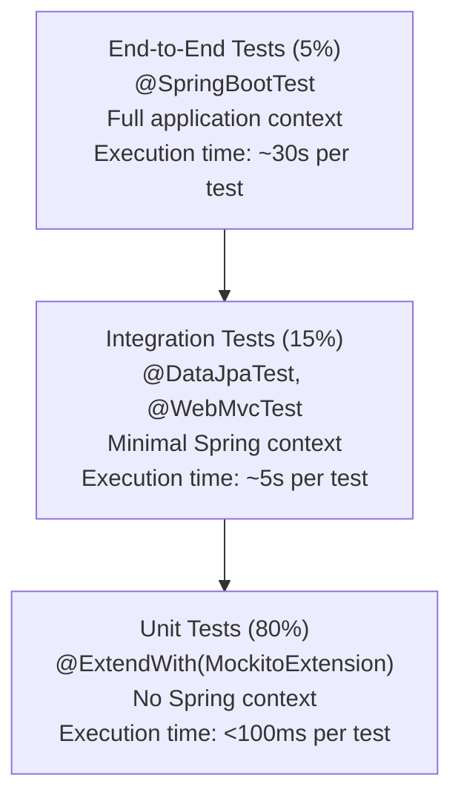
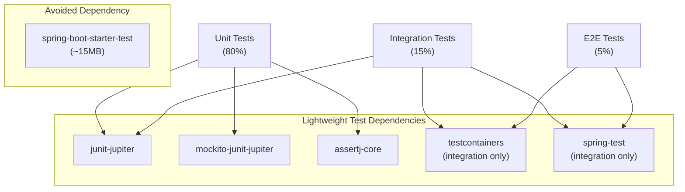
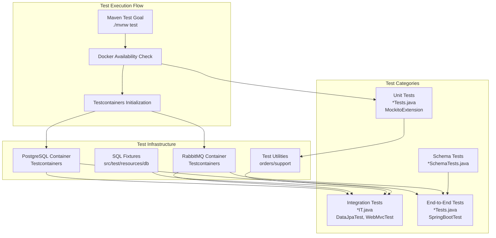
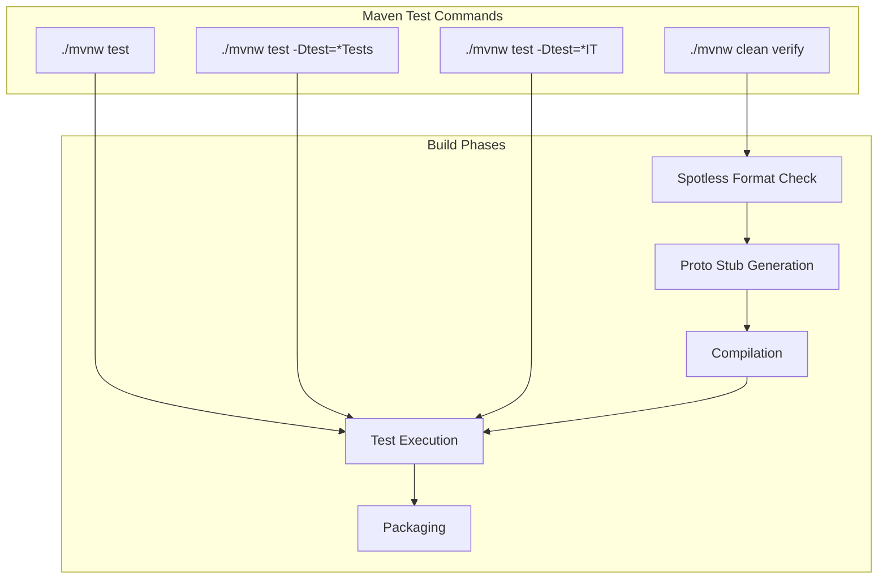
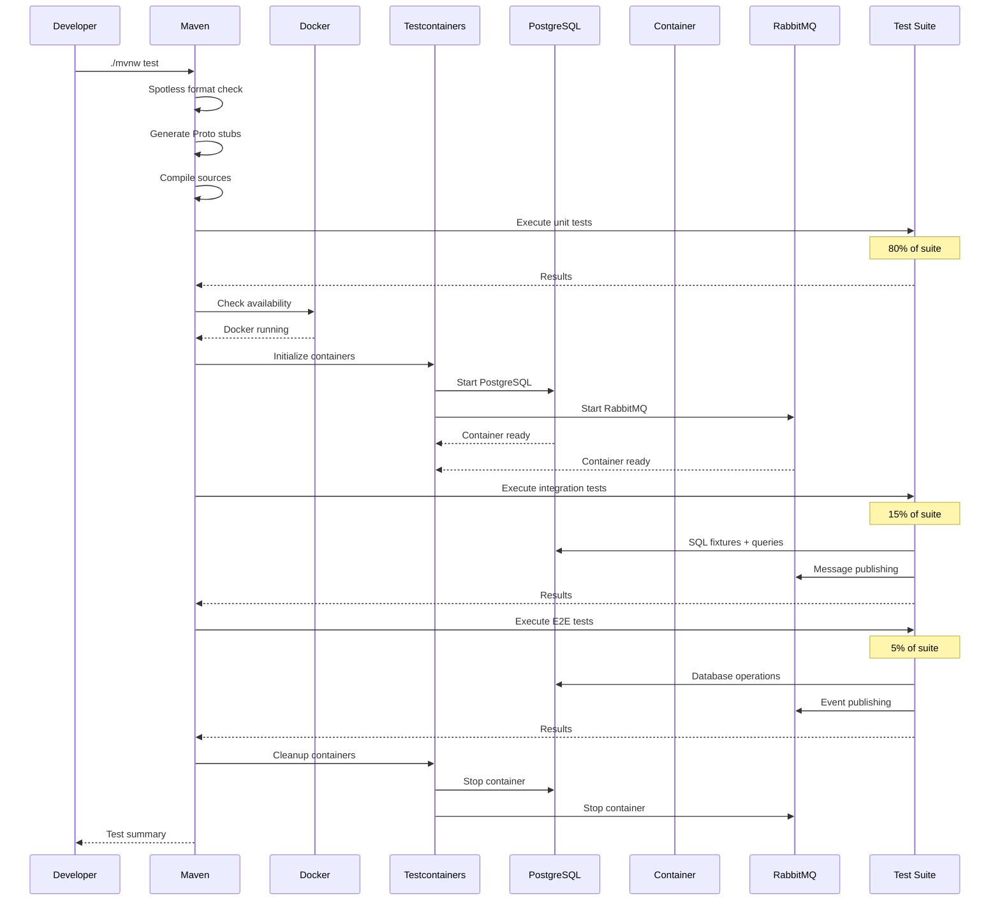
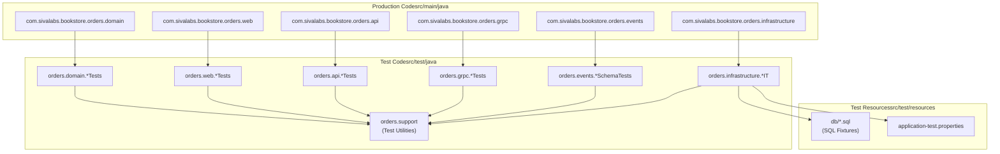

# Testing

> **Relevant source files**
> * [AGENTS.md](https://github.com/philipz/spring-modulith-orders/blob/eb506991/AGENTS.md)
> * [lightweight-test-example.md](https://github.com/philipz/spring-modulith-orders/blob/eb506991/lightweight-test-example.md)

This document describes the comprehensive testing strategy, patterns, and best practices for the orders-service. It covers the testing pyramid approach, test infrastructure setup, naming conventions, and execution patterns used throughout the codebase.

For deployment-specific testing considerations, see [Deployment](/philipz/spring-modulith-orders/6-deployment). For configuration of test environments, see [Configuration](/philipz/spring-modulith-orders/8-configuration).

---

## Purpose and Scope

The orders-service employs a multi-layered testing strategy designed to balance coverage with execution speed. Tests are categorized by their scope and dependencies, ranging from fast unit tests that verify individual components in isolation, to integration tests that validate database interactions and message publishing, to end-to-end tests that exercise the complete system with real infrastructure.

The testing approach emphasizes:

* **Lightweight dependencies** over heavyweight test frameworks to minimize execution time
* **Testcontainers** for integration tests requiring real PostgreSQL and RabbitMQ instances
* **Hermetic test suites** using SQL fixtures for predictable, repeatable results
* **Contract tests** for gRPC and event schemas to prevent breaking changes

---

## Testing Pyramid

The codebase follows an 80/15/5 testing pyramid that optimizes for fast feedback while ensuring comprehensive coverage:



**Testing Pyramid Distribution**

| Test Type | Percentage | Framework | Context | Typical Execution Time |
| --- | --- | --- | --- | --- |
| Unit Tests | 80% | JUnit Jupiter + Mockito | No Spring | < 100ms |
| Integration Tests | 15% | Spring Test Slices | Minimal Spring | < 5s |
| End-to-End Tests | 5% | SpringBootTest | Full application | < 30s |

Sources: [lightweight-test-example.md L42-L72](https://github.com/philipz/spring-modulith-orders/blob/eb506991/lightweight-test-example.md#L42-L72)

---

## Test Infrastructure and Dependencies

### Dependency Strategy

The orders-service uses a **lightweight testing approach** that avoids the monolithic `spring-boot-starter-test` dependency in favor of explicitly declared, minimal dependencies. This reduces test execution time and dependency footprint.



**Dependency Size Comparison**

| Approach | Total Size | Build Time Impact |
| --- | --- | --- |
| spring-boot-starter-test | ~15MB | Baseline |
| JUnit 5 + Mockito + AssertJ | ~3MB | 10x faster unit tests |
| Pure JUnit 5 | ~1MB | Minimal |

Sources: [lightweight-test-example.md L1-L40](https://github.com/philipz/spring-modulith-orders/blob/eb506991/lightweight-test-example.md#L1-L40)

 [lightweight-test-example.md L149-L154](https://github.com/philipz/spring-modulith-orders/blob/eb506991/lightweight-test-example.md#L149-L154)

---

## Test Infrastructure Components



### Testcontainers Integration

Integration and end-to-end tests depend on **Testcontainers** to provide real PostgreSQL and RabbitMQ instances. Docker must be available on the test execution environment.

**Key characteristics:**

* Containers are started automatically before tests requiring database or messaging
* Each test class can use shared or isolated containers based on lifecycle annotations
* SQL fixtures from [src/test/resources/db](https://github.com/philipz/spring-modulith-orders/blob/eb506991/src/test/resources/db)  are applied during setup
* Containers are cleaned up after test execution

### SQL Fixtures

The [src/test/resources/db](https://github.com/philipz/spring-modulith-orders/blob/eb506991/src/test/resources/db)

 directory contains SQL scripts that establish known database states for integration tests. These fixtures ensure hermetic, repeatable test execution by providing predictable data sets.

### Test Utilities

The `orders/support` package contains reusable test utilities, base classes, and helper methods that reduce boilerplate in test code. These utilities align with the DRY principle and maintain consistency across the test suite.

Sources: [AGENTS.md L22-L26](https://github.com/philipz/spring-modulith-orders/blob/eb506991/AGENTS.md#L22-L26)

 [AGENTS.md L10-L14](https://github.com/philipz/spring-modulith-orders/blob/eb506991/AGENTS.md#L10-L14)

---

## Writing Tests

### Test Naming Conventions

Test classes follow a strict naming pattern to indicate their scope and execution profile:

| Pattern | Type | Spring Context | Infrastructure | Example |
| --- | --- | --- | --- | --- |
| `*Tests.java` | Unit or E2E | Only for E2E | None for unit | `OrderServiceUnitTests` |
| `*IT.java` | Integration | Minimal slice | Testcontainers | `OrderRepositoryIT` |
| `*SchemaTests.java` | Contract | None or minimal | None | `OrderCreatedEventSchemaTests` |

The naming convention determines:

* Build tool filtering (some CI pipelines separate unit and integration phases)
* Developer expectations about execution time
* Spring context initialization requirements

Sources: [AGENTS.md L20](https://github.com/philipz/spring-modulith-orders/blob/eb506991/AGENTS.md#L20-L20)

 [AGENTS.md L23-L26](https://github.com/philipz/spring-modulith-orders/blob/eb506991/AGENTS.md#L23-L26)

### Unit Tests (80%)

Unit tests verify individual components in isolation using mocked dependencies. They execute without Spring context initialization, making them extremely fast.

**Pattern:**

```python
@ExtendWith(MockitoExtension.class)
class OrderServiceUnitTests {
    // Test structure:
    // 1. Arrange: Create mocks and test data
    // 2. Act: Invoke method under test
    // 3. Assert: Verify behavior with AssertJ
    // 4. Verify: Check mock interactions
}
```

**Key characteristics:**

* Use `@ExtendWith(MockitoExtension.class)` instead of `@SpringBootTest`
* Execution time under 100ms per test
* AssertJ for fluent assertions
* Mockito for dependency mocking
* No database or external service dependencies

**Example test method naming:**

```
void createOrder_WithValidRequest_ReturnsOrderNumber() { }
void validateOrderItem_WithInvalidPrice_ThrowsInvalidOrderException() { }
```

Sources: [lightweight-test-example.md L44-L52](https://github.com/philipz/spring-modulith-orders/blob/eb506991/lightweight-test-example.md#L44-L52)

 [AGENTS.md L23](https://github.com/philipz/spring-modulith-orders/blob/eb506991/AGENTS.md#L23-L23)

### Integration Tests (15%)

Integration tests validate interactions with infrastructure components like databases and message brokers, using real instances via Testcontainers.

**Pattern:**

```python
@DataJpaTest
class OrderRepositoryIT {
    // Test structure:
    // 1. Apply SQL fixtures from src/test/resources/db
    // 2. Execute repository operation
    // 3. Assert database state
}
```

**Spring Test Slices:**

| Annotation | Context Loaded | Use Case |
| --- | --- | --- |
| `@DataJpaTest` | JPA repositories, EntityManager | Repository tests |
| `@WebMvcTest` | Controllers, validators | REST API tests |
| `@SpringBootTest` | Full application context | E2E tests |

**Key characteristics:**

* Use minimal Spring context via test slices
* Testcontainers provides PostgreSQL and RabbitMQ
* SQL fixtures ensure predictable state
* Execution time under 5 seconds per test
* Suffix test classes with `IT.java` for integration tests

Sources: [lightweight-test-example.md L54-L62](https://github.com/philipz/spring-modulith-orders/blob/eb506991/lightweight-test-example.md#L54-L62)

 [AGENTS.md L24](https://github.com/philipz/spring-modulith-orders/blob/eb506991/AGENTS.md#L24-L24)

### End-to-End Tests (5%)

End-to-end tests exercise complete business flows through the full application stack with real infrastructure.

**Pattern:**

```python
@SpringBootTest(webEnvironment = SpringBootTest.WebEnvironment.RANDOM_PORT)
class OrdersEndToEndTests {
    // Test structure:
    // 1. Start full application with Testcontainers
    // 2. Execute REST or gRPC requests
    // 3. Verify database state, events published, cache updates
}
```

**Key characteristics:**

* Full Spring application context
* Real HTTP/gRPC endpoints on random ports
* Tests critical business paths only
* Execution time under 30 seconds per test
* Limited to 5% of test suite due to cost

Sources: [lightweight-test-example.md L64-L72](https://github.com/philipz/spring-modulith-orders/blob/eb506991/lightweight-test-example.md#L64-L72)

 [AGENTS.md L20](https://github.com/philipz/spring-modulith-orders/blob/eb506991/AGENTS.md#L20-L20)

### Schema/Contract Tests

Schema tests validate API and event contracts to prevent breaking changes. These tests ensure that gRPC `.proto` files and published event structures remain compatible with consumers.

**Example:**

```python
class OrderCreatedEventSchemaTests {
    // Validates:
    // 1. Event field presence and types
    // 2. JSON serialization format
    // 3. Backwards compatibility
}
```

**Contract validation scope:**

* gRPC service definitions in [src/main/proto/*.proto](https://github.com/philipz/spring-modulith-orders/blob/eb506991/src/main/proto/*.proto)
* Event schemas for `OrderCreatedEvent` and other `@Externalized` events
* REST API request/response DTOs

When modifying contracts:

1. Update `.proto` files or event classes
2. Regenerate stubs via Maven
3. Update corresponding schema tests
4. Ensure backwards compatibility or version appropriately

Sources: [AGENTS.md L26](https://github.com/philipz/spring-modulith-orders/blob/eb506991/AGENTS.md#L26-L26)

---

## Test Execution

### Maven Commands



**Standard test execution:**

```markdown
# Run all tests (unit + integration)
./mvnw test

# Run full build with formatting checks
./mvnw clean verify

# Run only unit tests
./mvnw test -Dtest=*Tests

# Run only integration tests
./mvnw test -Dtest=*IT
```

**Prerequisites:**

* Docker must be running for integration and E2E tests (Testcontainers requirement)
* JDK 21 installed
* Maven Wrapper handles Maven installation

Sources: [AGENTS.md L10-L14](https://github.com/philipz/spring-modulith-orders/blob/eb506991/AGENTS.md#L10-L14)

### Test Execution Flow



**Performance characteristics:**

| Suite Component | Count (approx) | Total Time |
| --- | --- | --- |
| Unit tests | 80% of total | ~10-20s |
| Integration tests | 15% of total | ~30-60s |
| E2E tests | 5% of total | ~30-90s |
| **Total** | **~100 tests** | **~2-3 minutes** |

Sources: [AGENTS.md L10-L14](https://github.com/philipz/spring-modulith-orders/blob/eb506991/AGENTS.md#L10-L14)

 [lightweight-test-example.md L140-L148](https://github.com/philipz/spring-modulith-orders/blob/eb506991/lightweight-test-example.md#L140-L148)

---

## Test Code Organization



**Directory structure:**

* Test packages mirror production packages in [src/test/java](https://github.com/philipz/spring-modulith-orders/blob/eb506991/src/test/java)
* Shared test utilities reside in `orders/support` package
* SQL fixtures for integration tests in [src/test/resources/db](https://github.com/philipz/spring-modulith-orders/blob/eb506991/src/test/resources/db)
* Test-specific configuration in `application-test.properties`

Sources: [AGENTS.md L8](https://github.com/philipz/spring-modulith-orders/blob/eb506991/AGENTS.md#L8-L8)

 [AGENTS.md L24](https://github.com/philipz/spring-modulith-orders/blob/eb506991/AGENTS.md#L24-L24)

---

## Best Practices

### Test Isolation and Hermeticity

* Each test should be independent and executable in any order
* Use SQL fixtures from [src/test/resources/db](https://github.com/philipz/spring-modulith-orders/blob/eb506991/src/test/resources/db)  to establish known state
* Clean up test data between tests or use transactional rollback
* Avoid shared mutable state across test methods

### Mocking Guidelines

* Mock external dependencies (ProductCatalogPort, external APIs)
* Use real database and messaging infrastructure via Testcontainers
* Verify mock interactions to ensure proper collaboration
* Prefer `@Mock` with `MockitoExtension` over manual `Mockito.mock()` calls

### Assertion Style

* Use AssertJ fluent assertions for readability
* Group related assertions for clear test failures
* Provide descriptive failure messages for business logic assertions
* Test both happy paths and error conditions

### Test Method Naming

Follow the pattern: `methodName_condition_expectedResult`

Examples:

* `createOrder_WithValidRequest_ReturnsOrderNumber`
* `validateOrderItem_WithNegativePrice_ThrowsInvalidOrderException`
* `findByOrderNumber_WhenNotExists_ReturnsEmpty`

### Contract Test Maintenance

When modifying public contracts:

1. Update `.proto` files or event classes
2. Run `./mvnw generate-sources` to regenerate stubs
3. Update schema tests (`OrderCreatedEventSchemaTests` and similar)
4. Verify backwards compatibility or coordinate with consumers
5. Include contract changes in the same commit as implementation

Sources: [AGENTS.md L22-L26](https://github.com/philipz/spring-modulith-orders/blob/eb506991/AGENTS.md#L22-L26)

---

## Common Patterns

### Unit Test Pattern

```yaml
Class under test: OrdersApiService
Dependencies: OrderService (mocked), ProductCatalogPort (mocked), OrderMapper (real)
Test class: OrdersApiServiceTests
```

### Integration Test Pattern

```yaml
Class under test: OrderRepository
Infrastructure: PostgreSQL via Testcontainers
Fixtures: src/test/resources/db/test-data.sql
Test class: OrderRepositoryIT
```

### End-to-End Test Pattern

```yaml
Flow: REST request → Controller → Service → Repository → Database
Events: Verify OrderCreatedEvent published to RabbitMQ
Test class: OrdersEndToEndTests
```

### Schema Test Pattern

```yaml
Contract: OrderCreatedEvent
Validation: Field presence, types, JSON format, backwards compatibility
Test class: OrderCreatedEventSchemaTests
```

Sources: [AGENTS.md L20-L26](https://github.com/philipz/spring-modulith-orders/blob/eb506991/AGENTS.md#L20-L26)

 [lightweight-test-example.md L44-L72](https://github.com/philipz/spring-modulith-orders/blob/eb506991/lightweight-test-example.md#L44-L72)

---

## Performance Optimization

### Minimizing Spring Context Startup

* Use `@ExtendWith(MockitoExtension.class)` for unit tests (no Spring context)
* Use test slices (`@DataJpaTest`, `@WebMvcTest`) for targeted integration tests
* Avoid `@SpringBootTest` except for critical E2E flows
* Cache Spring context between test classes when possible

### Container Reuse

* Testcontainers can reuse containers across test classes
* Configure singleton containers for PostgreSQL and RabbitMQ
* Balance container reuse with test isolation requirements

### Parallel Execution

Maven Surefire supports parallel test execution:

```markdown
./mvnw test -T 1C  # 1 thread per CPU core
```

Ensure tests are thread-safe and don't share mutable state when enabling parallelization.

Sources: [lightweight-test-example.md L140-L148](https://github.com/philipz/spring-modulith-orders/blob/eb506991/lightweight-test-example.md#L140-L148)

---

## Troubleshooting

### Docker Not Available

**Symptom:** Integration tests fail with "Could not find a valid Docker environment"

**Resolution:**

* Ensure Docker daemon is running
* Verify Docker socket permissions (Linux)
* Check Docker Desktop status (macOS/Windows)

### Testcontainers Port Conflicts

**Symptom:** Container fails to start due to port already in use

**Resolution:**

* Testcontainers automatically assigns random ports
* Ensure no conflicting services running on default ports (5432, 5672)
* Check for orphaned containers: `docker ps -a`

### SQL Fixture Issues

**Symptom:** Integration tests fail due to missing or inconsistent data

**Resolution:**

* Verify fixtures exist in [src/test/resources/db](https://github.com/philipz/spring-modulith-orders/blob/eb506991/src/test/resources/db)
* Check Liquibase changelogs have executed correctly
* Ensure test isolation (rollback transactions or clean state)

### Slow Test Execution

**Symptom:** Test suite takes significantly longer than expected

**Resolution:**

* Profile test execution to identify slow tests
* Convert slow `@SpringBootTest` tests to lighter test slices
* Check for unnecessary Testcontainers initialization
* Review mock setup complexity

Sources: [AGENTS.md L10-L14](https://github.com/philipz/spring-modulith-orders/blob/eb506991/AGENTS.md#L10-L14)