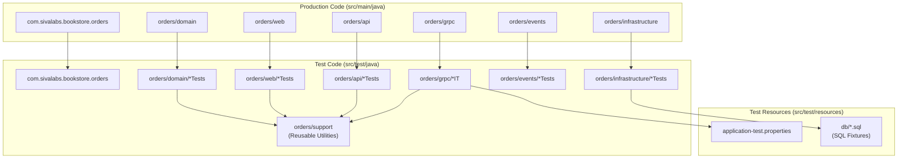
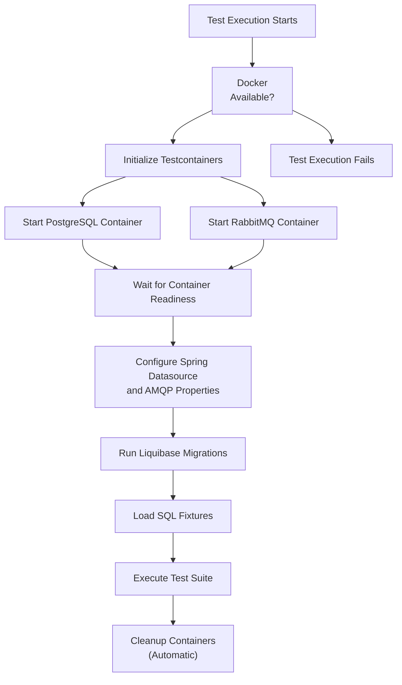
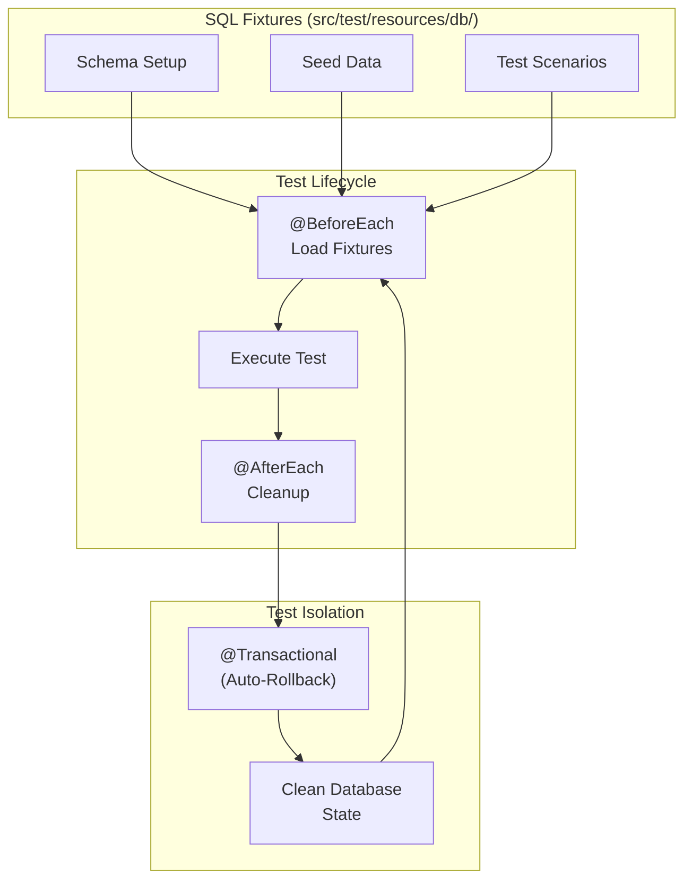
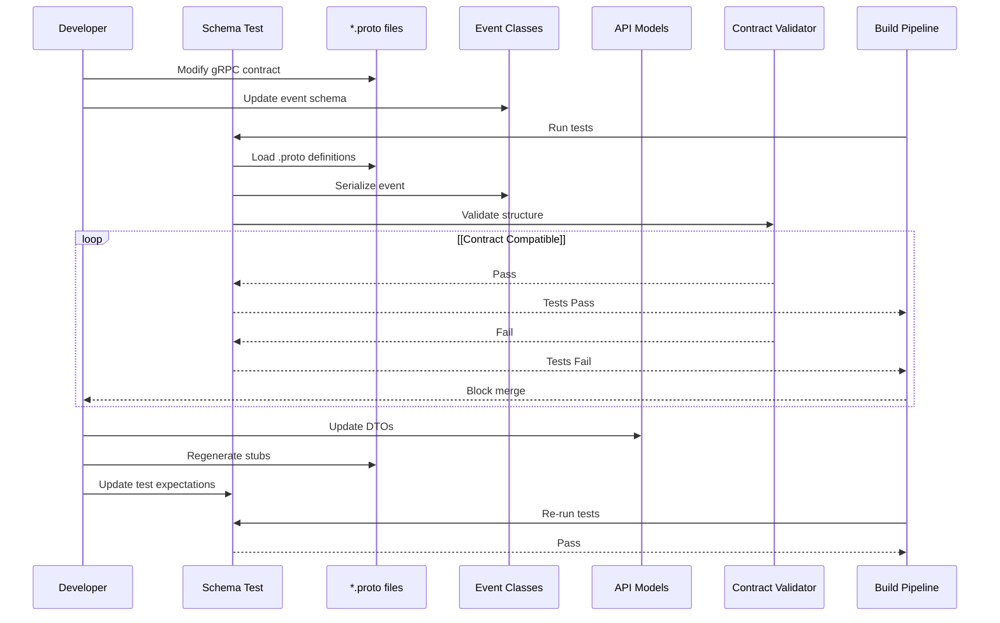
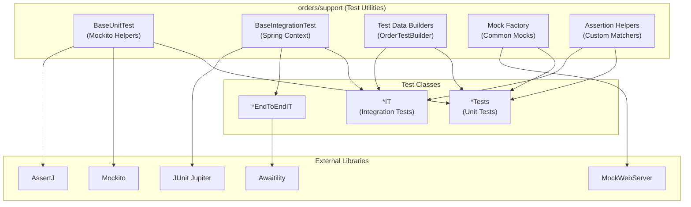
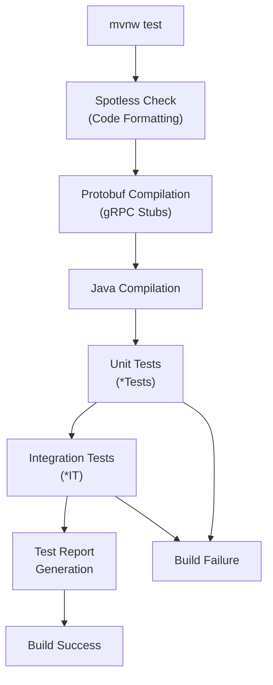

# Writing Tests

> **Relevant source files**
> * [AGENTS.md](https://github.com/philipz/spring-modulith-orders/blob/eb506991/AGENTS.md)
> * [lightweight-test-example.md](https://github.com/philipz/spring-modulith-orders/blob/eb506991/lightweight-test-example.md)
> * [pom.xml](https://github.com/philipz/spring-modulith-orders/blob/eb506991/pom.xml)

This page documents practical guidelines for writing tests in the orders-service codebase, including naming conventions, Testcontainers setup, SQL fixtures, schema tests, and reusable test utilities. For an overview of the testing strategy and performance considerations, see [Testing Strategy](/philipz/spring-modulith-orders/7.1-testing-strategy).

## Test Naming Conventions

The codebase follows specific naming patterns to distinguish between different test types:

* **Unit tests**: Classes suffixed with `Tests` (e.g., `OrderServiceUnitTests`)
* **Integration tests**: Classes suffixed with `IT` (e.g., `OrdersEndToEndIT`)

Individual test methods should read as behavior statements that describe what is being tested. The test class name should reflect the unit under test plus the behavior being verified.

**Examples:**

* `OrdersApiServiceTests` - Unit tests for `OrdersApiService`
* `OrderRepositoryTests` - Integration tests for repository layer
* `OrdersEndToEndIT` - Full integration tests across all layers

Sources: [AGENTS.md L20](https://github.com/philipz/spring-modulith-orders/blob/eb506991/AGENTS.md#L20-L20)

 [AGENTS.md L25](https://github.com/philipz/spring-modulith-orders/blob/eb506991/AGENTS.md#L25-L25)

## Test Organization and Structure



**Test Organization Principles:**

| Aspect | Pattern | Location |
| --- | --- | --- |
| **Package Structure** | Mirror production packages | `src/test/java/com/sivalabs/bookstore/orders/*` |
| **Shared Utilities** | Centralized helpers | `src/test/java/com/sivalabs/bookstore/orders/support/` |
| **Test Data** | SQL fixtures | `src/test/resources/db/` |
| **Configuration** | Test properties | `src/test/resources/application-test.properties` |
| **Rollback Scripts** | Manual verification | `scripts/rollback.sql` |

Tests mirror the production package structure, making it easy to locate tests for specific components. Reusable test utilities are consolidated in the `orders/support` directory to avoid duplication.

Sources: [AGENTS.md L4](https://github.com/philipz/spring-modulith-orders/blob/eb506991/AGENTS.md#L4-L4)

 [AGENTS.md L7](https://github.com/philipz/spring-modulith-orders/blob/eb506991/AGENTS.md#L7-L7)

 [AGENTS.md L8](https://github.com/philipz/spring-modulith-orders/blob/eb506991/AGENTS.md#L8-L8)

## Testcontainers Integration

The codebase uses Testcontainers to provide real PostgreSQL and RabbitMQ instances for integration tests, ensuring tests run against production-like infrastructure.

### Container Setup Flow



### Required Dependencies

The following test dependencies enable Testcontainers integration:

```xml
<!-- From pom.xml:211-225 -->
<dependency>
    <groupId>org.testcontainers</groupId>
    <artifactId>junit-jupiter</artifactId>
    <scope>test</scope>
</dependency>
<dependency>
    <groupId>org.testcontainers</groupId>
    <artifactId>postgresql</artifactId>
    <scope>test</scope>
</dependency>
<dependency>
    <groupId>org.testcontainers</groupId>
    <artifactId>rabbitmq</artifactId>
    <scope>test</scope>
</dependency>
```

### Testcontainers Usage Pattern

Integration tests requiring database access should follow this pattern:

1. **Annotate the test class** with `@SpringBootTest` and `@Testcontainers`
2. **Declare static container fields** using `@Container` annotation
3. **Configure dynamic properties** to point Spring to the container
4. **Ensure Docker is running** before executing tests

Example test structure:

* Container initialization happens once per test class
* Containers are automatically cleaned up after tests complete
* Spring Boot automatically configures datasource from container properties
* Liquibase migrations run against the containerized database

Sources: [pom.xml L210-L225](https://github.com/philipz/spring-modulith-orders/blob/eb506991/pom.xml#L210-L225)

 [AGENTS.md L13](https://github.com/philipz/spring-modulith-orders/blob/eb506991/AGENTS.md#L13-L13)

 [AGENTS.md L24](https://github.com/philipz/spring-modulith-orders/blob/eb506991/AGENTS.md#L24-L24)

## SQL Test Fixtures

Test data is managed through SQL fixtures located in `src/test/resources/db/`, ensuring tests remain hermetic and reproducible.

### Fixture Management Strategy



### Best Practices for Test Fixtures

| Practice | Implementation | Rationale |
| --- | --- | --- |
| **Hermetic Tests** | Each test loads its own fixtures | Tests don't depend on execution order |
| **Minimal Data** | Include only data required for the test | Faster execution and clearer intent |
| **Readable Fixtures** | Use descriptive names and comments | Easy to understand test scenarios |
| **Version Control** | Keep fixtures in `src/test/resources/db/` | Track changes alongside code |
| **Liquibase Sync** | Fixtures match schema from migrations | Prevents schema mismatch errors |

Tests should rely on provided SQL fixtures rather than creating data programmatically, ensuring consistency across test runs. The Liquibase migrations (defined in `src/main/resources/db`) establish the schema, while test fixtures provide the necessary data for each test scenario.

Sources: [AGENTS.md L7](https://github.com/philipz/spring-modulith-orders/blob/eb506991/AGENTS.md#L7-L7)

 [AGENTS.md L24](https://github.com/philipz/spring-modulith-orders/blob/eb506991/AGENTS.md#L24-L24)

## Schema Tests for API Contracts

Schema tests verify that API contracts (gRPC, REST, and events) remain stable over time, preventing breaking changes from being introduced accidentally.

### Contract Testing Flow



### Types of Schema Tests

**1. Event Schema Tests**

Tests like `OrderCreatedEventSchemaTests` verify that event payloads maintain their structure:

* Field names remain stable
* Data types don't change
* Required fields are present
* Serialization format is consistent

**2. gRPC Contract Tests**

Protocol Buffer definitions in `src/main/proto/*.proto` are validated through:

* Stub generation during build ([pom.xml L256-L273](https://github.com/philipz/spring-modulith-orders/blob/eb506991/pom.xml#L256-L273) )
* Service interface compatibility checks
* Message structure validation
* Backwards compatibility verification

**3. REST API Schema Tests**

OpenAPI specification tests ensure:

* Request/response models match expectations
* Validation constraints are documented
* Field descriptions are accurate
* Breaking changes are caught before deployment

### Writing Schema Tests

When adding or modifying API contracts:

1. **Create schema tests** similar to `OrderCreatedEventSchemaTests`
2. **Capture the expected structure** in test assertions
3. **Update proto files** and regenerate stubs in the same changeset
4. **Document any breaking changes** in the commit message
5. **Run the full test suite** to catch downstream impacts

Schema tests act as a safety net, preventing accidental contract changes that could break downstream consumers.

Sources: [AGENTS.md L26](https://github.com/philipz/spring-modulith-orders/blob/eb506991/AGENTS.md#L26-L26)

 [pom.xml L256-L273](https://github.com/philipz/spring-modulith-orders/blob/eb506991/pom.xml#L256-L273)

## Test Utilities and Helpers

Reusable test utilities are centralized in the `orders/support` directory, providing common functionality across test suites.

### Test Utilities Architecture



### Available Test Dependencies

The codebase provides comprehensive testing libraries:

| Library | Purpose | Usage |
| --- | --- | --- |
| **JUnit Jupiter** | Test framework | Annotations like `@Test`, `@BeforeEach` |
| **Mockito** | Mocking framework | Create mocks with `@Mock`, `@InjectMocks` |
| **AssertJ** | Fluent assertions | Readable assertions like `assertThat(x).isEqualTo(y)` |
| **MockMvc** | REST API testing | Test REST controllers without HTTP |
| **MockWebServer** | HTTP stub server | Mock external HTTP services |
| **Awaitility** | Async assertions | Wait for async operations with `await().until()` |
| **Testcontainers** | Infrastructure | PostgreSQL, RabbitMQ containers |

### Common Testing Patterns

**Test Data Builders**

Use builder patterns to create test objects:

* Provide sensible defaults
* Allow selective customization
* Improve test readability
* Reduce duplication

**Mock Factories**

Centralize mock creation for frequently-used dependencies:

* `ProductCatalogPort` mocks for product validation
* Repository mocks for database operations
* Event publisher mocks for async operations

**Custom Assertions**

Create domain-specific assertion helpers:

* Order state assertions
* Event payload validators
* Error response matchers

**Async Testing with Awaitility**

For event-driven tests, use Awaitility to wait for asynchronous operations:

* Poll until condition is met
* Timeout after specified duration
* Fail with descriptive messages

Sources: [pom.xml L203-L237](https://github.com/philipz/spring-modulith-orders/blob/eb506991/pom.xml#L203-L237)

 [AGENTS.md L8](https://github.com/philipz/spring-modulith-orders/blob/eb506991/AGENTS.md#L8-L8)

 [AGENTS.md L23](https://github.com/philipz/spring-modulith-orders/blob/eb506991/AGENTS.md#L23-L23)

 [AGENTS.md L25](https://github.com/philipz/spring-modulith-orders/blob/eb506991/AGENTS.md#L25-L25)

## Test Execution and Verification

### Running Tests

| Command | Scope | Purpose |
| --- | --- | --- |
| `./mvnw test` | All tests | Execute unit and integration tests |
| `./mvnw verify` | Full build | Run tests + Spotless + packaging |
| `./mvnw test -Dtest=OrdersApiServiceTests` | Single class | Run specific test class |
| `./mvnw test -Dtest=*IT` | Integration only | Run only integration tests |

**Prerequisites:**

* Docker must be running (for Testcontainers)
* Sufficient memory allocated to Docker (≥2GB recommended)
* PostgreSQL and RabbitMQ ports available (dynamically allocated)

### Test Execution Pipeline



### Debugging Test Failures

When tests fail:

1. **Check Docker status**: Ensure Docker daemon is running
2. **Review container logs**: Testcontainers output appears in test logs
3. **Verify fixtures**: Ensure SQL fixtures are compatible with schema
4. **Check isolation**: Confirm tests don't share state
5. **Run individually**: Isolate failures by running single test classes

The test suite is designed to be hermetic, meaning each test can run independently without side effects from other tests.

Sources: [AGENTS.md L11](https://github.com/philipz/spring-modulith-orders/blob/eb506991/AGENTS.md#L11-L11)

 [AGENTS.md L13](https://github.com/philipz/spring-modulith-orders/blob/eb506991/AGENTS.md#L13-L13)

 [pom.xml L247-L314](https://github.com/philipz/spring-modulith-orders/blob/eb506991/pom.xml#L247-L314)