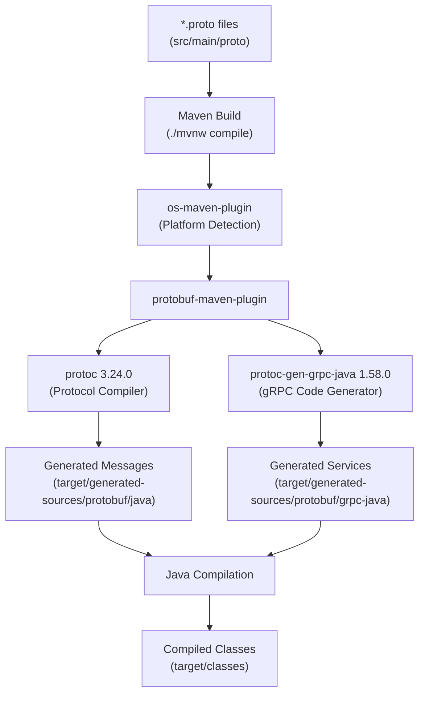
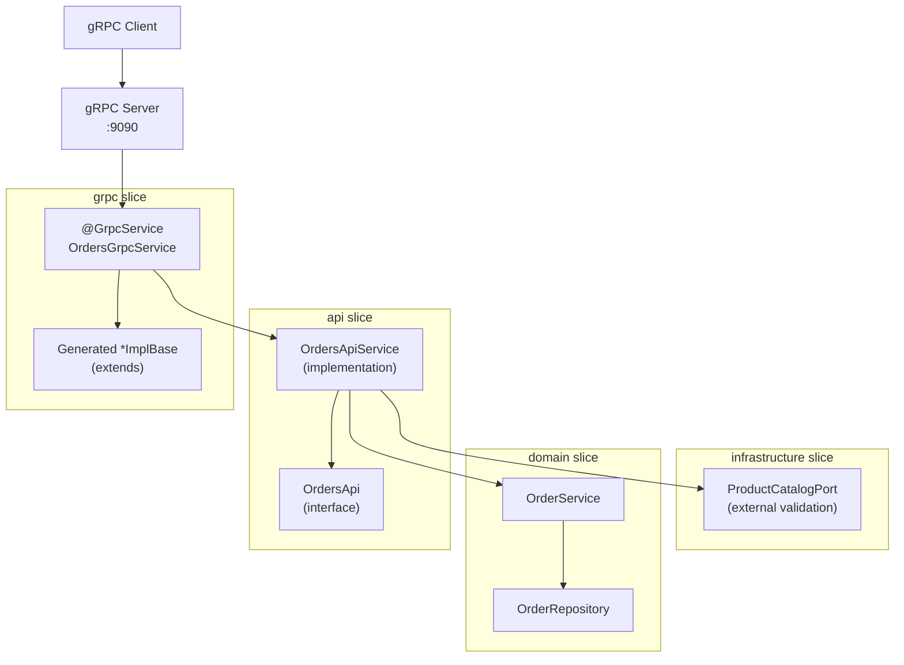
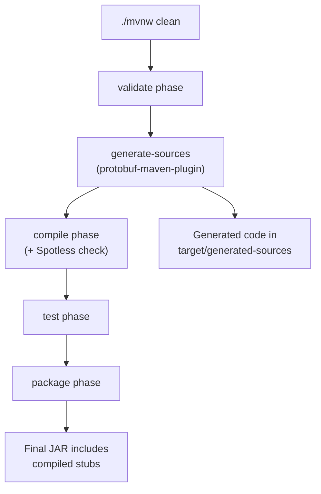

# gRPC API

> **Relevant source files**
> * [AGENTS.md](https://github.com/philipz/spring-modulith-orders/blob/eb506991/AGENTS.md)
> * [README.md](https://github.com/philipz/spring-modulith-orders/blob/eb506991/README.md)
> * [pom.xml](https://github.com/philipz/spring-modulith-orders/blob/eb506991/pom.xml)

## Purpose and Scope

This page documents the gRPC API exposed by the orders-service, including Protocol Buffer contract definitions, stub generation via Maven, server configuration, and service implementations. The gRPC API provides a strongly-typed, high-performance alternative to the REST API for inter-service communication.

For REST endpoint documentation, see [REST API](/philipz/spring-modulith-orders/4.1-rest-api). For details on the shared request/response models used by both APIs, see [Request and Response Models](/philipz/spring-modulith-orders/4.3-request-and-response-models). For the overall API layer architecture, see [API Layer Design](/philipz/spring-modulith-orders/3.3-api-layer-design).

---

## Protocol Buffer Contracts

### Contract Location

Protocol Buffer service definitions are stored in `src/main/proto/` directory. These `.proto` files define the gRPC service contracts, including service methods, request messages, and response messages.

**Sources:** [AGENTS.md L6](https://github.com/philipz/spring-modulith-orders/blob/eb506991/AGENTS.md#L6-L6)

 [README.md L7](https://github.com/philipz/spring-modulith-orders/blob/eb506991/README.md#L7-L7)

### Service Definition Structure

The gRPC service contracts follow Protocol Buffers version 3 (proto3) syntax. Each `.proto` file declares:

* **Package declaration**: Organizes generated code into Java packages
* **Service definitions**: Define RPC methods with request/response message types
* **Message definitions**: Define the structure of request and response payloads

The service integrates with the domain layer through the `OrdersApi` interface, ensuring consistent business logic execution regardless of whether requests arrive via gRPC or REST.

**Sources:** [pom.xml L82-L112](https://github.com/philipz/spring-modulith-orders/blob/eb506991/pom.xml#L82-L112)

 [AGENTS.md L6](https://github.com/philipz/spring-modulith-orders/blob/eb506991/AGENTS.md#L6-L6)

---

## Stub Generation Process

### Maven Plugin Configuration

The `protobuf-maven-plugin` automatically generates Java code from `.proto` files during the Maven build lifecycle. The plugin configuration is located in [pom.xml L256-L273](https://github.com/philipz/spring-modulith-orders/blob/eb506991/pom.xml#L256-L273)

| Configuration Element | Value | Purpose |
| --- | --- | --- |
| `protocArtifact` | `com.google.protobuf:protoc:3.24.0` | Protocol Buffer compiler version |
| `pluginId` | `grpc-java` | Identifies the gRPC Java plugin |
| `pluginArtifact` | `io.grpc:protoc-gen-grpc-java:1.58.0` | gRPC Java code generator |

**Sources:** [pom.xml L256-L273](https://github.com/philipz/spring-modulith-orders/blob/eb506991/pom.xml#L256-L273)

### Code Generation Workflow



**Diagram: gRPC Stub Generation Pipeline**

The generation happens automatically during the `compile` phase. To manually regenerate stubs:

```
./mvnw clean compile
```

**Sources:** [pom.xml L248-L273](https://github.com/philipz/spring-modulith-orders/blob/eb506991/pom.xml#L248-L273)

 [AGENTS.md L6](https://github.com/philipz/spring-modulith-orders/blob/eb506991/AGENTS.md#L6-L6)

 [README.md L19](https://github.com/philipz/spring-modulith-orders/blob/eb506991/README.md#L19-L19)

### Generated Code Structure

The plugin generates two categories of code:

1. **Message Classes** (`target/generated-sources/protobuf/java`): Java classes representing Protocol Buffer messages with builder patterns, serialization methods, and field accessors.
2. **Service Stubs** (`target/generated-sources/protobuf/grpc-java`): Abstract service classes (`ImplBase`), synchronous/asynchronous client stubs, and method descriptors.

**Sources:** [pom.xml L256-L273](https://github.com/philipz/spring-modulith-orders/blob/eb506991/pom.xml#L256-L273)

---

## gRPC Server Configuration

### Port Configuration

The gRPC server listens on port **9090** by default. This is configured through Spring Boot properties and can be overridden via environment variables.

| Property | Default Value | Environment Variable | Description |
| --- | --- | --- | --- |
| `grpc.server.port` | `9090` | `GRPC_SERVER_PORT` | gRPC server listening port |
| `grpc.server.address` | `0.0.0.0` | `GRPC_SERVER_ADDRESS` | Bind address for gRPC server |

**Sources:** [README.md L20](https://github.com/philipz/spring-modulith-orders/blob/eb506991/README.md#L20-L20)

 [AGENTS.md L12](https://github.com/philipz/spring-modulith-orders/blob/eb506991/AGENTS.md#L12-L12)

 [pom.xml L82-L112](https://github.com/philipz/spring-modulith-orders/blob/eb506991/pom.xml#L82-L112)

### gRPC Dependencies

The service uses the following gRPC-related dependencies:

| Dependency | Version | Purpose |
| --- | --- | --- |
| `grpc-spring-boot-starter` | 2.15.0.RELEASE | Spring Boot integration for gRPC |
| `grpc-protobuf` | 1.58.0 | Protocol Buffer runtime |
| `grpc-stub` | 1.58.0 | Client/server stub support |
| `grpc-services` | 1.58.0 | Standard gRPC services (health, reflection) |
| `grpc-netty` | 1.58.0 | Netty transport implementation |
| `javax.annotation-api` | 1.3.2 | JSR-305 annotations for generated code |

**Sources:** [pom.xml L82-L112](https://github.com/philipz/spring-modulith-orders/blob/eb506991/pom.xml#L82-L112)

### Server Startup

The gRPC server starts automatically when the Spring Boot application launches. The port assignment is logged during startup:

```
INFO  net.devh.boot.grpc.server.serverfactory.GrpcServerLifecycle - gRPC Server started, listening on address: 0.0.0.0, port: 9090
```

**Sources:** [README.md L20](https://github.com/philipz/spring-modulith-orders/blob/eb506991/README.md#L20-L20)

 [pom.xml L82-L112](https://github.com/philipz/spring-modulith-orders/blob/eb506991/pom.xml#L82-L112)

---

## Service Implementation Architecture

### gRPC Slice Integration



**Diagram: gRPC Service Integration with Application Layers**

The gRPC service implementation follows a layered approach:

1. **Presentation Layer** (`grpc` slice): Handles gRPC-specific concerns like Protobuf serialization and gRPC context management
2. **Application Layer** (`api` slice): Contains business validation and orchestration logic via `OrdersApiService`
3. **Domain Layer** (`domain` slice): Executes core business logic
4. **Infrastructure Layer**: Manages external integrations and data persistence

**Sources:** [AGENTS.md L4](https://github.com/philipz/spring-modulith-orders/blob/eb506991/AGENTS.md#L4-L4)

 [README.md L6](https://github.com/philipz/spring-modulith-orders/blob/eb506991/README.md#L6-L6)

### Service Implementation Pattern

gRPC service classes in the `grpc` slice:

* Use the `@GrpcService` annotation to register with the gRPC server
* Extend generated `*ImplBase` abstract classes from Protocol Buffer compilation
* Delegate business logic to `OrdersApiService` in the `api` slice
* Transform between Protobuf messages and domain DTOs

This separation ensures that:

* gRPC-specific code is isolated in the `grpc` slice
* Business logic remains protocol-agnostic in the `api` slice
* The same validation and business rules apply to REST and gRPC requests

**Sources:** [AGENTS.md L4-L6](https://github.com/philipz/spring-modulith-orders/blob/eb506991/AGENTS.md#L4-L6)

 [README.md L6](https://github.com/philipz/spring-modulith-orders/blob/eb506991/README.md#L6-L6)

### Request Processing Flow

```mermaid
sequenceDiagram
  participant gRPC Client
  participant gRPC Server :9090
  participant @GrpcService
  participant OrdersGrpcService
  participant OrdersApiService
  participant Bean Validation
  participant + Business Rules
  participant ProductCatalogPort
  participant OrderService

  gRPC Client->>gRPC Server :9090: CreateOrderRequest (Protobuf)
  gRPC Server :9090->>@GrpcService: RPC method invocation
  note over @GrpcService,OrdersGrpcService: Convert Protobuf → DTO
  @GrpcService->>OrdersApiService: createOrder(CreateOrderRequest)
  OrdersApiService->>Bean Validation: Validate request
  note over Bean Validation,+ Business Rules: @NotBlank, @Email, etc.
  OrdersApiService->>Bean Validation: validateOrderItem()
  note over Bean Validation,+ Business Rules: Business rules
  OrdersApiService->>ProductCatalogPort: validate(productCode, price)
  ProductCatalogPort-->>OrdersApiService: validation result
  OrdersApiService->>OrderService: createOrder(Order)
  OrderService-->>OrdersApiService: Created Order
  OrdersApiService-->>@GrpcService: CreateOrderResponse (DTO)
  note over @GrpcService,OrdersGrpcService: Convert DTO → Protobuf
  @GrpcService-->>gRPC Server :9090: CreateOrderResponse (Protobuf)
  gRPC Server :9090-->>gRPC Client: Response
```

**Diagram: gRPC Request Processing Sequence**

The flow demonstrates:

* Protocol-specific handling at the gRPC boundary
* Unified validation pipeline shared with REST API
* Domain logic execution independent of transport protocol
* Protobuf ↔ DTO transformation responsibility

**Sources:** [AGENTS.md L4](https://github.com/philipz/spring-modulith-orders/blob/eb506991/AGENTS.md#L4-L4)

 [README.md L6](https://github.com/philipz/spring-modulith-orders/blob/eb506991/README.md#L6-L6)

---

## gRPC Client Configuration

### Environment Variables for Clients

When other services need to connect to this orders-service via gRPC, they configure the client endpoint using environment variables:

| Environment Variable | Example Value | Description |
| --- | --- | --- |
| `GRPC_CLIENT_ORDERS_ADDRESS` | `static://localhost:9090` | Target address for orders-service gRPC endpoint |
| `GRPC_CLIENT_ORDERS_NEGOTIATION_TYPE` | `PLAINTEXT` | TLS configuration (PLAINTEXT for local dev) |

**Sources:** [AGENTS.md L35](https://github.com/philipz/spring-modulith-orders/blob/eb506991/AGENTS.md#L35-L35)

### Client Connection Patterns

gRPC clients can connect using different address formats:

| Format | Example | Use Case |
| --- | --- | --- |
| `static://` | `static://localhost:9090` | Single host connection |
| `dns://` | `dns://orders-service.orders.svc.cluster.local:9090` | Kubernetes service discovery |
| Direct | `orders-service:9090` | Docker Compose networking |

**Sources:** [pom.xml L82-L112](https://github.com/philipz/spring-modulith-orders/blob/eb506991/pom.xml#L82-L112)

### Health Checks and Reflection

The service includes gRPC standard services via [pom.xml L100-L102](https://github.com/philipz/spring-modulith-orders/blob/eb506991/pom.xml#L100-L102)

:

* **Health Service**: Enables health check probes for Kubernetes liveness/readiness
* **Reflection Service**: Allows tools like `grpcurl` to introspect available services

To test the gRPC API using reflection:

```
grpcurl -plaintext localhost:9090 list
grpcurl -plaintext localhost:9090 describe <ServiceName>
```

**Sources:** [pom.xml L100-L102](https://github.com/philipz/spring-modulith-orders/blob/eb506991/pom.xml#L100-L102)

---

## Build and Runtime Integration

### Build Process Integration

The gRPC stub generation is integrated into the standard Maven lifecycle:



**Diagram: gRPC Build Integration in Maven Lifecycle**

The stub generation happens before compilation, ensuring that:

* Generated code is available for type checking during compilation
* IDE integration can resolve generated types (after running `./mvnw compile`)
* Changes to `.proto` files are reflected in the build

**Sources:** [pom.xml L256-L273](https://github.com/philipz/spring-modulith-orders/blob/eb506991/pom.xml#L256-L273)

 [AGENTS.md L11](https://github.com/philipz/spring-modulith-orders/blob/eb506991/AGENTS.md#L11-L11)

 [README.md L19](https://github.com/philipz/spring-modulith-orders/blob/eb506991/README.md#L19-L19)

### Runtime Dependencies

The gRPC runtime requires the following infrastructure:

* **Netty**: Provides the transport layer via [pom.xml L103-L107](https://github.com/philipz/spring-modulith-orders/blob/eb506991/pom.xml#L103-L107)
* **Protocol Buffer Runtime**: Handles message serialization via [pom.xml L89-L92](https://github.com/philipz/spring-modulith-orders/blob/eb506991/pom.xml#L89-L92)
* **Spring Boot Integration**: Manages server lifecycle via [pom.xml L83-L87](https://github.com/philipz/spring-modulith-orders/blob/eb506991/pom.xml#L83-L87)

These dependencies are automatically included in the executable JAR produced by the Spring Boot Maven plugin.

**Sources:** [pom.xml L82-L112](https://github.com/philipz/spring-modulith-orders/blob/eb506991/pom.xml#L82-L112)

 [pom.xml L274-L289](https://github.com/philipz/spring-modulith-orders/blob/eb506991/pom.xml#L274-L289)

---

## Integration with Spring Modulith

The gRPC implementation follows Spring Modulith principles:

* **Module Isolation**: The `grpc` slice is a distinct Spring Modulith module with clear boundaries
* **Named Interfaces**: gRPC services expose functionality through the `order-api-model` named interface
* **Event Integration**: Domain events published by the `api` slice are accessible to gRPC clients
* **Dependency Direction**: The `grpc` slice depends on `api`, never the reverse

This architecture ensures that gRPC is treated as an optional presentation layer that can be enabled or disabled without affecting core business logic.

**Sources:** [AGENTS.md L4](https://github.com/philipz/spring-modulith-orders/blob/eb506991/AGENTS.md#L4-L4)

 [README.md L6](https://github.com/philipz/spring-modulith-orders/blob/eb506991/README.md#L6-L6)